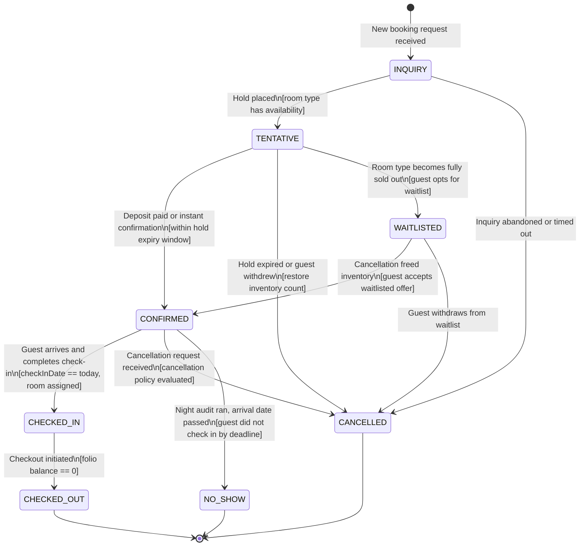
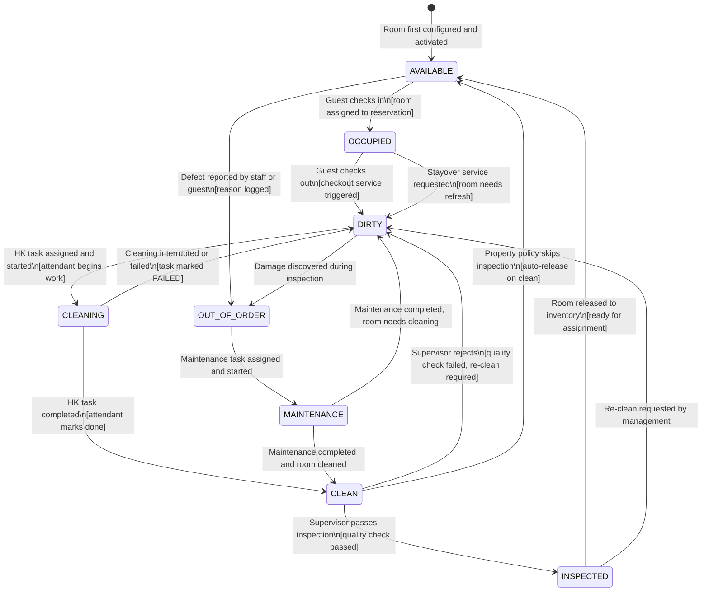
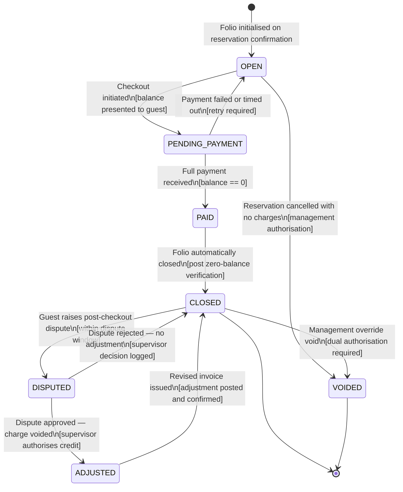
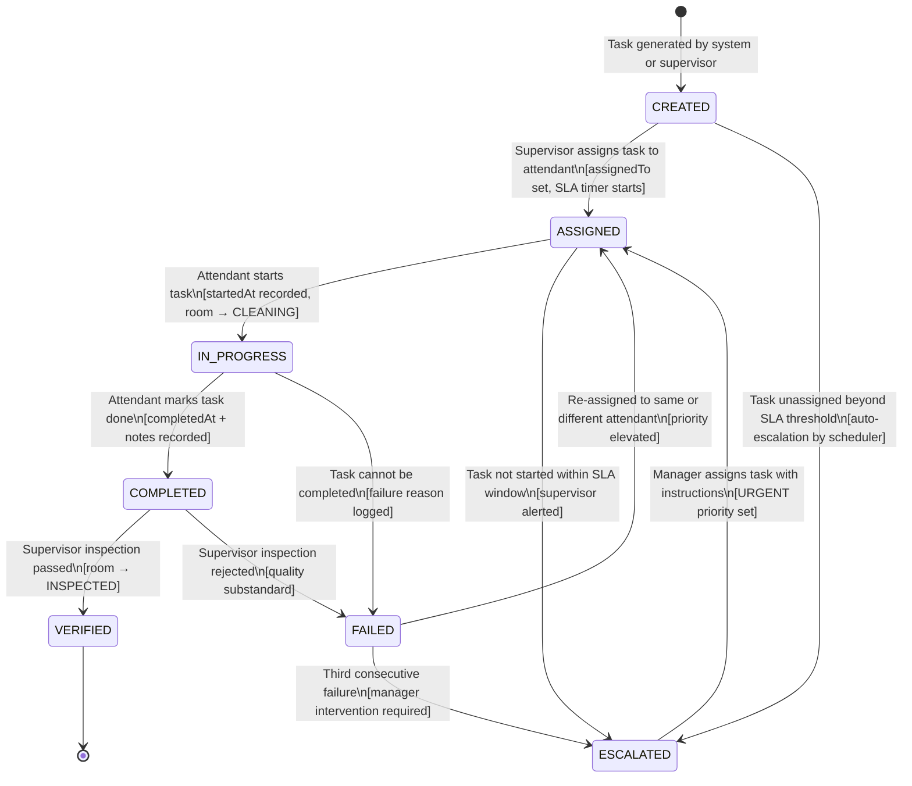

# Hotel Property Management System — State Machine Diagrams

This document defines the lifecycle state machines for four core HPMS entities: **Reservation**,
**Room**, **Folio**, and **HousekeepingTask**. Each section contains a Mermaid `stateDiagram-v2`
diagram, a structured transition table with guard conditions and resulting actions, and prose
descriptions of every state's business meaning and operational implications.

---

## 1. Reservation Lifecycle

### Prose State Descriptions

**INQUIRY** — The earliest stage of a reservation. A guest or travel agent has expressed interest
and a provisional record exists, but no commitment has been made and no room has been allocated.
Confirmation numbers are not generated at this stage. Inquiry records are retained for up to 24
hours; an automated cleanup job purges unconverted inquiries to keep the database clean. Inquiries
do not affect inventory counts.

**TENTATIVE** — A hold has been placed on the inventory. The room type's availability count is
decremented but no specific room is assigned yet. A hold expiry time is set (default: 2 hours for
web channels, 24 hours for agent channels). If the hold expires without confirmation, the
reservation reverts to CANCELLED automatically and the inventory count is restored. Deposits may
or may not be required depending on the rate plan.

**WAITLISTED** — The requested room type has no available inventory, but the guest has elected to
be added to the waitlist. The waitlist is ordered by request time and tier of the guest's loyalty
account. When a cancellation frees up inventory, the top-ranked waitlisted reservation is
automatically promoted to CONFIRMED. Waitlisted reservations do not affect inventory counts.

**CONFIRMED** — The reservation is fully committed. A confirmation number has been generated, the
folio has been initialised, and the inventory count reflects this booking. The guest has received
a confirmation email. Rate plan restrictions such as advance-purchase or minimum-stay requirements
have been validated. Cancellation at this stage may incur penalties depending on the rate plan's
cancellation policy.

**CHECKED_IN** — The guest has physically arrived at the property, completed registration, and
has been assigned a specific room. The `Room.status` transitions from `CLEAN` or `INSPECTED` to
`OCCUPIED`. The folio is open and nightly room-rate charges begin posting. The check-in timestamp
is recorded against the reservation.

**CHECKED_OUT** — The guest has vacated the property, all folio charges have been settled, and the
folio has been closed. The room is released and a checkout-service housekeeping task is created.
Loyalty points are awarded. A digital receipt is dispatched. This is a terminal state; the
reservation record is retained indefinitely for auditing and history.

**CANCELLED** — The reservation has been cancelled by the guest, travel agent, or property. The
inventory count is restored. If cancelled within the free-cancellation window, no penalty applies.
If cancelled outside the window, a cancellation fee is posted to the folio. The folio is closed
with the penalty charge if applicable. This is a terminal state.

**NO_SHOW** — The night audit has run for the arrival date and the guest did not check in before
the no-show processing deadline. A no-show penalty charge is posted to the folio per the rate
plan's cancellation policy. Revenue management is notified. The room is released back to
available inventory. This is a terminal state.

### State Diagram

### Transition Table

| From State  | Event                          | Guard Condition                                   | To State    | Action                                                                 |
|-------------|--------------------------------|---------------------------------------------------|-------------|------------------------------------------------------------------------|
| *(start)*   | Booking request received       | Property is active                                | INQUIRY     | Create provisional record, no inventory decrement                      |
| INQUIRY     | Hold placed                    | Room type has availability > 0                    | TENTATIVE   | Decrement availability count, set hold expiry timer                    |
| INQUIRY     | Inquiry abandoned / timed out  | Hold expiry reached with no action                | CANCELLED   | Delete provisional record, no inventory change                         |
| TENTATIVE   | Deposit paid or instant conf.  | Within hold expiry window                         | CONFIRMED   | Generate confirmation number, initialise folio, send email             |
| TENTATIVE   | Hold expired                   | Hold expiry timestamp passed without confirmation | CANCELLED   | Restore inventory count, notify agent/guest                            |
| TENTATIVE   | Guest opts for waitlist        | Room type is fully sold out                       | WAITLISTED  | Remove hold, restore inventory, add to waitlist queue                  |
| WAITLISTED  | Inventory freed                | Cancellation created availability slot            | CONFIRMED   | Assign freed inventory, generate confirmation number, initialise folio |
| WAITLISTED  | Guest withdraws                | Any time while waitlisted                         | CANCELLED   | Remove from waitlist queue, no inventory change                        |
| CONFIRMED   | Guest arrives, room assigned   | checkInDate == today, room is CLEAN/INSPECTED     | CHECKED_IN  | Assign room, start folio charging, update room status to OCCUPIED      |
| CONFIRMED   | Cancellation request           | Free cancellation window active                   | CANCELLED   | Restore inventory, close folio with no penalty, send cancellation conf |
| CONFIRMED   | Cancellation request           | Outside free cancellation window                  | CANCELLED   | Restore inventory, post cancellation fee to folio, send notification   |
| CONFIRMED   | Night audit — no-show deadline | Arrival date passed, guest not checked in         | NO_SHOW     | Post no-show penalty, notify revenue manager, release inventory        |
| CHECKED_IN  | Checkout initiated             | Folio balance == 0.00                             | CHECKED_OUT | Close folio, award loyalty points, send receipt, create HK task        |
| CHECKED_IN  | Checkout initiated             | Folio balance > 0.00                              | *(blocked)* | Payment must be collected before checkout can proceed                  |

---

## 2. Room Status Lifecycle

### Prose State Descriptions

**AVAILABLE** — The room is clean, inspected (or approved to skip inspection), and ready for a
new guest to be assigned. This is the only status from which a room can be allocated to a
reservation. The room appears in availability search results and the front-desk assignment screen.

**OCCUPIED** — A checked-in guest is currently staying in the room. The room does not appear in
availability searches. Housekeeping staff can request stayover or turndown service, but the room
cannot be allocated to another reservation until the current guest checks out.

**DIRTY** — The previous guest has checked out and the room needs a full checkout-service clean.
It may also transition here from OCCUPIED when a stayover service is pending. Dirty rooms are
invisible to the assignment system. The housekeeping dashboard highlights dirty rooms that need
to be cleaned before the next arrival.

**CLEANING** — A housekeeping attendant has been assigned and has started work on the room. The
`HousekeepingTask.status` is `IN_PROGRESS`. The room cannot be assigned during cleaning.

**CLEAN** — Cleaning is complete. The room is physically ready but has not yet been formally
inspected by a supervisor. Depending on the property's inspection policy, rooms may be assigned
directly from CLEAN (skipping inspection) or must wait for the INSPECTED transition.

**INSPECTED** — A housekeeping supervisor has verified the room meets quality standards. This is
the highest-confidence state. Properties with strict quality standards require INSPECTED before
assignment; others treat CLEAN and INSPECTED equivalently for assignment purposes.

**OUT_OF_ORDER** — A defect, maintenance issue, or safety concern prevents the room from being
used. The room does not appear in availability and cannot be assigned. Revenue management is
notified as out-of-order rooms reduce sellable inventory. A `MAINTENANCE` housekeeping task is
automatically created.

**MAINTENANCE** — Active maintenance work is in progress on the room (plumbing, electrical,
furniture repair). The room remains unsellable. On completion, the room transitions to DIRTY (or
CLEAN if the maintenance work did not disturb the room's cleanliness).

### State Diagram

### Transition Table

| From State   | Event                            | Guard                                   | To State     | Action                                                   |
|--------------|----------------------------------|-----------------------------------------|--------------|----------------------------------------------------------|
| *(config)*   | Room activated                   | Room record created                     | AVAILABLE    | Room added to sellable inventory                         |
| AVAILABLE    | Reservation check-in             | Reservation status == CONFIRMED         | OCCUPIED     | Set currentGuestId, remove from availability results     |
| AVAILABLE    | Staff reports defect             | Reason string provided                  | OUT_OF_ORDER | Create MAINTENANCE task, notify revenue management       |
| OCCUPIED     | Guest checks out                 | Folio closed                            | DIRTY        | Clear currentGuestId, create CHECKOUT_SERVICE HK task    |
| OCCUPIED     | Stayover service requested       | Guest still in residence                | DIRTY        | Create STAYOVER_SERVICE HK task at NORMAL priority       |
| DIRTY        | HK task assigned + started       | HK task status == IN_PROGRESS           | CLEANING     | Update HK task, record startedAt                         |
| DIRTY        | Damage found                     | Damage report submitted                 | OUT_OF_ORDER | Create MAINTENANCE task, escalate to engineering         |
| CLEANING     | HK task completed                | HK task status == COMPLETED             | CLEAN        | Record completedAt, notify supervisor for inspection     |
| CLEANING     | Cleaning interrupted or failed   | HK task status == FAILED                | DIRTY        | Re-queue HK task, notify supervisor                      |
| CLEAN        | Inspection passed                | Supervisor sign-off recorded            | INSPECTED    | Record inspectedBy and inspectedAt                       |
| CLEAN        | Inspection failed                | Supervisor rejection recorded           | DIRTY        | Create new HK task, log failure reason                   |
| CLEAN        | Auto-release (no inspection req) | Property.settings.skipInspection = true | AVAILABLE    | Add room back to sellable inventory                      |
| INSPECTED    | Released for assignment          | No active reservations                  | AVAILABLE    | Add room to sellable inventory                           |
| INSPECTED    | Management re-clean request      | Management override                     | DIRTY        | Create DEEP_CLEAN HK task                                |
| OUT_OF_ORDER | Maintenance task started         | Maintenance task assigned               | MAINTENANCE  | Log maintenance start time                               |
| MAINTENANCE  | Maintenance completed + cleaned  | Maintenance task closed                 | CLEAN        | Create INSPECTION task if policy requires                |
| MAINTENANCE  | Maintenance completed            | Room needs cleaning after work          | DIRTY        | Create CHECKOUT_SERVICE HK task                          |

---

## 3. Folio Lifecycle

### Prose State Descriptions

**OPEN** — The folio is active and accepting charges. This is the default state from reservation
confirmation through to checkout. Room rate charges are posted nightly by the night audit. Service
charges (restaurant, spa, minibar) are posted in real time. The guest can view their running
balance at any time at the front desk or via the guest-facing app.

**PENDING_PAYMENT** — Checkout has been initiated. The folio's charges have been finalised and
the balance has been presented to the guest for settlement. The folio is temporarily locked
against new charge postings (except payment entries) while payment is being processed. If payment
fails or times out, the folio reverts to OPEN.

**PAID** — Full payment has been received and recorded against the folio. The balance is zero or
negative (credit). This is a transient state that immediately triggers the CLOSE action. A folio
does not remain in PAID state for any significant duration.

**CLOSED** — The folio has been fully settled and closed. No further charges or payments can be
posted. The invoice has been generated and dispatched to the guest. This is a stable terminal
state for normal checkouts.

**DISPUTED** — The guest has raised a post-checkout dispute about one or more charges. The folio
is re-opened for review only — no new charges can be posted, but existing charges can be voided
by an authorised supervisor. The folio remains in DISPUTED until the dispute is resolved.

**ADJUSTED** — A post-checkout adjustment has been applied (charge voided and credit posted) to
resolve a dispute. A revised invoice has been issued. The folio transitions back to CLOSED after
the adjustment is recorded.

**VOIDED** — The entire folio has been voided — either because the reservation was cancelled
before any charges were incurred, or by a management-level override in exceptional circumstances.
All charges on the folio are marked as voided. A voided folio cannot be reopened.

### State Diagram

### Transition Table

| From State      | Event                             | Guard                                       | To State        | Action                                                        |
|-----------------|-----------------------------------|---------------------------------------------|-----------------|---------------------------------------------------------------|
| *(start)*       | Reservation confirmed             | Reservation status == CONFIRMED             | OPEN            | Create folio record, register night-audit posting schedule    |
| OPEN            | Checkout initiated                | Reservation status == CHECKED_IN            | PENDING_PAYMENT | Lock folio for new charges, compute and present balance       |
| OPEN            | Reservation cancelled, no charges | Zero non-voided charges, management auth    | VOIDED          | Void folio, mark all charges voided, close folio record       |
| PENDING_PAYMENT | Payment received (full)           | settledAmount >= balance                    | PAID            | Record payment, verify zero balance                           |
| PENDING_PAYMENT | Payment failed or timeout         | Gateway returned decline / timeout          | OPEN            | Unlock folio, surface error to front desk agent               |
| PAID            | Balance verified at zero          | Auto-transition after payment confirmed     | CLOSED          | Generate and dispatch invoice, update reservation to CHECKED_OUT |
| CLOSED          | Guest dispute submitted           | Within 30-day dispute window                | DISPUTED        | Flag folio, create dispute ticket, notify revenue management  |
| CLOSED          | Management void                   | Dual authorisation from two senior managers | VOIDED          | Void all charges, record void reason and authorising users    |
| DISPUTED        | Supervisor approves adjustment    | Supervisor role confirmed                   | ADJUSTED        | Void disputed charge, post compensating credit, reissue invoice |
| DISPUTED        | Supervisor rejects dispute        | Supervisor role confirmed                   | CLOSED          | Log rejection reason, notify guest, no financial change       |
| ADJUSTED        | Adjustment confirmed              | Credit posted and invoice regenerated       | CLOSED          | Send revised invoice, close dispute ticket                    |

---

## 4. HousekeepingTask Lifecycle

### Prose State Descriptions

**CREATED** — A housekeeping task has been generated by the system (e.g., triggered by a guest
checkout, a stayover service request, or the `putOutOfOrder()` method on a room) or manually
created by a housekeeping supervisor. The task is visible on the supervisor's dispatch board but
has not yet been assigned to an attendant. Priority determines its position in the dispatch queue.

**ASSIGNED** — A supervisor or the auto-assignment algorithm has allocated the task to a specific
housekeeping attendant (referenced by `assignedTo` UUID). The attendant's mobile device or
terminal displays the task with the room number, task type, and priority. The assigned timestamp
and SLA deadline are recorded. If the attendant does not start within the SLA window, the task
is auto-escalated.

**IN_PROGRESS** — The attendant has checked in to the room and started the cleaning or maintenance
work. `startedAt` is recorded. The room status transitions to CLEANING. Supervisors can monitor
the real-time elapsed time on the dashboard. If the task takes longer than the expected duration
for its task type, an alert is sent to the supervisor.

**COMPLETED** — The attendant has marked the work as done and submitted sign-off notes. `completedAt`
is recorded. The room transitions to CLEAN or MAINTENANCE_COMPLETE depending on task type. A
supervisor verification step may follow before the room is released to AVAILABLE. Completion
triggers notification to the front desk if a guest arrival is pending for that room.

**VERIFIED** — A supervisor has physically inspected the completed work and confirmed it meets
quality standards. The room transitions to INSPECTED. This is a terminal success state. Verification
metrics feed into the attendant's performance scorecard.

**FAILED** — The task could not be completed: missing supplies, locked room, guest refused entry,
or the attendant's quality was rejected by the supervisor. A failure reason is recorded. The task
is re-queued for re-assignment. The room remains in DIRTY or CLEANING state.

**ESCALATED** — The task has exceeded its SLA window without being started or completed, or it has
failed repeatedly. Escalation triggers an automatic notification to the Housekeeping Manager and
the Front Office Manager. The task receives priority `URGENT`. A supervisor must personally
assign or action an escalated task.

### State Diagram

### Transition Table

| From State  | Event                               | Guard                                          | To State    | Action                                                                  |
|-------------|-------------------------------------|------------------------------------------------|-------------|-------------------------------------------------------------------------|
| *(start)*   | Checkout / stayover / OOO trigger   | Room or reservation event fired                | CREATED     | Create task record, set type, priority, scheduledTime                   |
| CREATED     | Supervisor assigns                  | Valid staffId provided                         | ASSIGNED    | Set assignedTo, scheduledTime, SLA deadline; notify attendant device    |
| CREATED     | SLA breach — unassigned too long    | now > scheduledTime + unassignedSLAMinutes     | ESCALATED   | Set priority = URGENT, alert HK Manager and Front Office Manager        |
| ASSIGNED    | Attendant starts task               | Attendant confirms room entry                  | IN_PROGRESS | Record startedAt, transition room to CLEANING                           |
| ASSIGNED    | SLA breach — not started            | now > scheduledTime + startSLAMinutes          | ESCALATED   | Set priority = URGENT, alert supervisor, add to priority dispatch board |
| IN_PROGRESS | Attendant marks complete            | Notes field non-empty                          | COMPLETED   | Record completedAt, transition room to CLEAN, alert supervisor          |
| IN_PROGRESS | Access refused or supplies missing  | Attendant reports failure                      | FAILED      | Log failure reason, transition room back to DIRTY, alert supervisor     |
| COMPLETED   | Supervisor inspection passed        | Supervisor signs off                           | VERIFIED    | Transition room to INSPECTED, record inspectedBy, update scorecard      |
| COMPLETED   | Supervisor inspection rejected      | Quality standards not met                      | FAILED      | Log rejection notes, increment failure count, transition room to DIRTY  |
| FAILED      | Re-assigned                         | failureCount < 3                               | ASSIGNED    | Elevate priority by one level, assign to attendant, reset SLA timer     |
| FAILED      | Escalation threshold reached        | failureCount >= 3                              | ESCALATED   | Alert HK Director, block auto-assignment, require manager approval      |
| ESCALATED   | Manager assigns with instructions   | Manager role confirmed, staffId provided       | ASSIGNED    | Set priority = URGENT, set assignedTo, notify attendant immediately     |
| VERIFIED    | Task closed                         | Verification recorded                          | *(end)*     | Close task, update room inventory status, log performance metric        |

---

## 5. Transition Rules and Guards

This section documents the cross-cutting business rules that enforce state transition correctness
across all four lifecycles. These rules are implemented as domain-layer validations in the
entity state-change methods and are enforced before persistence.

### Guard: Room Must Be CLEAN or INSPECTED Before Check-In

A `Reservation` cannot transition from `CONFIRMED` to `CHECKED_IN` unless the target room has
`status == CLEAN` or `status == INSPECTED`. This guard prevents a guest from being checked into
a dirty or out-of-order room. Front-desk agents receive a real-time room status indicator during
the check-in screen. If no clean room of the correct type is available, the agent must either
wait, manually assign a different room, or escalate to the housekeeping supervisor.

### Guard: Zero Folio Balance Before Checkout

A `Reservation` cannot transition from `CHECKED_IN` to `CHECKED_OUT` unless all associated
folios have `status == CLOSED`. A folio cannot close unless its balance is zero. This dual-layer
guard ensures no guest can depart without settling their bill. The system surfaces the outstanding
balance to the front-desk agent with a breakdown by charge category and payment options.

### Guard: Cancellation Policy Evaluation

The transition from `CONFIRMED` to `CANCELLED` evaluates the rate plan's cancellation policy JSON
at the moment of the cancellation request. If the request falls within the free-cancellation
window (e.g., more than 48 hours before arrival), no penalty is applied. If outside the window,
the system calculates the penalty (e.g., first-night charge or percentage of total amount) and
posts it as a `CANCELLATION_FEE` charge before completing the cancellation.

### Guard: OTA Booking Source Lock

Reservations created from OTA sources (`source IN [OTA_BOOKING, OTA_EXPEDIA, ...]`) can only
be cancelled or modified through the ChannelManagerService, not directly by front-desk agents.
This guard prevents inventory and billing discrepancies between the HPMS and the OTA's own
system. OTA cancellation requests arrive via the same channel adapter as new bookings and
are processed through the same validation pipeline.

### Guard: Folio Dispute Window

A `CLOSED` folio can only transition to `DISPUTED` within the configurable dispute window
(default: 30 days from `closedAt`). Disputes raised outside this window are rejected at the
API level. The dispute window is set per property in `Property.settings.disputeWindowDays`.
After the dispute window expires, the folio record is considered immutable from a guest-facing
perspective (though internal adjustments with dual authorisation remain possible).

### Guard: Housekeeping SLA Enforcement

SLA thresholds are configurable per property and per task type in `Property.settings`:
- `unassignedSLAMinutes` (default: 30): Auto-escalate CREATED tasks not yet assigned.
- `startSLAMinutes` (default: 60): Auto-escalate ASSIGNED tasks not yet started.
- `completionSLAMinutes` (default: varies by type): Alert supervisor if task duration exceeds
  the expected time for its type (e.g., 45 min for checkout service, 20 min for stayover).

A background scheduler polls for SLA breaches every 5 minutes and fires escalation events for
any tasks that have exceeded their threshold without transitioning to the next state.

### Guard: No-Show Deadline

The no-show processing guard in the night audit is evaluated against the property's
`noShowDeadlineTime` setting (default: `22:00` local time). Reservations with
`checkInDate == auditDate` and `status == CONFIRMED` that have not transitioned to `CHECKED_IN`
by this time are marked `NO_SHOW`. Properties near airports or with late-arrival guest segments
often configure this later (e.g., `23:30`) to accommodate delayed flights.

### Idempotency of State Transitions

All state-change methods are idempotent for the target state. Calling `checkIn()` on a
`CHECKED_IN` reservation is a no-op (returns success without creating duplicate records). Calling
`close()` on a `CLOSED` folio is a no-op. This property is essential for the night audit's retry
logic and for OTA re-delivery scenarios where the same event may be processed more than once.
