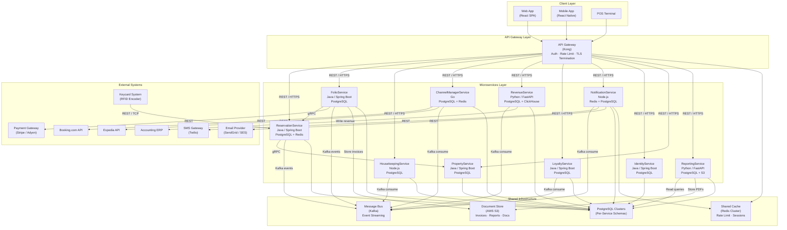
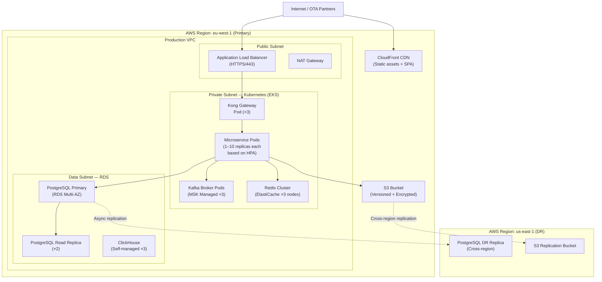

# Hotel Property Management System — Architecture Diagram

## Overview

The Hotel PMS is built as a **domain-oriented microservices architecture** deployed on Kubernetes. Each service owns its data, exposes a well-defined API surface, and communicates via synchronous REST/gRPC for request-response interactions and asynchronous Kafka events for state propagation. The architecture is designed for multi-property operation, meaning a single deployment can serve hundreds of hotel properties, with property-level data isolation enforced through tenant-scoped data partitioning.

This document describes the full microservices landscape, service interaction patterns, technology choices, deployment topology, and the key Architecture Decision Records (ADRs) that shaped these choices.

---

## 1. Architecture Principles

| # | Principle | Rationale |
|---|---|---|
| P-1 | **Each service owns its data** | No shared databases. Services integrate via APIs and events, not direct table joins. |
| P-2 | **Asynchronous by default** | State changes propagate via Kafka domain events. Synchronous calls reserved for reads and real-time user interactions. |
| P-3 | **Design for failure** | Every external call has a timeout, retry with exponential back-off, and circuit breaker. No cascading failures. |
| P-4 | **Idempotency everywhere** | All mutating operations accept an idempotency key. Safe to retry without side effects. |
| P-5 | **Immutable audit trail** | Every state change appends to an append-only audit log. No updates or deletes on audit records. |
| P-6 | **Zero-trust networking** | All inter-service communication is mTLS. JWT validation at the API Gateway; service-level claims checked in each service. |
| P-7 | **Observable by default** | Structured logging (JSON), distributed tracing (OpenTelemetry), and Prometheus metrics are non-optional for every service. |

---

## 2. Microservices Landscape

### 2.1 ReservationService

**Responsibility:** Manages the complete reservation lifecycle from creation to checkout. Owns room type availability calendar, room assignment logic, and the canonical reservation state machine.

**Tech Stack:** Java 21 + Spring Boot 3  
**Database:** PostgreSQL 15 (primary read-write) + Redis (availability hot cache)  
**Key APIs:**
- `POST /reservations` — create reservation
- `GET /reservations/{id}` — fetch with full history
- `PATCH /reservations/{id}/status` — status transitions (confirm, check-in, check-out, cancel, no-show)
- `POST /reservations/{id}/lock` — optimistic lock for concurrent modification prevention
- `GET /availability` — real-time room type availability query

**Publishes events:** `ReservationConfirmed`, `ReservationCheckedIn`, `ReservationCheckedOut`, `ReservationCancelled`, `ReservationNoShow`, `InventoryChanged`

---

### 2.2 HousekeepingService

**Responsibility:** Manages room cleanliness status, housekeeper task assignment, inspection workflows, and maintenance flagging. Consumes checkout events to automatically create cleaning tasks.

**Tech Stack:** Node.js 20 + Express + TypeScript  
**Database:** PostgreSQL 15  
**Key APIs:**
- `POST /tasks` — create housekeeping task
- `GET /tasks` — list tasks by status, floor, assignee
- `PATCH /tasks/{id}/assign` — assign to housekeeper
- `PATCH /tasks/{id}/complete` — mark complete with inspection
- `GET /rooms/status` — room status dashboard

**Consumes events:** `ReservationCheckedOut`, `ReservationCheckedIn`  
**Publishes events:** `RoomStatusChanged`

---

### 2.3 FolioService

**Responsibility:** Manages the guest billing ledger. Handles charge posting, payment capture, tax calculation, folio splitting, invoice generation, and checkout settlement.

**Tech Stack:** Java 21 + Spring Boot 3  
**Database:** PostgreSQL 15 (ACID-critical; no NoSQL)  
**Key APIs:**
- `POST /folios` — create folio on check-in
- `POST /folios/{id}/charges` — post charge with auto-tax
- `POST /folios/{id}/payments` — apply payment or pre-auth
- `POST /folios/{id}/close` — settle and generate invoice
- `GET /folios/{id}/invoice` — retrieve PDF invoice URL
- `POST /audit/post-room-charges` — batch night audit charge posting

**Publishes events:** `FolioChargePaid`, `FolioClosed`

---

### 2.4 ChannelManagerService

**Responsibility:** Bidirectional integration with OTA distribution channels. Pushes ARI updates outbound; ingests and normalises inbound OTA bookings. Manages channel credential store and mapping tables.

**Tech Stack:** Go 1.22  
**Database:** PostgreSQL 15 (channel mappings, sync log) + Redis (rate cache for fast ARI push)  
**Key APIs:**
- `POST /bookings/inbound` — receive OTA booking webhook
- `POST /ari/push` — trigger manual ARI push to all channels
- `GET /channels` — list connected channels and their sync status
- `POST /channels/{code}/test` — connectivity test
- `GET /sync-log` — ARI push audit history

**Consumes events:** `InventoryChanged`, `RateChanged`  
**Publishes events:** (outbound HTTP calls to OTA APIs, not Kafka events)

---

### 2.5 RevenueService

**Responsibility:** Revenue recognition, yield management rule evaluation, occupancy and ADR/RevPAR calculation, and business-date financial close. Provides the data layer for the revenue manager's dashboard.

**Tech Stack:** Python 3.12 + FastAPI  
**Database:** PostgreSQL 15 (revenue records, yield rules) + ClickHouse (analytical queries on large date ranges)  
**Key APIs:**
- `POST /revenue/recognise` — run revenue recognition for a business date
- `GET /revenue/stats` — ADR, RevPAR, occupancy for date range
- `GET /revenue/flash-report` — GM flash report data
- `POST /yield-rules` — create/update yield management rules

**Consumes events:** `FolioChargePaid`, `ReservationConfirmed`, `ReservationCancelled`

---

### 2.6 LoyaltyService

**Responsibility:** Manages guest loyalty programme: membership accounts, points accrual from stays, tier evaluation, and redemption voucher generation.

**Tech Stack:** Java 21 + Spring Boot 3  
**Database:** PostgreSQL 15  
**Key APIs:**
- `GET /accounts/{guestId}` — loyalty account summary
- `POST /accounts/{guestId}/award` — award points for stay
- `POST /accounts/{guestId}/redeem` — redeem points for voucher
- `GET /accounts/{guestId}/rewards` — available rewards

**Consumes events:** `FolioClosed`, `ReservationCheckedOut`  
**Publishes events:** `LoyaltyPointsAwarded`, `LoyaltyTierChanged`

---

### 2.7 NotificationService

**Responsibility:** Multi-channel notification dispatch. Templates for all guest-facing and staff-facing notification types. Supports email (SendGrid/SES), SMS (Twilio), and in-app push (FCM/APNs).

**Tech Stack:** Node.js 20 + Express + TypeScript  
**Database:** Redis (delivery tracking, deduplication) + PostgreSQL (template store, delivery log)  
**Key APIs:**
- `POST /notifications/send` — dispatch notification by template
- `GET /notifications/{id}/status` — delivery status
- `POST /templates` — manage notification templates

**Consumes events:** `ReservationConfirmed`, `ReservationCheckedIn`, `ReservationCheckedOut`, `ReservationCancelled`, `LoyaltyPointsAwarded`

---

### 2.8 IdentityService

**Responsibility:** Authentication (JWT issuance), authorisation (RBAC), staff user management, API key lifecycle, and session management.

**Tech Stack:** Java 21 + Spring Boot 3 + Spring Security  
**Database:** PostgreSQL 15  
**Key APIs:**
- `POST /auth/login` — staff login, returns JWT
- `POST /auth/guest-token` — issue short-lived guest portal token
- `POST /auth/refresh` — refresh access token
- `GET /users/{id}/permissions` — permission lookup
- `POST /api-keys` — issue/revoke API keys for integrations

---

### 2.9 PropertyService

**Responsibility:** Manages the property registry: property configuration, room type definitions, room inventory (physical rooms), tax configuration, and policy settings.

**Tech Stack:** Java 21 + Spring Boot 3  
**Database:** PostgreSQL 15  
**Key APIs:**
- `GET /properties/{id}` — full property configuration
- `POST /properties/{id}/rooms` — add room
- `PATCH /rooms/{number}/status` — update room status
- `GET /room-types` — list room types with current availability

---

### 2.10 ReportingService

**Responsibility:** Generates scheduled and on-demand reports: Daily Revenue, Arrivals/Departures, Night Audit Flash, Accounts Receivable Ageing, Housekeeping Status. Stores reports in S3 and indexes them for the reporting portal.

**Tech Stack:** Python 3.12 + FastAPI  
**Database:** PostgreSQL 15 (report metadata) + AWS S3 (PDF/CSV files)  
**Key APIs:**
- `POST /reports/generate` — trigger report generation
- `GET /reports` — list generated reports with S3 URLs
- `GET /reports/{id}` — report metadata + download link

---

## 3. Service Interaction Map

---

## 4. Technology Stack Summary

| Layer | Technology | Version | Purpose |
|---|---|---|---|
| API Gateway | Kong Gateway | 3.x | Routing, auth, rate limiting, TLS termination |
| Service Mesh | Istio | 1.21 | mTLS, traffic management, observability |
| Container Orchestration | Kubernetes (EKS) | 1.30 | Service deployment, scaling, self-healing |
| Event Streaming | Apache Kafka (MSK) | 3.7 | Async domain event propagation |
| Relational Database | PostgreSQL | 15 | Transactional data for all services |
| Analytical Database | ClickHouse | 24.x | Revenue analytics, large date-range queries |
| Cache / Session Store | Redis Cluster | 7.2 | Inventory hot cache, sessions, rate limiting |
| Document Store | AWS S3 | — | Invoices, reports, scanned IDs |
| Web Frontend | React + Vite | React 18 | Front-desk UI, revenue dashboard, admin portal |
| Mobile App | React Native + Expo | SDK 51 | Guest mobile app (check-in, key, folio) |
| Java Services | Spring Boot 3 + Java 21 | Spring 3.2 | ReservationService, FolioService, LoyaltyService, IdentityService, PropertyService |
| Node.js Services | Node.js + TypeScript | Node 20 LTS | HousekeepingService, NotificationService |
| Go Services | Go | 1.22 | ChannelManagerService (high throughput ARI push) |
| Python Services | Python + FastAPI | Python 3.12 | RevenueService, ReportingService |
| Observability | OpenTelemetry + Jaeger | — | Distributed tracing |
| Metrics | Prometheus + Grafana | — | Service health, SLO monitoring |
| Log Aggregation | Fluent Bit + OpenSearch | — | Centralised structured logging |
| CI/CD | GitHub Actions + ArgoCD | — | Build, test, GitOps deploy |
| Secrets Management | HashiCorp Vault | 1.16 | Database credentials, API keys, TLS certs |

---

## 5. Deployment Topology Overview

---

## 6. Architecture Decision Records (ADR) Summary

| ADR # | Title | Decision | Alternatives Considered | Rationale |
|---|---|---|---|---|
| ADR-001 | **Event-Driven vs Synchronous Inter-Service Communication** | **Event-driven (Kafka) for state propagation; synchronous REST/gRPC for reads and real-time UI flows** | Full synchronous REST; full async RPC | Event-driven decouples services and handles high-throughput night audit fan-outs without blocking. Synchronous kept only where latency matters to a user waiting for a response. |
| ADR-002 | **Monorepo vs Polyrepo** | **Monorepo (Turborepo)** | Separate Git repos per service | Shared tooling, atomic cross-service changes, easier dependency management for shared libraries (domain events, proto definitions). |
| ADR-003 | **PostgreSQL vs MongoDB for Reservations** | **PostgreSQL** | MongoDB (document store); DynamoDB (key-value) | Reservation data has complex relational structure (reservations, room allocations, rate plans, folios). ACID transactions are critical — double-booking prevention requires row-level locking. MongoDB's eventual consistency model is unsuitable here. |
| ADR-004 | **Go for Channel Manager** | **Go (ChannelManagerService)** | Java Spring Boot; Node.js | The channel manager must push ARI updates to 3+ OTAs concurrently under high volume (inventory changes during peak booking periods). Go's goroutines handle high concurrency with minimal memory overhead compared to JVM thread-per-request models. |
| ADR-005 | **API Gateway — Kong vs AWS API Gateway** | **Kong (self-hosted on Kubernetes)** | AWS API Gateway; Nginx + custom auth | Kong provides plugin-based extensibility (custom auth, rate limiting, request transformation) without AWS vendor lock-in. Multi-region and multi-property routing rules are more easily managed in Kong's declarative configuration than in AWS API GW's console-driven model. |
