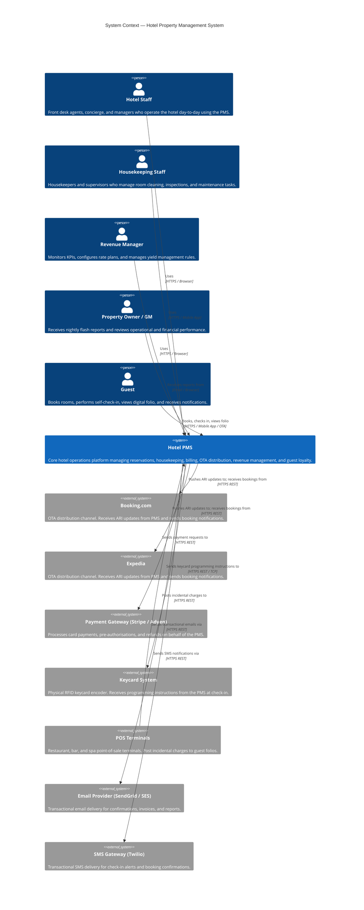

# Hotel Property Management System — C4 Context and Container Diagrams

## Overview

This document presents the Hotel PMS architecture through the lens of the **C4 model** (Context, Container, Component, Code). The C4 model provides a set of hierarchical, abstraction-level-appropriate diagrams that communicate the architecture to different audiences: the System Context diagram explains what the PMS is and who interacts with it (suitable for business stakeholders and non-technical audiences), while the Container diagram explains how the system is decomposed into deployable units and how they communicate (suitable for architects and senior engineers).

The diagrams follow the [C4 model specification](https://c4model.com/) and are rendered using the Mermaid C4 diagram syntax.

---

## 1. System Context Diagram

### 1.1 Prose Description

At the highest level, the **Hotel Property Management System** is a software platform that digitises and automates the operations of one or more hotel properties. It sits at the centre of a network of human actors and external software systems. Understanding all the actors and external dependencies at this level is critical for scoping integration work, defining security boundaries, and communicating the system's value to stakeholders.

**Human Actors:**

- **Hotel Staff** (Front Desk Agents, Concierge) interact with the PMS through a browser-based front-desk application. They perform check-ins, check-outs, room assignments, manual charge postings, and reservation modifications.
- **Housekeeping Staff** use the PMS (typically via mobile device) to receive room cleaning assignments, update room status, and log inspection results.
- **Revenue Manager** accesses the PMS revenue dashboard to monitor ADR, RevPAR, occupancy, and to configure rate plans and yield management rules.
- **General Manager / Property Owner** receive automated nightly Flash Report emails and can access the reporting portal for operational KPIs and financial summaries.
- **Guest** interacts with the PMS indirectly through: (a) an OTA or the hotel's direct booking portal, (b) a guest mobile app for digital check-in, mobile key access, and folio review.

**External Software Systems:**

- **OTA Channels (Booking.com, Expedia):** Bidirectional. The PMS sends ARI (Availability, Rates, Inventory) updates to OTAs; OTAs send booking notifications to the PMS.
- **Payment Gateway (Stripe/Adyen):** Outbound. The PMS sends payment capture, pre-authorisation, and refund requests.
- **Keycard System:** Outbound. The PMS instructs the physical keycard encoder to program RFID keycards or generate mobile key payloads.
- **POS Terminals:** Inbound. Restaurant, bar, and spa POS terminals post incidental charges to guest folios in the PMS.
- **Email/SMS Provider (SendGrid, Twilio):** Outbound. The PMS sends transactional emails (confirmations, invoices, night audit reports) and SMS messages through these providers.

### 1.2 C4 Context Diagram



---

## 2. Container Diagram

### 2.1 Prose Description

Inside the Hotel PMS system boundary, the platform is composed of multiple independently deployable containers — applications and data stores that together deliver the system's capabilities. Each container has a single, well-defined responsibility and communicates with other containers through defined protocols.

**Client-facing containers:**
- The **Web Application** (React SPA) is the primary interface for hotel staff, delivered via CDN. It provides the front-desk check-in workflow, housekeeping task board, revenue dashboard, and admin configuration panels.
- The **Mobile App** (React Native) serves both hotel staff and guests. Staff use it for housekeeping task management on the go; guests use it for self-check-in, mobile keycard access, and folio review.

**API and infrastructure containers:**
- The **API Gateway** (Kong) is the single entry point for all client requests. It handles TLS termination, JWT authentication, rate limiting, and routes requests to the appropriate backend microservice.
- The **Event Bus** (Kafka) is the central nervous system for asynchronous communication between services. Domain events are published and consumed here, enabling services to remain decoupled.
- The **Cache** (Redis) provides sub-millisecond data access for hot data: room availability counts, session tokens, rate-limiting counters, and notification deduplication keys.
- The **Document Store** (S3) stores binary artefacts: PDF invoices, generated reports, scanned identity documents, and housekeeping photo attachments.

**Backend microservice containers** (each independently deployable, with its own database):

| Container | Language / Framework | Responsibility |
|---|---|---|
| ReservationService | Java / Spring Boot | Reservation lifecycle, availability, room assignment |
| FolioService | Java / Spring Boot | Billing ledger, charge posting, payment settlement, invoice generation |
| HousekeepingService | Node.js / TypeScript | Cleaning task assignment, room status management, inspection workflows |
| ChannelManagerService | Go | OTA ARI push, inbound booking ingestion, channel mapping |
| RevenueService | Python / FastAPI | Revenue recognition, yield management, KPI calculation |
| LoyaltyService | Java / Spring Boot | Loyalty account management, points accrual, tier evaluation |
| NotificationService | Node.js / TypeScript | Multi-channel notification dispatch (email, SMS, push) |

**Database containers:**
- **Reservation DB** (PostgreSQL): Reservations, room allocations, availability calendar.
- **Folio DB** (PostgreSQL): Folios, charges, payments, invoices — ACID-critical financial data.

### 2.2 C4 Container Diagram

```mermaid
C4Container
  title Container Diagram — Hotel Property Management System

  Person(hotelStaff, "Hotel Staff", "Front desk, housekeeping, revenue manager")
  Person(guest, "Guest", "Books and self-manages their stay")

  System_Ext(bookingCom, "Booking.com", "OTA channel")
  System_Ext(expedia, "Expedia", "OTA channel")
  System_Ext(paymentGW, "Payment Gateway", "Stripe / Adyen")
  System_Ext(keycardSys, "Keycard System", "RFID encoder")
  System_Ext(emailSMS, "Email / SMS Provider", "SendGrid / Twilio")
  System_Ext(posTerm, "POS Terminals", "F&B / Spa")

  Container(webApp, "Web Application", "React 18 SPA (Vite)", "Staff-facing UI: front-desk operations, housekeeping board, revenue dashboard, admin configuration. Served via CloudFront CDN.")
  Container(mobileApp, "Mobile App", "React Native (Expo)", "Guest-facing: self check-in, mobile key, digital folio. Staff-facing: mobile housekeeping task management.")

  Container(apiGateway, "API Gateway", "Kong 3.x", "Single entry point. Handles TLS termination, JWT validation, rate limiting, and request routing to backend services.")

  Container(reservationSvc, "ReservationService", "Java 21 / Spring Boot 3", "Manages reservation lifecycle: create, confirm, modify, check-in, check-out, cancel, no-show. Owns availability calendar and room assignment logic.")
  Container(folioSvc, "FolioService", "Java 21 / Spring Boot 3", "Guest billing ledger. Posts room rate and incidental charges, applies taxes, captures payments, generates PDF invoices. Runs night audit charge batch.")
  Container(housekeepingSvc, "HousekeepingService", "Node.js 20 / TypeScript", "Manages cleaning task assignment, room status transitions, and inspection workflows. Consumes checkout events to auto-create tasks.")
  Container(channelMgrSvc, "ChannelManagerService", "Go 1.22", "Bidirectional OTA integration. Pushes ARI updates to Booking.com and Expedia. Ingests and normalises inbound OTA bookings.")
  Container(revenueSvc, "RevenueService", "Python 3.12 / FastAPI", "Revenue recognition, yield management rules, ADR/RevPAR/occupancy computation. Feeds revenue manager dashboard.")
  Container(loyaltySvc, "LoyaltyService", "Java 21 / Spring Boot 3", "Loyalty membership, points accrual from completed stays, tier evaluation, and redemption voucher issuance.")
  Container(notificationSvc, "NotificationService", "Node.js 20 / TypeScript", "Consumes domain events and dispatches notifications via email, SMS, and push. Manages notification templates and delivery tracking.")

  ContainerDb(reservationDb, "Reservation DB", "PostgreSQL 15", "Stores reservations, room allocations, room types, availability calendar, rate plans.")
  ContainerDb(folioDB, "Folio DB", "PostgreSQL 15", "Stores folios, folio charges, payments, tax lines, invoices — ACID-critical financial ledger.")
  ContainerDb(cache, "Cache", "Redis 7.2 Cluster", "Availability hot cache, session tokens, rate-limiting counters, notification deduplication keys.")
  ContainerDb(docStore, "Document Store", "AWS S3", "PDF invoices, generated reports, scanned ID documents, housekeeping photo attachments.")

  Container(eventBus, "Event Bus", "Apache Kafka (AWS MSK)", "Asynchronous domain event streaming between microservices. Topics per domain event type.")

  %% Client to Gateway
  Rel(hotelStaff, webApp, "Uses", "HTTPS / Browser")
  Rel(guest, mobileApp, "Uses", "HTTPS / Mobile")
  Rel(webApp, apiGateway, "Calls", "REST / HTTPS")
  Rel(mobileApp, apiGateway, "Calls", "REST / HTTPS")

  %% Gateway to Services
  Rel(apiGateway, reservationSvc, "Routes to", "REST / HTTPS")
  Rel(apiGateway, folioSvc, "Routes to", "REST / HTTPS")
  Rel(apiGateway, housekeepingSvc, "Routes to", "REST / HTTPS")
  Rel(apiGateway, channelMgrSvc, "Routes to", "REST / HTTPS")
  Rel(apiGateway, revenueSvc, "Routes to", "REST / HTTPS")
  Rel(apiGateway, loyaltySvc, "Routes to", "REST / HTTPS")
  Rel(apiGateway, notificationSvc, "Routes to", "REST / HTTPS")

  %% Service to DB
  Rel(reservationSvc, reservationDb, "Reads / writes", "JDBC / SQL")
  Rel(folioSvc, folioDB, "Reads / writes", "JDBC / SQL")
  Rel(reservationSvc, cache, "Caches availability", "Redis protocol")
  Rel(apiGateway, cache, "Session + rate limit", "Redis protocol")
  Rel(folioSvc, docStore, "Stores invoices", "AWS SDK / S3 API")

  %% Services to Event Bus
  Rel(reservationSvc, eventBus, "Publishes domain events", "Kafka producer")
  Rel(folioSvc, eventBus, "Publishes FolioChargePaid, FolioClosed", "Kafka producer")
  Rel(housekeepingSvc, eventBus, "Consumes + publishes RoomStatusChanged", "Kafka consumer/producer")
  Rel(channelMgrSvc, eventBus, "Consumes InventoryChanged", "Kafka consumer")
  Rel(revenueSvc, eventBus, "Consumes FolioChargePaid, ReservationConfirmed", "Kafka consumer")
  Rel(loyaltySvc, eventBus, "Consumes FolioClosed, CheckedOut", "Kafka consumer")
  Rel(notificationSvc, eventBus, "Consumes all guest-facing events", "Kafka consumer")

  %% External integrations
  Rel(channelMgrSvc, bookingCom, "Pushes ARI; receives bookings", "REST / HTTPS")
  Rel(channelMgrSvc, expedia, "Pushes ARI; receives bookings", "REST / HTTPS")
  Rel(folioSvc, paymentGW, "Captures payments / pre-auths", "REST / HTTPS")
  Rel(reservationSvc, keycardSys, "Encodes keycards at check-in", "REST / HTTPS")
  Rel(posTerm, folioSvc, "Posts incidental charges", "REST / HTTPS")
  Rel(notificationSvc, emailSMS, "Dispatches emails and SMS", "REST / HTTPS")
```



---

## 3. Key Relationships and Communication Patterns

### 3.1 Synchronous Communication (REST / gRPC)

Synchronous HTTP calls are used for flows where a human is waiting for an immediate response — check-in, folio charge posting, availability search. All synchronous calls pass through the API Gateway, which enforces authentication (JWT), authorisation (RBAC claims), and rate limiting.

| Caller | Callee | Protocol | Use Case |
|---|---|---|---|
| Web App | ReservationService | REST/HTTPS | Search, create, modify, check-in/out reservation |
| Web App | FolioService | REST/HTTPS | View folio, post adjustment, checkout |
| Web App | HousekeepingService | REST/HTTPS | Task board, assign task, update status |
| ChannelManagerService | Booking.com API | REST/HTTPS | ARI push, booking confirmation |
| ChannelManagerService | Expedia API | REST/HTTPS | ARI push, booking confirmation |
| FolioService | Payment Gateway | REST/HTTPS | Pre-auth, capture, refund |
| ReservationService | Keycard System | REST/HTTPS | Encode keycard at check-in |
| POS Terminal | FolioService | REST/HTTPS | Post incidental charge |

### 3.2 Asynchronous Communication (Kafka Events)

Kafka is used for all state propagation that does not require an immediate response. This decouples services and ensures that temporary failures in downstream consumers (e.g., NotificationService email provider outage) do not block the primary user-facing operation.

| Producer | Event Topic | Consumers | Purpose |
|---|---|---|---|
| ReservationService | `reservation.confirmed` | FolioService, ChannelManagerService, NotificationService | Trigger folio creation, ARI update, confirmation email |
| ReservationService | `reservation.checked-in` | HousekeepingService, LoyaltyService, NotificationService | Trigger welcome notification, start loyalty tracking |
| ReservationService | `reservation.checked-out` | HousekeepingService, FolioService, LoyaltyService, NotificationService | Trigger cleaning task, folio close, points award |
| ReservationService | `reservation.cancelled` | FolioService, ChannelManagerService, NotificationService | Trigger refund/no-show fee, ARI update, cancellation email |
| ReservationService | `inventory.changed` | ChannelManagerService | Trigger ARI push to all OTAs |
| FolioService | `folio.charge.paid` | RevenueService | Update daily revenue recognition |
| FolioService | `folio.closed` | LoyaltyService, RevenueService, NotificationService | Award points, recognise revenue, send invoice |
| HousekeepingService | `room.status.changed` | ReservationService | Update room availability when cleaned |
| LoyaltyService | `loyalty.points.awarded` | NotificationService | Send points award notification to guest |

### 3.3 Data Isolation Boundaries

Each microservice owns its own database schema. There are no cross-service database joins. Services that need data from another context either call the owning service's API synchronously, or maintain a local read-model (projection) built from consumed Kafka events.

| Service | Database | Schema Isolation Strategy |
|---|---|---|
| ReservationService | reservations_db (PostgreSQL) | Dedicated RDS instance; access via service account only |
| FolioService | folio_db (PostgreSQL) | Dedicated RDS instance; separate from reservations for financial isolation |
| HousekeepingService | housekeeping_db (PostgreSQL) | Shares RDS cluster (separate schema); low write volume |
| ChannelManagerService | channel_db (PostgreSQL) | Separate schema; sync log retained 90 days |
| RevenueService | revenue_db (PostgreSQL) + ClickHouse | PostgreSQL for operational data; ClickHouse for analytics |
| LoyaltyService | loyalty_db (PostgreSQL) | Dedicated schema; GDPR data minimisation applied |
| NotificationService | notifications_db (PostgreSQL) | Separate schema; delivery log purged after 30 days |

### 3.4 Security Boundaries

All traffic entering the system passes through the Kong API Gateway, which validates the JWT issued by IdentityService and injects the decoded claims into downstream request headers. Services perform a second, lightweight authorisation check on the injected claims (RBAC) without re-verifying the token signature.

Service-to-service calls within the Kubernetes cluster use mTLS (enforced by Istio service mesh). Each service has a dedicated Kubernetes ServiceAccount and Vault-injected short-lived credentials for its database.

External OTA webhooks are authenticated using HMAC-SHA256 signature verification at the ChannelManagerService ingestion endpoint. The shared secret per OTA is stored in HashiCorp Vault and rotated quarterly.

### 3.5 Resilience Patterns

| Pattern | Applied Where | Implementation |
|---|---|---|
| Circuit Breaker | FolioService → PaymentGateway | Resilience4j; opens after 5 failures in 30s window |
| Retry with Exponential Back-off | ChannelManagerService → OTA APIs | Go `retryablehttp`; max 3 retries, 1s/2s/4s delays |
| Idempotency Keys | All POST endpoints | UUID v4 key in `Idempotency-Key` header; stored in Redis for 24h |
| Saga Pattern | Check-out flow (folio → payment → reservation) | Choreography-based; compensating events on failure |
| Outbox Pattern | ReservationService, FolioService | Transactional outbox table; Debezium CDC → Kafka |
| Bulkhead | NotificationService email vs SMS | Separate thread pools; email failure cannot exhaust SMS threads |

---

## 4. Summary

The C4 model diagrams in this document describe a system where:

1. **Multiple human actors** (staff, guests, managers) interact with the PMS through dedicated, role-appropriate interfaces.
2. **Multiple external systems** (OTAs, payment processors, keycard systems) are integrated with clearly defined protocols and security patterns.
3. **Ten microservices** collaborate to deliver PMS capabilities, each owning its data and communicating via REST, gRPC, or Kafka events.
4. **Shared infrastructure** (Kafka, Redis, S3) provides the connective tissue between services without creating tight coupling.
5. **Security, resilience, and observability** are cross-cutting concerns enforced at the platform layer, not duplicated in each service.

The C4 model hierarchy continues at the Component level (within each service) and the Code level (class diagrams per aggregate) — these are documented in the domain model and sequence diagram documents respectively.

---

## 5. Deployment and Scaling Considerations

### 5.1 Horizontal Scaling Per Container

Each microservice container is independently scalable. The following table documents the default replica counts and Horizontal Pod Autoscaler (HPA) configuration for each service in production.

| Container | Min Replicas | Max Replicas | HPA Metric | Scale-Up Trigger |
|---|---|---|---|---|
| Web Application | 2 (CDN-served, stateless) | N/A | — | Deployed via CloudFront; no pod scaling needed |
| API Gateway (Kong) | 3 | 10 | CPU utilisation | > 70% CPU for 2 min |
| ReservationService | 3 | 12 | Request rate + CPU | > 200 RPS or > 70% CPU |
| FolioService | 2 | 8 | Request rate + CPU | > 150 RPS or > 70% CPU |
| HousekeepingService | 2 | 6 | Queue depth | > 500 unprocessed Kafka messages |
| ChannelManagerService | 2 | 10 | OTA webhook queue depth | > 50 pending webhooks |
| RevenueService | 1 | 4 | CPU (analytics workloads are bursty) | > 80% CPU for 5 min |
| LoyaltyService | 1 | 4 | Queue depth | > 200 unprocessed Kafka messages |
| NotificationService | 2 | 8 | Queue depth | > 300 unprocessed Kafka messages |
| Kafka (MSK) | 3 brokers (fixed) | — | Managed by AWS MSK | Broker storage > 80% |
| Redis Cluster | 3 nodes (fixed) | — | Managed by ElastiCache | Memory > 75% → add shard |
| Reservation DB (PostgreSQL) | 1 primary + 2 replicas | — | Managed RDS Multi-AZ | Read traffic → read replicas |
| Folio DB (PostgreSQL) | 1 primary + 2 replicas | — | Managed RDS Multi-AZ | Manual failover; financial data |

### 5.2 Night Audit Scaling

The Night Audit process creates a temporary spike in FolioService load as it posts room rate and tax charges for all in-house guests simultaneously. For a 500-room property at 85% occupancy, this means ~425 folios being posted in a tight window. FolioService is pre-scaled to its maximum replica count (8 pods) before the audit begins, using a Kubernetes CronJob that patches the HPA `minReplicas` field at 01:45 and resets it at 05:00.

### 5.3 Multi-Property Tenancy

The PMS supports multiple hotel properties in a single deployment. Tenancy is enforced at the application layer through a `propertyId` claim in the JWT — every API call is scoped to the authenticated property. Database-level isolation uses PostgreSQL Row-Level Security (RLS) policies keyed on `property_id`, ensuring that even a misconfigured query cannot accidentally return data from a different property.

---

## 6. Network and Security Architecture

### 6.1 Traffic Flow (Inbound)

```
Internet
  └── AWS CloudFront (CDN — static assets, SPA)
  └── AWS Application Load Balancer (HTTPS/443)
        └── Kong API Gateway (Kubernetes pod)
              └── Target microservice pod (internal HTTP/8080)
```

All traffic to the ALB is HTTPS only. Kong terminates TLS, validates the JWT, and forwards requests to backend services over plain HTTP within the private Kubernetes cluster network. Istio enforces mTLS for all pod-to-pod communication, even within the cluster.

### 6.2 Traffic Flow (Inbound — OTA Webhooks)

OTA webhook endpoints are hosted on a dedicated subdomain (`webhooks.pms.hotel.com`) with a separate Kong route that applies a webhook-specific auth plugin (HMAC signature verification) instead of the JWT plugin used for staff/guest routes. This separates the authentication model for machine-to-machine OTA integrations from the human user flows.

### 6.3 Secret Management

All sensitive configuration (database passwords, API keys for OTAs, payment gateway keys, JWT signing keys) is stored in HashiCorp Vault. Kubernetes pods use the Vault Agent Sidecar Injector to mount secrets as environment variables or files at pod startup. Secrets are never stored in Kubernetes Secrets objects or version-controlled config files.

| Secret Type | Rotation Frequency | Method |
|---|---|---|
| Database credentials | 30 days | Vault dynamic secrets (PostgreSQL role) |
| JWT signing key (RSA 2048) | 90 days | Vault PKI secrets engine |
| OTA HMAC shared secrets | Quarterly | Manual rotation with OTA partner portal |
| Payment gateway API keys | 180 days | Stripe/Adyen API key rotation |
| Internal mTLS certificates | 24 hours | Istio cert-manager auto-rotation |

### 6.4 Data Classification

| Data Category | Examples | Classification | Storage Requirement |
|---|---|---|---|
| Guest PII | Name, email, phone, passport number | **Confidential** | Encrypted at rest (AES-256), TLS in transit, access logged |
| Payment data | Card tokens, pre-auth references | **Restricted (PCI-DSS)** | Tokenised; actual card data never stored in PMS |
| Financial records | Folio charges, payments, invoices | **Confidential** | 7-year retention, immutable audit log |
| Operational data | Reservations, room status, tasks | **Internal** | Standard encryption, standard retention |
| Analytics data | ADR, RevPAR, occupancy stats | **Internal** | Aggregated; no PII in analytics store |
| Audit logs | All state transitions | **Confidential** | Append-only, tamper-evident, 7-year retention |

---

## 7. Observability Stack

Every container in the system contributes to three pillars of observability: logs, metrics, and traces.

### 7.1 Logging

All services emit structured JSON logs to stdout. Fluent Bit (DaemonSet) collects logs from all pods and ships them to OpenSearch. Log fields include: `timestamp`, `level`, `service`, `traceId`, `spanId`, `correlationId`, `propertyId`, `guestId` (hashed for PII protection), `event`, and `durationMs`.

### 7.2 Metrics

All services expose a `/metrics` endpoint (Prometheus scrape format). The following metrics are tracked per service:

| Metric | Type | Description |
|---|---|---|
| `http_requests_total` | Counter | Total requests by method, path, status code |
| `http_request_duration_seconds` | Histogram | P50/P95/P99 request latency |
| `kafka_consumer_lag` | Gauge | Consumer group lag per topic partition |
| `db_query_duration_seconds` | Histogram | Database query latency by query type |
| `folio_charges_posted_total` | Counter | Night audit progress tracking |
| `ota_ari_push_duration_seconds` | Histogram | Latency of ARI pushes to each OTA |
| `reservation_status_transitions_total` | Counter | State machine transitions by status |

### 7.3 Distributed Tracing

All services are instrumented with OpenTelemetry SDK. Traces propagate across service boundaries via W3C `traceparent` / `tracestate` headers. Jaeger is deployed as the trace backend, with trace data retained for 7 days. Every Kafka event includes `correlationId` and `traceId` in its headers to enable cross-service trace correlation even for async flows.

A single check-in operation generates a trace spanning: `FrontDeskUI → Kong → ReservationService → RoomService → KeycardService → FolioService → NotificationService`, giving the on-call engineer full visibility of where latency is incurred in a slow check-in.

