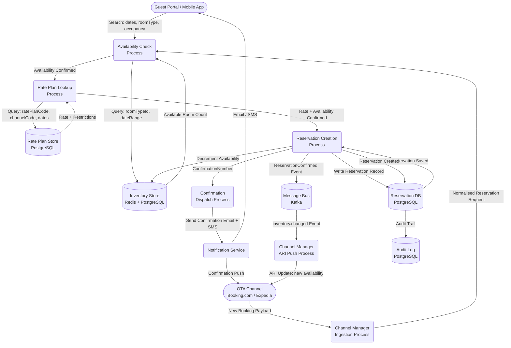
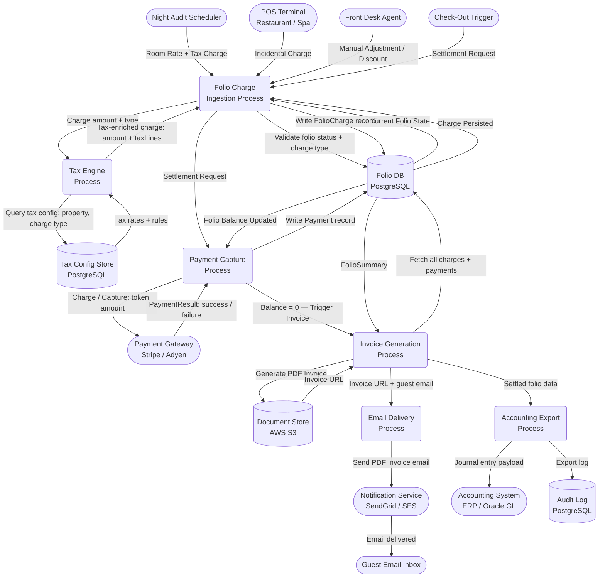
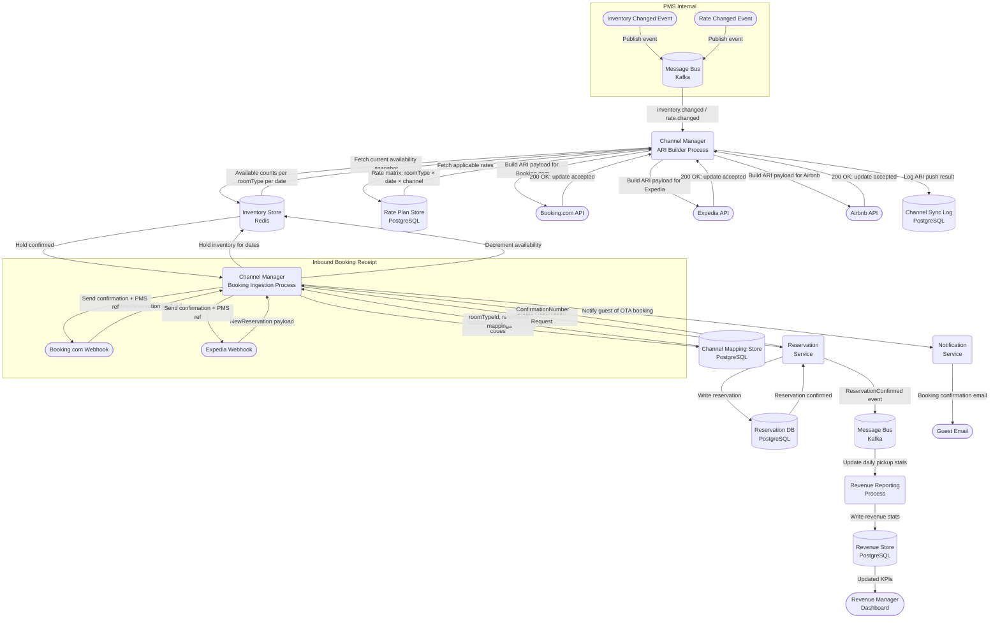

# Hotel Property Management System — Data Flow Diagrams

## Overview

Data Flow Diagrams (DFDs) show how data moves through the Hotel PMS — which actors supply it, which processes transform it, and which data stores persist it. Unlike sequence diagrams (which focus on timing and protocol), DFDs focus on the **shape and direction of data** as it passes through the system. This document presents three core flows: the end-to-end reservation creation flow, the folio billing and settlement flow, and the OTA channel synchronisation flow. Each is represented as a Mermaid flowchart with named actors, process nodes, and data-store nodes, followed by a prose explanation of each data movement.

All data stores are colour-coded in the diagrams:
- **Cylindrical nodes** (`[(…)]`) = persistent data stores
- **Rounded rectangles** (`(…)`) = processes / services
- **Rectangles** (`[…]`) = external actors or systems
- **Parallelograms** (described in notes) = data packets in transit

---

## 1. Reservation Flow

### 1.1 Prose Description

A reservation enters the system from one of two sources: a guest booking directly through the hotel's web or mobile portal, or a booking arriving via an OTA through the Channel Manager. In both cases the data path converges at the Reservation Ingestion process.

The guest submits a search request specifying property, dates, room type, and occupancy. The **Availability Check** process queries the Inventory data store, which holds a materialised view of available room counts per room type per date, maintained in near real-time. If availability exists, the **Rate Plan Lookup** process retrieves the applicable rate (BAR, package, promotional, or loyalty rate) from the Rate Plan data store.

With availability confirmed and a rate selected, the **Reservation Creation** process writes a new `Reservation` record to the Reservation DB, atomically decrementing the availability counter in the Inventory store using an optimistic-lock transaction. A `ConfirmationNumber` is generated and a `ReservationConfirmed` domain event is published to the Message Bus.

The Channel Manager Service consumes this event and pushes an ARI (Availability, Rates, Inventory) update to all connected OTA channels to reflect the reduced availability. In parallel, the Notification Service consumes the same event and dispatches a confirmation email and SMS to the guest.

### 1.2 Reservation Flow Diagram



### 1.3 Data Movements Summary

| Step | Data In | Process | Data Out | Store Written |
|---|---|---|---|---|
| 1 | Search params | Availability Check | Room counts | — |
| 2 | Room counts | Rate Plan Lookup | Rate, restrictions | — |
| 3 | Rate + availability | Reservation Creation | Reservation record | Reservation DB |
| 4 | Reservation record | Inventory Decrement | Updated counts | Inventory Store |
| 5 | Confirmation number | Notification Dispatch | Email + SMS | — |
| 6 | ReservationConfirmed event | ARI Push | Updated ARI | — (OTA external) |

---

## 2. Folio Billing Flow

### 2.1 Prose Description

The folio billing flow is triggered by charge events throughout a guest's stay. A charge event can originate from multiple sources: the Night Audit Scheduler posting room rate and tax charges, a Point of Sale (POS) terminal in the restaurant or spa sending incidental charges, a front-desk agent applying a manual adjustment, or the settlement process capturing the final payment at checkout.

Each charge event arrives at the **Folio Charge Ingestion** process, which validates the charge type, amounts, and the folio's current status (must be `OPEN`). The **Tax Engine** is invoked to calculate applicable taxes: room tax, city/tourist tax, VAT, and service charge, based on the property's tax configuration and the charge type. The enriched charge (including all tax lines) is written to the Folio DB.

At checkout — or during the night audit for express-checkout guests — the **Payment Capture** process calls the **Payment Gateway** with the pre-authorised token stored at check-in. The gateway either captures the pre-auth or charges the card for the outstanding balance. The payment result is written back to the Folio DB as a `Payment` record, and the folio balance is reconciled.

Once the balance reaches zero (or a credit balance exists), the **Invoice Generation** process creates a PDF invoice and stores it in the Document Store (S3). The **Email Delivery** process sends the invoice to the guest's registered email. Finally, an **Accounting Export** process formats the settled folio data as a journal entry and pushes it to the accounting system (e.g., Oracle Hospitality OPERA GL, or a custom ERP integration).

### 2.2 Folio Billing Flow Diagram



### 2.3 Data Movements Summary

| Step | Trigger | Process | Output | Store |
|---|---|---|---|---|
| 1 | Charge event | Folio Charge Ingestion | Validated charge | Folio DB |
| 2 | Charge amount | Tax Engine | Tax-enriched charge | Folio DB |
| 3 | Settlement request | Payment Capture | Payment record | Folio DB |
| 4 | Balance = 0 | Invoice Generation | PDF invoice | Document Store |
| 5 | Invoice ready | Email Delivery | Email with PDF | — (external) |
| 6 | Folio closed | Accounting Export | GL journal entry | Audit Log + ERP |

---

## 3. OTA Channel Sync Flow

### 3.1 Prose Description

The OTA Channel Sync flow operates in both directions and must maintain rate parity and availability accuracy across all connected distribution channels at all times. A delay of more than a few minutes in pushing ARI updates can result in overbookings (if availability is not decremented after a direct booking) or rate parity violations (if rates are adjusted for a promotional period but not pushed).

**Outbound (PMS → OTA):** Any change to availability or rates within the PMS triggers an `InventoryChanged` or `RateChanged` domain event on the Message Bus. The Channel Manager Service consumes these events, fetches the latest state snapshot from both the Inventory Store and the Rate Plan Store, constructs OTA-format ARI payloads, and pushes them concurrently to all connected OTA APIs. Each push is logged in the Channel Sync Log for audit and troubleshooting.

**Inbound (OTA → PMS):** When a booking is made on an OTA, the OTA sends a webhook payload to the Channel Manager's inbound endpoint. The Channel Manager validates the payload, performs a channel-to-PMS mapping (mapping OTA room type codes to PMS room type IDs, and OTA rate plan codes to PMS rate plan IDs), then calls the Reservation Service to create the reservation. Inventory is decremented, a confirmation is sent back to the OTA, and the guest receives a booking confirmation.

Revenue reporting is updated in near real-time: every confirmed booking event updates the daily pickup statistics in the Revenue Store, which feeds the revenue manager's dashboard.

### 3.2 OTA Channel Sync Flow Diagram



### 3.3 Data Movements Summary

| Direction | Trigger | Process | Data Exchanged | Store Updated |
|---|---|---|---|---|
| Outbound | Inventory/Rate change | ARI Builder | ARI payload (availability + rates) | Channel Sync Log |
| Outbound | ARI push result | Sync Logger | Push success/failure + timestamp | Channel Sync Log |
| Inbound | OTA webhook | Booking Ingestion | Booking payload → Reservation | Reservation DB |
| Inbound | Reservation created | Inventory Decrement | Updated counts | Inventory Store |
| Inbound | Booking confirmed | Revenue Reporting | Pickup stats | Revenue Store |

---

## 4. Data Stores and External Interfaces

### 4.1 Data Stores

| Store | Technology | Owned By | Contents | Retention |
|---|---|---|---|---|
| Reservation DB | PostgreSQL | ReservationService | Reservations, room allocations, status history | Indefinite |
| Folio DB | PostgreSQL | FolioService | Folios, charges, payments, invoices | 7 years (statutory) |
| Inventory Store | Redis + PostgreSQL | InventoryService | Room counts per type per date (hot: Redis; cold: PG) | Rolling 2 years |
| Rate Plan Store | PostgreSQL | RatePlanService | Rate plans, rate calendars, restrictions | Indefinite |
| Tax Config Store | PostgreSQL | FolioService | Tax rules per property per charge type | Indefinite |
| Channel Sync Log | PostgreSQL | ChannelManagerService | ARI push history, OTA acknowledgements | 90 days |
| Channel Mapping Store | PostgreSQL | ChannelManagerService | OTA code ↔ PMS ID mappings | Indefinite |
| Revenue Store | PostgreSQL | RevenueService | Daily revenue records, KPIs, occupancy stats | 5 years |
| Document Store | AWS S3 | Multiple (read/write) | Invoices, reports, ID documents (encrypted) | 7 years |
| Audit Log | PostgreSQL | All Services | Immutable event ledger (append-only) | 7 years |

### 4.2 External Interfaces

| External System | Direction | Protocol | Data Format | SLA |
|---|---|---|---|---|
| Booking.com API | Bidirectional | HTTPS REST | JSON (HTNG 2011B extensions) | 99.9% uptime |
| Expedia EPS API | Bidirectional | HTTPS REST | JSON (OTA_HotelAvailNotifRQ) | 99.9% uptime |
| Airbnb API | Bidirectional | HTTPS REST + Webhooks | JSON | 99.5% uptime |
| Payment Gateway (Stripe) | Outbound | HTTPS REST | JSON | 99.99% uptime |
| Notification Service (SendGrid) | Outbound | HTTPS REST | JSON + MIME | 99.9% uptime |
| SMS Gateway (Twilio) | Outbound | HTTPS REST | JSON | 99.9% uptime |
| Accounting System (ERP) | Outbound | HTTPS REST / SFTP | JSON / CSV | Best effort |
| Keycard System | Outbound | TCP/RS-232 or REST | Proprietary / JSON | Local only |
| POS Terminals | Inbound | HTTPS REST | JSON | 99.5% uptime |

---

## 5. Data Quality and Validation Rules

Each data flow includes validation gates that reject invalid or incomplete data before it reaches a core data store. The following rules apply at the ingestion boundary of each flow.

### 5.1 Reservation Flow Validation

| Field | Rule | Error Response |
|---|---|---|
| `checkInDate` | Must be today or a future date | 422: `CHECK_IN_DATE_IN_PAST` |
| `checkOutDate` | Must be strictly after `checkInDate` | 422: `INVALID_DATE_RANGE` |
| `roomTypeId` | Must exist and be active for the property | 404: `ROOM_TYPE_NOT_FOUND` |
| `guestId` | Must reference an existing guest profile | 404: `GUEST_NOT_FOUND` |
| `ratePlanCode` | Must be active for the requested channel and dates | 422: `RATE_PLAN_NOT_APPLICABLE` |
| `adultsCount` | Must be ≥ 1 and ≤ `RoomType.maxAdults` | 422: `OCCUPANCY_EXCEEDED` |

### 5.2 Folio Billing Flow Validation

| Field | Rule | Error Response |
|---|---|---|
| `chargeType` | Must be a valid enum value from the charge type registry | 400: `INVALID_CHARGE_TYPE` |
| `amount` | Must be a positive decimal, ≤ `MAX_SINGLE_CHARGE` property config | 400: `CHARGE_AMOUNT_INVALID` |
| `folioId` | Must reference an open folio (status = OPEN) | 409: `FOLIO_NOT_OPEN` |
| `businessDate` | Must equal the current business date (no backdating without override) | 422: `BACKDATE_NOT_PERMITTED` |
| `paymentToken` | Must be a valid Stripe/Adyen payment method token | 400: `PAYMENT_TOKEN_INVALID` |

### 5.3 OTA Channel Sync Validation

| Field | Rule | Error Response |
|---|---|---|
| `propertyCode` | Must map to an active property in the channel mapping store | 400: `UNKNOWN_PROPERTY_CODE` |
| `roomTypeCode` | Must have an active channel mapping to a PMS room type ID | 400: `ROOM_TYPE_MAPPING_NOT_FOUND` |
| `ratePlanCode` | Must have an active channel mapping to a PMS rate plan ID | 400: `RATE_PLAN_MAPPING_NOT_FOUND` |
| `otaBookingRef` | Must be unique; duplicate refs are rejected as replays | 409: `BOOKING_REF_ALREADY_EXISTS` |
| `totalAmount` | Must match the PMS-calculated rate for the dates; tolerance ±0.50 for rounding | 422: `AMOUNT_MISMATCH` |

---

## 6. Event Schema Reference

Domain events emitted during each flow conform to a standardised envelope schema. This ensures consistent deserialisation across all consuming services.

```json
{
  "eventId": "uuid-v4",
  "eventType": "reservation.confirmed",
  "source": "reservation-service",
  "specVersion": "1.0",
  "dataContentType": "application/json",
  "time": "2025-07-04T14:30:00Z",
  "correlationId": "uuid-v4",
  "data": {
    "reservationId": "RES-2025-000142",
    "confirmationNumber": "PMS-2025-483921",
    "guestId": "GUEST-00834",
    "propertyId": "PROP-001",
    "checkInDate": "2025-07-04",
    "checkOutDate": "2025-07-07",
    "roomTypeId": "DELUXE-KING",
    "ratePlanId": "BAR-2025-Q3",
    "totalAmount": { "amount": "750.00", "currency": "USD" },
    "source": "DIRECT_WEB"
  }
}
```

| Field | Type | Description |
|---|---|---|
| `eventId` | UUID v4 | Globally unique event identifier; used for deduplication |
| `eventType` | String | Dot-separated event name (e.g., `reservation.confirmed`) |
| `source` | String | Originating service name |
| `specVersion` | String | CloudEvents spec version |
| `time` | ISO 8601 | UTC timestamp of event emission |
| `correlationId` | UUID v4 | Traces back to the originating HTTP request or saga |
| `data` | Object | Event-specific payload; schema varies per `eventType` |

All events are produced to Kafka with `correlationId` set as the message key to ensure ordered processing within a single business transaction, while allowing parallel processing across different transactions.

---

## 7. Flow Monitoring and SLO Targets

| Flow | SLO Metric | Target | Alert Threshold |
|---|---|---|---|
| Reservation Flow | End-to-end P99 latency (search → confirm) | < 2 seconds | > 3 seconds for 5 min |
| Folio Billing | Charge posting P99 latency | < 500 ms | > 1 second for 2 min |
| Folio Billing | Payment capture success rate | > 99.5% | < 99% for 5 min |
| OTA Sync (outbound) | ARI push latency after inventory change | < 30 seconds | > 60 seconds |
| OTA Sync (inbound) | Booking ingestion to reservation confirmed | < 10 seconds | > 30 seconds |
| Night Audit | Full audit completion time | < 90 minutes | > 120 minutes |
