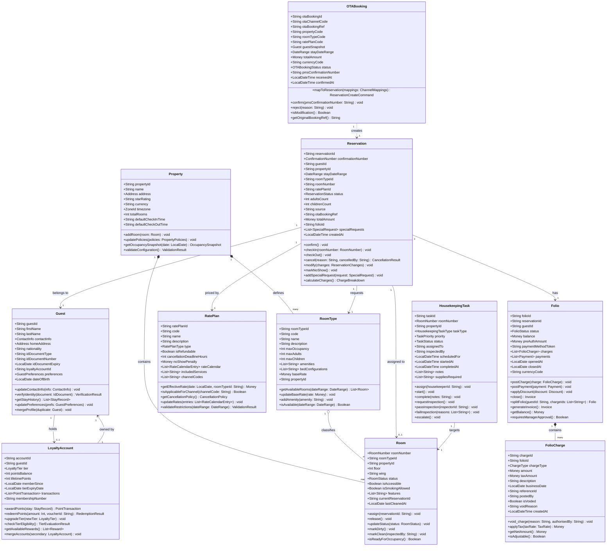

# Hotel Property Management System — Domain Model

## Overview

The Hotel PMS domain model is organised around a set of clearly delineated **bounded contexts**, each with its own ubiquitous language, aggregate roots, and persistence boundaries. This document describes the full domain model: the bounded contexts and their relationships, the core class diagram, aggregate-root responsibilities, value objects, and the invariants that govern the system's integrity. The model follows Domain-Driven Design (DDD) principles: aggregates encapsulate consistency boundaries, repositories are defined per aggregate root, and cross-context communication happens through domain events rather than direct service calls.

---

## 1. Bounded Contexts

### 1.1 Reservation Context (Core Domain)

The heart of the PMS. Manages the full lifecycle of a guest's intent to stay: from initial enquiry and booking, through check-in and in-stay modifications, to check-out. Key concepts: `Reservation`, `RoomAllocation`, `RoomType`, `RatePlan`, `DateRange`, `ConfirmationNumber`. This context owns the authoritative availability calendar and is the source of truth for who is staying in which room on which dates.

### 1.2 Housekeeping Context (Supporting Domain)

Manages the physical readiness of guest rooms. Receives room-status change events from the Reservation Context (check-out triggers a `DIRTY` transition) and orchestrates cleaning assignments. Key concepts: `HousekeepingTask`, `Room` (a local projection of the physical room), `HousekeeperAssignment`, `InspectionRecord`. The context maintains its own `Room` projection — not a shared object — to avoid tight coupling with the Reservation Context.

### 1.3 Revenue Context (Supporting Domain)

Handles yield management, rate optimisation, and revenue recognition. Consumes occupancy data from the Reservation Context and charge data from the Billing Context. Key concepts: `RevenueRecord`, `OccupancyStat`, `YieldRule`, `ADR` (Average Daily Rate), `RevPAR`.

### 1.4 Billing Context (Core Domain)

Manages the financial ledger for each stay. Every chargeable event (room rate, tax, incidental, F&B, no-show fee) is recorded as a `FolioCharge` on the guest's `Folio`. Handles payment capture, partial payments, split billing, and invoice generation. Key concepts: `Folio`, `FolioCharge`, `Payment`, `Invoice`, `TaxRate`.

### 1.5 Channel Management Context (Supporting Domain)

Bridges the PMS with external OTA distribution channels (Booking.com, Expedia, Airbnb, GDS). Translates between internal PMS models and OTA-specific schemas. Key concepts: `OTABooking`, `ChannelMapping`, `ARIUpdate`, `ChannelCredential`.

### 1.6 Loyalty Context (Generic Subdomain)

Tracks guest loyalty membership, points accrual, tier management, and redemption. Loosely coupled — consumes stay-completed events to award points. Key concepts: `LoyaltyAccount`, `PointTransaction`, `LoyaltyTier`, `RedemptionVoucher`.

### 1.7 Identity Context (Generic Subdomain)

Handles authentication, authorisation, and staff/guest identity. Manages roles (Front Desk Agent, Housekeeping Supervisor, Revenue Manager, General Manager), permissions, and API token issuance. Key concepts: `User`, `Role`, `Permission`, `AuthToken`.

---

## 2. Context Map

| Upstream Context | Downstream Context | Integration Pattern |
|---|---|---|
| Reservation | Housekeeping | Domain Event (`ReservationCheckedOut`) |
| Reservation | Billing | Domain Event (`ReservationConfirmed`, `CheckInCompleted`) |
| Billing | Revenue | Domain Event (`FolioChargePaid`) |
| Channel Management | Reservation | Anti-Corruption Layer (ACL) — translates OTA models |
| Reservation | Channel Management | Domain Event (`InventoryChanged`) |
| Billing | Loyalty | Domain Event (`StayCompleted`) |
| Identity | All Contexts | Shared Kernel — JWT token validation |

---

## 3. Domain Class Diagram



---

## 4. Aggregate Roots

### 4.1 Reservation (Aggregate Root)

The `Reservation` aggregate root is the central transactional boundary for all booking-related operations. It encapsulates the `RoomAllocation` (which room, which dates), the guest reference, and the rate plan selection. No external service may modify a reservation's status, room assignment, or dates without going through the `Reservation` aggregate's public methods. The aggregate enforces all status-transition rules (e.g., a `CANCELLED` reservation cannot be checked in; a `CHECKED_IN` reservation cannot be cancelled without a special override).

**Entities within aggregate:** `SpecialRequest`, `ReservationModificationHistory`, `RoomAllocation`  
**Invariants enforced:** see Section 6.

### 4.2 Folio (Aggregate Root)

The `Folio` aggregate root owns the entire financial ledger for a stay. All `FolioCharge` entities are only created through the `Folio.postCharge()` method, which validates business-date consistency, applies tax rules, and enforces the negative-balance invariant. Payments are also applied through the aggregate, which recalculates the running balance after every transaction.

**Entities within aggregate:** `FolioCharge`, `Payment`, `Discount`, `TaxLine`  
**Invariants enforced:** see Section 6.

### 4.3 HousekeepingTask (Aggregate Root)

The `HousekeepingTask` aggregate root manages the state machine for a single room-cleaning or maintenance assignment. It enforces that a task cannot be completed without passing inspection, and that an assigned task cannot be re-assigned to another housekeeper without first releasing the current assignment.

**Entities within aggregate:** `InspectionRecord`, `TaskNote`, `SupplyUsage`

### 4.4 Guest (Aggregate Root)

The `Guest` aggregate root is the system's master profile record for an individual guest. It owns identity documents, contact information, preferences, and loyalty account linkage. Guest merging (de-duplication) is performed through the aggregate to ensure consistency.

**Entities within aggregate:** `IdDocument`, `GuestPreference`, `StayHistoryEntry`

---

## 5. Value Objects

Value objects are immutable, identity-less objects defined entirely by their attributes. They are compared by value, not by reference.

### 5.1 `DateRange`

```
DateRange {
  checkIn: LocalDate   // inclusive
  checkOut: LocalDate  // exclusive (checkout day)
  
  nights(): Int        // checkOut - checkIn in days
  overlaps(other: DateRange): Boolean
  includes(date: LocalDate): Boolean
  extendBy(nights: Int): DateRange
}
```

**Invariant:** `checkOut` must be strictly after `checkIn`. Minimum stay of 1 night enforced at construction.

### 5.2 `Money`

```
Money {
  amount: BigDecimal   // always positive or zero; precision 2 d.p.
  currency: String     // ISO 4217 (e.g., "USD", "EUR", "GBP")
  
  add(other: Money): Money      // currencies must match
  subtract(other: Money): Money // result cannot be negative (throws)
  multiply(factor: BigDecimal): Money
  isZero(): Boolean
  format(): String              // localised display string
}
```

**Invariant:** Two `Money` values can only be added/subtracted if they share the same currency.

### 5.3 `Address`

```
Address {
  line1: String
  line2: String?
  city: String
  stateProvince: String?
  postalCode: String
  countryCode: String   // ISO 3166-1 alpha-2
  
  format(): String
  isComplete(): Boolean
}
```

### 5.4 `ContactInfo`

```
ContactInfo {
  email: String           // validated RFC 5322 format
  phone: String           // E.164 format
  preferredChannel: Enum  // EMAIL | SMS | PUSH | NONE
  
  validate(): ValidationResult
  withPreferredChannel(channel: Enum): ContactInfo
}
```

### 5.5 `RoomNumber`

```
RoomNumber {
  value: String   // e.g., "412A", "PENTHOUSE-01"
  floor: Int
  
  parse(raw: String): RoomNumber (static)
  toString(): String
  equals(other: RoomNumber): Boolean
}
```

**Invariant:** Room numbers are unique per property. Validated against a property-specific format regex at construction.

### 5.6 `ConfirmationNumber`

```
ConfirmationNumber {
  value: String   // format: PMS-{YYYY}-{6-digit-random}

  generate(propertyCode: String): ConfirmationNumber (static)
  isValid(): Boolean
  toString(): String
}
```

---

## 6. Domain Invariants

The following invariants must be enforced at the aggregate level and must never be violated, even in error recovery or migration scenarios.

### Reservation Invariants

| # | Invariant | Enforced By |
|---|---|---|
| R-1 | A `Reservation` must always have exactly one `RoomAllocation` for its entire `DateRange` | `Reservation.confirm()` |
| R-2 | A `Reservation` in `CHECKED_IN` status cannot transition to `CANCELLED` without a management override token | `Reservation.cancel()` |
| R-3 | A `Reservation` cannot be confirmed if the requested `RoomType` has zero available inventory for the `DateRange` | `ReservationService` + `InventoryService` |
| R-4 | `checkInDate` must be before `checkOutDate`; minimum 1 night | `DateRange` value object |
| R-5 | A `Reservation` cannot be assigned a room with status `OUT_OF_ORDER` or `MAINTENANCE` | `RoomService.assign()` |
| R-6 | `source` field must be one of the registered channel codes; unknown sources are rejected | `Reservation` constructor |

### Folio Invariants

| # | Invariant | Enforced By |
|---|---|---|
| F-1 | A `Folio` balance cannot go negative without a manager-level approval token | `Folio.postCharge()` |
| F-2 | A `FolioCharge` on a closed `Folio` is forbidden; all charges must be posted before folio closure | `Folio.postCharge()` |
| F-3 | A voided `FolioCharge` cannot be un-voided; a new corrective charge must be posted instead | `FolioCharge.void_charge()` |
| F-4 | The sum of all non-voided `FolioCharge` amounts minus the sum of all `Payment` amounts must equal `Folio.balance` at all times | `Folio` internal invariant check |
| F-5 | A `Folio` cannot be closed if outstanding balance > 0 and no settlement agreement exists | `Folio.close()` |

### Housekeeping Invariants

| # | Invariant | Enforced By |
|---|---|---|
| H-1 | A `HousekeepingTask` cannot be marked `COMPLETED` without a linked `InspectionRecord` that `PASSED` | `HousekeepingTask.complete()` |
| H-2 | A room cannot be assigned to a new reservation while its status is `DIRTY` or `IN_PROGRESS` | `RoomService.assign()` |

### Guest Invariants

| # | Invariant | Enforced By |
|---|---|---|
| G-1 | A `Guest` profile must have at least one valid `ContactInfo` (email or phone) | `Guest` constructor |
| G-2 | Identity document expiry must be a future date at the time of verification | `Guest.verifyIdentity()` |
| G-3 | A `Guest` cannot be merged into another if either has an open, in-house `Reservation` | `Guest.mergeProfile()` |

---

## 7. Domain Events

The following domain events are published by aggregate roots and consumed by downstream bounded contexts.

| Event | Published By | Consumed By | Payload |
|---|---|---|---|
| `ReservationConfirmed` | Reservation | Billing, Channel Mgmt, Notification | reservationId, guestId, dates, roomTypeId |
| `ReservationCheckedIn` | Reservation | Housekeeping, Loyalty, Notification | reservationId, roomNumber, folioId |
| `ReservationCheckedOut` | Reservation | Housekeeping, Billing, Loyalty, Notification | reservationId, roomNumber, folioId |
| `ReservationCancelled` | Reservation | Billing, Channel Mgmt, Inventory | reservationId, cancellationReason, refundDue |
| `ReservationNoShow` | Reservation | Billing, Inventory, Notification | reservationId, noShowFee |
| `FolioChargePaid` | Folio | Revenue, Loyalty | folioId, amount, chargeType, businessDate |
| `FolioClosed` | Folio | Revenue, Loyalty, Notification | folioId, totalRevenue, stayNights |
| `RoomStatusChanged` | HousekeepingTask | Reservation | roomNumber, previousStatus, newStatus |
| `InventoryChanged` | Reservation/Inventory | Channel Management | propertyId, roomTypeId, dates, delta |
| `LoyaltyPointsAwarded` | LoyaltyAccount | Notification | accountId, points, newBalance, tier |
