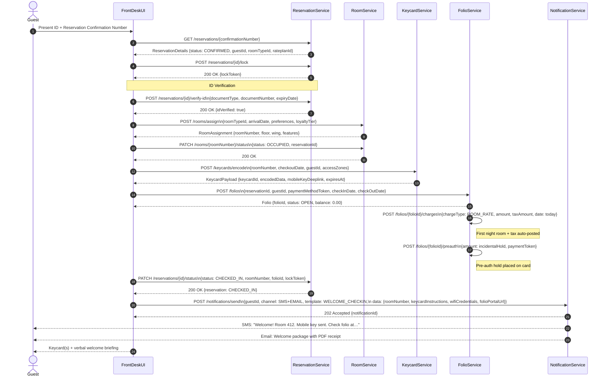
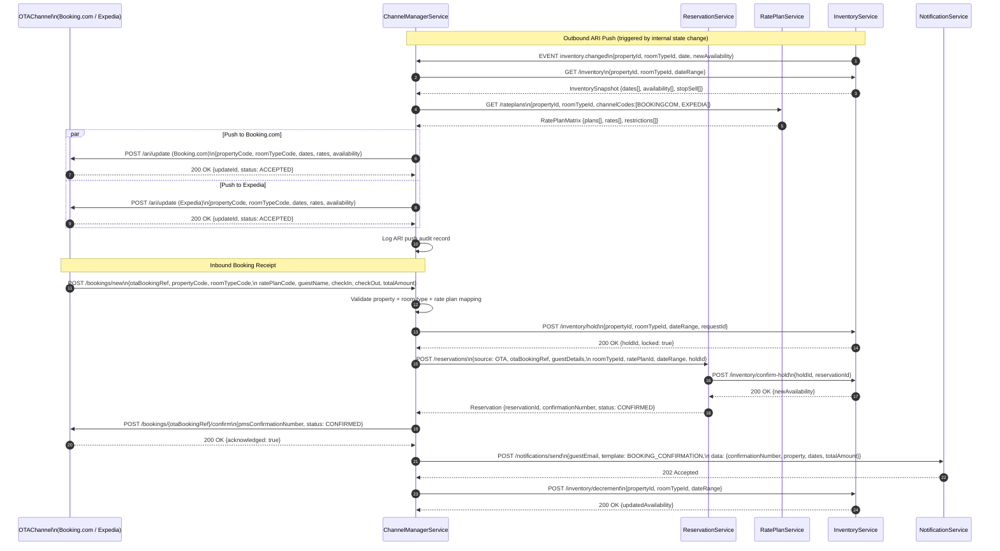
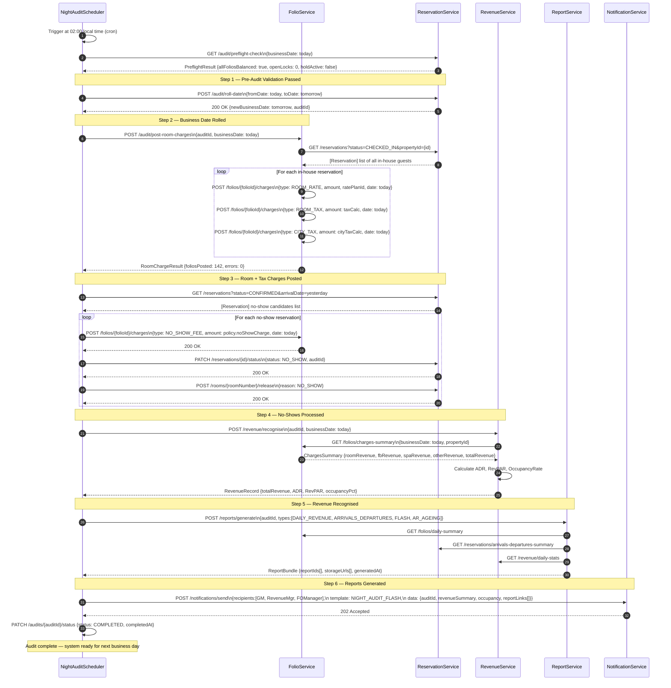
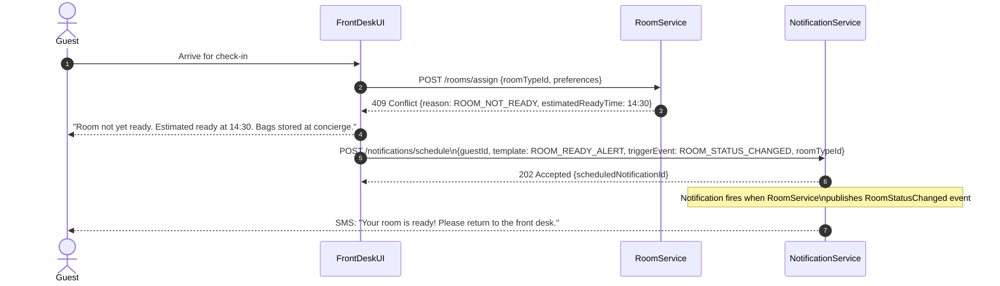
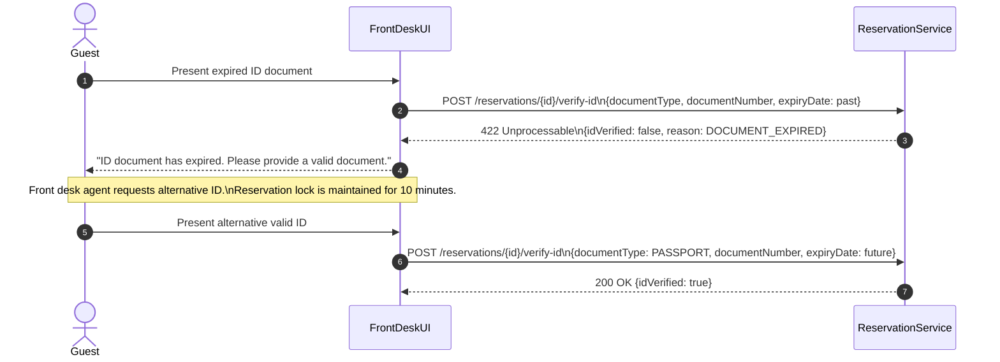
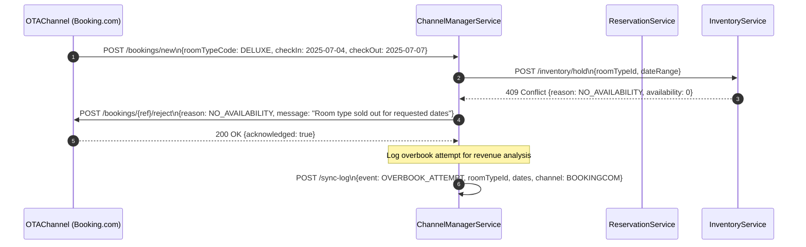
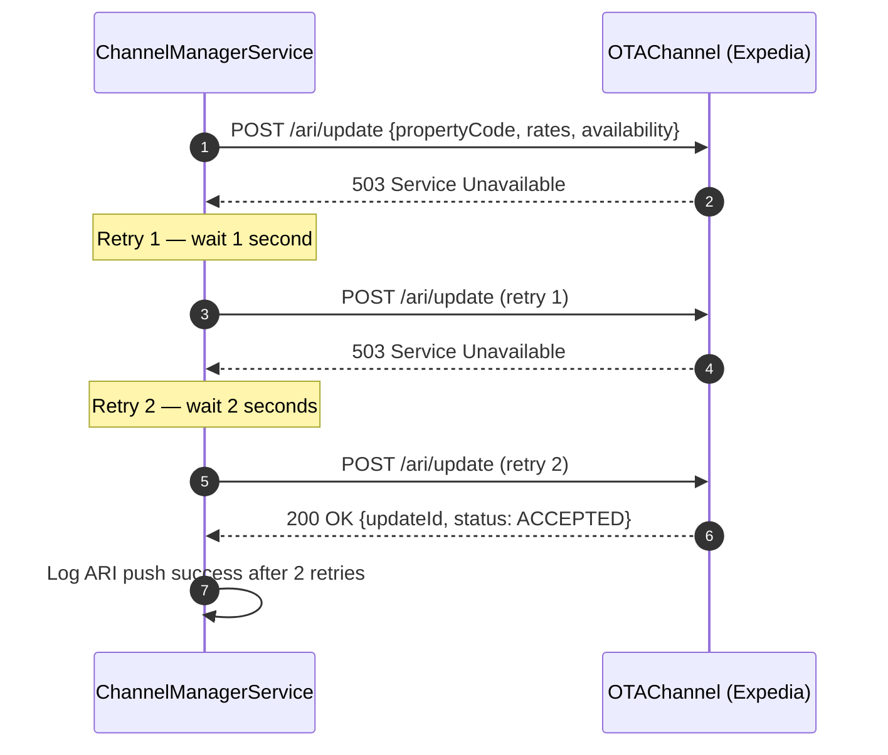
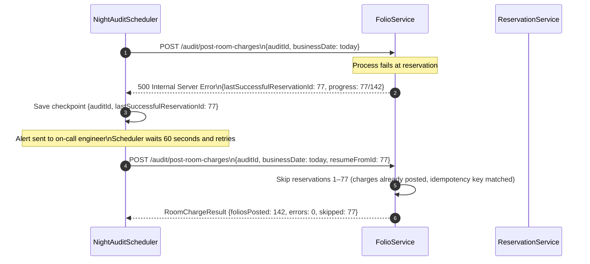

# Hotel Property Management System — System Sequence Diagrams

## Overview

System Sequence Diagrams (SSDs) capture the interactions between actors, front-end systems, and back-end services for the most operationally critical flows in the Hotel Property Management System (PMS). Each diagram tells the story of a single business process from trigger to completion, exposing every service boundary crossed, every data exchange made, and every failure path that must be handled. The three processes documented here — guest check-in, OTA booking synchronisation, and the nightly audit — together account for the majority of the PMS's real-time transactional load. Reading these diagrams alongside the domain model and data-flow diagrams gives architects and developers a complete picture of how the system behaves under normal operating conditions and what recovery actions are required when individual components fail.

---

## 1. Check-In Process

### 1.1 Prose Description

The check-in process begins the moment a guest arrives at the front desk (or initiates a mobile self-check-in). The front-desk agent opens the guest's reservation in **FrontDeskUI**, which calls **ReservationService** to retrieve and lock the reservation record, preventing concurrent modifications. ReservationService validates that the reservation is in `CONFIRMED` or `PRE_ASSIGNED` status and that the arrival date matches today's date. If the guest is a walk-in without a prior reservation, ReservationService creates a new same-day reservation inline.

Once the reservation is confirmed, **FolioService** is asked to initialise a new folio — an open billing ledger — linked to the reservation. This folio will accumulate room charges, taxes, incidental charges, and any pre-authorisation holds throughout the stay.

**RoomService** is then queried for the best available room matching the requested room type, floor preference, and any loyalty-tier upgrades. It applies the room-assignment algorithm (considering housekeeping status, maintenance flags, and VIP preferences) and tentatively assigns the room, marking it as `OCCUPIED`.

With a physical room number confirmed, **KeycardService** is instructed to encode one or more RFID keycards (or generate a mobile key payload) for the assigned room and any connected areas (pool, gym, parking). The keycard encoding result — including expiry tied to the checkout date — is returned to FrontDeskUI.

**FolioService** receives the final confirmation of room assignment and posts the first night's room charge and applicable taxes. A pre-authorisation hold is placed on the payment method on file.

Finally, **NotificationService** dispatches a welcome message via the guest's preferred channel (SMS, email, or in-app push) containing the room number, keycard instructions, Wi-Fi credentials, and a link to the digital folio portal. The front-desk agent completes the check-in flow, and the reservation status transitions to `CHECKED_IN`.

### 1.2 Sequence Diagram

---

## 2. OTA Booking Synchronisation

### 2.1 Prose Description

Online Travel Agency (OTA) synchronisation is a continuous, bidirectional process. In the outbound direction, whenever availability, rates, or inventory change inside the PMS (due to a new reservation, a cancellation, a manual rate adjustment, or a yield-management rule firing), the **ChannelManagerService** must push updated ARI (Availability, Rates, Inventory) data to every connected OTA within seconds to prevent overbooking or rate parity violations. In the inbound direction, when a guest books through Booking.com or Expedia, the OTA sends a booking notification to the channel manager, which translates it into a native PMS reservation.

The flow begins when the PMS detects a state change — for example, a reservation being created via the property's own website decrements inventory. **InventoryService** publishes an `INVENTORY_CHANGED` event, which **ChannelManagerService** consumes. It fetches the current net availability from **InventoryService** and the applicable rates from **RatePlanService**, then constructs an ARI update payload in the OTA's required format (OTA_HotelAvailNotifRQ for HTNG-based channels, or a REST payload for modern API partners). It pushes this update to Booking.com and Expedia concurrently and awaits their acknowledgements.

When a guest makes a booking on Booking.com, the OTA pushes a `NewReservation` notification to the channel manager endpoint. ChannelManagerService validates the property code, booking reference, rate plan code, and room type mapping, then calls **ReservationService** to create a new reservation record in `CONFIRMED` status. ReservationService decrements availability through **InventoryService**, ensuring no double-booking occurs under concurrent load (using optimistic locking). A confirmation number is generated and returned. ChannelManagerService sends the PMS confirmation number back to the OTA as acknowledgement, and **NotificationService** sends a booking confirmation to the guest.

### 2.2 Sequence Diagram

---

## 3. Night Audit Process

### 3.1 Prose Description

The night audit is the most operationally critical scheduled job in any hotel PMS. It runs once every 24 hours — typically between 01:00 and 04:00 local time — and performs a series of financial and administrative actions that close the current business day and open the next. The process is orchestrated by **NightAuditScheduler**, a cron-driven service that coordinates all downstream services through a strict, sequenced workflow with checkpoint logging at every step, allowing the audit to be safely resumed after a failure without duplicating charges.

**Step 1 — Pre-audit validation:** The scheduler verifies that all earlier-in-day folios are balanced, no conflicting locks exist, and the system clock is correct. It also checks for any manual holds placed by management (e.g., "do not audit until GM approval").

**Step 2 — Date roll:** The business date advances from the current day to the next calendar day. This is a global state change that affects all subsequent operations. ReservationService timestamps the date-roll event in the audit log.

**Step 3 — Room and tax charge posting:** FolioService iterates over all in-house reservations (status `CHECKED_IN`) and posts a room rate charge and applicable tax charges (room tax, city tax, VAT) to each open folio. Rate amounts are sourced from the reservation's rate plan and rate calendar. This step is idempotent: charges tagged with the audit date are never double-posted.

**Step 4 — No-show processing:** ReservationService identifies all reservations with an arrival date equal to yesterday that are still in `CONFIRMED` status (i.e., the guest never arrived). For each no-show, a no-show charge is posted to the folio per the cancellation/no-show policy, the reservation status is set to `NO_SHOW`, and the room reverts to `AVAILABLE` in RoomService.

**Step 5 — Revenue recognition:** RevenueService aggregates the day's posted charges by category (accommodation, F&B, spa, other) and computes occupancy statistics (ADR, RevPAR, occupancy rate) for the property.

**Step 6 — Report generation:** ReportService generates the Daily Revenue Report, Arrival/Departure Report, Manager's Flash Report, and the Accounts Receivable Ageing summary. Reports are stored in the document store and made available through the reporting portal.

**Step 7 — Manager summary notification:** NotificationService sends the nightly Flash Report digest to the General Manager, Revenue Manager, and Front Office Manager via email, with a dashboard deep-link.

### 3.2 Sequence Diagram

---

## Summary

| Process | Actors Involved | Critical Failure Points | Recovery Strategy |
|---|---|---|---|
| Check-In | Guest, FrontDeskUI, 6 services | Keycard encoding failure, folio creation failure | Retry keycard; manual folio fallback; paper key issued |
| OTA Booking Sync | OTA, 5 services | Inventory hold race condition, OTA timeout | Optimistic lock retry; OTA webhook retry with idempotency key |
| Night Audit | Scheduler, 5 services | Partial charge posting, date-roll conflict | Idempotency keys on all charge posts; checkpoint resume from last successful step |

All three flows are designed with idempotency as a first-class concern. Every mutating API call carries a unique idempotency key so that retries after partial failures cannot result in duplicate charges, double room assignments, or phantom reservations.

---

## 4. Error Handling and Alternate Flows

### 4.1 Check-In — Alternate Flows

#### 4.1.1 Room Not Ready (Housekeeping Still In Progress)

#### 4.1.2 ID Verification Failure

### 4.2 OTA Booking Sync — Alternate Flows

#### 4.2.1 Overbooking Attempt (No Availability)

#### 4.2.2 ARI Push Failure with Retry

### 4.3 Night Audit — Alternate Flows

#### 4.3.1 Night Audit Interrupted — Safe Resume

---

## 5. Sequence Design Principles Applied

| Principle | Application in These Diagrams |
|---|---|
| **Optimistic Locking** | Reservation lock token acquired before check-in modifications; prevents concurrent edits by two agents |
| **Idempotency Keys** | All POST calls (charge posting, booking creation, ARI push) carry unique keys; safe retry on timeout |
| **Parallel Execution** | OTA ARI pushes to Booking.com and Expedia happen in parallel (`par` block) to minimise latency |
| **Saga Pattern** | Check-in is a multi-step saga; each step is independently rollback-able (e.g., keycard failure → release room assignment) |
| **Inventory Hold-Then-Confirm** | Inventory is held before reservation creation, then confirmed on success or released on failure — prevents phantom bookings |
| **Checkpoint Resume** | Night audit stores progress checkpoints; failures resume from last successful step without duplicating charges |
