# Hotel Property Management System — C4 Code Diagram: ReservationService

## Code-Level Design

The ReservationService is the core domain service of HPMS. It owns the Reservation aggregate, orchestrates availability checks, rate resolution, and room allocation, and publishes domain events that drive downstream services (FolioService, HousekeepingService, NotificationService, LoyaltyService).

The code-level design follows Hexagonal Architecture (Ports and Adapters). The domain model and application layer have zero dependencies on infrastructure frameworks. Spring Boot annotations appear only at the infrastructure adapter and configuration boundary. This makes domain logic unit-testable without starting a Spring context or connecting to a database.

**Layering rules (enforced by ArchUnit tests):**

- `controller` → depends on `application` (DTOs only); never depends on `domain.model` directly.
- `application` → depends on `domain` (model, service, events, repository interfaces); never depends on `infrastructure`.
- `domain` → depends on nothing outside `domain`; no Spring, no JPA, no Jackson annotations.
- `infrastructure` → depends on `application` and `domain`; implements domain repository interfaces.

---

## Code Diagram (Class Level)

```mermaid
classDiagram
    %% ─── Controller Layer ───────────────────────────────────────────
    class ReservationController {
        -ReservationApplicationService appService
        +createReservation(ReservationRequest) ReservationResponse
        +modifyReservation(UUID, ModifyRequest) ReservationResponse
        +cancelReservation(UUID, CancelRequest) void
        +checkIn(UUID, CheckInRequest) ReservationResponse
        +checkOut(UUID, CheckOutRequest) FolioSummary
        +getReservation(UUID) ReservationResponse
        +searchAvailability(AvailabilityRequest) AvailabilityResponse
    }

    class ReservationRequest {
        +UUID propertyId
        +String roomTypeId
        +LocalDate checkInDate
        +LocalDate checkOutDate
        +String ratePlanCode
        +GuestInfo primaryGuest
        +int adultCount
        +int childCount
        +ReservationSource source
        +String otaReservationId
        +String specialRequests
    }

    class ReservationResponse {
        +UUID reservationId
        +String confirmationNumber
        +ReservationStatus status
        +String roomTypeId
        +String allocatedRoomNumber
        +LocalDate checkInDate
        +LocalDate checkOutDate
        +BigDecimal totalAmount
        +String currency
        +GuestInfo primaryGuest
        +Instant createdAt
    }

    class CheckInRequest {
        +LocalDate actualCheckInDate
        +String assignedRoomNumber
        +List~KeyCardInfo~ keyCards
        +boolean upgradeApplied
    }

    class CheckOutRequest {
        +LocalDate actualCheckOutDate
        +PaymentMethod paymentMethod
        +boolean emailFolio
    }

    %% ─── Application Layer ──────────────────────────────────────────
    class ReservationApplicationService {
        -AvailabilityEngine availabilityEngine
        -RatePlanResolver ratePlanResolver
        -ReservationBusinessRules businessRules
        -ReservationRepository reservationRepository
        -KafkaEventPublisher eventPublisher
        -RoomServiceClient roomServiceClient
        -RatePlanServiceClient ratePlanServiceClient
        -NotificationServiceClient notificationClient
        -InventoryCacheService cacheService
        +handle(CreateReservationCommand) UUID
        +handle(ModifyReservationCommand) Reservation
        +handle(CheckInCommand) Reservation
        +handle(CheckOutCommand) Reservation
        +handle(CancelReservationCommand) void
        +queryAvailability(AvailabilityQuery) AvailabilityResult
    }

    class CreateReservationCommand {
        +UUID propertyId
        +String roomTypeId
        +LocalDate checkInDate
        +LocalDate checkOutDate
        +String ratePlanCode
        +GuestInfo primaryGuest
        +int adultCount
        +int childCount
        +ReservationSource source
        +String otaReservationId
        +String specialRequests
        +UUID commandId
        +Instant issuedAt
    }

    class ModifyReservationCommand {
        +UUID reservationId
        +UUID propertyId
        +LocalDate newCheckInDate
        +LocalDate newCheckOutDate
        +String newRoomTypeId
        +String modifyReason
        +UUID commandId
    }

    class CheckInCommand {
        +UUID reservationId
        +UUID propertyId
        +LocalDate actualDate
        +String roomNumber
        +UUID commandId
    }

    class CheckOutCommand {
        +UUID reservationId
        +UUID propertyId
        +LocalDate actualDate
        +UUID commandId
    }

    class CancelReservationCommand {
        +UUID reservationId
        +UUID propertyId
        +String cancellationReason
        +CancellationSource source
        +UUID commandId
    }

    %% ─── Domain Model ───────────────────────────────────────────────
    class Reservation {
        -UUID id
        -UUID propertyId
        -String confirmationNumber
        -ReservationStatus status
        -ReservationSource source
        -String otaReservationId
        -RoomAllocation roomAllocation
        -GuestInfo primaryGuest
        -LocalDate checkInDate
        -LocalDate checkOutDate
        -Instant actualCheckInAt
        -Instant actualCheckOutAt
        -String ratePlanCode
        -BigDecimal totalAmount
        -String currency
        -String specialRequests
        -Instant createdAt
        -Instant updatedAt
        -int version
        -List~DomainEvent~ domainEvents
        +checkin(LocalDate, String) void
        +checkout(LocalDate) void
        +cancel(String, CancellationSource) void
        +modify(LocalDate, LocalDate, String) void
        +confirmByOTA(String) void
        +getDomainEvents() List~DomainEvent~
        +clearEvents() void
        #registerEvent(DomainEvent) void
    }

    class RoomAllocation {
        -String roomTypeId
        -String allocatedRoomNumber
        -boolean upgraded
        -RoomAllocationStatus allocationStatus
        +assignRoom(String) void
        +upgrade(String) void
        +release() void
        +isAssigned() boolean
    }

    class ReservationStatus {
        <<enumeration>>
        PENDING
        CONFIRMED
        CHECKED_IN
        CHECKED_OUT
        CANCELLED
        NO_SHOW
    }

    class ReservationSource {
        <<enumeration>>
        DIRECT_WEB
        DIRECT_PHONE
        WALK_IN
        OTA_BOOKING_COM
        OTA_EXPEDIA
        OTA_AGODA
        OTA_AIRBNB
        GDS
        CORPORATE
    }

    %% ─── Domain Services ────────────────────────────────────────────
    class AvailabilityEngine {
        -InventoryCacheService cacheService
        -AvailabilityReadRepository readRepository
        +checkAvailability(UUID, String, LocalDate, LocalDate) AvailabilityResult
        +acquireBookingLock(UUID, String, LocalDate, LocalDate) BookingLock
        +releaseLock(BookingLock) void
    }

    class RatePlanResolver {
        -RatePlanServiceClient ratePlanClient
        -InventoryCacheService cacheService
        +resolveRate(UUID, String, String, LocalDate, LocalDate) ResolvedRate
        +applyPromotions(ResolvedRate, GuestInfo) ResolvedRate
        +calculateTotalAmount(ResolvedRate, int) Money
    }

    class ReservationBusinessRules {
        +validateMinimumStay(String, LocalDate, LocalDate) void
        +validateMaximumAdvanceBooking(LocalDate) void
        +validateGuestAgeRequirements(GuestInfo, String) void
        +validateCancellationPolicy(Reservation) CancellationFee
        +validateModificationDeadline(Reservation, LocalDate) void
    }

    %% ─── Domain Events ──────────────────────────────────────────────
    class ReservationCreatedEvent {
        +UUID reservationId
        +UUID propertyId
        +String confirmationNumber
        +String roomTypeId
        +LocalDate checkInDate
        +LocalDate checkOutDate
        +BigDecimal totalAmount
        +GuestInfo primaryGuest
        +ReservationSource source
        +Instant occurredAt
    }

    class CheckInCompletedEvent {
        +UUID reservationId
        +UUID propertyId
        +String roomNumber
        +LocalDate actualCheckInDate
        +Instant occurredAt
    }

    class CheckOutCompletedEvent {
        +UUID reservationId
        +UUID propertyId
        +String roomNumber
        +LocalDate actualCheckOutDate
        +BigDecimal finalAmount
        +Instant occurredAt
    }

    class ReservationCancelledEvent {
        +UUID reservationId
        +UUID propertyId
        +String cancellationReason
        +CancellationSource source
        +BigDecimal cancellationFee
        +Instant occurredAt
    }

    %% ─── Infrastructure — Persistence ───────────────────────────────
    class ReservationJpaRepository {
        <<interface>>
        +findByIdAndPropertyId(UUID, UUID) Optional~ReservationJpaEntity~
        +findByOtaReservationId(String, String) Optional~ReservationJpaEntity~
        +findByPropertyIdAndCheckInDateBetween(UUID, LocalDate, LocalDate) List~ReservationJpaEntity~
        +save(ReservationJpaEntity) ReservationJpaEntity
    }

    class ReservationRepositoryAdapter {
        -ReservationJpaRepository jpaRepository
        -ReservationMapper mapper
        -OutboxRepository outboxRepository
        +findById(UUID, UUID) Optional~Reservation~
        +findByOtaReservationId(String, String) Optional~Reservation~
        +save(Reservation) Reservation
        +publishEvents(Reservation) void
    }

    class ReservationJpaEntity {
        +UUID id
        +UUID propertyId
        +String confirmationNumber
        +String status
        +String source
        +String otaReservationId
        +String roomTypeId
        +String allocatedRoomNumber
        +LocalDate checkInDate
        +LocalDate checkOutDate
        +Instant actualCheckInAt
        +Instant actualCheckOutAt
        +String ratePlanCode
        +BigDecimal totalAmount
        +String currency
        +String guestDataJson
        +String specialRequests
        +Instant createdAt
        +Instant updatedAt
        +int version
    }

    class RoomAllocationJpaEntity {
        +UUID id
        +UUID reservationId
        +String roomTypeId
        +String allocatedRoomNumber
        +boolean upgraded
        +String allocationStatus
        +Instant allocatedAt
    }

    %% ─── Infrastructure — Cache ──────────────────────────────────────
    class InventoryCacheService {
        -RedisTemplate~String, String~ redisTemplate
        -RedisKeyBuilder keyBuilder
        -ObjectMapper objectMapper
        +getAvailability(UUID, String, LocalDate) Optional~AvailabilityData~
        +setAvailability(UUID, String, LocalDate, AvailabilityData, Duration) void
        +invalidateAvailability(UUID, String, LocalDate) void
        +invalidateDateRange(UUID, String, LocalDate, LocalDate) void
        +acquireLock(String, Duration) boolean
        +releaseLock(String) void
    }

    class RedisKeyBuilder {
        +availabilityKey(UUID, String, LocalDate) String
        +ratePlanKey(UUID, String, LocalDate) String
        +bookingLockKey(UUID, String, LocalDate, LocalDate) String
        +sessionKey(String) String
        +dedupKey(String, String) String
    }

    %% ─── Infrastructure — Messaging ──────────────────────────────────
    class KafkaEventPublisher {
        -KafkaTemplate~String, String~ kafkaTemplate
        -ObjectMapper objectMapper
        +publish(DomainEvent, String) void
        +publishBatch(List~DomainEvent~, String) void
    }

    class EventEnvelope {
        +String eventId
        +String eventType
        +String aggregateId
        +String aggregateType
        +String payload
        +int schemaVersion
        +Instant occurredAt
        +Map~String, String~ metadata
    }

    %% ─── Infrastructure — Clients ────────────────────────────────────
    class RoomServiceClient {
        <<interface>>
        +getRoomTypeDetails(UUID, String) RoomTypeDetails
        +checkRoomAvailability(UUID, String, LocalDate, LocalDate) boolean
        +assignRoom(UUID, String, String) RoomAssignmentResult
    }

    class RatePlanServiceClient {
        <<interface>>
        +getRatePlan(UUID, String) RatePlanDetails
        +computeNightlyRates(UUID, String, LocalDate, LocalDate) List~NightlyRate~
    }

    class NotificationServiceClient {
        <<interface>>
        +sendReservationConfirmation(UUID, String) void
        +sendCheckInNotification(UUID, String) void
        +sendCheckOutAndFolioLink(UUID, String, String) void
    }

    %% ─── Relationships ───────────────────────────────────────────────
    ReservationController --> ReservationApplicationService
    ReservationController ..> ReservationRequest
    ReservationController ..> ReservationResponse
    ReservationController ..> CheckInRequest
    ReservationController ..> CheckOutRequest

    ReservationApplicationService --> AvailabilityEngine
    ReservationApplicationService --> RatePlanResolver
    ReservationApplicationService --> ReservationBusinessRules
    ReservationApplicationService --> ReservationRepositoryAdapter
    ReservationApplicationService --> KafkaEventPublisher
    ReservationApplicationService --> InventoryCacheService
    ReservationApplicationService --> RoomServiceClient
    ReservationApplicationService --> RatePlanServiceClient
    ReservationApplicationService --> NotificationServiceClient
    ReservationApplicationService ..> CreateReservationCommand
    ReservationApplicationService ..> ModifyReservationCommand
    ReservationApplicationService ..> CheckInCommand
    ReservationApplicationService ..> CheckOutCommand
    ReservationApplicationService ..> CancelReservationCommand

    Reservation *-- RoomAllocation
    Reservation --> ReservationStatus
    Reservation --> ReservationSource
    Reservation ..> ReservationCreatedEvent
    Reservation ..> CheckInCompletedEvent
    Reservation ..> CheckOutCompletedEvent
    Reservation ..> ReservationCancelledEvent

    AvailabilityEngine --> InventoryCacheService
    RatePlanResolver --> RatePlanServiceClient
    RatePlanResolver --> InventoryCacheService

    ReservationRepositoryAdapter ..|> ReservationRepository
    ReservationRepositoryAdapter --> ReservationJpaRepository
    ReservationRepositoryAdapter ..> ReservationJpaEntity

    ReservationJpaEntity *-- RoomAllocationJpaEntity

    InventoryCacheService --> RedisKeyBuilder
    KafkaEventPublisher ..> EventEnvelope
```



---

## Package Structure

```
com.hpms.reservation
├── controller
│   ├── ReservationController.java
│   ├── dto
│   │   ├── ReservationRequest.java
│   │   ├── ReservationResponse.java
│   │   ├── ModifyReservationRequest.java
│   │   ├── CheckInRequest.java
│   │   ├── CheckOutRequest.java
│   │   ├── CancelReservationRequest.java
│   │   ├── AvailabilityRequest.java
│   │   └── AvailabilityResponse.java
│   └── mapper
│       └── ReservationDtoMapper.java
├── application
│   ├── ReservationApplicationService.java
│   └── command
│       ├── CreateReservationCommand.java
│       ├── ModifyReservationCommand.java
│       ├── CheckInCommand.java
│       ├── CheckOutCommand.java
│       └── CancelReservationCommand.java
├── domain
│   ├── model
│   │   ├── Reservation.java
│   │   ├── RoomAllocation.java
│   │   ├── GuestInfo.java
│   │   ├── Money.java
│   │   ├── ReservationStatus.java
│   │   └── ReservationSource.java
│   ├── service
│   │   ├── AvailabilityEngine.java
│   │   ├── RatePlanResolver.java
│   │   └── ReservationBusinessRules.java
│   ├── events
│   │   ├── DomainEvent.java (abstract)
│   │   ├── ReservationCreatedEvent.java
│   │   ├── ReservationModifiedEvent.java
│   │   ├── CheckInCompletedEvent.java
│   │   ├── CheckOutCompletedEvent.java
│   │   └── ReservationCancelledEvent.java
│   └── repository
│       └── ReservationRepository.java (interface/port)
└── infrastructure
    ├── persistence
    │   ├── ReservationJpaRepository.java
    │   ├── ReservationRepositoryAdapter.java
    │   ├── OutboxRepository.java
    │   ├── entity
    │   │   ├── ReservationJpaEntity.java
    │   │   ├── RoomAllocationJpaEntity.java
    │   │   └── OutboxEntry.java
    │   └── mapper
    │       └── ReservationMapper.java
    ├── cache
    │   ├── InventoryCacheService.java
    │   └── RedisKeyBuilder.java
    ├── messaging
    │   ├── KafkaEventPublisher.java
    │   ├── OutboxProcessor.java
    │   └── EventEnvelope.java
    └── client
        ├── RoomServiceClient.java
        ├── RatePlanServiceClient.java
        └── NotificationServiceClient.java
```

---

## Key Class Implementations

### CreateReservationCommand Handler — Full Flow

```java
@Service
@RequiredArgsConstructor
@Slf4j
public class ReservationApplicationService {

    private final AvailabilityEngine availabilityEngine;
    private final RatePlanResolver ratePlanResolver;
    private final ReservationBusinessRules businessRules;
    private final ReservationRepository reservationRepository;
    private final InventoryCacheService cacheService;
    private final RoomServiceClient roomServiceClient;
    private final NotificationServiceClient notificationClient;

    @Transactional
    public UUID handle(CreateReservationCommand cmd) {
        log.info("Creating reservation for property={} roomType={} checkIn={} checkOut={}",
            cmd.propertyId(), cmd.roomTypeId(), cmd.checkInDate(), cmd.checkOutDate());

        // Step 1: Validate business rules (minimum stay, advance booking limits, etc.)
        businessRules.validateMinimumStay(cmd.roomTypeId(), cmd.checkInDate(), cmd.checkOutDate());
        businessRules.validateMaximumAdvanceBooking(cmd.checkInDate());
        businessRules.validateGuestAgeRequirements(cmd.primaryGuest(), cmd.roomTypeId());

        // Step 2: Check availability and acquire distributed lock (Redlock, 10s TTL)
        AvailabilityResult availability = availabilityEngine.checkAvailability(
            cmd.propertyId(), cmd.roomTypeId(), cmd.checkInDate(), cmd.checkOutDate());

        if (!availability.isAvailable()) {
            throw new RoomNotAvailableException(
                cmd.propertyId(), cmd.roomTypeId(), cmd.checkInDate(), cmd.checkOutDate());
        }

        BookingLock lock = availabilityEngine.acquireBookingLock(
            cmd.propertyId(), cmd.roomTypeId(), cmd.checkInDate(), cmd.checkOutDate());

        try {
            // Step 3: Re-check availability inside lock (double-check pattern)
            AvailabilityResult lockedAvailability = availabilityEngine.checkAvailability(
                cmd.propertyId(), cmd.roomTypeId(), cmd.checkInDate(), cmd.checkOutDate());
            if (!lockedAvailability.isAvailable()) {
                throw new RoomNotAvailableException(
                    cmd.propertyId(), cmd.roomTypeId(), cmd.checkInDate(), cmd.checkOutDate());
            }

            // Step 4: Resolve rate plan and compute pricing
            ResolvedRate rate = ratePlanResolver.resolveRate(
                cmd.propertyId(), cmd.roomTypeId(), cmd.ratePlanCode(),
                cmd.checkInDate(), cmd.checkOutDate());
            ResolvedRate promotedRate = ratePlanResolver.applyPromotions(rate, cmd.primaryGuest());
            Money totalAmount = ratePlanResolver.calculateTotalAmount(
                promotedRate, cmd.checkOutDate().compareTo(cmd.checkInDate()));

            // Step 5: Build the Reservation aggregate root
            Reservation reservation = Reservation.create(
                cmd.propertyId(),
                cmd.roomTypeId(),
                cmd.checkInDate(),
                cmd.checkOutDate(),
                cmd.primaryGuest(),
                cmd.adultCount(),
                cmd.childCount(),
                cmd.source(),
                cmd.otaReservationId(),
                cmd.specialRequests(),
                promotedRate.ratePlanCode(),
                totalAmount
            );

            // Step 6: Persist reservation; domain events go to Outbox within same transaction
            Reservation saved = reservationRepository.save(reservation);
            reservationRepository.publishEvents(saved);

            // Step 7: Invalidate availability cache for booked date range
            cacheService.invalidateDateRange(
                cmd.propertyId(), cmd.roomTypeId(), cmd.checkInDate(), cmd.checkOutDate());

            log.info("Reservation created: id={} confirmationNumber={}",
                saved.getId(), saved.getConfirmationNumber());

            return saved.getId();

        } finally {
            // Step 8: Always release the booking lock
            availabilityEngine.releaseLock(lock);
        }
    }

    @Transactional
    public Reservation handle(CheckInCommand cmd) {
        Reservation reservation = reservationRepository
            .findById(cmd.reservationId(), cmd.propertyId())
            .orElseThrow(() -> new ReservationNotFoundException(cmd.reservationId()));

        // Assign room via RoomService (verifies room is clean and available)
        RoomAssignmentResult assignment = roomServiceClient
            .assignRoom(cmd.propertyId(), cmd.roomNumber(), cmd.reservationId().toString());

        if (!assignment.isSuccessful()) {
            throw new RoomAssignmentFailedException(cmd.roomNumber(), assignment.getReason());
        }

        // Transition aggregate state — business rules enforced inside aggregate
        reservation.checkin(cmd.actualDate(), cmd.roomNumber());

        Reservation saved = reservationRepository.save(reservation);
        reservationRepository.publishEvents(saved);

        return saved;
    }

    @Transactional
    public Reservation handle(CancelReservationCommand cmd) {
        Reservation reservation = reservationRepository
            .findById(cmd.reservationId(), cmd.propertyId())
            .orElseThrow(() -> new ReservationNotFoundException(cmd.reservationId()));

        // Validates cancellation policy; may calculate cancellation fee
        CancellationFee fee = businessRules.validateCancellationPolicy(reservation);

        reservation.cancel(cmd.cancellationReason(), cmd.source());

        Reservation saved = reservationRepository.save(reservation);
        reservationRepository.publishEvents(saved);

        // Re-credit availability cache immediately
        cacheService.invalidateDateRange(
            reservation.getPropertyId(),
            reservation.getRoomAllocation().getRoomTypeId(),
            reservation.getCheckInDate(),
            reservation.getCheckOutDate()
        );

        return saved;
    }
}
```

### Reservation Aggregate Root

```java
public class Reservation extends AggregateRoot {

    private final UUID id;
    private final UUID propertyId;
    private final String confirmationNumber;
    private ReservationStatus status;
    private final ReservationSource source;
    private final String otaReservationId;
    private final RoomAllocation roomAllocation;
    private final GuestInfo primaryGuest;
    private LocalDate checkInDate;
    private LocalDate checkOutDate;
    private Instant actualCheckInAt;
    private Instant actualCheckOutAt;
    private final String ratePlanCode;
    private final Money totalAmount;
    private final String specialRequests;
    private final Instant createdAt;
    private Instant updatedAt;

    public static Reservation create(UUID propertyId, String roomTypeId,
            LocalDate checkInDate, LocalDate checkOutDate,
            GuestInfo primaryGuest, int adults, int children,
            ReservationSource source, String otaReservationId,
            String specialRequests, String ratePlanCode, Money totalAmount) {

        Reservation r = new Reservation(
            UUID.randomUUID(), propertyId,
            ConfirmationNumberGenerator.generate(propertyId),
            ReservationStatus.CONFIRMED, source, otaReservationId,
            new RoomAllocation(roomTypeId), primaryGuest,
            checkInDate, checkOutDate, ratePlanCode, totalAmount,
            specialRequests, Instant.now()
        );

        r.registerEvent(new ReservationCreatedEvent(
            r.id, r.propertyId, r.confirmationNumber, roomTypeId,
            checkInDate, checkOutDate, totalAmount.amount(), totalAmount.currency(),
            primaryGuest, source, Instant.now()
        ));

        return r;
    }

    public void checkin(LocalDate actualDate, String roomNumber) {
        if (this.status != ReservationStatus.CONFIRMED) {
            throw new InvalidReservationStateException(
                "Cannot check-in reservation with status: " + this.status);
        }
        if (actualDate.isBefore(this.checkInDate.minusDays(1))) {
            throw new EarlyCheckinNotPermittedException(this.id, actualDate, this.checkInDate);
        }
        this.roomAllocation.assignRoom(roomNumber);
        this.status = ReservationStatus.CHECKED_IN;
        this.actualCheckInAt = Instant.now();
        this.updatedAt = Instant.now();
        registerEvent(new CheckInCompletedEvent(
            this.id, this.propertyId, roomNumber, actualDate, Instant.now()));
    }

    public void checkout(LocalDate actualDate) {
        if (this.status != ReservationStatus.CHECKED_IN) {
            throw new InvalidReservationStateException(
                "Cannot check-out reservation with status: " + this.status);
        }
        this.status = ReservationStatus.CHECKED_OUT;
        this.actualCheckOutAt = Instant.now();
        this.roomAllocation.release();
        this.updatedAt = Instant.now();
        registerEvent(new CheckOutCompletedEvent(
            this.id, this.propertyId,
            this.roomAllocation.getAllocatedRoomNumber(),
            actualDate, this.totalAmount.amount(), Instant.now()
        ));
    }

    public void cancel(String reason, CancellationSource cancelledBy) {
        if (this.status == ReservationStatus.CHECKED_IN
                || this.status == ReservationStatus.CHECKED_OUT) {
            throw new InvalidReservationStateException(
                "Cannot cancel a reservation in status: " + this.status);
        }
        if (this.status == ReservationStatus.CANCELLED) {
            return; // Idempotent: already cancelled
        }
        this.status = ReservationStatus.CANCELLED;
        this.updatedAt = Instant.now();
        registerEvent(new ReservationCancelledEvent(
            this.id, this.propertyId, reason, cancelledBy, Instant.now()));
    }
}
```

### InventoryCacheService

```java
@Service
@RequiredArgsConstructor
@Slf4j
public class InventoryCacheService {

    private final RedisTemplate<String, String> redisTemplate;
    private final RedisKeyBuilder keyBuilder;
    private final ObjectMapper objectMapper;

    public Optional<AvailabilityData> getAvailability(
            UUID propertyId, String roomTypeId, LocalDate date) {
        String key = keyBuilder.availabilityKey(propertyId, roomTypeId, date);
        String cached = redisTemplate.opsForValue().get(key);
        if (cached == null) {
            return Optional.empty();
        }
        try {
            return Optional.of(objectMapper.readValue(cached, AvailabilityData.class));
        } catch (JsonProcessingException e) {
            log.warn("Failed to deserialize availability cache for key={}: {}", key, e.getMessage());
            redisTemplate.delete(key);
            return Optional.empty();
        }
    }

    public void setAvailability(UUID propertyId, String roomTypeId,
            LocalDate date, AvailabilityData data, Duration ttl) {
        String key = keyBuilder.availabilityKey(propertyId, roomTypeId, date);
        try {
            redisTemplate.opsForValue().set(key, objectMapper.writeValueAsString(data), ttl);
        } catch (JsonProcessingException e) {
            log.error("Failed to serialize availability data for key={}", key, e);
        }
    }

    public void invalidateDateRange(UUID propertyId, String roomTypeId,
            LocalDate from, LocalDate to) {
        from.datesUntil(to.plusDays(1)).forEach(date ->
            redisTemplate.delete(keyBuilder.availabilityKey(propertyId, roomTypeId, date))
        );
    }

    public boolean acquireLock(String lockKey, Duration ttl) {
        Boolean acquired = redisTemplate.opsForValue()
            .setIfAbsent(lockKey, "1", ttl);
        return Boolean.TRUE.equals(acquired);
    }

    public void releaseLock(String lockKey) {
        redisTemplate.delete(lockKey);
    }
}
```

---

## Design Patterns in Code

### Outbox Pattern for Reliable Event Publishing

Domain events are not published directly to Kafka. They are written to the `outbox_events` table within the same database transaction as the aggregate save. A separate `OutboxProcessor` (scheduled every 500 ms) reads unpublished outbox entries, publishes them to Kafka, and marks them as published.

This guarantees exactly-once-write semantics: either the reservation is saved AND the event is in the outbox (both succeed), or neither persists (transaction rollback). Kafka publishing is best-effort with retries; idempotent Kafka producers prevent duplicate messages if the outbox processor retries after a partial failure.

```sql
CREATE TABLE outbox_events (
    id          UUID PRIMARY KEY DEFAULT gen_random_uuid(),
    aggregate_id UUID NOT NULL,
    aggregate_type TEXT NOT NULL,
    event_type  TEXT NOT NULL,
    payload     JSONB NOT NULL,
    schema_version INTEGER NOT NULL DEFAULT 1,
    property_id UUID NOT NULL,
    occurred_at TIMESTAMPTZ NOT NULL,
    published_at TIMESTAMPTZ,
    created_at  TIMESTAMPTZ NOT NULL DEFAULT now()
);

CREATE INDEX idx_outbox_unpublished
    ON outbox_events (created_at)
    WHERE published_at IS NULL;
```

### Value Object Pattern

`Money`, `GuestInfo`, and `RoomAllocation` are value objects: they are immutable, compared by value, and carry no identity. Using value objects prevents primitive obsession and centralises validation.

```java
public record Money(BigDecimal amount, String currency) {
    public Money {
        if (amount.compareTo(BigDecimal.ZERO) < 0) {
            throw new IllegalArgumentException("Money amount cannot be negative: " + amount);
        }
        if (currency == null || currency.length() != 3) {
            throw new IllegalArgumentException("Invalid ISO-4217 currency code: " + currency);
        }
        amount = amount.setScale(2, RoundingMode.HALF_UP);
    }

    public Money add(Money other) {
        if (!this.currency.equals(other.currency)) {
            throw new CurrencyMismatchException(this.currency, other.currency);
        }
        return new Money(this.amount.add(other.amount), this.currency);
    }

    public Money multiply(int nights) {
        return new Money(this.amount.multiply(BigDecimal.valueOf(nights)), this.currency);
    }
}
```

---

## Dependency Injection Configuration

```java
@Configuration
@EnableTransactionManagement
public class ReservationServiceConfiguration {

    @Bean
    public ReservationApplicationService reservationApplicationService(
            AvailabilityEngine availabilityEngine,
            RatePlanResolver ratePlanResolver,
            ReservationBusinessRules businessRules,
            ReservationRepository reservationRepository,
            InventoryCacheService cacheService,
            RoomServiceClient roomServiceClient,
            RatePlanServiceClient ratePlanServiceClient,
            NotificationServiceClient notificationClient) {
        return new ReservationApplicationService(
            availabilityEngine, ratePlanResolver, businessRules,
            reservationRepository, cacheService, roomServiceClient,
            ratePlanServiceClient, notificationClient);
    }

    @Bean
    public AvailabilityEngine availabilityEngine(
            InventoryCacheService cacheService,
            AvailabilityReadRepository readRepository) {
        return new AvailabilityEngine(cacheService, readRepository);
    }

    @Bean
    public ReservationBusinessRules reservationBusinessRules(
            @Value("${hpms.reservation.max-advance-days:365}") int maxAdvanceDays,
            @Value("${hpms.reservation.min-stay-days:1}") int minStayDays) {
        return new ReservationBusinessRules(maxAdvanceDays, minStayDays);
    }

    @Bean
    public RedisKeyBuilder redisKeyBuilder(
            @Value("${hpms.redis.key-prefix:hpms}") String keyPrefix) {
        return new RedisKeyBuilder(keyPrefix);
    }
}
```

Spring's `@PropertyScoped` security aspect is registered as a `@Bean` in the security configuration module and applies to all controller methods annotated with `@PropertyScoped`, extracting and validating the property context from the JWT before any application service method is invoked.
