# Hotel Property Management System — Cloud Architecture (AWS)

## Cloud-Native Design Principles

The HPMS cloud architecture is built on AWS and follows cloud-native principles that maximise resilience, scalability, and operational efficiency. Every architectural decision is made with the understanding that hotel operations run 24/7/365 with zero acceptable downtime during peak check-in/check-out windows.

**Architectural principles:**

- **Managed services first.** Use AWS managed services (RDS, ElastiCache, MSK, SQS) rather than self-managed equivalents. The operational overhead of managing database clusters, Kafka brokers, or Redis clusters is not a core hotel domain competency.
- **Stateless application layer.** All microservices are stateless. Session state is stored in Redis, not in-memory within the pod. This enables horizontal scaling without session affinity.
- **Event-driven integration.** Services communicate asynchronously via Kafka (high-throughput streams) and SQS/SNS (reliable command delivery). Synchronous HTTP calls are limited to request/response interactions that require immediate feedback (availability checks, payment authorisation).
- **Immutable data patterns.** Folio charges, payment records, and reservation history are append-only. Updates are new records; old records are never modified. This simplifies audit trails and eliminates update anomalies.
- **PCI DSS scope minimisation.** Payment card data never flows through HPMS application code. Stripe.js tokenises card data client-side; HPMS stores only payment tokens and transaction metadata. The PCI DSS scope is limited to the FolioService's interaction with the Stripe API.

---

## Compute: Amazon EKS

### Cluster Configuration

HPMS runs on Amazon EKS version 1.30 with managed node groups. The control plane is AWS-managed across three AZs, providing a 99.95% SLA without any operator responsibility for etcd, kube-apiserver, or kube-controller-manager.

**Cluster add-ons:**
- **AWS Load Balancer Controller** — provisions ALB/NLB for Ingress resources
- **Amazon EBS CSI Driver** — persistent volumes for stateful workloads (Prometheus TSDB)
- **Amazon EFS CSI Driver** — shared volumes for report generation
- **AWS VPC CNI** — native VPC networking, each pod gets a VPC IP address
- **CoreDNS** — cluster DNS
- **kube-proxy** — service network rules
- **Cluster Autoscaler** — node group scaling

### Node Group Sizing

| Node Group          | Instance    | vCPU | Memory | Storage      | Min/Max  | Use Case                              |
|---------------------|-------------|------|--------|--------------|----------|---------------------------------------|
| `app-general`       | m5.xlarge   | 4    | 16 GiB | 100 GB gp3   | 3 / 18   | Java, Node.js, Go services            |
| `data-services`     | r5.large    | 2    | 16 GiB | 100 GB gp3   | 3 / 9    | Redis-heavy services, analytics       |
| `revenue-compute`   | c5.2xlarge  | 8    | 16 GiB | 100 GB gp3   | 1 / 6    | Pricing algorithms, report generation |
| `spot-workers`      | m5.xlarge   | 4    | 16 GiB | 100 GB gp3   | 0 / 12   | Batch, NightAudit, PDF rendering      |
| `system`            | t3.medium   | 2    | 4 GiB  | 50 GB gp3    | 3 / 3    | Istio CP, Prometheus, ArgoCD          |

Spot instances in `spot-workers` use a diversified instance pool (m5.xlarge, m4.xlarge, m5a.xlarge) to reduce interruption probability. Spot interruption handlers (node-termination-handler daemon set) drain pods gracefully with a 120-second window when a spot interruption notice is received.

### HPA Configuration (ReservationService Example)

```yaml
apiVersion: autoscaling/v2
kind: HorizontalPodAutoscaler
metadata:
  name: reservation-service-hpa
spec:
  scaleTargetRef:
    apiVersion: apps/v1
    kind: Deployment
    name: reservation-service
  minReplicas: 3
  maxReplicas: 12
  metrics:
    - type: Resource
      resource:
        name: cpu
        target:
          type: Utilization
          averageUtilization: 70
    - type: Pods
      pods:
        metric:
          name: http_requests_in_flight
        target:
          type: AverageValue
          averageValue: "50"
  behavior:
    scaleUp:
      stabilizationWindowSeconds: 60
      policies:
        - type: Pods
          value: 3
          periodSeconds: 60
    scaleDown:
      stabilizationWindowSeconds: 300
      policies:
        - type: Pods
          value: 1
          periodSeconds: 120
```

The scale-down stabilisation window of 300 seconds prevents thrashing during the end of a check-in rush, giving pods time to drain in-flight requests before termination.

---

## Database: Amazon RDS (PostgreSQL)

### Instance Configuration

| Parameter               | Value                                               |
|-------------------------|-----------------------------------------------------|
| Engine                  | PostgreSQL 15.4                                     |
| Instance Class          | db.r6g.2xlarge (primary), db.r6g.xlarge (replica)  |
| Storage                 | 2 TB gp3, 3000 IOPS baseline, autoscaling to 10 TB  |
| Multi-AZ                | Enabled (synchronous standby in separate AZ)        |
| Read Replicas           | 2 (ap-southeast-1, same region, for reporting)      |
| Backup Retention        | 30 days automated snapshots                         |
| Point-in-Time Recovery  | Enabled, 5-minute granularity                       |
| Deletion Protection     | Enabled                                             |
| Encryption              | Enabled (AES-256, KMS CMK `hpms/rds/primary`)       |
| Performance Insights    | Enabled, 7-day retention                            |
| Enhanced Monitoring     | Enabled, 60-second granularity                      |

### RDS Proxy

RDS Proxy sits between the application pods and the RDS instance to provide connection pooling and failover handling:

- **Connection pool:** Maintains a warm pool of up to 500 database connections, servicing up to 5,000 concurrent application connections by multiplexing.
- **IAM Authentication:** Pods authenticate to RDS Proxy via IAM role (IRSA); no long-lived database passwords in application configuration.
- **Automatic failover:** RDS Proxy detects the primary failover (Multi-AZ promotion) and routes connections to the new primary within 30 seconds, without application-level reconnect logic.
- **Read/write splitting:** A separate RDS Proxy endpoint routes `read-only` connections (reporting queries) to read replicas, reducing primary load.

### Database Strategy per Service

| Service               | Database     | Schema         | RDS Proxy Endpoint          |
|-----------------------|--------------|----------------|-----------------------------|
| ReservationService    | hpms_primary | `reservations` | `hpms-rw.proxy.rds.amazonaws.com` |
| FolioService          | hpms_primary | `folios`       | `hpms-rw.proxy.rds.amazonaws.com` |
| LoyaltyService        | hpms_primary | `loyalty`      | `hpms-rw.proxy.rds.amazonaws.com` |
| RoomService           | hpms_primary | `rooms`        | `hpms-rw.proxy.rds.amazonaws.com` |
| PropertyService       | hpms_primary | `properties`   | `hpms-rw.proxy.rds.amazonaws.com` |
| RevenueService        | hpms_primary | `revenue`      | `hpms-rw.proxy.rds.amazonaws.com` |
| ReportingService      | hpms_primary | (all schemas)  | `hpms-ro.proxy.rds.amazonaws.com` |

Each service owns its schema exclusively. Cross-schema JOINs are not permitted at the application layer; data is integrated via Kafka events and the read model.

### Row-Level Security

PostgreSQL Row-Level Security (RLS) enforces property-level data isolation at the database engine level:

```sql
CREATE POLICY property_isolation ON reservations
  USING (property_id = current_setting('app.current_property_id')::uuid);

ALTER TABLE reservations ENABLE ROW LEVEL SECURITY;
```

The application sets `SET LOCAL app.current_property_id = '{propertyId}'` at the start of each transaction. Even if a bug in the application layer omits a `WHERE property_id = ?` clause, RLS prevents cross-property data leakage.

---

## Caching: Amazon ElastiCache (Redis)

### Cluster Configuration

| Parameter                  | Value                                         |
|----------------------------|-----------------------------------------------|
| Redis Version              | 7.1                                           |
| Cluster Mode               | Enabled                                       |
| Shards                     | 3                                             |
| Replicas per Shard         | 2                                             |
| Node Type                  | cache.r6g.large (26 GiB memory per node)      |
| Total Memory               | ~156 GiB across cluster                       |
| Encryption at Rest         | Enabled (AES-256, KMS CMK `hpms/redis`)       |
| Encryption in Transit      | Enabled (TLS 1.2+)                            |
| AUTH Token                 | Enabled (rotated monthly via Secrets Manager) |
| Multi-AZ Automatic Failover| Enabled                                       |
| Backup                     | Daily snapshots, 7-day retention              |

### Cache Usage by Service

| Cache Purpose                   | Key Pattern                                         | TTL       |
|---------------------------------|-----------------------------------------------------|-----------|
| Room availability               | `availability:{propertyId}:{roomTypeId}:{date}`     | 60–3600 s |
| Rate plan cache                 | `rateplan:{propertyId}:{ratePlanId}:{date}`         | 1800 s    |
| Session token                   | `session:{tokenHash}`                               | 900 s     |
| OTA payload deduplication       | `ota-dedup:{otaName}:{otaReservationId}`            | 86400 s   |
| Guest profile read model        | `guest:{guestId}:profile`                           | 600 s     |
| Property config                 | `property:{propertyId}:config`                      | 3600 s    |
| Distributed lock                | `lock:booking:{propertyId}:{roomTypeId}:{dateRange}`| 10 s      |
| Night audit state               | `night-audit:{propertyId}:{auditDate}`              | 7200 s    |

### Redis Eviction Policy

`allkeys-lru` is configured as the eviction policy. This ensures that under memory pressure, the least-recently-used keys (older availability cache entries for distant dates) are evicted first, preserving hot data for current and near-future dates.

---

## Messaging: Amazon SQS / SNS and Amazon MSK

### SQS / SNS Architecture

SNS is used for fan-out: a single event published to an SNS topic is delivered to multiple SQS queues, allowing multiple consumers to independently process the same event.

**SNS Topics and SQS Queue Subscriptions:**

| SNS Topic                          | Subscribed SQS Queues                                          |
|------------------------------------|----------------------------------------------------------------|
| `hpms.reservation.created`         | `folio-charge-init-queue`, `housekeeping-status-queue`, `notification-queue`, `loyalty-earn-queue` |
| `hpms.reservation.cancelled`       | `folio-refund-queue`, `inventory-cache-invalidation-queue`, `notification-queue` |
| `hpms.checkout.completed`          | `housekeeping-task-queue`, `folio-finalise-queue`, `loyalty-earn-queue` |
| `hpms.ota.reservation.received`    | `reservation-upsert-queue`, `ota-ack-queue`                   |
| `hpms.payment.captured`            | `folio-payment-queue`, `notification-queue`                   |

**SQS Queue Configuration:**

| Queue                              | Visibility Timeout | Message Retention | DLQ                              | Max Receive Count |
|------------------------------------|--------------------|-------------------|----------------------------------|-------------------|
| `reservation-upsert-queue`         | 30 s               | 4 days            | `reservation-upsert-dlq`        | 3                 |
| `folio-charge-init-queue`          | 60 s               | 4 days            | `folio-charge-dlq`              | 3                 |
| `housekeeping-task-queue`          | 30 s               | 1 day             | `housekeeping-dlq`              | 5                 |
| `notification-queue`               | 30 s               | 1 day             | `notification-dlq`              | 3                 |
| `ota-ack-queue`                    | 15 s               | 4 hours           | `ota-ack-dlq`                   | 2                 |
| `inventory-cache-invalidation-queue`| 15 s              | 1 day             | `cache-invalidation-dlq`        | 5                 |
| `loyalty-earn-queue`               | 30 s               | 4 days            | `loyalty-dlq`                   | 3                 |

Dead-letter queues are monitored by CloudWatch alarms: any message in a DLQ triggers a PagerDuty P2 alert within 5 minutes.

**Message Deduplication:**

For FIFO queues (OTA reservation upsert), message deduplication is based on the `MessageDeduplicationId` set to `SHA-256({otaName}:{otaReservationId}:{version})`. For standard queues, consumers implement idempotency checks using a Redis deduplication key before processing.

### Amazon MSK (Kafka) — High-Throughput Event Streaming

MSK Kafka is used for high-throughput, ordered event streams that require replay capability (availability inventory changes, ARI sync from OTAs).

| Parameter              | Value                                           |
|------------------------|-------------------------------------------------|
| Kafka Version          | 3.5.1                                           |
| Broker Count           | 3 (one per AZ)                                  |
| Broker Instance        | kafka.m5.2xlarge                                |
| Storage per Broker     | 2 TB gp3                                        |
| Replication Factor     | 3                                               |
| Min In-Sync Replicas   | 2                                               |
| Encryption in Transit  | TLS (SASL_SSL)                                  |
| Authentication         | SASL/SCRAM (credentials in Secrets Manager)     |
| Log Retention          | 7 days                                          |
| Compaction             | Enabled for inventory topics                    |

**Kafka Topic Definitions:**

| Topic                            | Partitions | Retention | Consumer Groups                           |
|----------------------------------|------------|-----------|-------------------------------------------|
| `hpms.inventory.updated`         | 24         | 7 days    | `inventory-cache-service`, `ota-ari-push` |
| `hpms.ota.events.inbound`        | 12         | 7 days    | `channel-manager-processor`               |
| `hpms.ota.events.outbound`       | 12         | 7 days    | `booking-com-adapter`, `expedia-adapter`  |
| `hpms.reservation.events`        | 24         | 14 days   | `folio-service`, `loyalty-service`        |
| `hpms.audit.events`              | 6          | 90 days   | `audit-log-service`                       |

---

## Storage: Amazon S3

### Bucket Architecture

Each bucket is dedicated to a single data purpose, with independent lifecycle policies, encryption keys, and access controls.

| Bucket Name                            | Purpose                            | Encryption    | Versioning | Lifecycle Policy               |
|----------------------------------------|------------------------------------|---------------|------------|-------------------------------|
| `hpms-invoices-{accountId}`           | Guest folio PDF invoices           | SSE-KMS CMK   | Enabled    | IA after 90d, Glacier after 1y |
| `hpms-ota-payloads-{accountId}`       | Raw OTA webhook payloads           | SSE-KMS CMK   | Enabled    | IA after 30d, expire after 2y  |
| `hpms-reports-{accountId}`            | Revenue, occupancy reports         | SSE-KMS CMK   | Enabled    | IA after 60d, expire after 3y  |
| `hpms-backups-{accountId}`            | RDS automated backups export       | SSE-KMS CMK   | Disabled   | Expire after 30d               |
| `hpms-access-logs-{accountId}`        | ALB, S3, CloudFront access logs    | SSE-S3        | Disabled   | Expire after 90d               |
| `hpms-terraform-state-{accountId}`    | Terraform state files              | SSE-KMS CMK   | Enabled    | Never expire                   |
| `hpms-argocd-artifacts-{accountId}`   | ArgoCD Helm chart packages         | SSE-S3        | Enabled    | Expire after 180d              |

### Pre-Signed URLs

FolioService generates pre-signed URLs (15-minute TTL) for guests to download their invoice PDFs. This avoids exposing the S3 bucket publicly while allowing unauthenticated download from a link sent via email.

```java
GeneratePresignedUrlRequest request = new GeneratePresignedUrlRequest(
    "hpms-invoices-" + accountId,
    "invoices/" + propertyId + "/" + reservationId + "/folio.pdf"
)
  .withMethod(HttpMethod.GET)
  .withExpiration(Date.from(Instant.now().plusSeconds(900)));

URL presignedUrl = s3Client.generatePresignedUrl(request);
```

### S3 Replication

Cross-Region Replication (CRR) is enabled from `hpms-invoices`, `hpms-ota-payloads`, and `hpms-reports` buckets to their DR-region counterparts. Replication Time Control (RTC) provides a 15-minute SLA on replication with CloudWatch metrics (`ReplicationLatency`, `BytesPendingReplication`).

---

## Security: IAM, KMS, Secrets Manager

### IAM — Pod-Level Roles (IRSA)

Each microservice's Kubernetes ServiceAccount is annotated with an IAM Role ARN via IRSA (IAM Roles for Service Accounts). Pods assume their service role at runtime via the EKS OIDC identity provider.

| Service                | IAM Role                               | Permissions                                          |
|------------------------|----------------------------------------|------------------------------------------------------|
| ReservationService     | `hpms-reservation-service-role`       | RDS Proxy IAM auth, Redis, S3:GetObject (invoices)  |
| FolioService           | `hpms-folio-service-role`             | RDS Proxy IAM auth, KMS:Decrypt (payment), S3:PutObject (invoices), KMS:GenerateDataKey |
| ChannelManagerService  | `hpms-channel-manager-role`           | MSK IAM auth, S3:PutObject (OTA payloads), Secrets Manager:GetSecretValue |
| NotificationService    | `hpms-notification-service-role`      | SQS:ReceiveMessage, SNS:Publish, SES:SendEmail      |
| NightAuditProcessor    | `hpms-night-audit-role`               | RDS Proxy IAM auth, S3:PutObject (reports), SQS    |

No service has `*` permissions. IAM policies follow least-privilege with explicit resource ARNs.

### KMS — Customer-Managed Keys

| Key Alias                  | Protected Data                              | Rotation   |
|----------------------------|---------------------------------------------|------------|
| `hpms/rds/primary`         | RDS database storage encryption             | Annual     |
| `hpms/redis/primary`       | ElastiCache at-rest encryption              | Annual     |
| `hpms/s3/invoices`         | S3 invoice bucket SSE                       | Annual     |
| `hpms/s3/ota-payloads`     | S3 OTA payload bucket SSE                   | Annual     |
| `hpms/payment-tokens`      | Stripe payment token envelope encryption    | 90 days    |
| `hpms/pii/guest-data`      | Guest PII field-level encryption (passport) | 90 days    |

Envelope encryption is used for payment tokens: the KMS data key encrypts the token, and the encrypted data key is stored alongside the ciphertext in the database. This minimises KMS API calls to key generation and decryption operations only.

### Secrets Manager

Secrets are rotated automatically using Lambda-based rotation functions:

- **RDS credentials:** Rotated every 30 days. RDS Proxy transparently handles the rotation without downtime.
- **Redis AUTH token:** Rotated monthly. `InventoryCacheService` retrieves the current token on pod startup and caches it for 5 minutes.
- **OTA webhook secrets:** Rotated manually after OTA partner notification; dual-secret window of 24 hours allows zero-downtime rotation.
- **External API keys (Stripe, SMS gateway):** Rotated quarterly or on security event.

---

## Observability: CloudWatch, X-Ray, OpenTelemetry

### Metrics Pipeline

All services export metrics in OpenTelemetry format via the OTEL SDK. The OpenTelemetry Collector DaemonSet on each EKS node receives metrics, traces, and logs from pods and forwards them to:

- **Amazon CloudWatch** — metrics (custom namespace `HPMS/Services`)
- **Amazon X-Ray** — distributed traces for all service-to-service calls
- **Grafana Tempo** — self-hosted distributed tracing for low-latency trace search
- **Amazon CloudWatch Logs** — structured JSON logs with trace correlation ID

### Key Dashboards and Alarms

| Alarm Name                                 | Metric                              | Threshold   | Action           |
|--------------------------------------------|-------------------------------------|-------------|------------------|
| `ReservationService-HighErrorRate`         | 5xx rate > 1% over 5 min           | P1 PagerDuty| Scale up, notify |
| `AvailabilitySearch-HighLatency`           | p99 > 200 ms over 5 min            | P2 PagerDuty| Investigate cache|
| `RDS-HighConnectionCount`                  | > 400 connections                  | P2 PagerDuty| Review pool size |
| `Redis-EvictionRate`                        | > 100 evictions/min                | P3 Slack    | Review memory    |
| `DLQ-MessagesVisible`                      | > 0 messages in any DLQ            | P2 PagerDuty| Investigate DLQ  |
| `NightAudit-Failed`                        | Audit job status = FAILED          | P1 PagerDuty| Manual review    |

### Distributed Tracing

Every inbound request receives a trace ID injected by the Istio Envoy proxy. The trace propagates via the `traceparent` W3C header through all downstream service calls, Kafka messages (in message headers), and database queries (via PostgreSQL `application_name`). This enables end-to-end latency analysis from guest's browser click to database write.

---

## Cost Optimisation

| Strategy                          | Estimated Savings | Implementation                                            |
|-----------------------------------|-------------------|-----------------------------------------------------------|
| Reserved Instances (RDS, ElastiCache) | 40% vs on-demand | 1-year Reserved Instance commitment for steady-state base |
| Spot Instances (EKS spot-workers) | 70% vs on-demand  | Spot for NightAudit, batch, PDF rendering                 |
| S3 Intelligent-Tiering            | 30% on storage    | Auto-tier infrequently accessed objects                   |
| RDS Storage Autoscaling           | Avoid over-provisioning | Scale storage on-demand rather than pre-allocating   |
| EKS Cluster Scale-to-Zero (spot)  | 100% when idle    | Dev/staging spot-workers scale to 0 overnight             |
| Graviton Instances (r6g, m6g)     | 20% vs Intel      | Use Graviton2 for RDS, ElastiCache, EKS nodes            |
| CloudFront Caching                | Reduce origin load| Cache static assets (React bundle, images) for 1 year    |

AWS Cost Explorer with resource tagging (`Project:HPMS`, `Environment:production`, `Service:{serviceName}`) provides per-service cost attribution. Budget alerts at 80% and 100% of monthly budget trigger Slack notifications to the platform team.

---

## Architecture Diagram

```mermaid
graph TD
    subgraph Clients
        WEB[React Web App\nCloudFront + S3]
        MOBILE[React Native\nMobile App]
        OTA[OTA Partners\nBooking.com / Expedia]
    end

    subgraph EdgeLayer[Edge Layer]
        CF[CloudFront CDN\nSSL Termination\nStatic Assets]
        WAF[AWS WAF v2\nOWASP + OTA IP Rules]
        SHIELD[Shield Advanced\nDDoS Protection]
        ALB[Application Load Balancer\nHTTPS 443]
        NLB[Network Load Balancer\nOTA Webhooks]
    end

    subgraph ComputeLayer[Compute — Amazon EKS]
        KONG[Kong API Gateway\nJWT Auth + Rate Limit]
        RS[ReservationService\nJava 21 / Spring Boot]
        FS[FolioService\nJava 21 / Spring Boot]
        LS[LoyaltyService\nJava 21 / Spring Boot]
        HS[HousekeepingService\nNode.js 20 / Fastify]
        NS[NotificationService\nNode.js 20 / Fastify]
        CMS[ChannelManagerService\nGo 1.22]
        REVS[RevenueService\nPython 3.12 / FastAPI]
        KCS[KeycardService\nGo 1.22]
        ROOMS[RoomService\nJava 21 / Spring Boot]
        PROPS[PropertyService\nJava 21 / Spring Boot]
        NAP[NightAuditProcessor\nJava 21 CronJob]
    end

    subgraph DataLayer[Data Layer]
        RDS[RDS PostgreSQL 15\nMulti-AZ + 2 Read Replicas\nRDS Proxy]
        REDIS[ElastiCache Redis 7.1\nCluster Mode\n3 Shards × 2 Replicas]
        MSK[Amazon MSK Kafka 3.5\n3 Brokers × 3 AZs]
    end

    subgraph MessagingLayer[Messaging — SQS / SNS]
        SNS_RES[SNS: reservation.created]
        SNS_CXL[SNS: reservation.cancelled]
        SNS_CO[SNS: checkout.completed]
        SQS_FOLIO[SQS: folio-charge-init]
        SQS_HK[SQS: housekeeping-task]
        SQS_NOTIF[SQS: notification]
        SQS_LOYAL[SQS: loyalty-earn]
        SQS_OTA[SQS: ota-ack]
    end

    subgraph StorageLayer[Storage — Amazon S3]
        S3_INV[S3: Invoices Bucket\nSSE-KMS]
        S3_OTA[S3: OTA Payloads\nSSE-KMS]
        S3_RPT[S3: Reports Bucket\nSSE-KMS]
    end

    subgraph SecurityLayer[Security Services]
        IAM[IAM IRSA\nPod-Level Roles]
        KMS[KMS CMKs\nEnvelope Encryption]
        SM[Secrets Manager\nAuto-Rotation]
        PRIV_CA[AWS Private CA\nIstio mTLS Certs]
    end

    subgraph ObservabilityLayer[Observability]
        CW[CloudWatch\nMetrics + Logs + Alarms]
        XRAY[AWS X-Ray\nDistributed Tracing]
        PROM[Prometheus\nIn-Cluster Metrics]
        GRAF[Grafana\nDashboards]
    end

    WEB -->|HTTPS| CF
    MOBILE -->|HTTPS| ALB
    OTA -->|HTTPS Webhook| WAF
    WAF --> NLB
    SHIELD --> ALB
    SHIELD --> NLB
    CF -->|Origin| ALB
    ALB --> KONG
    NLB --> KONG
    KONG --> RS
    KONG --> FS
    KONG --> LS
    KONG --> HS
    KONG --> NS
    KONG --> CMS
    KONG --> REVS
    KONG --> KCS
    KONG --> ROOMS
    KONG --> PROPS

    RS -->|Read/Write| RDS
    RS -->|Cache Availability| REDIS
    RS -->|Publish Events| MSK
    RS -->|Publish| SNS_RES
    RS -->|Publish| SNS_CXL
    FS -->|Read/Write| RDS
    FS -->|Subscribe| SQS_FOLIO
    FS -->|Store Invoices| S3_INV
    LS -->|Subscribe| SQS_LOYAL
    LS -->|Read/Write| RDS
    HS -->|Subscribe| SQS_HK
    NS -->|Subscribe| SQS_NOTIF
    CMS -->|Consume Events| MSK
    CMS -->|Publish ARI| MSK
    CMS -->|Store Payloads| S3_OTA
    REVS -->|Read| RDS
    REVS -->|Store Reports| S3_RPT
    NAP -->|Read/Write| RDS
    NAP -->|Store Reports| S3_RPT

    SNS_RES --> SQS_FOLIO
    SNS_RES --> SQS_HK
    SNS_RES --> SQS_NOTIF
    SNS_RES --> SQS_LOYAL
    SNS_CXL --> SQS_NOTIF
    SNS_CO --> SQS_HK
    SNS_CO --> SQS_LOYAL
    CMS --> SQS_OTA

    RS --> IAM
    FS --> KMS
    CMS --> SM
    PRIV_CA -->|Issue mTLS Certs| ComputeLayer

    ComputeLayer --> CW
    ComputeLayer --> XRAY
    PROM -->|Scrape| ComputeLayer
    GRAF --> PROM
    GRAF --> CW
```


