# Hotel Property Management System — Deployment Diagram

## Deployment Strategy

The Hotel Property Management System (HPMS) is deployed on Amazon Web Services using a cloud-native, Kubernetes-first architecture. The deployment strategy prioritises high availability, fault isolation, and horizontal scalability to support multi-property hotel groups with thousands of concurrent guests. Every service is containerised and deployed as a Kubernetes workload, giving operations teams a consistent control plane regardless of the service's runtime (JVM, Node.js, Go, or Python).

**Core tenets of the deployment strategy:**

- **Active-active primary region with passive DR region.** The primary region (ap-southeast-1, Singapore) serves all live traffic. A disaster-recovery region (ap-southeast-2, Sydney) receives continuous database replication and can be promoted within 15 minutes via Route 53 health-check failover.
- **Immutable infrastructure.** Container images are built once, tagged with a Git SHA, scanned for vulnerabilities (Snyk + ECR image scanning), and promoted through environments (dev → staging → production) without modification.
- **GitOps delivery.** ArgoCD monitors the `infra/k8s/` directory in the GitOps repository. Any merge to `main` triggers a sync cycle; ArgoCD applies the diff and reports health status back to GitHub.
- **Zero-downtime deployments.** All deployments use a rolling update strategy with `maxSurge: 25%` and `maxUnavailable: 0`. Stateful services (database migration jobs) use Blue-Green promotion coordinated by Flyway.
- **Infrastructure as Code.** All AWS resources are provisioned via Terraform modules stored in `infra/terraform/`. No manual console changes are permitted; CloudTrail alerts on any manual resource creation.

---

## Kubernetes Multi-AZ Architecture

The primary EKS cluster spans three Availability Zones (AZ-1a, AZ-1b, AZ-1c) within the ap-southeast-1 VPC. Each AZ contains a managed node group with dedicated instance types per workload class.

### Node Groups

| Node Group         | Instance Type   | Min | Max | Purpose                                               |
|--------------------|-----------------|-----|-----|-------------------------------------------------------|
| `app-general`      | m5.xlarge       | 3   | 18  | Spring Boot, Node.js, Go microservices                |
| `data-services`    | r5.large        | 3   | 9   | Redis-aware services, in-memory data processing       |
| `revenue-compute`  | c5.2xlarge      | 1   | 6   | RevenueService (CPU-intensive pricing algorithms)     |
| `spot-workers`     | m5.xlarge (Spot)| 0   | 12  | Batch jobs, report generation, night audit processor  |
| `system`           | t3.medium       | 3   | 3   | Istio control plane, monitoring, ArgoCD               |

The Cluster Autoscaler runs in the `kube-system` namespace and monitors pending pods. It scales out a node group when pods cannot be scheduled due to resource pressure, and scales in after 10 minutes of underutilisation (with a 5-minute cooldown on scale-in to avoid flapping).

### Kubernetes Workload Distribution

The EKS cluster uses **pod topology spread constraints** to ensure no single AZ hosts more than 40% of the replicas for any critical service. An example constraint for ReservationService:

```yaml
topologySpreadConstraints:
  - maxSkew: 1
    topologyKey: topology.kubernetes.io/zone
    whenUnsatisfiable: DoNotSchedule
    labelSelector:
      matchLabels:
        app: reservation-service
```

Pod Disruption Budgets (PDBs) ensure that rolling node upgrades or AZ maintenance never bring a service below its minimum replica count:

- ReservationService: `minAvailable: 2`
- FolioService: `minAvailable: 2`
- ChannelManagerService: `minAvailable: 1`
- HousekeepingService: `minAvailable: 1`
- NotificationService: `minAvailable: 1`

### Horizontal and Vertical Autoscaling

HPA is configured for all stateless services using a combination of CPU utilisation (target 70%) and a custom metric: `http_requests_in_flight` sourced from the Prometheus adapter. During peak check-in windows (07:00–10:00 and 14:00–17:00 hotel local time), HPA scales ReservationService from a baseline of 3 replicas up to 12.

VPA runs in recommendation-only mode, providing weekly reports on right-sizing. Its recommendations are reviewed and applied manually each sprint to avoid disruptive in-place resizing during production hours.

---

## Multi-Property Architecture

The HPMS supports hotel groups operating dozens to hundreds of individual properties. The multi-property architecture isolates property data while allowing shared platform services to be operated efficiently.

### Namespace Isolation

Each property group (e.g., "SunshineHotels", "ArcadiaResorts") is assigned a dedicated Kubernetes namespace. Within that namespace, all microservices run with property-group-specific ConfigMaps and Secrets. System-level services (Istio, monitoring, cert-manager, ArgoCD) run in shared infrastructure namespaces.

```
Namespace Layout:
  kube-system/            — Kubernetes system components
  istio-system/           — Istio control plane
  monitoring/             — Prometheus, Grafana, Loki, Tempo
  argocd/                 — ArgoCD application controller
  hpms-shared/            — Shared platform services (email relay, PDF engine)
  hpms-sunshinehotels/    — All microservices for Sunshine Hotels group
  hpms-arcadiaresorts/    — All microservices for Arcadia Resorts group
  hpms-standalone-{id}/   — Independent single-property deployments
```

### Shared Services

The following services are deployed once in `hpms-shared/` and accessed by all property namespaces via Kubernetes Services with Istio authorisation policies:

- **NotificationService** — email, SMS, and push notification delivery
- **PDFGeneratorService** — invoice and report rendering
- **AuditLogService** — immutable audit event sink
- **IdentityService** — JWT issuance and OAuth2 token introspection

### Tenant-Aware Routing

Istio's `VirtualService` resources implement tenant-aware routing based on the `X-Property-ID` HTTP header. Requests arriving at the ingress gateway carry this header (set by the Web frontend after login) and are routed to the correct property namespace. An Istio `AuthorizationPolicy` in each namespace rejects requests whose `X-Property-ID` does not match the namespace's configured property group.

### Data Isolation Strategy

| Layer                | Isolation Mechanism                                                        |
|----------------------|----------------------------------------------------------------------------|
| PostgreSQL           | Separate RDS instance per property group; no cross-group shared schemas   |
| Redis                | Separate ElastiCache cluster per property group; keyspace prefixed by `{propertyId}:` |
| S3                   | Separate bucket per property group; bucket policy denies cross-group access|
| Kafka (MSK)          | Separate topic prefix per property group: `{groupId}.{topic}`             |
| Application Layer    | Spring Security `@PropertyScoped` filter; every repository call includes `property_id` |

---

## Service Deployment Specifications

| Service                  | Runtime          | Replicas (base/max) | CPU Request/Limit   | Memory Request/Limit | Port  |
|--------------------------|------------------|---------------------|---------------------|----------------------|-------|
| ReservationService       | Java 21 JVM      | 3 / 12              | 500m / 2000m        | 512Mi / 2Gi          | 8080  |
| FolioService             | Java 21 JVM      | 2 / 8               | 500m / 2000m        | 512Mi / 2Gi          | 8081  |
| LoyaltyService           | Java 21 JVM      | 2 / 6               | 250m / 1000m        | 256Mi / 1Gi          | 8082  |
| HousekeepingService      | Node.js 20       | 2 / 6               | 250m / 500m         | 128Mi / 512Mi        | 3000  |
| NotificationService      | Node.js 20       | 2 / 8               | 250m / 500m         | 128Mi / 512Mi        | 3001  |
| ChannelManagerService    | Go 1.22          | 2 / 10              | 200m / 1000m        | 128Mi / 512Mi        | 9090  |
| RevenueService           | Python 3.12      | 2 / 6               | 500m / 2000m        | 256Mi / 1Gi          | 8000  |
| RoomService              | Java 21 JVM      | 2 / 6               | 250m / 1000m        | 256Mi / 1Gi          | 8083  |
| PropertyService          | Java 21 JVM      | 2 / 4               | 250m / 1000m        | 256Mi / 1Gi          | 8084  |
| KeycardService           | Go 1.22          | 2 / 4               | 200m / 500m         | 64Mi / 256Mi         | 9091  |
| NightAuditProcessor      | Java 21 JVM      | 1 / 1 (CronJob)     | 1000m / 4000m       | 1Gi / 4Gi            | N/A   |
| API Gateway (Kong)       | Kong 3.x         | 3 / 6               | 500m / 1000m        | 256Mi / 512Mi        | 8000  |

All services expose a `/health/live` liveness probe and a `/health/ready` readiness probe. Readiness probes check downstream dependency connectivity (database, Redis, Kafka) before the pod is added to the service endpoint slice.

---

## Redis High Availability for Room Availability

Room availability is the most read-heavy data in the system. On a 200-room hotel, each availability search may query up to 365 date-slots across 20 room types — up to 7,300 Redis reads per availability request. Caching is therefore essential to meeting the 50 ms p99 latency target for availability searches.

### Key Structure

```
availability:{propertyId}:{roomTypeId}:{date}
```

**Example:** `availability:PROP-001:ROOM-KING:2025-08-15`

The value is a JSON-encoded object:

```json
{
  "totalRooms": 40,
  "blockedRooms": 2,
  "reservedRooms": 27,
  "availableRooms": 11,
  "lowestRate": 18500,
  "currency": "SGD",
  "stopSell": false,
  "lastUpdated": "2025-08-10T14:23:01Z"
}
```

### TTL Strategy

| Cache Entry Type         | TTL       | Rationale                                                      |
|--------------------------|-----------|----------------------------------------------------------------|
| Current day availability | 60 s      | Frequently updated; short TTL ensures freshness               |
| 7-day window             | 300 s     | Moderate update frequency; read-heavy during search           |
| 8–30 day window          | 1800 s    | Lower update frequency; longer TTL reduces DB load            |
| 31–365 day window        | 3600 s    | Mostly pre-loaded; updated on bulk ARI push from OTAs         |
| Closed / stop-sell dates | 60 s      | Critical correctness; short TTL to avoid oversell risk        |

### Cache Invalidation

Invalidation is event-driven via Kafka. The `InventoryCacheService` subscribes to the following topics:

- `reservation.created` → decrement `availableRooms`, update `reservedRooms`
- `reservation.cancelled` → increment `availableRooms`, decrement `reservedRooms`
- `reservation.modified` → invalidate all affected date keys for old and new date ranges
- `checkin.completed` → update room status flags
- `checkout.completed` → increment `availableRooms` upon room becoming clean
- `ari.updated` (from ChannelManagerService) → bulk invalidate date range for the affected room type

Invalidation uses `DEL` followed by a cache warm-up query from PostgreSQL. This prevents stale-reads on the first request after invalidation (cache-aside pattern).

### Pessimistic Locking During Booking Confirmation

Between the availability check and the booking write, there is a race condition window. HPMS uses Redis distributed locking (Redlock algorithm across 3 Redis primaries in separate AZs) to prevent overselling:

```
Lock key: lock:booking:{propertyId}:{roomTypeId}:{checkIn}:{checkOut}
Lock TTL: 10 s (covers the DB write + Kafka publish)
Lock acquire timeout: 2 s (fail-fast; return "retry later" to client)
```

If lock acquisition fails after 3 retries with 200 ms jitter, the API returns HTTP 409 with a `Retry-After: 2` header. The frontend retries up to 3 times before showing a "room no longer available" message to the guest.

---

## Deployment Diagram

```mermaid
graph TD
    subgraph Internet
        Guest[Guest Browser / Mobile App]
        OTA[OTA Partners\nBooking.com / Expedia]
        HotelStaff[Hotel Staff\nFront Desk / Housekeeping]
    end

    subgraph CloudFront[AWS CloudFront CDN]
        CF[CloudFront Distribution\nWeb App + Static Assets]
    end

    subgraph PrimaryRegion[AWS Primary Region — ap-southeast-1]
        subgraph PublicSubnets[Public Subnets]
            ALB[Application Load Balancer]
            NLB[Network Load Balancer\nOTA Webhooks]
            NAT[NAT Gateways × 3]
        end

        subgraph AZ1[Availability Zone 1a]
            subgraph K8S_AZ1[EKS Node Group AZ-1a]
                INGRESS[Istio Ingress Gateway]
                RS1[ReservationService Pod]
                FS1[FolioService Pod]
                CMS1[ChannelManagerService Pod]
                GW1[API Gateway Kong Pod]
            end
            RDS_PRIMARY[RDS PostgreSQL\nPrimary Instance]
            REDIS1[ElastiCache Redis\nShard 1 Primary]
            MSK1[MSK Kafka\nBroker 1]
        end

        subgraph AZ2[Availability Zone 1b]
            subgraph K8S_AZ2[EKS Node Group AZ-1b]
                RS2[ReservationService Pod]
                FS2[FolioService Pod]
                HS1[HousekeepingService Pod]
                NS1[NotificationService Pod]
                REVS1[RevenueService Pod]
            end
            RDS_STANDBY[RDS PostgreSQL\nStandby Multi-AZ]
            REDIS2[ElastiCache Redis\nShard 2 Primary]
            MSK2[MSK Kafka\nBroker 2]
        end

        subgraph AZ3[Availability Zone 1c]
            subgraph K8S_AZ3[EKS Node Group AZ-1c]
                RS3[ReservationService Pod]
                LS1[LoyaltyService Pod]
                KCS1[KeycardService Pod]
                PROPS1[PropertyService Pod]
                ROOMS1[RoomService Pod]
            end
            RDS_REPLICA1[RDS Read Replica\nReporting Workloads]
            REDIS3[ElastiCache Redis\nShard 3 Primary]
            MSK3[MSK Kafka\nBroker 3]
        end

        subgraph SharedStorage[Shared Storage Layer]
            S3_INV[S3 Bucket\nInvoices]
            S3_OTA[S3 Bucket\nOTA Payloads]
            S3_RPT[S3 Bucket\nReports]
            SM[Secrets Manager]
            KMS[KMS Customer Keys]
        end

        subgraph Monitoring[Observability Stack]
            PROM[Prometheus]
            GRAF[Grafana]
            TEMPO[Grafana Tempo\nDistributed Tracing]
            LOKI[Loki\nLog Aggregation]
        end
    end

    subgraph DRRegion[AWS DR Region — ap-southeast-2]
        RDS_DR[RDS PostgreSQL\nCross-Region Read Replica]
        REDIS_DR[ElastiCache Redis\nDR Cluster]
        EKS_DR[EKS Cluster\nPassive Warm Standby]
        S3_DR[S3 Cross-Region\nReplication Bucket]
    end

    Guest -->|HTTPS| CF
    HotelStaff -->|HTTPS| CF
    OTA -->|HTTPS Webhook| NLB
    CF -->|Origin Request| ALB
    ALB --> INGRESS
    NLB --> GW1
    INGRESS --> GW1
    GW1 --> RS1
    GW1 --> FS1
    GW1 --> CMS1
    GW1 --> HS1
    GW1 --> NS1
    GW1 --> REVS1
    GW1 --> LS1

    RS1 <-->|Read/Write| RDS_PRIMARY
    RS1 <-->|Cache| REDIS1
    RS1 -->|Events| MSK1
    FS1 <-->|Read/Write| RDS_PRIMARY
    CMS1 -->|ARI Events| MSK2

    RDS_PRIMARY -->|Sync Replication| RDS_STANDBY
    RDS_PRIMARY -->|Async Replication| RDS_REPLICA1
    RDS_PRIMARY -->|Cross-Region| RDS_DR

    REDIS1 <-->|Replication| REDIS2
    REDIS2 <-->|Replication| REDIS3
    REDIS3 -->|Cross-Region Sync| REDIS_DR

    MSK1 <-->|Replication| MSK2
    MSK2 <-->|Replication| MSK3

    FS1 -->|Store Invoices| S3_INV
    CMS1 -->|Store Payloads| S3_OTA
    REVS1 -->|Store Reports| S3_RPT

    S3_INV -->|CRR| S3_DR
    S3_OTA -->|CRR| S3_DR
    S3_RPT -->|CRR| S3_DR

    PROM -->|Scrape Metrics| K8S_AZ1
    PROM -->|Scrape Metrics| K8S_AZ2
    PROM -->|Scrape Metrics| K8S_AZ3
    GRAF -->|Query| PROM
    GRAF -->|Query| TEMPO
    GRAF -->|Query| LOKI

    PrimaryRegion -->|15-min RTO Failover| DRRegion
```



---

## DR Region and Failover

The DR region maintains passive warm standby. EKS worker nodes are running but scaled to 0 via the Cluster Autoscaler minimum. RDS and Redis are kept current via continuous replication. S3 uses Cross-Region Replication (CRR) with replication time control (RTC) for a 15-minute SLA on object replication.

**Failover sequence:**
1. Route 53 health check detects primary region ALB failure (3 consecutive checks × 30 s = 90 s detection time).
2. Route 53 DNS failover record activates, directing traffic to DR region ALB.
3. RDS read replica in DR is promoted to writable primary (5–10 minute operation).
4. EKS Cluster Autoscaler scales up DR node groups (3–5 minutes).
5. ArgoCD sync in DR region applies latest GitOps state.
6. ElastiCache Redis cluster in DR is promoted; `InventoryCacheService` performs warm-up.
7. System is operational in DR region within 15 minutes of primary failure.

**RTO: 15 minutes. RPO: 60 seconds** (limited by RDS async replication lag).
