# Hotel Property Management System — Network Infrastructure

## Network Design Principles

The HPMS network is designed around the principle of defence-in-depth: no single perimeter control is sufficient. Traffic traverses multiple inspection points (WAF, NLB, ALB, Istio mTLS, security groups) before reaching any application or data tier resource. Each layer enforces the principle of least privilege — components communicate only on the ports and protocols required for their function.

**Core principles:**

- **Zero-trust networking.** All inter-service communication is authenticated via mutual TLS (mTLS) enforced by Istio service mesh. A pod without a valid Istio-issued certificate cannot send or receive traffic from other pods in the mesh.
- **Strict layer separation.** Public, application, and data subnets are logically and physically separated. Routing tables ensure data-tier resources have no default route to the internet.
- **Encrypted transport everywhere.** All traffic is TLS 1.2 minimum; TLS 1.3 preferred. Unencrypted connections are rejected at the ALB listener and Istio gateway levels.
- **Immutable network policies.** Kubernetes NetworkPolicy objects are version-controlled and applied via GitOps. Ad-hoc firewall changes are not permitted.
- **Audit-first.** VPC Flow Logs capture all accepted and rejected traffic to S3 for 90-day retention and CloudTrail integration. DNS query logs are captured via Route 53 Resolver query logging.

---

## VPC Architecture

### Primary VPC — ap-southeast-1 (Singapore)

**CIDR Block:** `10.0.0.0/16` (65,534 usable host addresses)

The VPC is divided into three tiers across three Availability Zones, yielding nine subnet ranges.

#### Public Subnets (Internet-Facing Tier)

| Subnet              | AZ        | CIDR              | Hosted Resources                          |
|---------------------|-----------|-------------------|-------------------------------------------|
| `public-1a`         | ap-se-1a  | `10.0.1.0/24`     | ALB, NAT Gateway, Bastion Host            |
| `public-1b`         | ap-se-1b  | `10.0.2.0/24`     | ALB, NAT Gateway                          |
| `public-1c`         | ap-se-1c  | `10.0.3.0/24`     | ALB, NAT Gateway, NLB (OTA webhooks)      |

Public subnets have an Internet Gateway attachment and route `0.0.0.0/0` to the IGW. Only ALB, NLB, NAT Gateway, and the Bastion Host are permitted here. EKS nodes and application workloads are never placed in public subnets.

#### Private Subnets — Application Tier

| Subnet              | AZ        | CIDR              | Hosted Resources                          |
|---------------------|-----------|-------------------|-------------------------------------------|
| `private-app-1a`    | ap-se-1a  | `10.0.11.0/24`    | EKS Worker Nodes (app-general group)      |
| `private-app-1b`    | ap-se-1b  | `10.0.12.0/24`    | EKS Worker Nodes (data-services group)    |
| `private-app-1c`    | ap-se-1c  | `10.0.13.0/24`    | EKS Worker Nodes (revenue-compute group)  |

Application-tier subnets route internet-bound traffic via NAT Gateways in the corresponding public subnet. This allows pods to pull container images from ECR and call external APIs (payment gateways, OTA APIs) without having public IP addresses.

#### Private Subnets — Data Tier

| Subnet              | AZ        | CIDR              | Hosted Resources                          |
|---------------------|-----------|-------------------|-------------------------------------------|
| `private-data-1a`   | ap-se-1a  | `10.0.21.0/24`    | RDS Primary, ElastiCache Shard 1, MSK Broker 1 |
| `private-data-1b`   | ap-se-1b  | `10.0.22.0/24`    | RDS Standby, ElastiCache Shard 2, MSK Broker 2 |
| `private-data-1c`   | ap-se-1c  | `10.0.23.0/24`    | RDS Read Replica, ElastiCache Shard 3, MSK Broker 3 |

Data-tier subnets have **no route to the internet** — not even via NAT Gateway. The only ingress path is from the application tier security groups. Outbound connections from RDS (e.g., for enhanced monitoring) use a VPC Endpoint for CloudWatch.

### DR VPC — ap-southeast-2 (Sydney)

**CIDR Block:** `10.10.0.0/16` (reserved for DR; no CIDR overlap with primary)

The DR VPC mirrors the primary structure but resources are kept at minimum scale until failover is declared.

### VPC Endpoints

All AWS service communication from within the VPC uses VPC Interface Endpoints or Gateway Endpoints to avoid traversing the public internet:

| Service              | Endpoint Type  | Used By                                           |
|----------------------|----------------|---------------------------------------------------|
| S3                   | Gateway        | All application pods, RDS snapshot export         |
| ECR API + DKR        | Interface      | EKS node image pulls                              |
| Secrets Manager      | Interface      | All application pods (credential retrieval)       |
| KMS                  | Interface      | FolioService (payment data encryption), S3 SSE    |
| CloudWatch Logs      | Interface      | All pods (log shipping)                           |
| SQS                  | Interface      | NotificationService, NightAuditProcessor          |
| SNS                  | Interface      | Event fan-out                                     |
| MSK (Kafka)          | Interface      | ChannelManagerService, ReservationService         |
| RDS                  | Interface      | N/A — RDS communicates directly within VPC        |
| STS                  | Interface      | Pod IAM roles via IRSA (OIDC)                     |

---

## Security Zones and Segmentation

### Security Group Definitions

Security groups act as stateful firewalls at the ENI level. Each resource class has its own security group with minimal permissions.

#### ALB Security Group (`sg-alb`)

| Direction | Protocol | Port     | Source / Destination     | Purpose                               |
|-----------|----------|----------|--------------------------|---------------------------------------|
| Inbound   | TCP      | 443      | `0.0.0.0/0`              | HTTPS from internet                   |
| Inbound   | TCP      | 80       | `0.0.0.0/0`              | HTTP → redirect to HTTPS              |
| Outbound  | TCP      | 8080     | `sg-eks-workers`         | Forward to Kong API Gateway pods      |

#### NLB Security Group (`sg-nlb-ota`)

| Direction | Protocol | Port     | Source / Destination         | Purpose                             |
|-----------|----------|----------|------------------------------|-------------------------------------|
| Inbound   | TCP      | 443      | OTA IP ranges (see allowlist)| OTA webhook ingestion               |
| Outbound  | TCP      | 9090     | `sg-eks-workers`             | Forward to ChannelManagerService    |

#### EKS Worker Node Security Group (`sg-eks-workers`)

| Direction | Protocol | Port       | Source / Destination     | Purpose                              |
|-----------|----------|------------|--------------------------|--------------------------------------|
| Inbound   | TCP      | 8080-9091  | `sg-alb`                 | Traffic from ALB                     |
| Inbound   | TCP      | 8080-9091  | `sg-nlb-ota`             | Traffic from NLB (OTA webhooks)      |
| Inbound   | TCP      | 443        | `sg-eks-workers`         | Inter-pod mTLS (Istio)               |
| Inbound   | TCP      | 15000-15010| `sg-eks-workers`         | Istio Envoy proxy admin              |
| Outbound  | TCP      | 5432       | `sg-rds`                 | PostgreSQL                           |
| Outbound  | TCP      | 6379       | `sg-elasticache`         | Redis                                |
| Outbound  | TCP      | 9092       | `sg-msk`                 | Kafka broker                         |
| Outbound  | TCP      | 443        | `0.0.0.0/0` (via NAT)    | External API calls, ECR pulls        |

#### RDS Security Group (`sg-rds`)

| Direction | Protocol | Port | Source / Destination | Purpose                          |
|-----------|----------|------|----------------------|----------------------------------|
| Inbound   | TCP      | 5432 | `sg-eks-workers`     | Application layer DB connections |
| Inbound   | TCP      | 5432 | `sg-bastion`         | DBA access via bastion           |
| Outbound  | (none)   | —    | —                    | No outbound connections needed   |

#### ElastiCache Security Group (`sg-elasticache`)

| Direction | Protocol | Port | Source / Destination | Purpose                    |
|-----------|----------|------|----------------------|----------------------------|
| Inbound   | TCP      | 6379 | `sg-eks-workers`     | Redis client connections   |
| Outbound  | (none)   | —    | —                    | No outbound connections    |

#### MSK Security Group (`sg-msk`)

| Direction | Protocol | Port | Source / Destination | Purpose                         |
|-----------|----------|------|----------------------|---------------------------------|
| Inbound   | TCP      | 9092 | `sg-eks-workers`     | Kafka producer/consumer (SASL)  |
| Inbound   | TCP      | 9094 | `sg-eks-workers`     | Kafka broker TLS (SASL_SSL)     |
| Inbound   | TCP      | 2181 | `sg-msk`             | ZooKeeper (intra-cluster only)  |
| Outbound  | TCP      | 9092 | `sg-msk`             | Intra-cluster broker replication|

### Network ACLs

NACLs provide a stateless second layer of defence. They are kept deliberately broad (allow application ports from within VPC, deny all from internet to data subnets) to avoid operational complexity, while security groups enforce fine-grained access.

**Data Subnet NACL** — critical rule: deny all inbound traffic from `0.0.0.0/0` except from within the VPC CIDR (`10.0.0.0/16`). This ensures that even if a security group is misconfigured, data-tier resources remain unreachable from the internet.

### VPC Flow Logs

Flow Logs are enabled on the VPC level (`ALL` traffic, both accepted and rejected) and on the ENIs of the RDS, ElastiCache, and MSK security groups. Logs are delivered to:

1. **CloudWatch Logs** — 7-day hot retention for real-time security analysis by GuardDuty and CloudWatch Insights.
2. **S3 (Parquet format)** — 90-day retention for compliance, queryable via Athena.

GuardDuty analyses Flow Logs in real time and raises findings for port scanning, unusual outbound connections, and data exfiltration patterns (large outbound byte counts to unknown IPs from data-tier subnets).

---

## OTA Webhook Security

Online Travel Agencies (OTAs) push reservation events to HPMS via HTTPS webhooks. These webhooks carry new bookings, modifications, cancellations, and payment confirmations. Securing this inbound channel is critical to prevent injection of fraudulent reservations.

### HMAC-SHA256 Signature Verification

Each OTA partner shares a secret key during onboarding, stored in AWS Secrets Manager under `hpms/ota/{partnerCode}/webhook-secret`. All incoming webhook payloads are signed by the OTA using HMAC-SHA256, with the signature delivered in the `X-Signature-SHA256` HTTP header.

**Verification logic in ChannelManagerService:**

```
1. Extract raw request body as bytes (before any JSON parsing).
2. Retrieve partner webhook secret from Secrets Manager (cached in memory for 5 minutes).
3. Compute HMAC-SHA256(secret, rawBodyBytes) → expectedSignature.
4. Decode X-Signature-SHA256 header (hex string) → receivedSignature.
5. Compare expectedSignature vs receivedSignature using constant-time comparison
   (MessageDigest.isEqual) to prevent timing attacks.
6. If mismatch: return HTTP 401, log security event to AuditLogService.
7. If match: proceed to payload parsing.
```

Replay attacks are mitigated by checking the `X-Timestamp` header. If the timestamp is more than 5 minutes old relative to server time, the request is rejected with HTTP 400.

### IP Allowlisting

Each OTA partner provides their published IP ranges during onboarding. These ranges are configured as WAF IP sets:

| OTA Partner     | WAF IP Set Name               | Update Mechanism                       |
|-----------------|-------------------------------|----------------------------------------|
| Booking.com     | `ota-allowlist-booking`       | Manual, reviewed quarterly             |
| Expedia         | `ota-allowlist-expedia`       | Manual, reviewed quarterly             |
| Airbnb          | `ota-allowlist-airbnb`        | Manual, reviewed quarterly             |
| Agoda           | `ota-allowlist-agoda`         | Manual, reviewed quarterly             |

The WAF is attached to the NLB's associated ALB listener. Requests from IPs not in the partner's allowlist receive a 403 response before reaching the ChannelManagerService. The allowlist is a first-line filter; HMAC verification is always performed regardless of IP origin to ensure defence in depth.

### WAF Rules

AWS WAF v2 rules on the OTA-facing NLB listener:

| Rule Name                      | Priority | Action | Description                                      |
|--------------------------------|----------|--------|--------------------------------------------------|
| `OTA-IP-Allowlist`             | 1        | Allow  | Allow traffic from known OTA IP sets             |
| `Block-Non-OTA-IPs`            | 2        | Block  | Block all other IPs at webhook endpoint          |
| `Rate-Limit-Per-OTA`           | 3        | Block  | 1000 requests/5 min per source IP                |
| `AWS-AWSManagedRulesCommonRuleSet` | 10   | Block  | OWASP Top 10 protections                         |
| `Size-Constraint-Payload`      | 20       | Block  | Block payloads > 1 MB                            |
| `Block-Bad-Inputs`             | 30       | Block  | SQL injection, XSS patterns in request body      |

### Rate Limiting Per OTA Partner

Rate limiting is enforced at two levels:

1. **WAF level:** 1,000 requests per 5-minute window per source IP (measured by WAF rate-based rule).
2. **Application level:** Kong API Gateway applies per-partner rate limits based on the `X-OTA-Partner-ID` header (validated after HMAC verification). Booking.com: 500 req/min; Expedia: 300 req/min; others: 100 req/min.

Exceeding the rate limit returns HTTP 429 with `Retry-After` header.

### DDoS Protection

AWS Shield Advanced is enabled on the NLB, ALB, and CloudFront distribution. Shield Advanced provides:

- Layer 3/4 DDoS protection (SYN floods, UDP reflection, volumetric attacks).
- Layer 7 application-layer protection via WAF integration.
- DDoS response team (DRT) access during active attacks.
- Cost protection for scaling charges incurred during a DDoS event.

---

## Keycard Integration Network

Hotel keycard systems (ASSA ABLOY VingCard, Dormakaba Ambiance, SALTO) are on-premise systems that must communicate with the cloud-hosted HPMS to encode key cards for guests at check-in and to revoke access at check-out.

### Network Path

The on-premise keycard controller (a local server within the hotel's IT room) connects to the HPMS cloud via an AWS Site-to-Site VPN with two IPSec tunnels for redundancy. For enterprise hotel groups with very low latency requirements, AWS Direct Connect with a dedicated 100 Mbps virtual interface is available as an upgrade.

```
Hotel Property LAN (192.168.1.0/24)
   ↓
Keycard Controller Server (ASSA ABLOY VISIONLINE or Dormakaba MATRIX)
   ↓
Cisco ASA / Palo Alto Firewall (on-premise VPN gateway)
   ↓  [IPSec IKEv2, AES-256-GCM, SHA-384 HMAC]
AWS Virtual Private Gateway (ap-southeast-1)
   ↓
Transit Gateway → VPC Route Table
   ↓
private-app subnet → KeycardService Pod (TCP:9091)
```

Both IPSec tunnels run simultaneously in active-active mode for 2 Gbps aggregate throughput. If the primary tunnel fails, BGP reconverges to the secondary tunnel within 60 seconds. Tunnel health is monitored via CloudWatch metrics (`TunnelState`, `TunnelDataIn`, `TunnelDataOut`) with PagerDuty alerts on tunnel down events.

### Protocol and Message Format

KeycardService exposes a REST API over HTTPS/TLS 1.3. The keycard controller communicates using a lightweight JSON protocol:

```
POST /api/v1/keycard/encode
Authorization: Bearer {service-account-jwt}
Content-Type: application/json

{
  "reservationId": "RES-2025-089342",
  "roomNumber": "512",
  "guestName": "John Smith",
  "checkIn": "2025-08-15T15:00:00+08:00",
  "checkOut": "2025-08-18T12:00:00+08:00",
  "accessLevel": "GUEST_STANDARD",
  "keyIndex": 1
}
```

The response includes an encoded key payload that the keycard controller writes to the physical card via a MIFARE DESFire EV2 encoder.

### Encryption in Transit

All traffic over the VPN tunnel is encrypted at the IPSec layer (AES-256-GCM). Within the VPC, the VPN traffic arrives at the KeycardService pod over the Istio mTLS mesh. The JWT used by the keycard controller is a short-lived token (15-minute TTL) issued by the HPMS IdentityService, refreshed automatically by the keycard controller daemon.

### Offline Failover Mode

If connectivity between the hotel and cloud is lost, the keycard controller activates offline mode:

1. The keycard controller caches the day's reservation data (downloaded each morning at 06:00 UTC+8 via a full sync).
2. In offline mode, the controller uses cached reservation data to encode keys locally.
3. A local audit log of encoded keys is written to the controller's encrypted local storage.
4. When connectivity is restored, the controller uploads the offline audit log to HPMS for reconciliation.
5. KeycardService triggers a security review if any key was encoded during the offline period for a reservation that does not exist or has been cancelled.

---

## Certificate Management

### TLS Certificate Lifecycle

All HTTPS endpoints use certificates issued or managed by AWS Certificate Manager (ACM). Public-facing endpoints (ALB, CloudFront) use ACM certificates with automatic 60-day-prior renewal. Internal cluster certificates (Istio mTLS) are managed by cert-manager with a private CA provisioned via AWS Private CA.

| Certificate Scope            | Issuer                 | Rotation Period | Monitoring                      |
|------------------------------|------------------------|-----------------|----------------------------------|
| ALB HTTPS listener           | ACM (public CA)        | Auto (ACM)      | ACM expiry alarm                |
| CloudFront distribution      | ACM (public CA)        | Auto (ACM)      | ACM expiry alarm                |
| Istio mTLS (service mesh)    | AWS Private CA         | 24 hours        | cert-manager CertificateRequest |
| Keycard controller client    | AWS Private CA         | 90 days         | cert-manager + Prometheus alert |
| Internal API Gateway (Kong)  | AWS Private CA         | 30 days         | cert-manager + Prometheus alert |
| Bastion Host SSH             | EC2 Instance Connect   | Per-session     | N/A                             |

### Certificate Pinning

The mobile application (React Native) pins the ALB's root CA certificate to prevent man-in-the-middle attacks on hotel Wi-Fi networks. Certificate pinning is implemented using the `react-native-ssl-pinning` library with a backup pin for the upcoming ACM renewal.

---

## Network Diagram

```mermaid
graph TD
    subgraph Internet_Zone[Internet]
        GUEST[Guest Browser / Mobile]
        OTA_PARTNER[OTA Partners]
        HOTEL_STAFF[Hotel Staff Remote]
    end

    subgraph AWS_Region[AWS ap-southeast-1]
        subgraph Public_Subnets[Public Subnets — 10.0.1-3.0/24]
            CF[CloudFront CDN]
            ALB[Application Load Balancer\nsg-alb — Port 443]
            NLB[Network Load Balancer\nsg-nlb-ota — Port 443\nOTA Webhooks Only]
            NAT1[NAT Gateway AZ-1a]
            NAT2[NAT Gateway AZ-1b]
            NAT3[NAT Gateway AZ-1c]
            BASTION[Bastion Host\nsg-bastion — SSHPort 22]
            WAF[AWS WAF v2\nOTA IP Allowlist\nOWASP Rules]
            SHIELD[AWS Shield Advanced]
        end

        subgraph Private_App_Subnets[Private App Subnets — 10.0.11-13.0/24]
            subgraph EKS_Cluster[EKS Cluster — Istio Service Mesh]
                KONG[Kong API Gateway\nPort 8080]
                RS[ReservationService\nPort 8080]
                FS[FolioService\nPort 8081]
                LS[LoyaltyService\nPort 8082]
                HS[HousekeepingService\nPort 3000]
                NS[NotificationService\nPort 3001]
                CMS[ChannelManagerService\nPort 9090]
                REVS[RevenueService\nPort 8000]
                KCS[KeycardService\nPort 9091]
                ISTIO[Istio mTLS\nService Mesh Overlay]
            end
        end

        subgraph Private_Data_Subnets[Private Data Subnets — 10.0.21-23.0/24]
            RDS[RDS PostgreSQL\nMulti-AZ — Port 5432\nsg-rds]
            REDIS[ElastiCache Redis\nCluster Mode — Port 6379\nsg-elasticache]
            MSK[Amazon MSK Kafka\n3 Brokers — Port 9094\nsg-msk]
        end

        subgraph VPC_Endpoints[VPC Endpoints — No IGW Needed]
            EP_S3[S3 Gateway Endpoint]
            EP_SM[Secrets Manager Interface]
            EP_KMS[KMS Interface]
            EP_CW[CloudWatch Logs Interface]
            EP_ECR[ECR Interface]
            EP_SQS[SQS Interface]
        end

        subgraph Transit_Gateway[Transit Gateway]
            TGW[AWS Transit Gateway\nMulti-VPC Routing]
        end
    end

    subgraph OnPremise[On-Premise Hotel Systems]
        KEYCARD_CTRL[Keycard Controller\nASSA ABLOY / Dormakaba]
        POS[Point of Sale System]
        HOTEL_FW[Hotel Firewall\nVPN Gateway]
    end

    subgraph DR_Region[DR Region — ap-southeast-2]
        DR_EKS[EKS Cluster\nPassive Warm Standby]
        DR_RDS[RDS Cross-Region Replica]
        DR_REDIS[ElastiCache DR]
    end

    GUEST -->|HTTPS 443| CF
    HOTEL_STAFF -->|HTTPS 443| CF
    OTA_PARTNER -->|HTTPS 443| WAF
    WAF --> NLB
    SHIELD -->|DDoS Protection| ALB
    SHIELD -->|DDoS Protection| NLB
    CF -->|Origin| ALB
    ALB --> KONG
    NLB --> CMS

    KONG -->|Route| RS
    KONG -->|Route| FS
    KONG -->|Route| LS
    KONG -->|Route| HS
    KONG -->|Route| NS
    KONG -->|Route| REVS
    KONG -->|Route| KCS

    ISTIO -->|mTLS| RS
    ISTIO -->|mTLS| FS
    ISTIO -->|mTLS| CMS

    RS --> RDS
    RS --> REDIS
    RS --> MSK
    FS --> RDS
    CMS --> MSK

    RS --> EP_SM
    FS --> EP_KMS
    RS --> EP_S3

    EKS_Cluster --> NAT1
    EKS_Cluster --> NAT2
    EKS_Cluster --> NAT3
    NAT1 -->|Internet Egress| Internet_Zone
    NAT2 -->|Internet Egress| Internet_Zone
    NAT3 -->|Internet Egress| Internet_Zone

    KEYCARD_CTRL --> HOTEL_FW
    POS --> HOTEL_FW
    HOTEL_FW -->|IPSec IKEv2\nSite-to-Site VPN| TGW
    TGW --> KCS

    BASTION -->|Internal SSH| EKS_Cluster
    BASTION -->|psql Port 5432| RDS

    RDS -->|Cross-Region Replication| DR_RDS
    REDIS -->|Cross-Region Sync| DR_REDIS
    EKS_Cluster -->|GitOps Sync| DR_EKS
```



---

## Transit Gateway and Multi-Property Connectivity

For hotel groups operating multiple properties, each property's on-premise systems (keycard, POS, IPTV) connect to the HPMS cloud via the AWS Transit Gateway. The Transit Gateway acts as a central routing hub:

- **Each property** has a dedicated Site-to-Site VPN attachment to the Transit Gateway.
- **Route tables** on the Transit Gateway ensure property A's VPN attachment cannot route traffic to property B's VPC.
- **Segment isolation** is enforced via Transit Gateway route table associations: each property VPN attachment belongs to its own segment.
- **Shared services VPC** (IdentityService, AuditLogService) has a peering attachment to the Transit Gateway visible to all segments.

This architecture supports up to 5,000 VPN attachments per Transit Gateway, comfortably supporting large hotel groups.
