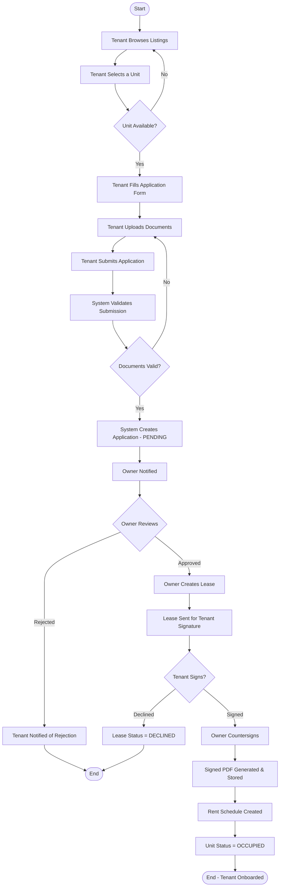
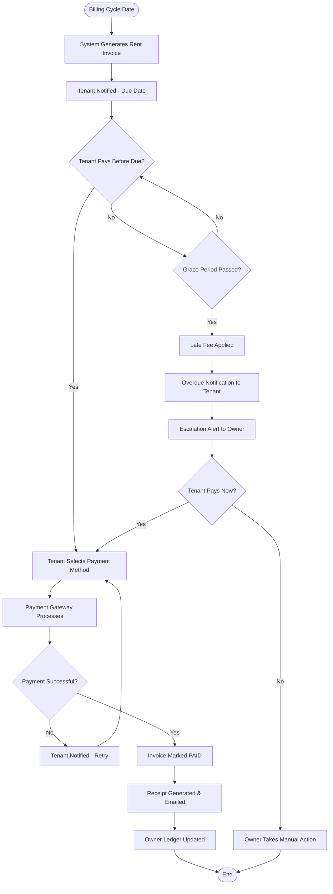
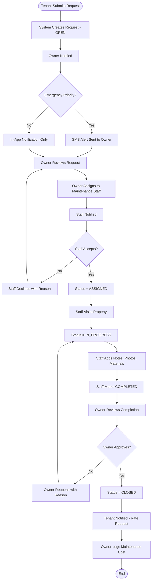
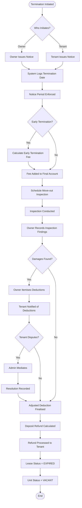
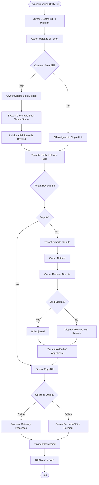

# Activity Diagrams

## Overview
Activity diagrams showing the business process flows for key operations in the house rental management system.

---

## Tenant Application & Onboarding Flow

---

## Rent Payment Flow

---

## Maintenance Request Flow

---

## Lease Termination & Deposit Refund Flow

---

## Bill Management Flow

