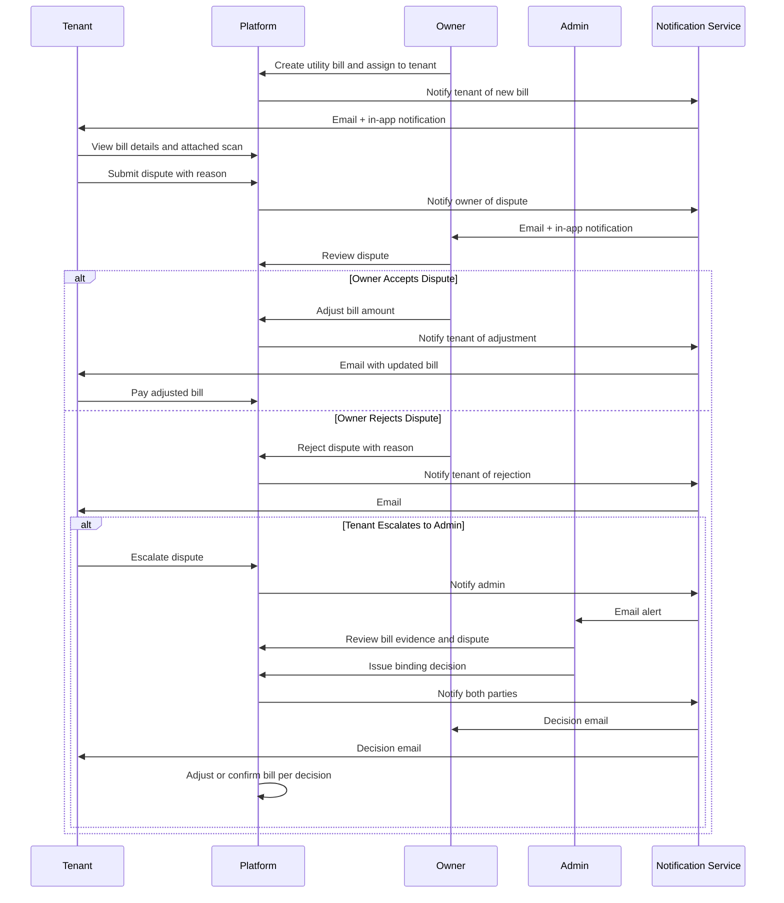

# Swimlane Diagrams

## Overview
Swimlane (BPMN-style) diagrams illustrating cross-actor workflows in the house rental management system.

---

## Tenant Onboarding Swimlane

```mermaid
sequenceDiagram
    participant T as Tenant
    participant P as Platform
    participant O as Owner
    participant ES as E-Signature Provider
    participant N as Notification Service

    T->>P: Register and verify account
    T->>P: Browse available unit listings
    T->>P: Submit rental application with documents
    P->>P: Validate documents and create application (PENDING)
    P->>N: Trigger - notify owner of new application
    N->>O: Email + in-app notification

    O->>P: Review application details and documents
    alt Rejected
        O->>P: Reject application with reason
        P->>N: Notify tenant of rejection
        N->>T: Email notification
    else Approved
        O->>P: Approve application
        O->>P: Create lease from template (configure terms)
        P->>ES: Send lease document for tenant signature
        ES->>T: Signature request email

        T->>ES: Review and sign lease digitally
        ES->>P: Signature confirmed (timestamp, IP)
        P->>N: Notify owner to countersign
        N->>O: Email notification

        O->>ES: Countersign lease
        ES->>P: Final signed lease delivered
        P->>P: Store PDF; create rent schedule; set unit OCCUPIED
        P->>N: Send signed copy to both parties
        N->>T: Signed lease PDF email
        N->>O: Signed lease PDF email
    end
```

---

## Rent Collection Swimlane

```mermaid
sequenceDiagram
    participant P as Platform
    participant T as Tenant
    participant PG as Payment Gateway
    participant O as Owner
    participant N as Notification Service

    P->>P: Billing cycle date reached
    P->>P: Generate rent invoice
    P->>N: Notify tenant - rent due
    N->>T: Email + SMS + push notification

    T->>P: View invoice
    T->>P: Click Pay Now - select payment method
    P->>PG: Initiate payment request
    PG->>T: Redirect to payment page
    T->>PG: Complete payment

    alt Payment Successful
        PG->>P: Webhook - payment confirmed
        P->>P: Mark invoice PAID; update owner ledger
        P->>N: Send receipt to tenant
        N->>T: Payment receipt email
        P->>N: Notify owner of payment received
        N->>O: In-app notification
    else Payment Failed
        PG->>P: Webhook - payment failed
        P->>N: Notify tenant - retry
        N->>T: Email notification
    end

    alt Invoice Overdue (past grace period)
        P->>P: Apply late fee to invoice
        P->>N: Overdue notification to tenant
        N->>T: Email + SMS
        P->>N: Escalation alert to owner
        N->>O: Email + in-app notification
    end
```

---

## Maintenance Request Swimlane

```mermaid
sequenceDiagram
    participant T as Tenant
    participant P as Platform
    participant O as Owner
    participant M as Maintenance Staff
    participant N as Notification Service

    T->>P: Submit maintenance request (description, priority, photos)
    P->>P: Create request (OPEN); assign request ID
    P->>N: Notify owner of new request
    N->>O: Email + push notification

    O->>P: Review request details
    O->>P: Assign to maintenance staff member
    P->>N: Notify assigned staff
    N->>M: Email + push notification

    alt Staff Accepts
        M->>P: Accept assignment (status: ASSIGNED)
        M->>P: Visit property; update status to IN_PROGRESS
        M->>P: Add work notes, photos, materials used
        M->>P: Mark task as COMPLETED

        P->>N: Notify owner of completion
        N->>O: Email + in-app notification

        alt Owner Approves
            O->>P: Approve completion (status: CLOSED)
            P->>N: Notify tenant - request resolved
            N->>T: Push notification + email
            T->>P: Rate the maintenance work
            O->>P: Log maintenance cost
        else Owner Reopens
            O->>P: Reopen request with reason
            P->>N: Notify staff to revisit
            N->>M: Push notification
        end
    else Staff Declines
        M->>P: Decline with reason
        P->>N: Notify owner - reassignment needed
        N->>O: Push notification
        O->>P: Assign to different staff member
    end
```

---

## Lease Termination & Deposit Refund Swimlane

```mermaid
sequenceDiagram
    participant T as Tenant
    participant P as Platform
    participant O as Owner
    participant A as Admin
    participant N as Notification Service

    T->>P: Submit lease termination notice
    P->>P: Record notice date; calculate termination date
    P->>N: Notify owner of termination notice
    N->>O: Email + in-app notification

    P->>P: Schedule move-out inspection on termination date
    O->>P: Conduct inspection; record findings and photos
    P->>P: Generate inspection report

    alt No Damages
        O->>P: Confirm no deductions
        P->>P: Calculate full deposit refund
    else Damages Found
        O->>P: Itemise deductions from deposit
        P->>N: Notify tenant of proposed deductions
        N->>T: Email with deduction breakdown

        alt Tenant Accepts
            T->>P: Accept deductions
        else Tenant Disputes
            T->>P: Submit dispute with reason
            P->>N: Notify admin of dispute
            N->>A: Email alert

            A->>P: Review dispute; mediate between parties
            A->>P: Record resolution decision
            P->>N: Notify both parties of decision
            N->>O: Email
            N->>T: Email
        end
    end

    P->>P: Process deposit refund to tenant
    P->>N: Notify tenant of refund
    N->>T: Refund confirmation email

    P->>P: Set lease EXPIRED; set unit VACANT
    P->>N: Notify owner - unit available for re-listing
    N->>O: In-app notification
```

---

## Bill Dispute Resolution Swimlane


