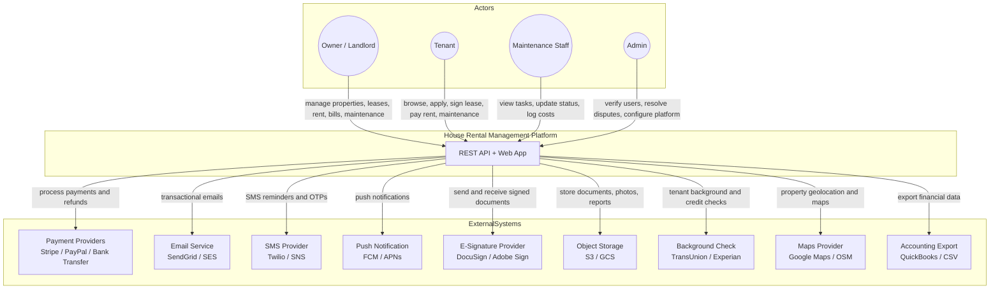
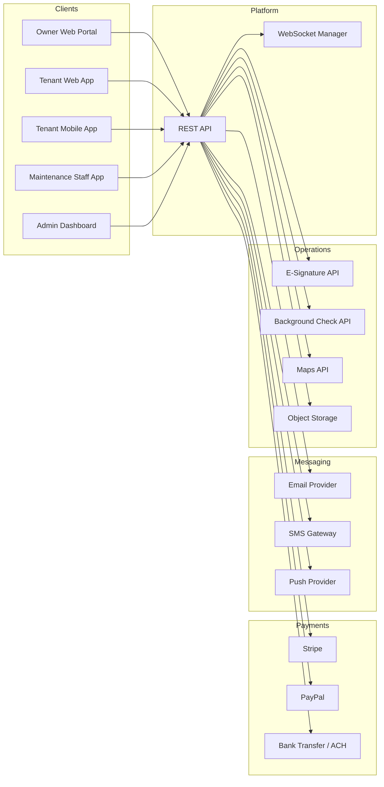
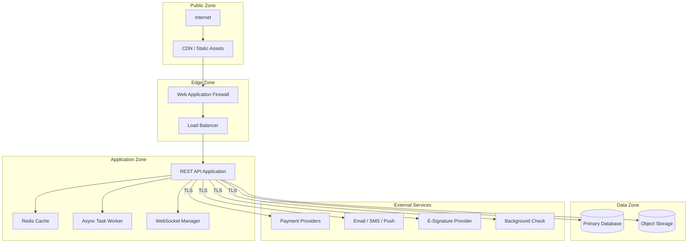

# System Context Diagram

## Overview
The system context diagram defines the boundaries of the house rental management platform and its interactions with external actors and services.

---

## Main System Context Diagram

---

## Detailed Context With Data Flows

---

## Security Boundaries

---

## External Dependency Notes

| System | Purpose | Priority |
|--------|---------|----------|
| Payment providers | Rent and bill payment processing, refunds | Core |
| Email provider | Transactional emails, lease documents | Core |
| SMS gateway | Rent reminders, OTP, emergency maintenance alerts | Core |
| E-signature provider | Digital lease signing | Core |
| Object storage | Property photos, lease PDFs, bill scans, report exports | Core |
| Push notifications | Real-time in-app alerts for tenants and owners | Core |
| Background check API | Tenant credit and rental history screening | Optional |
| Maps provider | Property geolocation, address autocomplete | Optional |
| Accounting export | Financial data export for external accounting tools | Optional |
