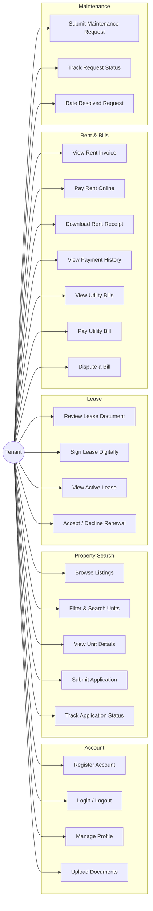
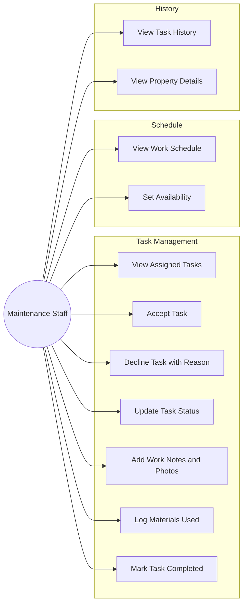
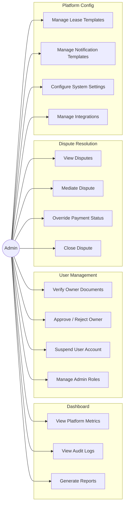
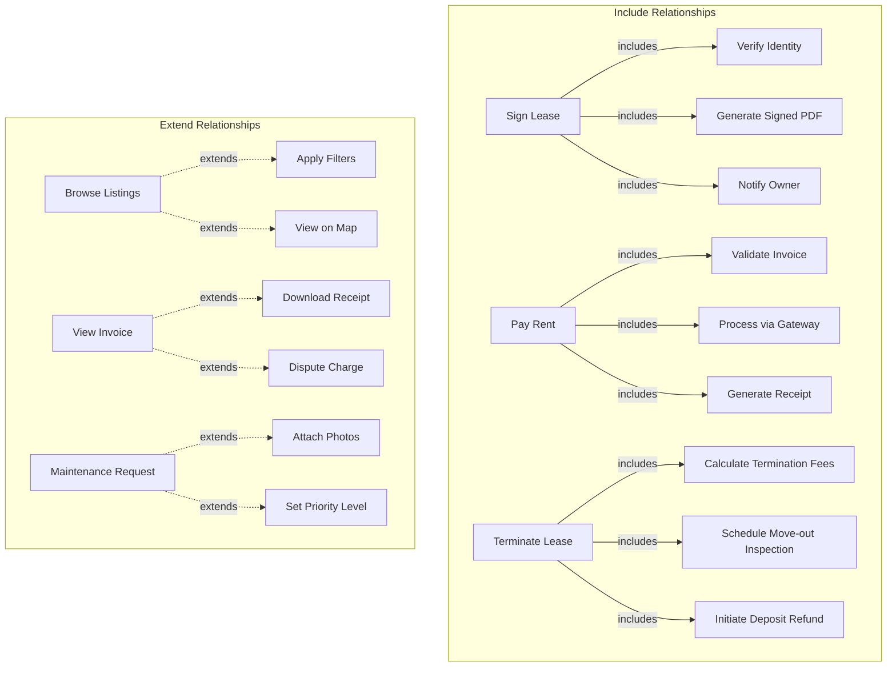

# Use Case Diagram

## Overview
This document contains use case diagrams for all major actors in the house rental management system.

---

## Complete System Use Case Diagram

```mermaid
graph TB
    subgraph Actors
        Owner((Owner))
        Tenant((Tenant))
        MaintStaff((Maintenance Staff))
        Admin((Admin))
        PaymentGW((Payment Gateway))
        EmailSvc((Email Service))
        SMSSvc((SMS Service))
        ESign((E-Signature Provider))
    end

    subgraph "House Rental Management Platform"
        UC1[Manage Properties]
        UC2[Manage Units]
        UC3[Review Applications]
        UC4[Manage Leases]
        UC5[Manage Rent]
        UC6[Manage Bills]
        UC7[Manage Maintenance]
        UC8[View Reports]

        UC10[Browse Listings]
        UC11[Submit Application]
        UC12[Sign Lease]
        UC13[Pay Rent]
        UC14[Pay Bills]
        UC15[Submit Maintenance Request]

        UC20[Manage Tasks]
        UC21[Update Task Status]

        UC30[Manage Users]
        UC31[Verify Documents]
        UC32[Resolve Disputes]
        UC33[Configure Platform]
    end

    Owner --> UC1
    Owner --> UC2
    Owner --> UC3
    Owner --> UC4
    Owner --> UC5
    Owner --> UC6
    Owner --> UC7
    Owner --> UC8

    Tenant --> UC10
    Tenant --> UC11
    Tenant --> UC12
    Tenant --> UC13
    Tenant --> UC14
    Tenant --> UC15

    MaintStaff --> UC20
    MaintStaff --> UC21

    Admin --> UC30
    Admin --> UC31
    Admin --> UC32
    Admin --> UC33

    UC13 --> PaymentGW
    UC14 --> PaymentGW
    UC12 --> ESign
    UC5 --> EmailSvc
    UC7 --> SMSSvc
```

---

## Owner Use Cases

```mermaid
graph LR
    Owner((Owner))

    subgraph "Account & Portfolio"
        UC1[Register Account]
        UC2[Login / Logout]
        UC3[Manage Profile]
        UC4[Add Property]
        UC5[Manage Units]
        UC6[Publish Unit Listing]
    end

    subgraph "Tenant & Lease"
        UC7[Review Applications]
        UC8[Approve / Reject Applicant]
        UC9[Create Lease Agreement]
        UC10[Countersign Lease]
        UC11[Renew Lease]
        UC12[Terminate Lease]
    end

    subgraph "Rent Management"
        UC13[Configure Rent & Fees]
        UC14[View Rent Invoices]
        UC15[Record Offline Payment]
        UC16[View Overdue Payments]
    end

    subgraph "Bills & Utilities"
        UC17[Create Utility Bill]
        UC18[Split Bill Across Units]
        UC19[Attach Bill Scan]
    end

    subgraph "Maintenance"
        UC20[View Maintenance Requests]
        UC21[Assign Request to Staff]
        UC22[Approve Completed Request]
        UC23[Schedule Preventive Task]
        UC24[Log Maintenance Cost]
    end

    subgraph "Finance & Reports"
        UC25[View Financial Dashboard]
        UC26[Generate Rent Roll]
        UC27[Generate Tax Report]
        UC28[Export Reports]
    end

    Owner --> UC1
    Owner --> UC2
    Owner --> UC3
    Owner --> UC4
    Owner --> UC5
    Owner --> UC6
    Owner --> UC7
    Owner --> UC8
    Owner --> UC9
    Owner --> UC10
    Owner --> UC11
    Owner --> UC12
    Owner --> UC13
    Owner --> UC14
    Owner --> UC15
    Owner --> UC16
    Owner --> UC17
    Owner --> UC18
    Owner --> UC19
    Owner --> UC20
    Owner --> UC21
    Owner --> UC22
    Owner --> UC23
    Owner --> UC24
    Owner --> UC25
    Owner --> UC26
    Owner --> UC27
    Owner --> UC28
```

---

## Tenant Use Cases

---

## Maintenance Staff Use Cases

---

## Admin Use Cases

---

## Use Case Relationships

