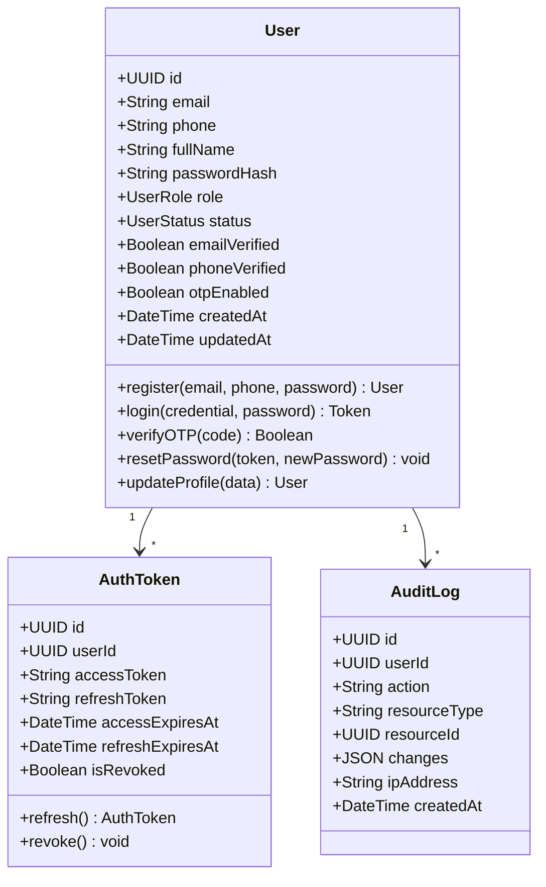
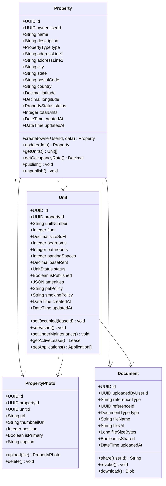
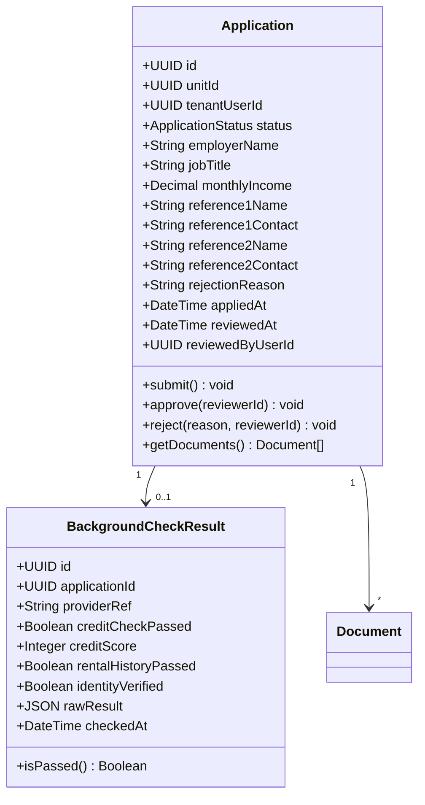
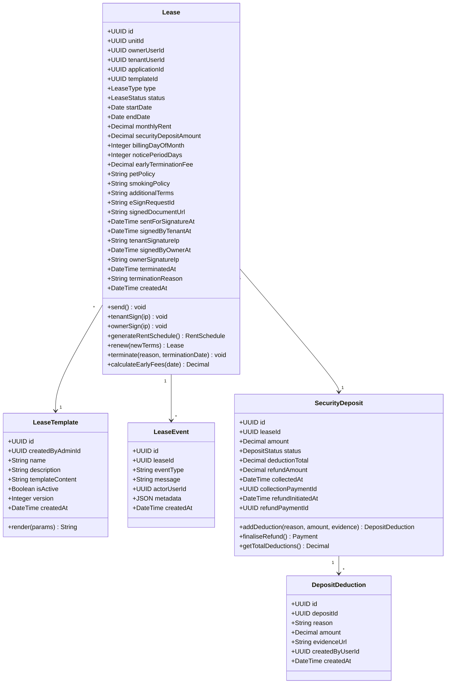
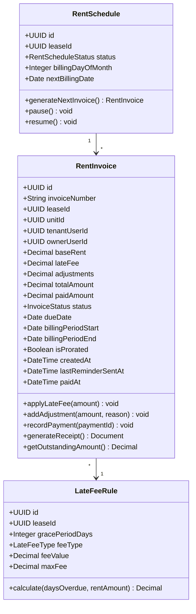
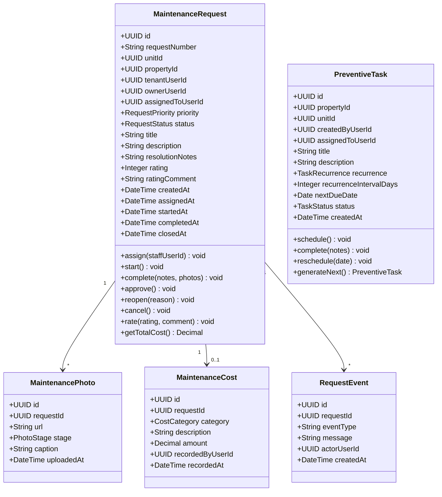

# Class Diagrams

## Overview
Detailed class diagrams with attributes, methods, and relationships for each major domain in the house rental management system.

---

## User & Auth Domain

---

## Property & Unit Domain

---

## Application & Screening Domain

---

## Lease Domain

---

## Rent Invoice Domain

---

## Maintenance Domain

