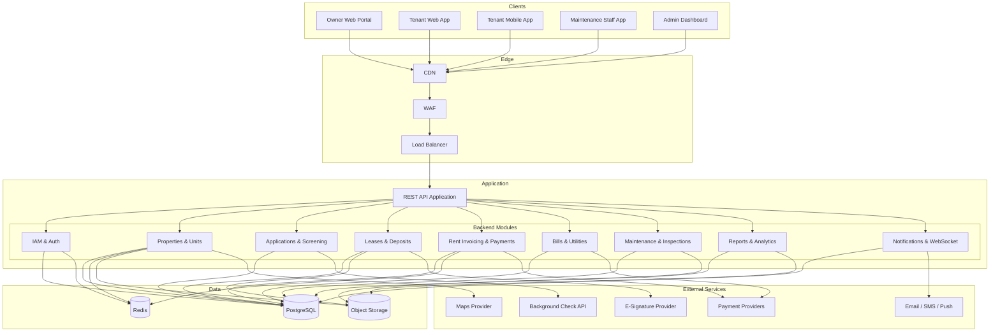
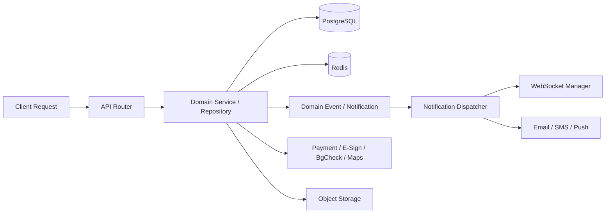

# High-Level Architecture Diagram

## Overview
This document describes the high-level architecture of the house rental management platform — a modular API application backed by a relational database, object storage, async workers, and WebSocket fanout for real-time notifications.

---

## System Architecture Overview

---

## Runtime Interaction Model

---

## Key Backend Responsibilities

| Module | Main Responsibilities |
|--------|-----------------------|
| IAM | JWT auth, OTP, RBAC, session management, admin audit log |
| Properties & Units | Property CRUD, unit management, listing publish/unpublish, photo storage |
| Applications | Application submission, document upload, background check integration, screening |
| Leases & Deposits | Lease creation from templates, e-signature flow, deposit tracking, renewal/termination |
| Rent Invoicing | Automated invoice generation, payment gateway integration, late fees, receipt generation |
| Bills & Utilities | Bill creation, common-area split, dispute lifecycle, payment reconciliation |
| Maintenance | Request lifecycle (open → close), staff assignment, cost logging, preventive tasks |
| Inspections | Move-in/out inspection records, finding logs, photo storage, report generation |
| Reports & Analytics | Rent roll, income/expense reports, tax summaries, occupancy analytics |
| Notifications | Persisted notifications, WebSocket fanout, email/SMS/push dispatch |

---

## Current Constraints

- The architecture is designed as a modular monolith; each module can be extracted into an independent service if scale demands it.
- Background check and e-signature integrations are pluggable; the platform supports adapter patterns for multiple providers.
- Real-time tracking of maintenance staff location is outside the current scope; future upgrade.
