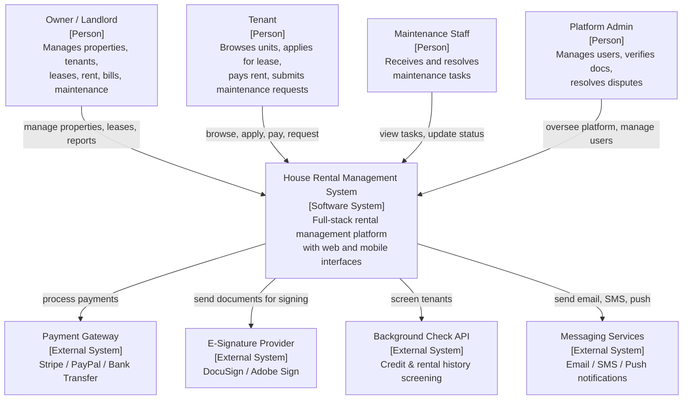
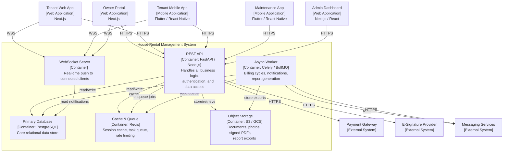

# C4 Diagrams

## Overview
C4 model diagrams for the house rental management system: Context (Level 1) and Container (Level 2).

---

## Level 1 – System Context Diagram

---

## Level 2 – Container Diagram

---

## Level 2 – Container Interaction Detail

| Container | Technology | Role |
|-----------|------------|------|
| REST API | FastAPI / Node.js | Core request handler; all business modules |
| Async Worker | Celery / BullMQ | Scheduled billing, notification dispatch, report generation |
| WebSocket Server | FastAPI WebSocket / Socket.io | Real-time notifications to connected browser/app clients |
| Primary Database | PostgreSQL | Source of truth for all entities |
| Cache & Queue | Redis | JWT block list, rate-limit counters, async task queue |
| Object Storage | AWS S3 / GCS | Property photos, lease PDFs, bill scans, inspection reports |
