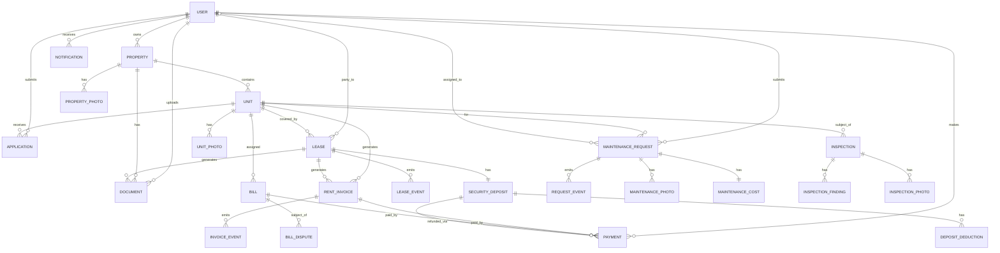
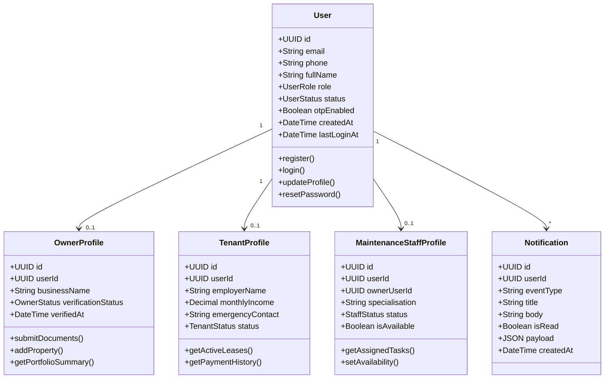
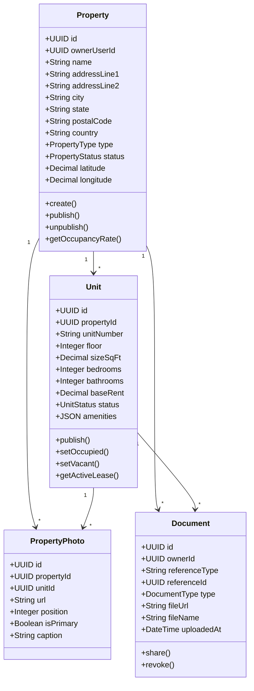
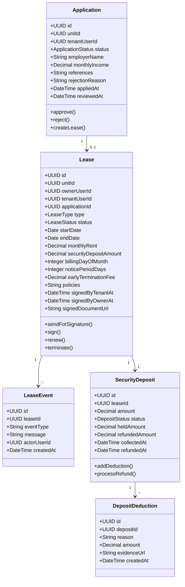
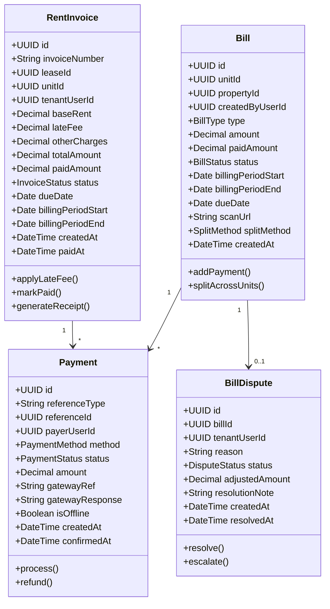
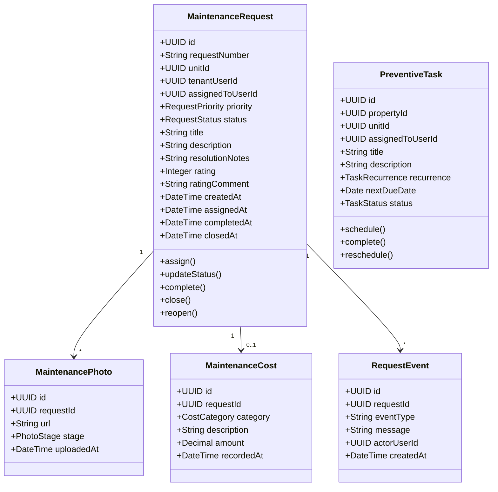
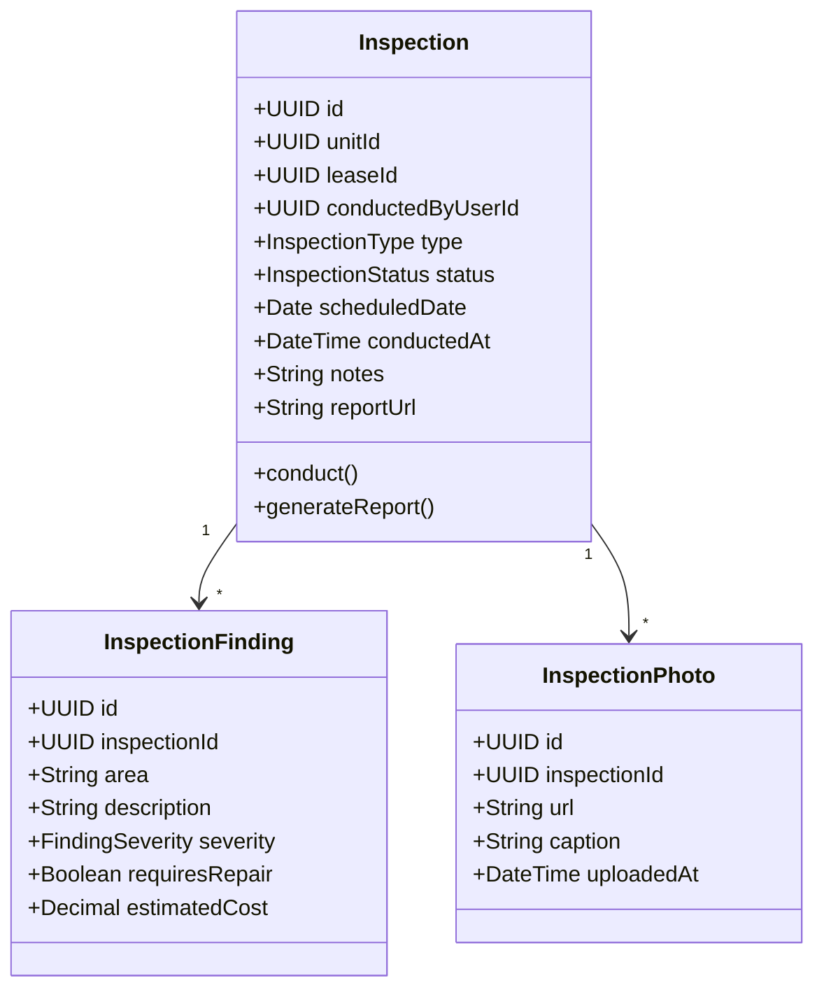
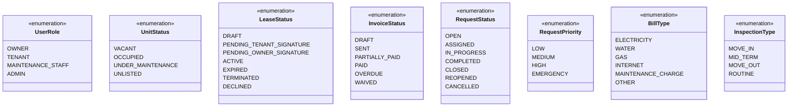

# Domain Model

## Overview
The Domain Model shows the key business entities and their relationships in the house rental management system.

---

## Complete Domain Model

---

## User Domain

---

## Property Domain

---

## Application & Lease Domain

---

## Rent & Bill Domain

---

## Maintenance Domain

---

## Inspection Domain

---

## Enumeration Types

