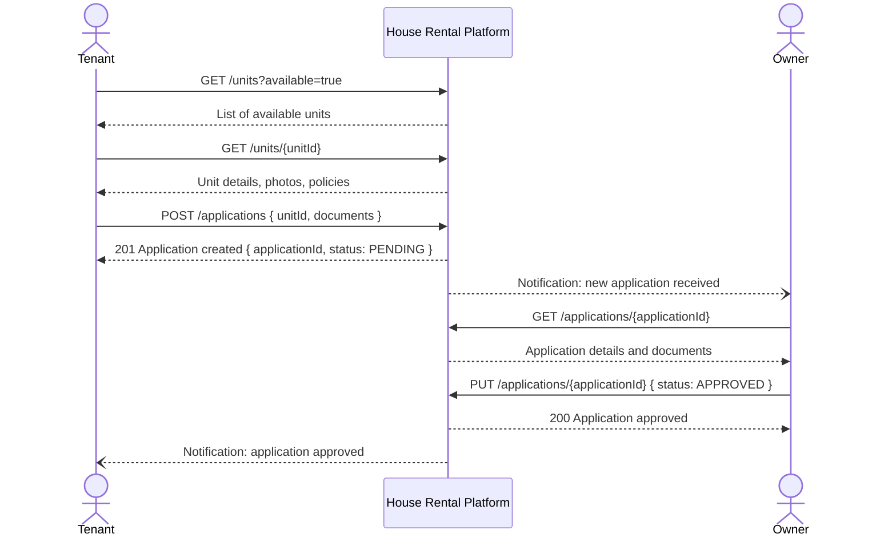
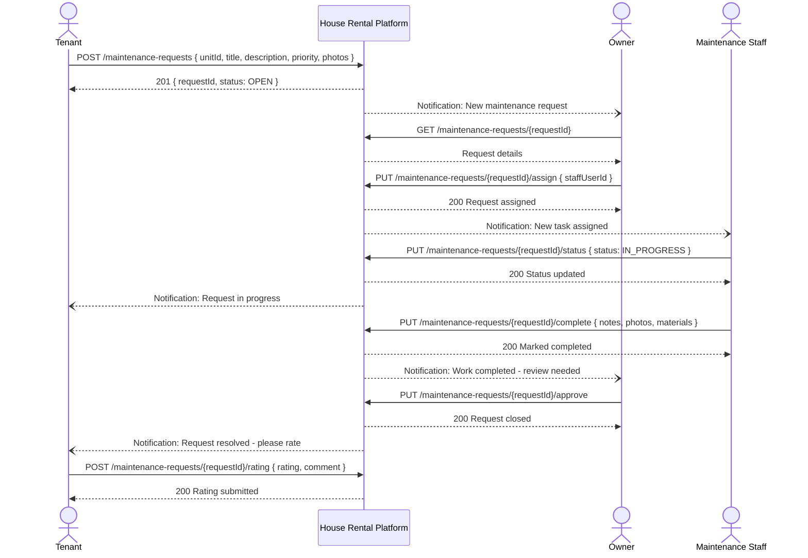
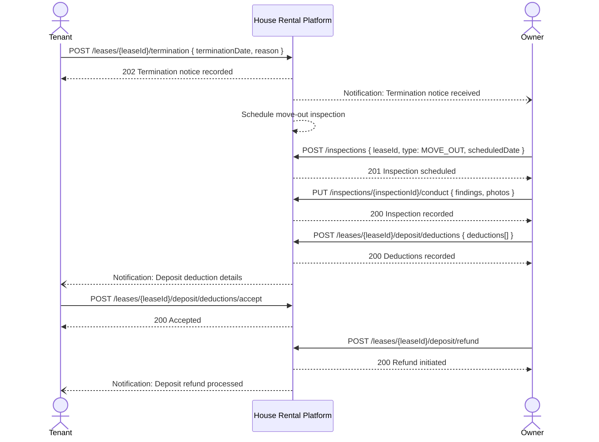

# System Sequence Diagrams

## Overview
Black-box system sequence diagrams showing interactions between actors and the platform for primary use cases.

---

## Tenant Applies for a Unit



---

## Lease Creation and Signing

```mermaid
sequenceDiagram
    actor Owner
    participant Platform as House Rental Platform
    participant ESign as E-Signature Provider
    actor Tenant

    Owner->>Platform: POST /leases { applicationId, terms, startDate, endDate, rent }
    Platform-->>Owner: 201 Lease created { leaseId, status: DRAFT }

    Owner->>Platform: POST /leases/{leaseId}/send-for-signature
    Platform->>ESign: Send lease document to tenant
    ESign-->>Platform: Signature request ID
    Platform-->>Owner: 200 Lease sent { status: PENDING_TENANT_SIGNATURE }
    Platform--)Tenant: Email: Sign your lease

    Tenant->>ESign: Review and sign document
    ESign->>Platform: Webhook: tenant signed { leaseId, timestamp, ip }
    Platform-->>Platform: Update lease status
    Platform--)Owner: Notification: Tenant signed, please countersign

    Owner->>Platform: POST /leases/{leaseId}/countersign
    Platform->>ESign: Record owner signature
    ESign-->>Platform: Final signed document URL
    Platform-->>Owner: 200 Lease fully signed
    Platform-->>Platform: Generate rent schedule; set unit OCCUPIED
    Platform--)Tenant: Email: Signed lease PDF attached
```

---

## Rent Invoice and Payment

```mermaid
sequenceDiagram
    participant Scheduler as Billing Scheduler
    participant Platform as House Rental Platform
    actor Tenant
    participant PG as Payment Gateway
    actor Owner

    Scheduler->>Platform: Trigger billing cycle for lease
    Platform-->>Platform: Generate rent invoice
    Platform--)Tenant: Notification: Rent due - {amount} by {date}

    Tenant->>Platform: GET /invoices/current
    Platform-->>Tenant: Invoice details { amount, dueDate, breakdown }

    Tenant->>Platform: POST /invoices/{invoiceId}/pay { paymentMethod }
    Platform->>PG: Initiate payment { amount, method }
    PG-->>Platform: Payment URL / session

    Platform-->>Tenant: 200 { paymentUrl }
    Tenant->>PG: Complete payment

    PG->>Platform: Webhook: payment confirmed { gatewayRef, amount }
    Platform-->>Platform: Mark invoice PAID; update ledger
    Platform--)Tenant: Email: Payment receipt
    Platform--)Owner: Notification: Rent received
```

---

## Maintenance Request Lifecycle



---

## Deposit Refund on Lease Termination


