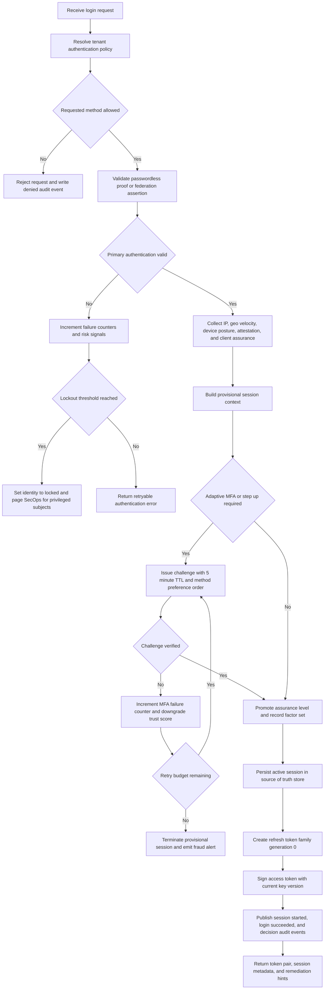
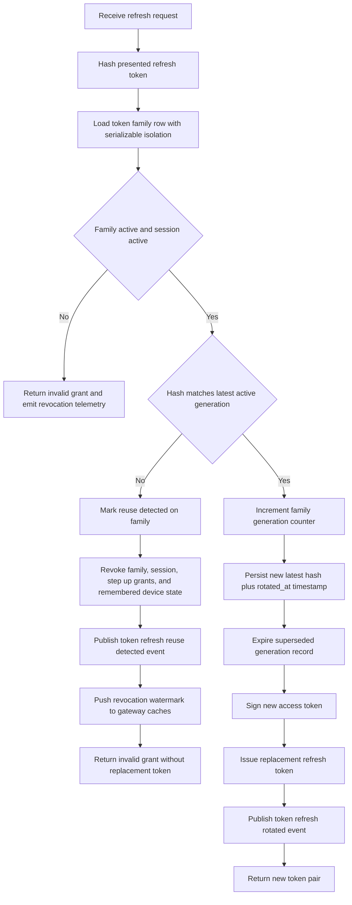
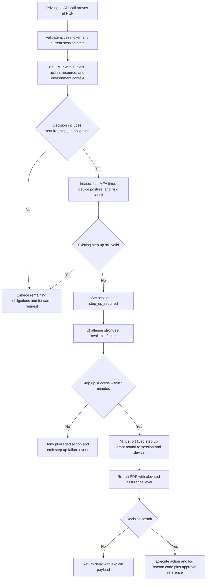
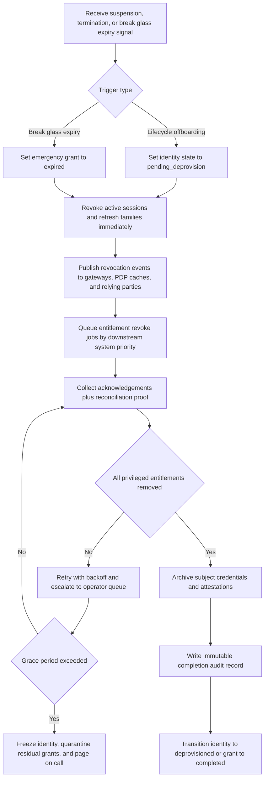

# Activity Diagrams

These activities translate the requirements, API contracts, and state machines into
implementation-ready control flow. They focus on the IAM paths where security posture,
revocation guarantees, and audit evidence must remain correct under concurrency.

## Login and Token Issuance Activity

**Implementation notes**
- Tenant policy decides whether passwordless, social federation, enterprise federation, or password fallback is legal for the client application.
- Device posture combines device binding, WebAuthn attestation status, impossible-travel score, ASN reputation, and prior compromise markers.
- MFA challenge selection order is WebAuthn platform, WebAuthn roaming, TOTP, push, then recovery code; SMS is recovery-only for low-assurance tenants.
- Primary authentication failures lock the account after 10 attempts in 15 minutes for standard users and 5 attempts in 15 minutes for privileged users.

## Refresh Rotation and Reuse Detection Activity

**Implementation notes**
- Exactly one concurrent refresh wins per family. Losers receive `invalid_grant` and do not mint additional access tokens.
- `generation` is a 64-bit monotonic counter scoped to `family_id`; overflow is treated as an operational defect that forces re-authentication before wraparound.
- Reuse detection cascades to the active session, step-up grant cache, and any derived token-exchange grants created from the family.
- Revocation publication target is `100 ms` commit-to-bus and `5 s P95` propagation to all gateways and PDP caches.

## Privileged Action Step-Up Activity

**Implementation notes**
- Step-up freshness is `15 minutes` for admin writes, `5 minutes` for credential reset, policy publish, or break-glass approval, and `1 request` for signing-key export.
- Device posture can block step-up completion even after factor success when attestation is absent, malware risk is high, or screen lock is disabled for managed-device tenants.
- PEP must enforce obligations before forwarding the privileged request, including `require_justification`, `notify_owner`, and `record_session`.

## Deprovisioning and Emergency Access Expiry Activity

**Implementation notes**
- Deprovisioning priority order is session revoke, refresh family revocation, privileged entitlements, standard entitlements, downstream profile cleanup, and archive export.
- Emergency access grants never extend automatically; renewal requires a new request, new approvals, and a new step-up proof.
- Reconciliation proof is the signed set of downstream acknowledgements, residual exception list, and final operator disposition.

## Activity Guardrails

| Activity | Hard guardrail | Timeout or SLA | Required evidence |
|---|---|---|---|
| Login | No token issued before session record commits | Auth response in `P95 < 800 ms` without MFA | `auth.login.succeeded` or `auth.login.failed` |
| Refresh rotation | Single winning generation update | `P95 < 200 ms` on warm path | `token.refresh.rotated` or `token.refresh.reuse_detected` |
| Step-up | Must bind factor result to current session and device | Challenge TTL `5 min` | `auth.step_up.completed` plus obligation trace |
| Deprovisioning | Session revoke precedes entitlement cleanup | Revocation propagation `P95 < 5 s` | `identity.suspended` or `identity.deprovisioned` |
| Break-glass expiry | Expiry cannot depend on operator action | Grant TTL max `4 h` | `break_glass.grant.expired` |
