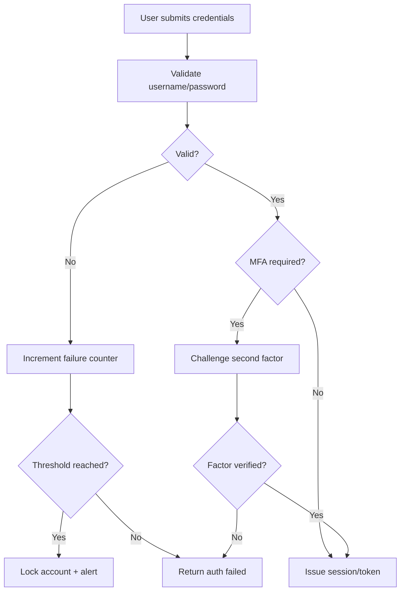
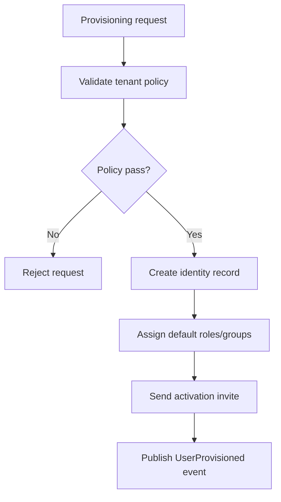
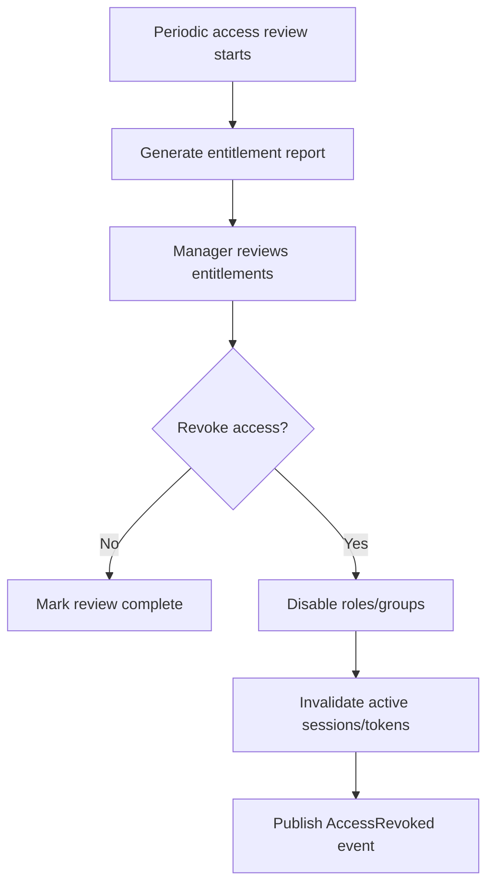

# Activity Diagrams

## Login with MFA

```mermaid
flowchart TD
    A[User submits credentials] --> B[Validate username/password]
    B --> C{Valid?}
    C -- No --> D[Increment failure counter]
    D --> E{Threshold reached?}
    E -- Yes --> F[Lock account + alert]
    E -- No --> Z[Return auth failed]
    C -- Yes --> G{MFA required?}
    G -- No --> H[Issue session/token]
    G -- Yes --> I[Challenge second factor]
    I --> J{Factor verified?}
    J -- No --> Z
    J -- Yes --> H
```

## User Provisioning

```mermaid
flowchart TD
    A[Provisioning request] --> B[Validate tenant policy]
    B --> C{Policy pass?}
    C -- No --> D[Reject request]
    C -- Yes --> E[Create identity record]
    E --> F[Assign default roles/groups]
    F --> G[Send activation invite]
    G --> H[Publish UserProvisioned event]
```

## Access Review and Revocation

```mermaid
flowchart TD
    A[Periodic access review starts] --> B[Generate entitlement report]
    B --> C[Manager reviews entitlements]
    C --> D{Revoke access?}
    D -- No --> E[Mark review complete]
    D -- Yes --> F[Disable roles/groups]
    F --> G[Invalidate active sessions/tokens]
    G --> H[Publish AccessRevoked event]
```
