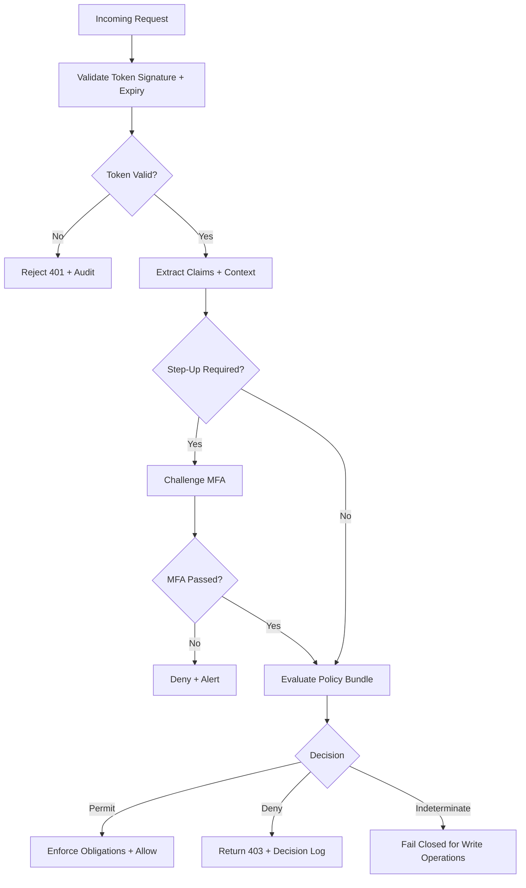

# Business Rules

This document defines enforceable policy rules for **Identity and Access Management Platform** so authentication, authorization, federation, and lifecycle management behave consistently under normal and exceptional conditions.

## Context
- Domain focus: identity authentication, policy-based authorization, and identity lifecycle management.
- Rule categories: authorization, identity lifecycle, federation, session management, and compliance.
- Enforcement points: API gateway, policy decision point (PDP), token service, lifecycle workers, and admin consoles.

## Enforceable Rules
1. Every request to a protected resource must be accompanied by a valid, non-expired access token with the correct audience.
2. Authorization decisions default to deny when no policy explicitly permits the requested action on the resource.
3. An explicit deny from any policy overrides any matching permit for the same action/resource tuple.
4. Privileged or high-risk actions require a step-up MFA challenge completed within 15 minutes.
5. A suspended, locked, or deprovisioned identity must not receive new access tokens or permit any resource access.
6. Refresh token reuse detection: reusing a previously rotated token must revoke the entire token family and terminate the session.
7. Break-glass access grants require dual approval, are scoped to a specific resource/time window, and auto-expire.
8. Federated login is denied if issuer URI, audience, or required claim mappings do not match the registered connection.
9. Policy bundle activation requires approval metadata and an immutable diff checksum recorded in the audit log.
10. All critical administrative actions (policy publication, identity suspension, break-glass grant) must reference a ticket and emit an immutable audit event.

## Rule Evaluation Pipeline

## Exception and Override Handling
- Overrides are restricted to approved exception classes (`break_glass`, `emergency_access`) and require dual-party approval.
- Override windows automatically expire and emit an expiry audit event; access is not silently retained.
- Repeated override patterns trigger policy redesign review and automation improvement tasks.
- Indeterminate decisions fail closed for write or privileged operations; fail open only for explicitly safe read paths with a documented risk acceptance.

## Federation and Provisioning Rules
- Missing required claim mappings block JIT provisioning with a structured error and an alert to the IdP owner.
- SCIM source-of-truth matrix defines which system wins attribute conflicts; drift reconciliation runs every 15 minutes.
- Certificate rollover and metadata refresh for federation connections follow overlap windows to avoid service disruption.

## Compliance and Audit Rules
- Every access token contains minimum claims: `sub`, `iss`, `aud`, `iat`, `exp`, `tid` (tenant), `scope`.
- Decision logs include: policy version hash, matched rules, obligations, request context, and correlation ID.
- Audit retention: 13 months hot search, 7 years archive; log integrity is verified by cryptographic hash chain.

## Measurable Acceptance Criteria
- Authorization decision latency P99 <= 50 ms at 10 000 RPS.
- Token revocation propagation to all enforcement points within 5 seconds P95.
- Zero false-permit decisions under adversarial test scenarios.
