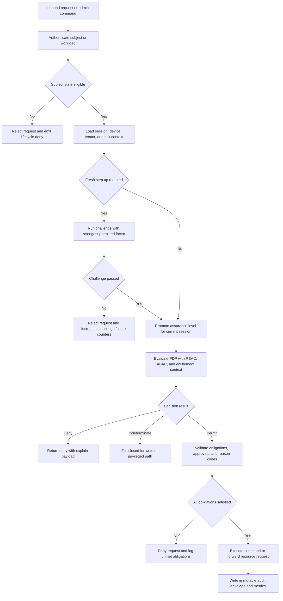

# Business Rules

This document captures the business invariants that the IAM platform must enforce at
every gateway, service, worker, and operator workflow. The rules assume a multi-tenant
platform with passwordless and federated login, adaptive MFA, hybrid RBAC and ABAC,
SCIM-driven lifecycle changes, and immutable auditability.

## Context
- Enforcement points: API gateway PEP, authentication service, token service, policy decision point, policy administration API, lifecycle workers, federation adapters, and admin UI.
- Rule evaluation inputs: identity state, session state, device posture, tenant policy, resource sensitivity, entitlement source, and current incident posture.
- Policy decisions are explainable by default and never rely on unstated fall-through behavior.

## Enforceable Rules
1. **Protected resource access**: every protected human request must present a valid access token whose `iss`, `aud`, `tid`, `sid`, and `exp` claims match the current tenant, client, and session.
2. **Workload access**: workload identities may authenticate only with registered client credentials, mTLS certificates, or signed workload identity tokens bound to an attested workload record.
3. **Tenant login policy**: a client application may offer only the primary methods enabled for its tenant and risk class; password fallback is disabled when the tenant is marked passwordless-only.
4. **Primary authentication gating**: suspended, locked, deprovisioned, quarantined, or archived subjects must never pass primary authentication, even when the upstream IdP assertion is valid.
5. **Adaptive MFA**: privileged actions or logins with elevated risk require a fresh MFA challenge completed within `5 minutes`; standard admin access may accept a fresh challenge completed within `15 minutes`.
6. **Trusted device limits**: device trust can reduce prompts for low-risk user journeys, but it never bypasses MFA for break-glass access, policy publication, credential recovery, or signing-key administration.
7. **Failure throttling**: human identities lock after `10` failed primary attempts in `15 minutes`, while privileged identities lock after `5`; MFA challenges allow `5` attempts before the session is terminated.
8. **Session source of truth**: session state in the session store is authoritative over any token claim. A token whose backing session is `revoked`, `terminated`, `expired`, or `step_up_required` must be denied.
9. **Access token lifetime**: access tokens remain short-lived at `10 minutes` default and may be reduced to `2 minutes` during brownout or elevated threat posture.
10. **Refresh rotation atomicity**: each refresh request either wins the next family generation or fails with `invalid_grant`; the system must never mint two active generations for the same family.
11. **Reuse detection**: presenting a rotated refresh token revokes the full family, terminates the session, invalidates active step-up grants, and emits a security alert within the revocation SLA.
12. **Decision semantics**: PDP results are `permit`, `deny`, `not_applicable`, or `indeterminate`; write and privileged operations fail closed on `indeterminate`.
13. **Precedence**: explicit `deny` outranks `permit`; direct user grants outrank group grants only among permits; source-of-truth rank breaks ties only after deny precedence is resolved.
14. **Obligation enforcement**: a PEP may forward a request only after every returned obligation is either fulfilled synchronously or converted into a verifiable deny reason.
15. **Policy publication**: policies move `draft -> review -> approved -> active`; activation requires dual control, successful simulation, signed diff hash, and rollback metadata.
16. **Explainability**: every non-public authorization decision stores policy IDs, matched statements, evaluated attributes, obligation outcomes, risk signals, and correlation identifiers.
17. **Entitlement lifecycle**: every grant has a source, owner, justification, approval record when required, start time, optional expiry, and revocation path.
18. **Grant conflict handling**: deny guardrails, suspension state, or deprovisioning always override new grants. Break-glass grants outrank standard permits but do not override legal or safety-deny policies.
19. **Federation trust validation**: OIDC and SAML assertions are rejected when issuer, audience, nonce or relay binding, signature, certificate, `kid`, or required claims fail validation.
20. **Claim mapping**: a required mapping failure blocks JIT provisioning. Optional mappings may be skipped only when the tenant mapping profile marks them non-authoritative.
21. **SCIM source ownership**: each mutable identity attribute has one authoritative source. SCIM-managed attributes may not be overwritten by local UI edits unless a temporary exception is approved.
22. **Suspension semantics**: a suspension command revokes all sessions immediately, blocks new token issuance, freezes entitlement propagation, and starts downstream revocation workflows.
23. **Break-glass issuance**: emergency access requires two approvers from distinct control groups, a ticket reference, reason text, scoped permissions, explicit expiry, and a fresh step-up proof from the requestor.
24. **Break-glass expiry**: emergency access expires automatically at or before `4 hours`; continuation requires a new approval cycle and a new audit chain.
25. **Workload credential rotation**: managed workload credentials rotate on schedule with overlap windows; compromise or attestation failure forces immediate quarantine and credential invalidation.
26. **Audit immutability**: security-sensitive state changes are not acknowledged to the caller until their audit envelope is durably written to the append-only audit pipeline.
27. **Evidence retention**: hot audit search is retained for `13 months`; immutable archive, policy diff history, and break-glass evidence remain available for `7 years` unless a stronger legal hold applies.
28. **Operator accountability**: policy publication, user suspension, session revoke, grant override, and connector disable actions require signed operator identity, ticket reference, and correlation ID.

## Rule Evaluation Pipeline

## Exception and Override Handling

| Exception class | Who may request | Required controls | Maximum duration | Automatic follow-up |
|---|---|---|---|---|
| `break_glass` | Named human operator | Dual approval, fresh step-up, ticket, session recording | `4 hours` | Post-use review within `24 hours` |
| `temporary_attribute_override` | Identity admin | Source owner approval, diff snapshot, expiry | `72 hours` | Drift reconciliation re-check |
| `connector_quarantine_bypass` | Platform SRE | Incident commander approval, narrow scope | `60 minutes` | Connector certification rerun |
| `read_only_fail_open` | Security architect | Written risk acceptance, tenant allowlist, safe-read proof | `30 minutes` | Executive review and policy patch |

Override rules:
- Exceptions never bypass signature validation, token integrity checks, or immutable audit writes.
- Overrides are policy objects with expiry, not ad hoc flags hidden in code or UI state.
- Repeated use of the same exception class for the same tenant triggers a design-review action item.

## Federation and Provisioning Rules
- JIT provisioning can create only the minimal bootstrap identity with baseline roles such as `viewer` or `requester`; privileged roles always require a separate entitlement workflow.
- Federation metadata refresh honors overlap windows and rejects silent certificate downgrade or issuer changes.
- SCIM provisioning must validate manager references, group existence, and source ownership before committing an update.
- Login-time claim drift may update low-risk profile fields only when the mapping profile marks the field as login-authoritative.
- Connector retries must be idempotent and keyed by provider operation ID or SCIM `meta.version`.

## Compliance and Audit Rules
- All privileged actions record actor, acting-on-behalf-of principal, device posture, step-up time, ticket reference, policy hash, and approval references.
- Audit chains are tamper-evident through a per-tenant hash chain and signed export manifest.
- Policy simulations, denied publishes, and dry runs are retained because they form evidence for change-management controls.
- Compliance export jobs must prove completeness by reconciling event counts from Kafka offsets, archive object counts, and OLTP shadow indexes.

## Measurable Acceptance Criteria
- Authorization decision latency remains `P99 <= 50 ms` at `10,000 RPS` with warm caches and `P99 <= 150 ms` on cache miss.
- Session terminate and token family revocation propagate to all enforcement points in `P95 <= 5 s` and `P99 <= 10 s`.
- `100 percent` of policy publishes require simulation evidence, approver identity, and stored diff hash.
- No false-permit outcomes are allowed in adversarial tests covering stale cache, replay, reuse, claim forgery, and entitlement conflict scenarios.
