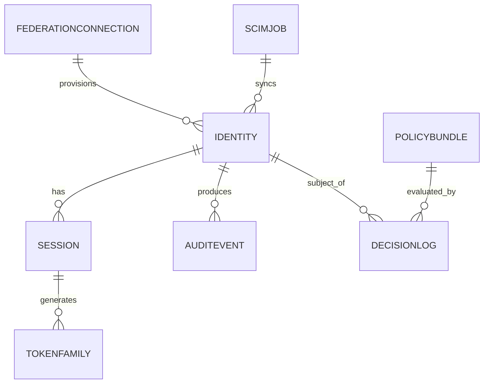

# Data Dictionary

This data dictionary is the canonical reference for **Identity and Access Management Platform**. It defines shared terminology, entity semantics, and governance controls required to keep identity and authorization workflows consistent across services and teams.

## Scope and Goals
- Establish a stable vocabulary for authentication, authorization, federation, and lifecycle management.
- Define minimum required fields for core IAM entities and expected relationship boundaries.
- Document data quality and retention controls needed for production readiness.

## Core Entities

| Entity | Description | Required Attributes |
|---|---|---|
| `Identity` | Human or workload principal record | `identity_id`, `tenant_id`, `type`, `status`, `subject_ref`, `created_at` |
| `Session` | Active session source of truth | `session_id`, `identity_id`, `status`, `auth_time`, `device_id`, `expires_at` |
| `TokenFamily` | Refresh token rotation tracking | `family_id`, `session_id`, `latest_refresh_hash`, `revoked_at`, `created_at` |
| `PolicyBundle` | Immutable versioned policy artifact | `policy_version`, `bundle_hash`, `activated_at`, `activated_by`, `scope` |
| `DecisionLog` | Explainability and forensic evidence | `decision_id`, `policy_version`, `identity_id`, `resource`, `action`, `result`, `obligations` |
| `FederationConnection` | Enterprise IdP trust configuration | `connection_id`, `tenant_id`, `protocol`, `issuer`, `jwks_uri`, `status` |
| `ScimJob` | SCIM provisioning pipeline telemetry | `job_id`, `external_system`, `object_ref`, `attempt`, `result`, `occurred_at` |
| `AuditEvent` | Immutable compliance and operations trail | `audit_id`, `identity_id`, `actor`, `action`, `target`, `decision`, `ip_address`, `occurred_at` |

## Canonical Relationship Diagram

## Data Quality Controls
1. `tenant_id` is mandatory on all entities; requests without tenant context are rejected at the gateway.
2. PII-bearing fields (email, phone, display name) are encrypted at rest and tagged with classification tier.
3. Immutable entities (`AuditEvent`, `DecisionLog`, `TokenFamily`) use append-only storage patterns.
4. Status fields (`identity.status`, `session.status`) use controlled vocabularies and reject unknown values.
5. External imports from SCIM must include `external_id`, `source_system`, and `ingested_at` provenance.
6. Duplicate identity detection runs on natural keys (`subject_ref + tenant_id`) to prevent provisioning collisions.

## Retention and Access Patterns
- Active sessions and token families: hot OLTP with strict TTL enforcement.
- Decision logs: 13 months hot search + 7 years compliance archive.
- Audit events: immutable retention with legal-hold support and correlation ID indexing.

## Field Constraints
- `tenant_id` is mandatory on all entities.
- PII-bearing fields must be encrypted-at-rest and access-controlled.
- Immutable fields are append-only through event sourcing patterns.
- `reason_code` is mandatory for lifecycle transitions and high-impact administrative actions.

## Domain Glossary
- **Identity**: A human user or system workload that can authenticate and receive authorization decisions.
- **PolicyBundle**: A versioned, immutable artifact containing all authorization policies active for a scope.
- **TokenFamily**: A lineage tracking record that links refresh token rotations for reuse detection.
- **Decision**: An authorization verdict (`permit`, `deny`, `not_applicable`, `indeterminate`) produced by the PDP.
