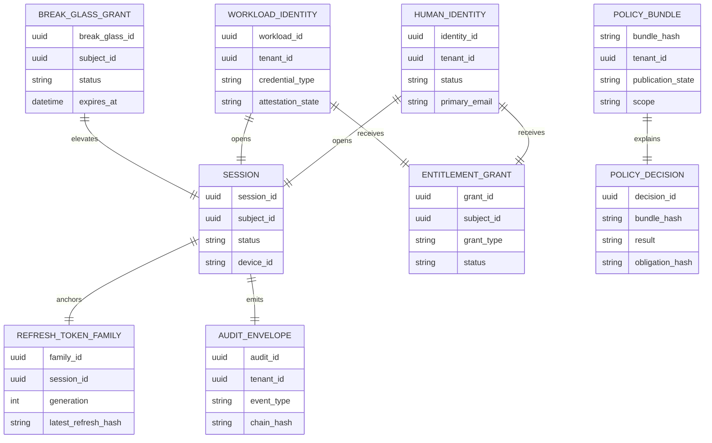

# Data Dictionary

This data dictionary is the implementation reference for the Identity and Access
Management Platform. It defines the canonical records that authentication,
authorization, federation, provisioning, entitlement, and audit services must share.

## Scope and Goals
- Normalize data ownership between the authentication core, policy platform, lifecycle services, federation adapters, and compliance pipeline.
- Define mandatory fields that make token issuance, entitlement reconciliation, and audit explainability deterministic.
- Capture retention, provenance, and encryption rules needed to ship a real multi-tenant IAM control plane.

## Core Entities

| Entity | Description | Required attributes | Authoritative store | Retention |
|---|---|---|---|---|
| `HumanIdentity` | Human workforce or customer principal | `identity_id`, `tenant_id`, `status`, `primary_email`, `assurance_level`, `source_system`, `created_at` | PostgreSQL `identities` | Life of account plus archive |
| `WorkloadIdentity` | Non-human principal for services, jobs, or agents | `workload_id`, `tenant_id`, `credential_type`, `attestation_state`, `rotation_schedule`, `owner_team`, `status` | PostgreSQL `workload_identities` | Until retirement plus audit archive |
| `DeviceCredential` | Registered factor or device binding | `device_id`, `subject_id`, `type`, `attestation_trust`, `public_key_ref`, `last_used_at`, `status` | PostgreSQL `mfa_devices` | Until revoked plus evidence retention |
| `Session` | Active or historical subject session | `session_id`, `subject_id`, `tenant_id`, `status`, `auth_time`, `auth_methods`, `device_id`, `risk_score`, `expires_at` | Redis plus PostgreSQL shadow | TTL in Redis plus 13 month audit shadow |
| `RefreshTokenFamily` | Lineage record for rotating refresh tokens | `family_id`, `session_id`, `latest_refresh_hash`, `generation`, `last_rotated_at`, `revoked_at`, `reuse_detected_at` | PostgreSQL `refresh_token_families` | Until family expiry plus 13 months searchable |
| `StepUpGrant` | Short-lived elevated assurance binding | `grant_id`, `session_id`, `subject_id`, `achieved_methods`, `issued_at`, `expires_at`, `device_binding_hash` | Redis plus PostgreSQL shadow | TTL plus 13 month audit shadow |
| `PolicyBundle` | Immutable compiled policy artifact for a scope | `bundle_hash`, `tenant_id`, `scope`, `version`, `publication_state`, `approved_by`, `activated_at` | PostgreSQL `policy_bundles` | Indefinite |
| `PolicyDecision` | Explainable result returned by the PDP | `decision_id`, `bundle_hash`, `subject_id`, `resource`, `action`, `result`, `matched_statements`, `obligations`, `device_posture`, `risk_score`, `occurred_at` | Append-only decision log | 13 months hot plus 7 years archive |
| `EntitlementGrant` | Direct, group-derived, or emergency permission grant | `grant_id`, `subject_id`, `grant_type`, `resource_scope`, `policy_ref`, `source_system`, `approval_ref`, `status`, `expires_at` | PostgreSQL `entitlement_grants` | Until revoked plus 7 years archive |
| `EntitlementConflict` | Pending or resolved grant conflict | `conflict_id`, `tenant_id`, `subject_id`, `winning_record_ref`, `losing_record_ref`, `reason_code`, `resolution_state`, `detected_at` | PostgreSQL `entitlement_conflicts` | 7 years |
| `FederationConnection` | OIDC or SAML trust configuration | `connection_id`, `tenant_id`, `protocol`, `issuer`, `audience`, `jwks_uri_or_metadata_url`, `claim_mapping_version`, `status` | PostgreSQL `federation_connections` | Life of connection plus 7 years history |
| `ScimSyncCursor` | SCIM job checkpoint and drift summary | `cursor_id`, `tenant_id`, `provider_id`, `resource_type`, `last_success_at`, `last_version_seen`, `drift_count`, `status` | PostgreSQL `scim_sync_cursors` | Indefinite |
| `BreakGlassGrant` | Emergency access request and issuance record | `break_glass_id`, `subject_id`, `scope`, `request_reason`, `approver_ids`, `issued_session_id`, `expires_at`, `status` | PostgreSQL `break_glass_grants` | 7 years minimum |
| `AuditEnvelope` | Immutable audit event envelope | `audit_id`, `tenant_id`, `event_type`, `actor_ref`, `target_ref`, `correlation_id`, `chain_hash`, `signature_ref`, `occurred_at` | Kafka plus WORM archive | 7 years or legal hold |
| `SigningKeyVersion` | Signing and verification key metadata | `kid`, `algorithm`, `kms_key_ref`, `state`, `activated_at`, `retire_after`, `verification_only_after` | KMS inventory plus PostgreSQL registry | Indefinite |
| `RevocationWatermark` | Last applied revocation sequence per consumer | `consumer_id`, `tenant_id`, `stream`, `watermark_value`, `applied_at`, `lag_ms` | Redis or consumer metadata table | 30 days hot plus metrics archive |

## Canonical Relationship Diagram

## Data Quality Controls

| Control | Rule | Enforcement |
|---|---|---|
| Tenant scoping | Every mutable row carries `tenant_id` and is covered by row-level isolation rules | DB constraints plus gateway tenant resolution |
| Provenance | External updates include `source_system`, upstream identifier, ingest timestamp, and request ID | SCIM adapter and federation adapter validation |
| Status vocabularies | `status` fields accept only documented lifecycle values | Enum validation plus migration tests |
| Cryptographic hygiene | Token hashes, device secrets, signing-key refs, and chain hashes never store raw secret material | Service-layer hash and envelope libraries |
| Append-only evidence | Decision logs, audit envelopes, refresh-family history, and policy publications are append-only | Database permissions plus archive immutability |
| Conflict traceability | Every entitlement or source-of-truth conflict stores both contenders and the winning rule | Reconciliation worker and review UI |
| PII classification | Email, phone, recovery contacts, and device nicknames are tagged as confidential and encrypted at rest | Column policy plus KMS key policy |
| Clock discipline | Security timestamps use UTC with synchronized monotonic host time | NTP drift monitoring and schema checks |

## Retention and Access Patterns
- Sessions, step-up grants, and revocation watermarks are hot operational data with strict TTL and replication targets.
- Refresh-token families, entitlement grants, policy bundles, and federation connections are transactional data with immutable history rows.
- Policy decisions and audit envelopes must support indexed search by tenant, subject, actor, ticket, and correlation ID.
- Break-glass grants, suspensions, and deprovisioning evidence remain exportable even after the underlying identity is archived.

## Field Constraints
- `subject_id` may refer to a human or workload identity, but APIs must expose the concrete subject type explicitly.
- `external_id` is immutable once linked unless a supervised relink workflow produces a signed migration record.
- `risk_score` is normalized to `0..100` and accompanied by `risk_reasons[]` so decisions remain explainable.
- `auth_methods` stores ordered factors actually used, not merely those registered for the subject.
- `resource_scope` is stored in canonical resource-URN format to keep RBAC and ABAC policy matching deterministic.
- `chain_hash` is calculated from the prior audit record hash plus the normalized current envelope.

## Domain Glossary
- **Token family**: the ordered lineage of refresh tokens that belong to one session and client binding.
- **Step-up grant**: a short-lived record proving that the current session satisfied a higher assurance requirement.
- **Entitlement**: a concrete permission assignment derived from role membership, direct assignment, policy binding, or emergency override.
- **Drift**: divergence between the platform record and the authoritative upstream identity or entitlement source.
- **Watermark**: the highest revocation sequence or event offset applied by a consumer such as a gateway or PDP cache.
