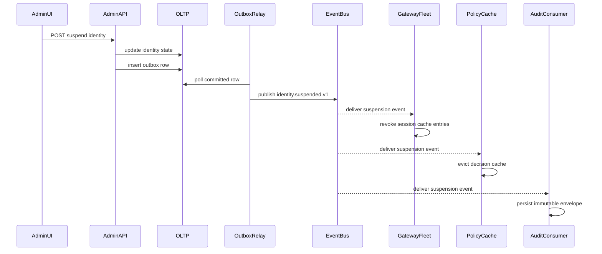

# Event Catalog

This catalog defines the production event contracts for the Identity and Access
Management Platform. The catalog is written for service developers, connector owners,
analytics consumers, and compliance teams that rely on event ordering and evidence.

## Contract Conventions
- Event name format: `<domain>.<aggregate>.<action>.v1`.
- Mandatory envelope headers: `event_id`, `event_time`, `tenant_id`, `correlation_id`, `causation_id`, `producer`, `schema_version`, and `trace_flags`.
- Partition keys are entity-specific and chosen to preserve causal ordering for security-sensitive streams such as sessions, token families, identities, and policy bundles.
- Delivery semantics are at-least-once; consumers must deduplicate by `event_id` and reject out-of-window replays.
- Security-sensitive events carry an immutable `audit_ref` that links the event to the WORM archive record.
- Breaking schema changes require a new major version and a dual-publish migration window.

## Domain Events

| Event | Producer | Partition key | Key payload fields | Trigger | Primary consumers |
|---|---|---|---|---|---|
| `auth.login.succeeded.v1` | auth-service | `tenant_id+session_id` | `session_id`, `subject_id`, `auth_methods`, `client_id`, `risk_score` | Primary login completes | Audit, analytics, risk feedback |
| `auth.login.failed.v1` | auth-service | `tenant_id+subject_ref` | `subject_ref`, `failure_reason`, `risk_indicators`, `attempt_count` | Login rejected | Fraud analytics, audit |
| `auth.step_up.required.v1` | auth-service | `tenant_id+session_id` | `session_id`, `requested_assurance`, `reason_codes`, `device_posture` | PDP or auth flow requires stronger assurance | UI notifier, audit |
| `auth.step_up.completed.v1` | auth-service | `tenant_id+session_id` | `session_id`, `achieved_methods`, `expires_at`, `assurance_level` | Step-up challenge succeeds | PDP cache, audit |
| `session.terminated.v1` | session-service | `tenant_id+session_id` | `session_id`, `reason_code`, `initiator`, `revocation_scope` | Logout, admin revoke, expiry, or suspension | Gateway, audit, analytics |
| `token.refresh.rotated.v1` | token-service | `tenant_id+family_id` | `family_id`, `session_id`, `new_generation`, `client_binding` | Valid refresh exchange wins | Gateway telemetry, audit |
| `token.refresh.reuse_detected.v1` | token-service | `tenant_id+family_id` | `family_id`, `session_id`, `presented_generation`, `reuse_detected_at`, `ip_address` | Rotated token is reused | Incident automation, audit |
| `token.family.revoked.v1` | token-service | `tenant_id+family_id` | `family_id`, `session_id`, `reason_code`, `watermark_hint` | Manual revoke, reuse, or suspension | Gateways, PDP, relying-party introspection |
| `policy.bundle.activated.v1` | policy-admin | `tenant_id+bundle_hash` | `bundle_hash`, `scope`, `approved_by`, `diff_hash`, `activation_mode` | Policy publish succeeds | PDP compiler, audit |
| `policy.decision.logged.v1` | pdp | `tenant_id+decision_id` | `decision_id`, `subject_id`, `result`, `matched_statements`, `obligations` | PDP returns final decision | Audit lake, explainability analytics |
| `identity.suspended.v1` | lifecycle-service | `tenant_id+identity_id` | `identity_id`, `reason_code`, `ticket_ref`, `initiated_by` | Suspension workflow commits | Session manager, entitlement freeze, audit |
| `identity.deprovisioned.v1` | lifecycle-service | `tenant_id+identity_id` | `identity_id`, `completed_at`, `residual_conflicts`, `archive_ref` | Offboarding finishes | Archive export, compliance |
| `entitlement.granted.v1` | entitlement-service | `tenant_id+grant_id` | `grant_id`, `subject_id`, `resource_scope`, `source_system`, `expires_at` | Grant activates | PEP cache, audit, recertification jobs |
| `entitlement.revoked.v1` | entitlement-service | `tenant_id+grant_id` | `grant_id`, `subject_id`, `reason_code`, `revoked_by`, `downstream_targets` | Grant removed | PEP cache, downstream connectors, audit |
| `entitlement.conflict.detected.v1` | entitlement-service | `tenant_id+conflict_id` | `conflict_id`, `subject_id`, `winning_ref`, `losing_ref`, `severity` | Reconciler finds incompatible grants | Review UI, audit |
| `federation.claim_mapping_failed.v1` | federation-service | `tenant_id+connection_id` | `connection_id`, `subject_hint`, `missing_claims`, `mapping_version` | Required OIDC or SAML claim cannot map | Connector owner alerting, audit |
| `federation.connection.degraded.v1` | federation-service | `tenant_id+connection_id` | `connection_id`, `failure_rate`, `latency_ms`, `breaker_state` | IdP health breaches threshold | Ops automation, status page |
| `scim.drift.detected.v1` | scim-reconciler | `tenant_id+subject_ref` | `subject_ref`, `attribute_diffs`, `source_owner`, `severity` | Drift job or login hint finds divergence | Review UI, auto-remediation worker |
| `break_glass.grant.issued.v1` | admin-service | `tenant_id+break_glass_id` | `break_glass_id`, `subject_id`, `scope`, `approver_ids`, `expires_at` | Emergency access becomes active | Session manager, audit, compliance |
| `break_glass.grant.expired.v1` | admin-service | `tenant_id+break_glass_id` | `break_glass_id`, `expired_session_id`, `closure_reason`, `evidence_ref` | TTL or manual close ends emergency access | Session manager, compliance |
| `workload.identity.quarantined.v1` | workload-service | `tenant_id+workload_id` | `workload_id`, `reason_code`, `credential_refs`, `attestation_state` | Compromise or failed attestation | Secret rotator, audit |

## Publish and Consumption Sequence

## Ordering and Replay Rules
- Session events are ordered by `session_id`; token-family events are ordered by `family_id`; identity lifecycle events are ordered by `identity_id`.
- Consumers must treat older `watermark_hint` values as stale and ignore them after logging telemetry.
- Duplicate events must be safe because outbox relay retries and consumer redelivery are normal failure modes.
- DLQ replay for security-tier events requires operator approval and must preserve original `event_time` and `event_id`.

## Operational SLOs
- Commit-to-publish latency is `P95 <= 3 s` for standard events and `P95 <= 500 ms` for revocation, suspension, and break-glass expiry events.
- Token-family revocation reaches every online gateway and PDP cache in `P95 <= 5 s` and `P99 <= 10 s`.
- Tier-1 DLQ items are acknowledged by on-call within `10 minutes` and replayed or quarantined within `30 minutes`.
- Schema compatibility reviews occur monthly with connector owners, relying-party integrators, and data-governance stakeholders.
- Audit event loss tolerance is zero; any gap between producer offsets and archive counts pages the incident commander.
