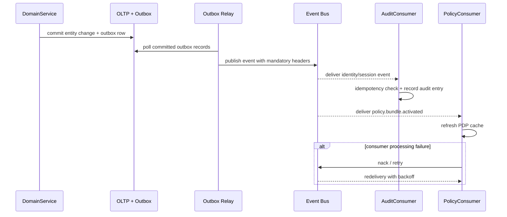

# Event Catalog

This catalog defines production event contracts for the **Identity and Access Management Platform**. It is intended for service developers, integration teams, and audit consumers.

## Contract Conventions
- Event name format: `<domain>.<aggregate>.<action>.v1`.
- Mandatory headers: `event_id`, `event_time`, `correlation_id`, `causation_id`, `tenant_id`, `schema_version`.
- Delivery semantics: at-least-once; all consumers must implement idempotency using `event_id`.
- Ordering guarantee: ordered per partition key (`tenant_id + identity_id` or `tenant_id + session_id`).
- Breaking change policy: major version bump with old topic kept active for the full migration window.

## Domain Events

| Event | Producer | Partition Key | Key Payload Fields | Trigger | Consumers |
|---|---|---|---|---|---|
| `identity.created.v1` | lifecycle-service | `tenant_id+identity_id` | `identity_id`, `type`, `status`, `source_system` | New identity provisioned | Audit, SCIM sync, Entitlement bootstrap |
| `identity.suspended.v1` | lifecycle-service | `tenant_id+identity_id` | `identity_id`, `reason_code`, `actor_id`, `ticket_ref` | Identity suspended | Session killer, Entitlement freeze, Audit |
| `identity.deprovisioned.v1` | lifecycle-service | `tenant_id+identity_id` | `identity_id`, `actor_id`, `offboard_at` | Offboarding completed | Token revocation, Entitlement revoke, Archive |
| `session.started.v1` | auth-service | `tenant_id+session_id` | `session_id`, `identity_id`, `auth_methods`, `device_id` | Successful authentication | Audit, Risk engine, Analytics |
| `session.terminated.v1` | auth-service | `tenant_id+session_id` | `session_id`, `identity_id`, `reason_code` | Logout or forced termination | Token revocation, Audit |
| `token.family.revoked.v1` | token-service | `tenant_id+family_id` | `family_id`, `session_id`, `reason` | Reuse detection or force-revoke | Gateway cache invalidation, Audit |
| `policy.bundle.activated.v1` | policy-admin | `tenant_id+policy_version` | `policy_version`, `bundle_hash`, `activated_by`, `scope` | Policy deployment | PDP cache refresh, Audit |
| `authorization.denied.v1` | pdp | `tenant_id+identity_id` | `identity_id`, `resource`, `action`, `matched_rules`, `decision` | Policy deny verdict | Audit, Anomaly detection |
| `federation.drift.detected.v1` | scim-reconciler | `tenant_id+external_id` | `external_id`, `attribute_diff`, `source_system` | SCIM drift reconciliation | Admin alert, Auto-sync queue |
| `break_glass.grant.issued.v1` | admin-service | `tenant_id+identity_id` | `identity_id`, `resource_scope`, `approvers`, `expiry` | Emergency access granted | Audit, Compliance reporting |

## Publish and Consumption Sequence

## Operational SLOs
- P95 commit-to-publish latency <= 3 seconds for identity lifecycle and session events.
- Token revocation events must propagate to all gateway enforcement caches within 5 seconds P95.
- DLQ acknowledgement within 10 minutes for tier-1 events (revocation, suspension, deprovisioning).
- Monthly schema compatibility review with integration teams and relying party consumers.
- Audit event delivery must be guaranteed with zero tolerance for loss; failed deliveries page on-call.
