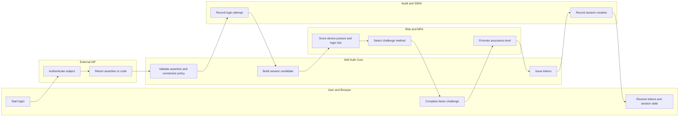
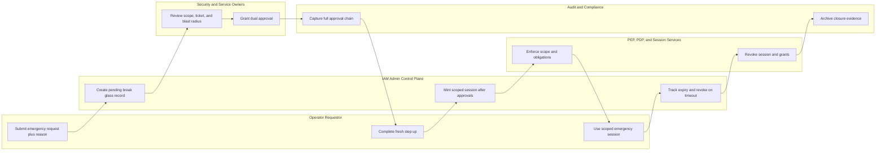

# Swimlane Diagrams

These swimlane views show who owns each cross-system handoff. The emphasis is on
identity-domain race conditions, human approvals, and evidence-producing transitions.

## Federated Login with Adaptive MFA

**Lane ownership**
- The IdP proves primary authentication but does not decide local session state, adaptive MFA, or authorization scope.
- IAM Auth Core owns nonce validation, issuer or audience pinning, JIT provisioning limits, and refresh-family creation.
- Risk and MFA owns challenge method selection, device posture evaluation, and factor replay protection.

## SCIM Drift Reconciliation and Entitlement Repair

```mermaid
flowchart LR
    subgraph Directory["Source Directory or HRIS"]
        D1["Publish user or group delta"]
    end
    subgraph Connector["SCIM and Federation Adapters"]
        C1["Validate schema and source ownership"]
        C2["Store provisioning delta"]
    end
    subgraph Reconciler["Drift and Entitlement Reconciler"]
        R1["Compare current state with authoritative attributes"]
        R2["Detect entitlement conflicts"]
        R3["Prepare auto fix or review item"]
    end
    subgraph Admin["Identity Admin and SecOps"]
        A1["Approve high risk correction"]
        A2["Review residual conflicts"]
    end
    subgraph Runtime["IAM Runtime"]
        I1["Apply corrections and revoke stale grants"]
        I2["Terminate sessions when required"]
        I3["Emit reconciliation proof"]
    end

    D1 --> C1 --> C2 --> R1 --> R2 --> R3
    R3 -->|Low risk| I1 --> I2 --> I3
    R3 -->|High risk| A1 --> A2 --> I1
```

**Lane ownership**
- Connector validation owns schema correctness, idempotency, and source-of-truth tagging before any local mutation occurs.
- The reconciler owns deterministic conflict resolution and escalation routing, not the external directory.
- Admin review is required for manager-chain changes, privileged group removals, or claim mapping changes that would broaden access.

## Break-Glass Approval, Use, and Closure

## RACI Highlights

| Workflow | Responsible | Accountable | Consulted | Informed |
|---|---|---|---|---|
| Federated login assurance | Auth service plus risk engine | IAM product owner | Tenant security admin | End-user support |
| Drift reconciliation | SCIM reconciler | Identity operations lead | Source directory owner | Affected application owners |
| Break-glass activation | Admin control plane plus approvers | Incident commander | Service owner and SecOps | Compliance team |

## Handoff Rules
- Every lane transition carries `tenant_id`, `correlation_id`, subject reference, and actor reference where applicable.
- Human review lanes must record start time, reviewer identity, approval outcome, and timeout path.
- Security-sensitive transitions are incomplete until an immutable audit envelope is written and linked back to the workflow record.
