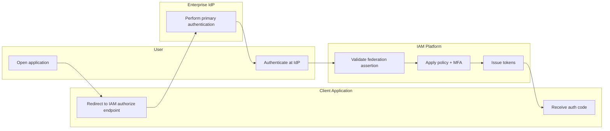
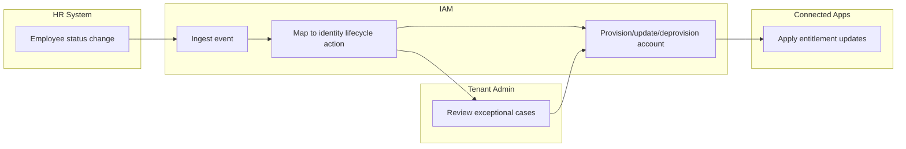

# Swimlane Diagrams

## Federated Sign-in Swimlane

```mermaid
flowchart LR
    subgraph User[User]
      A[Open application]
      B[Authenticate at IdP]
    end

    subgraph App[Client Application]
      C[Redirect to IAM authorize endpoint]
      D[Receive auth code]
    end

    subgraph IAM[IAM Platform]
      E[Validate federation assertion]
      F[Apply policy + MFA]
      G[Issue tokens]
    end

    subgraph IdP[Enterprise IdP]
      H[Perform primary authentication]
    end

    A --> C --> H --> B --> E --> F --> G --> D
```

## Joiner-Mover-Leaver Swimlane

```mermaid
flowchart LR
    subgraph HR[HR System]
      A[Employee status change]
    end

    subgraph IAM[IAM]
      B[Ingest event]
      C[Map to identity lifecycle action]
      D[Provision/update/deprovision account]
    end

    subgraph Admin[Tenant Admin]
      E[Review exceptional cases]
    end

    subgraph Apps[Connected Apps]
      F[Apply entitlement updates]
    end

    A --> B --> C --> D --> F
    C --> E --> D
```
