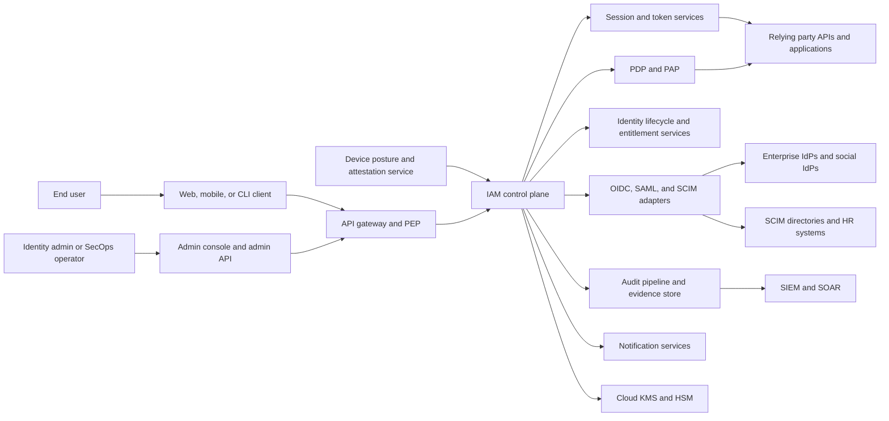

# System Context Diagram

The IAM platform is both an authentication broker and the local authorization authority
for relying-party applications. It consumes federation and provisioning data, issues
tokens, evaluates policy, and proves every high-impact action to auditors.

## Trust Boundaries

| Boundary | Inbound or outbound parties | Controls | Failure stance |
|---|---|---|---|
| Internet ingress | End users, partner apps, admin browsers | WAF, DDoS protection, mTLS where applicable, JWT validation, rate limits, CSRF defenses | Fail closed |
| Federation trust | IAM to OIDC or SAML IdPs | Metadata signature checks, issuer and audience pinning, replay protection, cert overlap windows | Fail closed |
| Provisioning trust | IAM to SCIM directories and HR sources | Source-of-truth matrix, schema validation, idempotency keys, drift detection | Quarantine on ambiguity |
| Cryptographic boundary | IAM to KMS or HSM | Key-usage policies, signing-key version registry, split duties, attested access logs | Refuse issuance on failure |
| Audit boundary | IAM to archive and SIEM | Append-only transport, signed envelopes, WORM retention, chain-hash verification | Buffer briefly, then page |

## External Systems and Contracts
- **Enterprise IdP**: authoritative for primary authentication when a tenant enables federation, but not for local authorization, emergency grants, or local suspension state.
- **SCIM directory or HR system**: authoritative for a subset of identity attributes and baseline group memberships according to tenant mapping policy.
- **Relying-party application**: consumes issued tokens or policy decisions and must honor revocation, token audience, and obligation contracts.
- **Device posture service**: contributes attestation status, OS risk, device management state, and certificate freshness into adaptive MFA and privileged access decisions.
- **SIEM or SOAR**: receives near-real-time events for detection and response, but immutable archive remains the compliance system of record.

## Context Assumptions
- IAM owns session lifecycle, refresh-token family state, policy evaluation, explainability, and entitlement reconciliation.
- Upstream assertions may bootstrap or update identity records, but they never bypass local suspend, break-glass, or deny-policy controls.
- All external dependencies are treated as partially trusted. Compromise or degradation in any dependency must not widen access.
- Admin-facing workflows use the same policy engine and audit pipeline as customer-facing APIs.

## Failure Containment Notes
- If the IdP is down, existing sessions continue until expiry, but new federated logins fail with a tenant-visible degraded-state message.
- If the device posture feed is stale, privileged decisions require a new strong factor and may deny high-risk actions entirely.
- If the KMS or HSM is unavailable, token minting stops, refresh exchange fails closed, and existing tokens remain valid only until normal expiry.
- If the SIEM is unavailable, audit envelopes remain buffered and archived; operators must not disable evidence generation to restore throughput.
