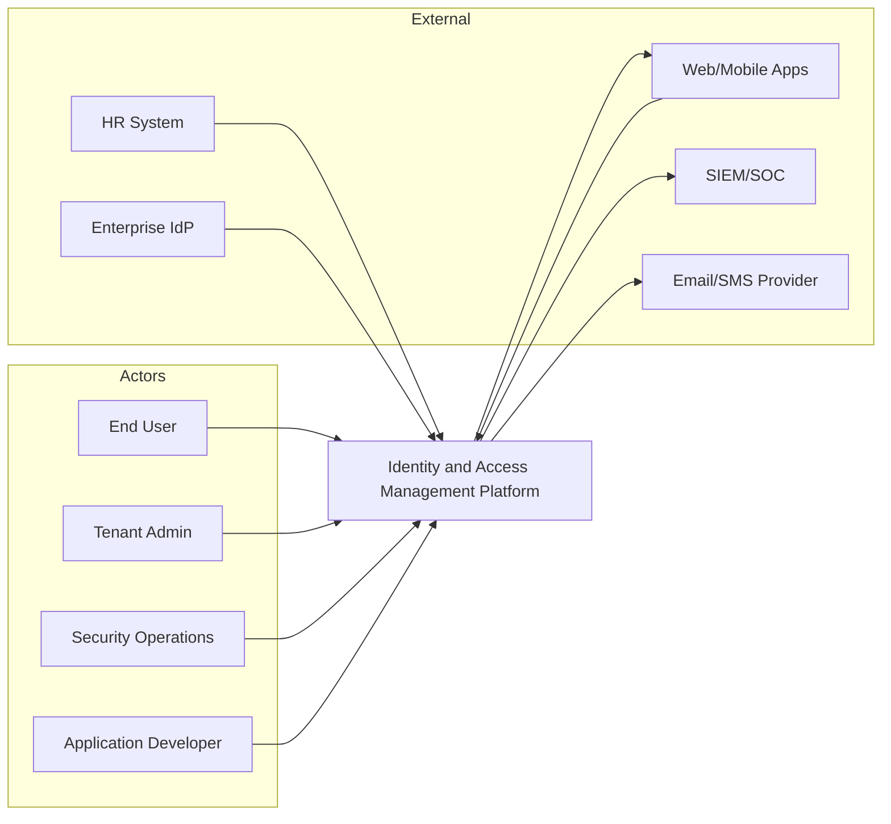

# System Context Diagram

```mermaid
flowchart LR
    subgraph Actors
      EndUser[End User]
      Admin[Tenant Admin]
      SecOps[Security Operations]
      Dev[Application Developer]
    end

    IAM[Identity and Access Management Platform]

    subgraph External
      App1[Web/Mobile Apps]
      HR[HR System]
      SIEM[SIEM/SOC]
      SMS[Email/SMS Provider]
      IdP[Enterprise IdP]
    end

    EndUser --> IAM
    Admin --> IAM
    SecOps --> IAM
    Dev --> IAM

    App1 --> IAM
    IAM --> App1
    HR --> IAM
    IAM --> SIEM
    IAM --> SMS
    IdP --> IAM
```
