# Use Case Diagram — Identity and Access Management Platform

**Document Version:** 1.0
**Status:** Approved
**Last Updated:** 2025-01-15
**Owner:** Platform Architecture Team

---

## 1. Overview

This document describes the complete use-case scope for the IAM Platform. It identifies every actor, every use case, the actor-to-use-case relationships, include/extend associations, and maps each use case to its REST API endpoint. The diagram and tables below are the canonical functional reference for all downstream design artifacts.

---

## 2. Actors

| Actor | Type | Description |
|---|---|---|
| **End User** | Primary Human | An authenticated individual (employee, customer, or contractor) who logs in, completes MFA, and accesses protected resources. |
| **Tenant Admin** | Primary Human | An administrator scoped to one organization who configures federation, policies, SCIM, and manages users/groups within that tenant. |
| **Platform Admin** | Primary Human | A privileged cross-tenant operator who maintains IAM infrastructure, manages service accounts, and handles cross-tenant compliance reporting. |
| **Developer** | Primary Human | An application developer who registers OAuth 2.0 / OIDC clients, manages service accounts, and integrates with IAM APIs. |
| **Security Auditor** | Primary Human | A read-only compliance officer who reviews audit logs and generates regulatory reports (SOC 2, ISO 27001, GDPR). |
| **External IdP** | External System | An external Identity Provider (Azure AD, Okta, Google Workspace) that authenticates users via SAML 2.0 or OIDC and delivers signed signed assertions. |
| **SCIM Directory** | External System | An external directory (Okta, Azure AD, OneLogin) that pushes user lifecycle events to the IAM platform via the SCIM 2.0 protocol. |

---

## 3. Use Case Diagram

```mermaid
flowchart TB
    %% ── Actors ──────────────────────────────────────────────────────────────
    EU(["End User"])
    TA(["Tenant Admin"])
    PA(["Platform Admin"])
    DEV(["Developer"])
    SA(["Security Auditor"])
    EIdP(["External IdP"])
    SCIMDIR(["SCIM Directory"])

    %% ── Authentication & Session Management ─────────────────────────────────
    subgraph AUTH ["Authentication and Session Management"]
        UC01["UC-01: Authenticate with Password"]
        UC02["UC-02: Authenticate via SSO"]
        UC03["UC-03: Enroll MFA Device"]
        UC04["UC-04: Complete MFA Challenge"]
        UC05["UC-05: Refresh Access Token"]
        UC19["UC-19: Revoke Session"]
    end

    %% ── Tenant Administration ────────────────────────────────────────────────
    subgraph ADMGRP ["Tenant Administration"]
        UC06["UC-06: Manage Users"]
        UC07["UC-07: Manage Groups"]
        UC08["UC-08: Assign Roles"]
        UC09["UC-09: Configure SSO Provider"]
        UC10["UC-10: Configure SCIM Directory"]
        UC11["UC-11: Manage Policies"]
        UC20["UC-20: Manage IP Allowlist"]
    end

    %% ── Privileged Access ────────────────────────────────────────────────────
    subgraph PRIV ["Privileged Access"]
        UC12["UC-12: Request Break-Glass Access"]
        UC13["UC-13: Approve Break-Glass Request"]
    end

    %% ── Audit and Compliance ─────────────────────────────────────────────────
    subgraph AUDITGRP ["Audit and Compliance"]
        UC14["UC-14: View Audit Logs"]
        UC15["UC-15: Generate Compliance Report"]
    end

    %% ── Developer Operations ─────────────────────────────────────────────────
    subgraph DEVOPS ["Developer and API Operations"]
        UC16["UC-16: Manage Service Accounts"]
        UC17["UC-17: Register OAuth Client"]
    end

    %% ── Provisioning ─────────────────────────────────────────────────────────
    subgraph PROVGRP ["Provisioning"]
        UC18["UC-18: Provision via SCIM"]
    end

    %% ── End User Relationships ───────────────────────────────────────────────
    EU --> UC01
    EU --> UC02
    EU --> UC03
    EU --> UC04
    EU --> UC05
    EU --> UC19
    EU --> UC12

    %% ── Tenant Admin Relationships ───────────────────────────────────────────
    TA --> UC06
    TA --> UC07
    TA --> UC08
    TA --> UC09
    TA --> UC10
    TA --> UC11
    TA --> UC13
    TA --> UC14
    TA --> UC20

    %% ── Platform Admin Relationships ─────────────────────────────────────────
    PA --> UC06
    PA --> UC08
    PA --> UC11
    PA --> UC13
    PA --> UC14
    PA --> UC15
    PA --> UC16

    %% ── Developer Relationships ──────────────────────────────────────────────
    DEV --> UC17
    DEV --> UC16
    DEV --> UC05

    %% ── Security Auditor Relationships ───────────────────────────────────────
    SA --> UC14
    SA --> UC15

    %% ── External IdP Relationships ───────────────────────────────────────────
    EIdP --> UC02

    %% ── SCIM Directory Relationships ─────────────────────────────────────────
    SCIMDIR --> UC18
```

---

## 4. Include and Extend Relationships

| Base Use Case | Relationship | Referenced Use Case | Condition / Trigger |
|---|---|---|---|
| UC-01 Authenticate with Password | `<<include>>` | UC-04 Complete MFA Challenge | Triggered when tenant MFA policy is **required** or risk score exceeds the configured threshold. |
| UC-02 Authenticate via SSO | `<<include>>` | UC-04 Complete MFA Challenge | Triggered when tenant policy enforces step-up MFA even after a valid external assertion is received. |
| UC-01 Authenticate with Password | `<<extend>>` | UC-03 Enroll MFA Device | Extended when the user has no enrolled MFA device and tenant policy requires MFA — enrollment is forced inline. |
| UC-06 Manage Users | `<<extend>>` | UC-19 Revoke Session | Extended when an admin deactivates or deletes a user — all active sessions are immediately revoked. |
| UC-12 Request Break-Glass Access | `<<include>>` | UC-04 Complete MFA Challenge | Break-glass always requires step-up MFA verification from the requestor before submission. |
| UC-13 Approve Break-Glass Request | `<<extend>>` | UC-14 View Audit Logs | Approval actions are written to the audit trail; approvers may view the log inline. |
| UC-18 Provision via SCIM | `<<include>>` | UC-07 Manage Groups | Group membership changes in the SCIM payload trigger the same group management logic. |
| UC-15 Generate Compliance Report | `<<include>>` | UC-14 View Audit Logs | Compliance reports are generated by querying and aggregating the audit event store. |
| UC-09 Configure SSO Provider | `<<include>>` | UC-11 Manage Policies | Saving an SSO provider configuration binds it to a tenant-level authentication policy automatically. |

---

## 5. Actor Goal Summaries

### 5.1 End User Goals
- Log in securely using username/password or delegated identity via SSO (SAML 2.0 / OIDC).
- Enroll and manage MFA devices (TOTP, WebAuthn/FIDO2, SMS OTP, Email OTP).
- Complete MFA challenges transparently during the authentication flow.
- Obtain short-lived JWT access tokens and long-lived refresh tokens for API access.
- Renew access tokens without re-authentication within the allowed session lifetime.
- Request time-bound emergency privileged access when standard authorization is insufficient.
- Explicitly terminate active sessions (self-service logout or admin-forced logout).

### 5.2 Tenant Admin Goals
- Manage the full user lifecycle (create, read, update, deactivate, delete) within their organization.
- Organize users into groups and assign role bindings at user or group level.
- Configure SAML 2.0 and OIDC federation with external identity providers.
- Configure SCIM 2.0 automatic provisioning and deprovisioning from external directories.
- Define and enforce RBAC / ABAC authorization policies.
- Restrict tenant access to approved IP ranges via IP allowlisting rules.
- Review audit logs scoped to their tenant.
- Approve or deny break-glass access requests from users within their tenant.

### 5.3 Platform Admin Goals
- Manage users, roles, and policies across all tenants.
- Manage service accounts used for machine-to-machine (M2M) authentication.
- Approve emergency break-glass requests.
- Generate and export cross-tenant compliance reports.
- Access the full audit trail across all tenants for security investigations.

### 5.4 Developer Goals
- Register and manage OAuth 2.0 / OIDC client applications (public and confidential clients).
- Manage service accounts and rotate client credentials (client secrets, JWK key pairs).
- Obtain and programmatically refresh access tokens for backend service integrations.

### 5.5 Security Auditor Goals
- Query audit logs using structured filters (time range, actor, event type, resource, outcome).
- Export audit events to external SIEM systems or as downloadable CSV / JSON files.
- Generate framework-specific compliance reports covering SOC 2 Type II, ISO 27001, and GDPR Article 30.

---

## 6. Use Case to REST API Mapping

| Use Case | Method | Endpoint | Required Scope |
|---|---|---|---|
| UC-01 Authenticate with Password | `POST` | `/v1/auth/token` | None |
| UC-02 SSO SAML Initiate | `GET` | `/v1/sso/saml/{provider_id}/init` | None |
| UC-02 SSO SAML ACS | `POST` | `/v1/sso/saml/{provider_id}/acs` | None |
| UC-02 SSO OIDC Authorize | `GET` | `/v1/sso/oidc/{provider_id}/authorize` | None |
| UC-02 SSO OIDC Callback | `GET` | `/v1/sso/oidc/{provider_id}/callback` | None |
| UC-03 Enroll TOTP | `POST` | `/v1/mfa/enroll/totp` | `mfa:enroll` |
| UC-03 Enroll WebAuthn Options | `POST` | `/v1/mfa/enroll/webauthn/options` | `mfa:enroll` |
| UC-03 Enroll WebAuthn Verify | `POST` | `/v1/mfa/enroll/webauthn/verify` | `mfa:enroll` |
| UC-04 Verify TOTP Challenge | `POST` | `/v1/mfa/challenge/totp` | `mfa:challenge` |
| UC-04 Verify WebAuthn Challenge | `POST` | `/v1/mfa/challenge/webauthn` | `mfa:challenge` |
| UC-05 Refresh Access Token | `POST` | `/v1/auth/token/refresh` | None (Refresh Token in body) |
| UC-06 Create User | `POST` | `/v1/tenants/{tid}/users` | `iam:users:write` |
| UC-06 Read User | `GET` | `/v1/tenants/{tid}/users/{uid}` | `iam:users:read` |
| UC-06 Update User | `PATCH` | `/v1/tenants/{tid}/users/{uid}` | `iam:users:write` |
| UC-06 Deactivate User | `POST` | `/v1/tenants/{tid}/users/{uid}/deactivate` | `iam:users:write` |
| UC-06 Delete User | `DELETE` | `/v1/tenants/{tid}/users/{uid}` | `iam:users:delete` |
| UC-07 Create Group | `POST` | `/v1/tenants/{tid}/groups` | `iam:groups:write` |
| UC-07 Update Group Members | `PATCH` | `/v1/tenants/{tid}/groups/{gid}/members` | `iam:groups:write` |
| UC-07 Delete Group | `DELETE` | `/v1/tenants/{tid}/groups/{gid}` | `iam:groups:write` |
| UC-08 Assign Role to User | `POST` | `/v1/tenants/{tid}/users/{uid}/role-assignments` | `iam:roles:assign` |
| UC-08 Assign Role to Group | `POST` | `/v1/tenants/{tid}/groups/{gid}/role-assignments` | `iam:roles:assign` |
| UC-08 Revoke Role Assignment | `DELETE` | `/v1/tenants/{tid}/role-assignments/{rid}` | `iam:roles:assign` |
| UC-09 Create SSO Provider | `POST` | `/v1/tenants/{tid}/sso/providers` | `iam:sso:write` |
| UC-09 Update SSO Provider | `PUT` | `/v1/tenants/{tid}/sso/providers/{pid}` | `iam:sso:write` |
| UC-09 Delete SSO Provider | `DELETE` | `/v1/tenants/{tid}/sso/providers/{pid}` | `iam:sso:write` |
| UC-10 Configure SCIM | `POST` | `/v1/tenants/{tid}/scim/config` | `iam:scim:write` |
| UC-10 Rotate SCIM Token | `POST` | `/v1/tenants/{tid}/scim/config/rotate-token` | `iam:scim:write` |
| UC-11 Create Policy | `POST` | `/v1/tenants/{tid}/policies` | `iam:policies:write` |
| UC-11 Update Policy | `PUT` | `/v1/tenants/{tid}/policies/{pid}` | `iam:policies:write` |
| UC-11 Delete Policy | `DELETE` | `/v1/tenants/{tid}/policies/{pid}` | `iam:policies:write` |
| UC-12 Create Break-Glass Request | `POST` | `/v1/breakglass/requests` | `iam:breakglass:request` |
| UC-12 Get Request Status | `GET` | `/v1/breakglass/requests/{rid}` | `iam:breakglass:request` |
| UC-13 Approve Request | `POST` | `/v1/breakglass/requests/{rid}/approve` | `iam:breakglass:approve` |
| UC-13 Deny Request | `POST` | `/v1/breakglass/requests/{rid}/deny` | `iam:breakglass:approve` |
| UC-14 Query Audit Logs | `GET` | `/v1/tenants/{tid}/audit-logs` | `iam:audit:read` |
| UC-14 Export Audit Logs | `POST` | `/v1/tenants/{tid}/audit-logs/export` | `iam:audit:export` |
| UC-15 Create Report | `POST` | `/v1/tenants/{tid}/reports` | `iam:reports:write` |
| UC-15 Get Report | `GET` | `/v1/tenants/{tid}/reports/{rid}` | `iam:reports:read` |
| UC-15 Download Report | `GET` | `/v1/tenants/{tid}/reports/{rid}/download` | `iam:reports:read` |
| UC-16 Create Service Account | `POST` | `/v1/tenants/{tid}/service-accounts` | `iam:service-accounts:write` |
| UC-16 Rotate SA Credentials | `POST` | `/v1/tenants/{tid}/service-accounts/{sid}/credentials/rotate` | `iam:service-accounts:write` |
| UC-17 Register OAuth Client | `POST` | `/v1/tenants/{tid}/oauth/clients` | `iam:clients:write` |
| UC-17 Update OAuth Client | `PUT` | `/v1/tenants/{tid}/oauth/clients/{cid}` | `iam:clients:write` |
| UC-17 Rotate Client Secret | `POST` | `/v1/tenants/{tid}/oauth/clients/{cid}/secret/rotate` | `iam:clients:write` |
| UC-18 SCIM Create User | `POST` | `/scim/v2/Users` | SCIM Bearer Token |
| UC-18 SCIM Update User | `PUT` | `/scim/v2/Users/{id}` | SCIM Bearer Token |
| UC-18 SCIM Patch User | `PATCH` | `/scim/v2/Users/{id}` | SCIM Bearer Token |
| UC-18 SCIM Delete User | `DELETE` | `/scim/v2/Users/{id}` | SCIM Bearer Token |
| UC-18 SCIM Create Group | `POST` | `/scim/v2/Groups` | SCIM Bearer Token |
| UC-18 SCIM Patch Group | `PATCH` | `/scim/v2/Groups/{id}` | SCIM Bearer Token |
| UC-19 Revoke Current Session | `DELETE` | `/v1/sessions/current` | Bearer Token |
| UC-19 Revoke Session by ID | `DELETE` | `/v1/tenants/{tid}/sessions/{sid}` | `iam:sessions:revoke` |
| UC-19 Revoke All User Sessions | `DELETE` | `/v1/tenants/{tid}/users/{uid}/sessions` | `iam:sessions:revoke` |
| UC-20 Set IP Allowlist | `PUT` | `/v1/tenants/{tid}/ip-allowlist` | `iam:security:write` |
| UC-20 Get IP Allowlist | `GET` | `/v1/tenants/{tid}/ip-allowlist` | `iam:security:read` |

---

## 7. Implementation Priority Matrix

| Use Case | Business Value | Risk | MVP | Phase 2 | Phase 3 |
|---|---|---|---|---|---|
| UC-01 Authenticate with Password | Critical | Low | YES | | |
| UC-02 Authenticate via SSO | High | Medium | YES | | |
| UC-03 Enroll MFA Device | Critical | Medium | YES | | |
| UC-04 Complete MFA Challenge | Critical | Low | YES | | |
| UC-05 Refresh Access Token | High | Low | YES | | |
| UC-06 Manage Users | Critical | Low | YES | | |
| UC-07 Manage Groups | High | Low | YES | | |
| UC-08 Assign Roles | Critical | Medium | YES | | |
| UC-09 Configure SSO Provider | High | High | | YES | |
| UC-10 Configure SCIM Directory | High | High | | YES | |
| UC-11 Manage Policies | Critical | High | | YES | |
| UC-12 Request Break-Glass Access | Medium | High | | | YES |
| UC-13 Approve Break-Glass Request | Medium | High | | | YES |
| UC-14 View Audit Logs | High | Medium | YES | | |
| UC-15 Generate Compliance Report | Medium | Medium | | YES | |
| UC-16 Manage Service Accounts | High | Medium | YES | | |
| UC-17 Register OAuth Client | High | Medium | YES | | |
| UC-18 Provision via SCIM | High | High | | YES | |
| UC-19 Revoke Session | High | Low | YES | | |
| UC-20 Manage IP Allowlist | Medium | Low | | YES | |

---

## 8. Relationship Notes

### UC-01: Authenticate with Password
Users submit a username and password through the login endpoint. The platform retrieves the credential record, verifies the password using Argon2id (or bcrypt for legacy accounts), checks account status (active, locked, suspended), and evaluates the risk engine score derived from device fingerprint, IP reputation, geolocation anomaly, and velocity signals. When tenant policy requires MFA or the risk score exceeds the configured threshold, the flow branches to UC-04. On success the platform issues a signed JWT access token with a 15-minute TTL and a rotating refresh token with a 7-day TTL.

### UC-02: Authenticate via SSO
Supports SP-initiated and IdP-initiated flows for both SAML 2.0 and OIDC. For SAML 2.0, the platform generates a signed `AuthnRequest`, redirects the user to the IdP, receives a `SAMLResponse` at the Assertion Consumer Service (ACS) endpoint, and validates the response (signature, issuer, audience restriction, `NotBefore` and `NotOnOrAfter` timing, `InResponseTo` anti-replay nonce). For OIDC, the platform acts as a Relying Party, initiates an authorization code flow with PKCE (S256), exchanges the code for tokens, and validates the ID token claims (`iss`, `aud`, `exp`, `iat`, `nonce`). Attribute and claim mapping rules translate external identity attributes into local IAM roles and group memberships. JIT provisioning can auto-create local user records on first SSO login.

### UC-03: Enroll MFA Device
Supported authenticator types: TOTP (RFC 6238, 30-second window, HMAC-SHA1, 6 digits), WebAuthn/FIDO2 (attestation formats: packed, tpm, android-key, none; resident keys supported), SMS OTP (6-digit, 10-minute TTL), Email OTP (6-digit, 10-minute TTL). TOTP enrollment delivers a QR code (otpauth URI) and a plaintext base32 secret for manual entry; one successful TOTP verification is required before the device is activated. WebAuthn enrollment follows the W3C WebAuthn Level 2 registration ceremony. Ten single-use backup codes are generated at enrollment time and shown only once.

### UC-09: Configure SSO Provider
Tenant admins upload SAML metadata XML or supply an OIDC Discovery URL (`.well-known/openid-configuration`). The platform extracts and stores the signing certificate(s), entity ID, SSO service URL, and SLO endpoint. For OIDC the platform fetches and caches the JWKS. Attribute mapping rules translate IdP-specific claim names into IAM-standard fields. JIT provisioning settings (auto-create, default role, attribute-driven group assignment) are configured at this step.

### UC-10: Configure SCIM Directory
Tenant admins provide the SCIM 2.0 endpoint URL and a static bearer token issued by the external directory. The platform validates the token format, performs a test `GET /ServiceProviderConfig` request to verify connectivity, and stores the credential encrypted with AES-256-GCM using envelope encryption via the configured KMS. Supported SCIM filter operators: `eq`, `ne`, `co`, `sw`, `gt`, `lt`, `ge`, `le`. The platform advertises its own SCIM capabilities via `GET /scim/v2/ServiceProviderConfig`.

### UC-12 / UC-13: Break-Glass Access
Break-glass is designed for emergency scenarios where normal authorization channels are unavailable or insufficient. The requestor must complete step-up MFA (UC-04) before submitting the request, specifying the target resource, justification, and requested duration. Pre-configured approvers are notified by email and in-app push notification. If no approver responds within the configurable window (default 15 minutes), the request expires. Approved sessions are time-bound (default 4 hours, maximum 8 hours) and are logged with elevated verbosity — every API call within the break-glass session is individually recorded with the associated request ID.

### UC-18: Provision via SCIM
The SCIM directory sends HTTP requests to `/scim/v2/Users` and `/scim/v2/Groups`. The platform enforces RFC 7643 schema validation, uses the `externalId` field as the idempotency key to prevent duplicate records on retry, and checks for email and username conflicts before creating records. On successful provisioning, the platform emits `user.provisioned` or `user.deprovisioned` audit events and invokes configured downstream webhook subscriptions to notify other integrated systems.
