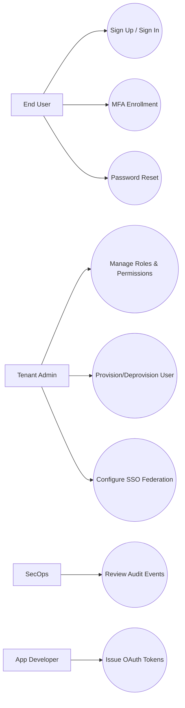

# Use Case Diagram

```mermaid
flowchart LR
    User[End User]
    Admin[Tenant Admin]
    SecOps[SecOps]
    Dev[App Developer]

    UC1((Sign Up / Sign In))
    UC2((MFA Enrollment))
    UC3((Password Reset))
    UC4((Manage Roles & Permissions))
    UC5((Provision/Deprovision User))
    UC6((Issue OAuth Tokens))
    UC7((Review Audit Events))
    UC8((Configure SSO Federation))

    User --> UC1
    User --> UC2
    User --> UC3

    Admin --> UC4
    Admin --> UC5
    Admin --> UC8

    Dev --> UC6
    SecOps --> UC7
```
