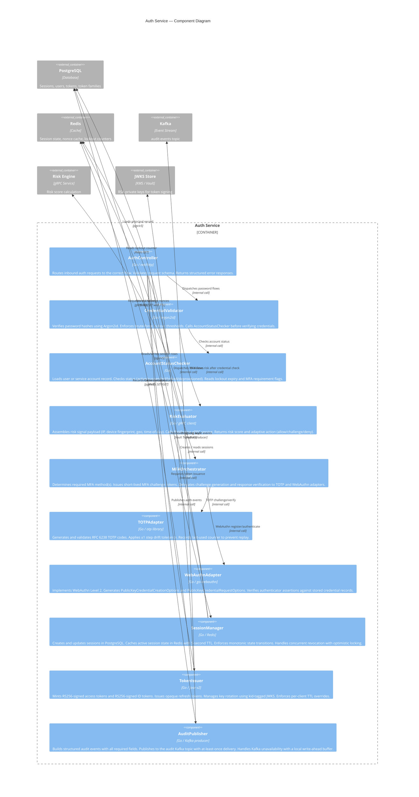
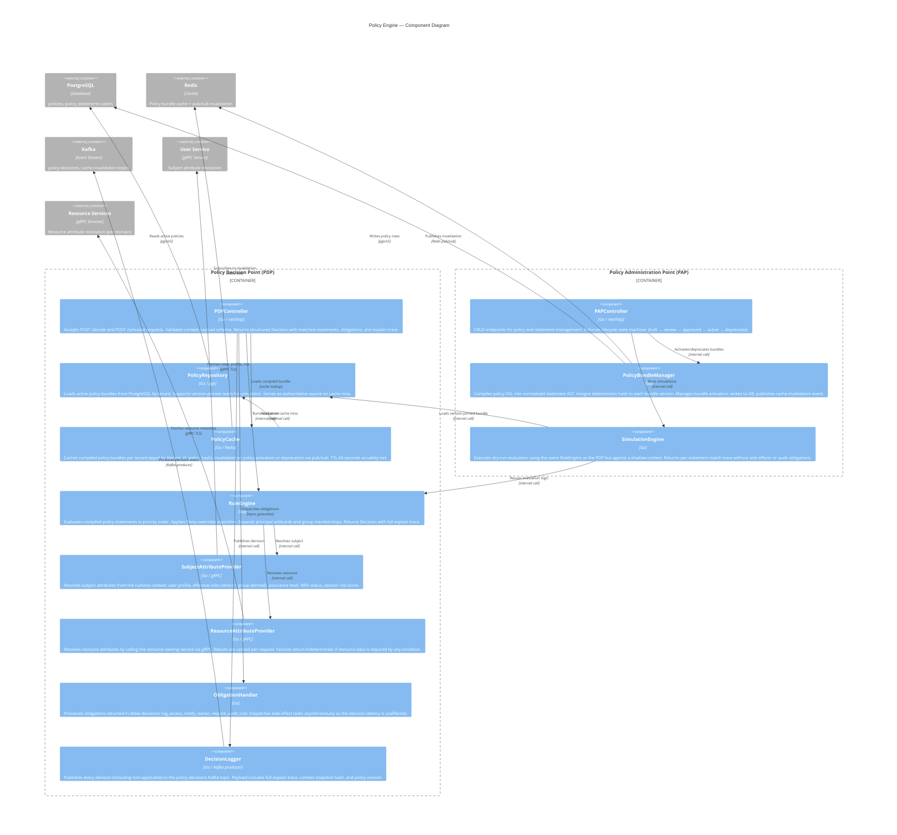

# C4 Component Diagrams

## 1. Auth Service — Level 3 Component Diagram

The Auth Service is the entry point for all authentication flows: password login, OIDC/SAML federation, OAuth 2.0 token exchange, MFA step-up, and session management. It issues and rotates tokens, evaluates risk signals, and publishes every auth decision to the audit stream.

---

## 2. Policy Engine — Level 3 Component Diagram

The Policy Engine provides both a Policy Decision Point (PDP) for real-time authorization and a Policy Administration Point (PAP) for lifecycle management. The PDP is a stateless, hot-path service. The PAP manages the policy lifecycle from draft through activation.

---

## 3. Component Interface Specifications

### 3.1 AuthController

| Attribute | Value |
|---|---|
| **Listens on** | `HTTP :8080` |
| **Input** | JSON request body, `Authorization` header, `X-Request-ID`, `X-Idempotency-Key` |
| **Output** | JSON response (token set, challenge, or error) |
| **Dependencies** | CredentialValidator, MFAOrchestrator, SessionManager, TokenIssuer, AuditPublisher |
| **SLO** | p99 < 300ms for password login, p99 < 150ms for token refresh |

### 3.2 CredentialValidator

| Attribute | Value |
|---|---|
| **Input** | `email`, `password` (plaintext), `tenant_id`, `client_ip` |
| **Output** | `{valid: bool, user_id, lockout_remaining_seconds}` or error |
| **Dependencies** | AccountStatusChecker, RiskEvaluator |
| **Algorithm** | Argon2id with `m=65536, t=3, p=4`; constant-time comparison |
| **Side effects** | Increments `failed_login_count`; sets `locked_until` on threshold breach |

### 3.3 AccountStatusChecker

| Attribute | Value |
|---|---|
| **Input** | `principal_id`, `principal_type`, `tenant_id` |
| **Output** | `{status, mfa_required, locked_until, assurance_level}` or `PrincipalNotFoundError` |
| **Dependencies** | PostgreSQL (read), Redis (lockout counter cache) |
| **Cache TTL** | 5 seconds in Redis; bypassed for step-up and revocation checks |

### 3.4 RiskEvaluator

| Attribute | Value |
|---|---|
| **Input** | `{ip, user_agent, device_fingerprint, geo, user_id, tenant_id}` |
| **Output** | `{score: 0.0–1.0, action: "allow" | "challenge" | "deny", signals: []}` |
| **Dependencies** | Risk Engine gRPC service |
| **Timeout** | 200ms; on timeout returns `{score: 0.5, action: "challenge"}` (fail-safe) |

### 3.5 MFAOrchestrator

| Attribute | Value |
|---|---|
| **Input** | `{user_id, tenant_id, method, stage: "begin" | "verify", payload}` |
| **Output** | `{challenge_id, method, expires_in}` on begin; `{verified: bool}` on verify |
| **Dependencies** | TOTPAdapter, WebAuthnAdapter, Redis (nonce store) |
| **Challenge TTL** | 300 seconds stored in Redis with automatic expiry |

### 3.6 SessionManager

| Attribute | Value |
|---|---|
| **Input** | `{principal_id, principal_type, tenant_id, auth_method, assurance_level, ip, user_agent, device_fingerprint, risk_signals}` |
| **Output** | `Session` object with `session_id`, `token_family_id`, `expires_at` |
| **Dependencies** | PostgreSQL (write), Redis (session cache) |
| **Consistency** | PostgreSQL is source of truth; Redis cache is write-through with 5-second TTL |
| **Revocation SLA** | Session state change propagates to Redis within 5 seconds P95 |

### 3.7 TokenIssuer

| Attribute | Value |
|---|---|
| **Input** | `{session_id, principal, tenant_id, scopes, audience, client_id, token_types}` |
| **Output** | `{access_token, refresh_token, id_token, expires_in}` |
| **Dependencies** | JWKS Store (Vault Transit), PostgreSQL (token metadata) |
| **Key rotation** | `kid` rotates every 30 days; two keys active during overlap window |
| **Access token TTL** | 600 seconds (default); configurable per OAuth client |

### 3.8 AuditPublisher

| Attribute | Value |
|---|---|
| **Input** | `AuditEvent` struct (all required fields must be populated before publish) |
| **Output** | `{event_id, offset}` on success |
| **Dependencies** | Kafka producer (topic: `audit-events`) |
| **Delivery guarantee** | At-least-once via Kafka producer `acks=all` |
| **Fallback** | On Kafka unavailability: writes to PostgreSQL write-ahead buffer table; drained by background job |

### 3.9 PDPController

| Attribute | Value |
|---|---|
| **Listens on** | `HTTP :8081` (internal), `gRPC :9090` |
| **Input** | `{subject, action, resource, environment}` context |
| **Output** | `{decision, matched_statements, obligations, explain_trace, evaluation_time_ms}` |
| **SLO** | p99 < 20ms for cached policy bundles; p99 < 50ms with cache miss |

### 3.10 PolicyBundleManager

| Attribute | Value |
|---|---|
| **Input** | Policy document (DSL JSON); target status transition |
| **Output** | `{bundle_hash, version, activated_at}` |
| **Dependencies** | PostgreSQL (policy writes), Redis (pub/sub invalidation) |
| **Invariant** | Only one bundle version per tenant can have `status = 'active'` at a time |

### 3.11 SimulationEngine

| Attribute | Value |
|---|---|
| **Input** | `{policy_id, version, subject_context, action, resource_context, environment}` |
| **Output** | Per-statement match trace; final decision; no side effects emitted |
| **Dependencies** | PolicyRepository (version-pinned read), RuleEngine |
| **Isolation** | Runs in a read-only transaction; cannot trigger ObligationHandler or DecisionLogger |

---

## 4. Technology Choices

### Auth Service

| Component | Technology | Justification |
|---|---|---|
| HTTP framework | `net/http` + `chi` router | Minimal allocations on hot path; no reflection-based routing overhead |
| Password hashing | `argon2id` via `golang.org/x/crypto` | OWASP-recommended; tunable memory/time parameters; side-channel resistant |
| JWT signing | `github.com/go-jose/go-jose/v3` | RFC 7515/7519 compliant; explicit algorithm selection prevents `alg:none` attacks |
| WebAuthn | `github.com/go-webauthn/webauthn` | WebAuthn Level 2 spec compliance; maintained by the Go security community |
| Session cache | Redis 7 (Sentinel) | Sub-millisecond reads; TTL-based expiry; Lua scripting for atomic revocation |
| Database driver | `github.com/jackc/pgx/v5` | Prepared statement caching; binary protocol; context-based cancellation |
| Kafka producer | `github.com/segmentio/kafka-go` | Pure-Go; supports `acks=all` with configurable retry; no CGo dependency |

### Policy Engine

| Component | Technology | Justification |
|---|---|---|
| HTTP/gRPC | `net/http` + `google.golang.org/grpc` | gRPC for internal service mesh (low latency, typed contracts); HTTP for external REST API |
| Policy cache | Redis 7 (Cluster) | Policy bundles are read-heavy and ~10–50 KB per tenant; Redis fits the working set entirely in memory |
| Cache invalidation | Redis Pub/Sub | Low-latency fan-out to all PDP replicas on policy activation without polling |
| Rule evaluation | Custom AST evaluator (Go) | Deterministic; no dynamic dispatch; allows precompiled condition indexes; fully testable |
| Obligation dispatch | Go channels + worker pool | Obligations are fire-and-forget; decoupled from decision latency via buffered channel |
