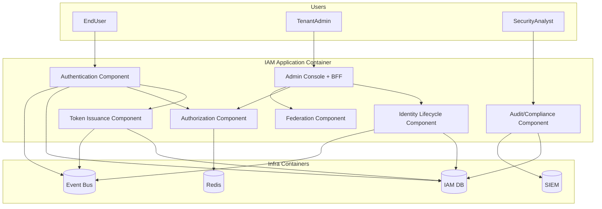

# C4 Component Diagram

```mermaid
flowchart TB
    subgraph Users
      EndUser
      TenantAdmin
      SecurityAnalyst
    end

    subgraph IAM[IAM Application Container]
      UIBFF[Admin Console + BFF]
      AuthCmp[Authentication Component]
      AuthzCmp[Authorization Component]
      IdentityCmp[Identity Lifecycle Component]
      TokenCmp[Token Issuance Component]
      FederationCmp[Federation Component]
      AuditCmp[Audit/Compliance Component]
    end

    subgraph Infra[Infra Containers]
      OLTP[(IAM DB)]
      Cache[(Redis)]
      Bus[(Event Bus)]
      SIEM[(SIEM)]
    end

    EndUser --> AuthCmp
    TenantAdmin --> UIBFF
    SecurityAnalyst --> AuditCmp

    UIBFF --> IdentityCmp
    UIBFF --> AuthzCmp
    UIBFF --> FederationCmp

    AuthCmp --> TokenCmp
    AuthCmp --> AuthzCmp

    IdentityCmp --> OLTP
    AuthCmp --> OLTP
    TokenCmp --> OLTP
    AuthzCmp --> Cache

    IdentityCmp --> Bus
    AuthCmp --> Bus
    TokenCmp --> Bus

    AuditCmp --> OLTP
    AuditCmp --> SIEM
```
