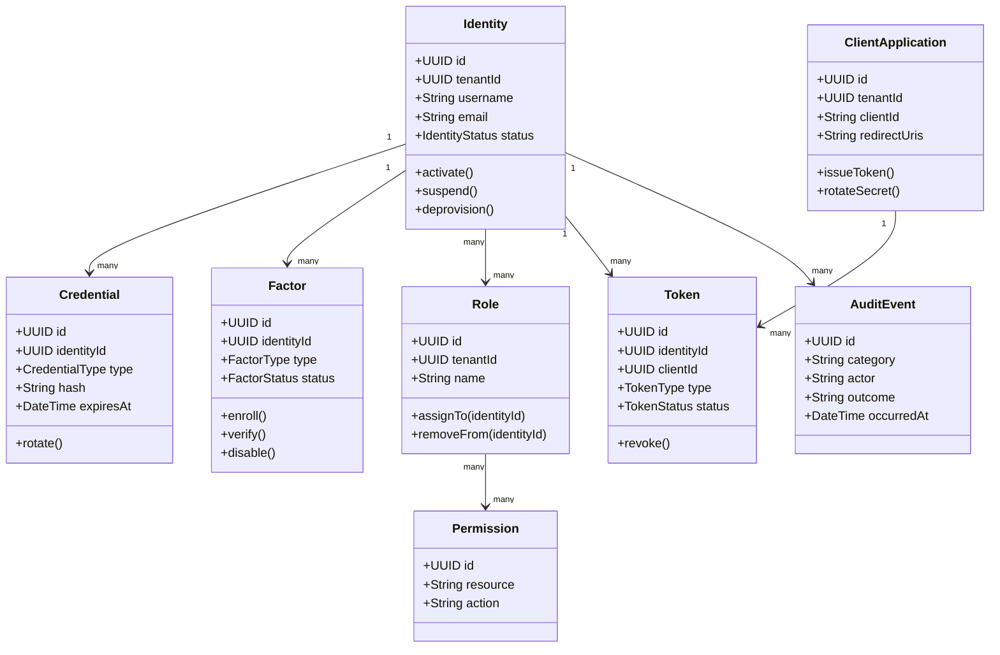

# Class Diagrams

```mermaid
classDiagram
    class Identity {
      +UUID id
      +UUID tenantId
      +String username
      +String email
      +IdentityStatus status
      +activate()
      +suspend()
      +deprovision()
    }

    class Credential {
      +UUID id
      +UUID identityId
      +CredentialType type
      +String hash
      +DateTime expiresAt
      +rotate()
    }

    class Factor {
      +UUID id
      +UUID identityId
      +FactorType type
      +FactorStatus status
      +enroll()
      +verify()
      +disable()
    }

    class Role {
      +UUID id
      +UUID tenantId
      +String name
      +assignTo(identityId)
      +removeFrom(identityId)
    }

    class Permission {
      +UUID id
      +String resource
      +String action
    }

    class ClientApplication {
      +UUID id
      +UUID tenantId
      +String clientId
      +String redirectUris
      +issueToken()
      +rotateSecret()
    }

    class Token {
      +UUID id
      +UUID identityId
      +UUID clientId
      +TokenType type
      +TokenStatus status
      +revoke()
    }

    class AuditEvent {
      +UUID id
      +String category
      +String actor
      +String outcome
      +DateTime occurredAt
    }

    Identity "1" --> "many" Credential
    Identity "1" --> "many" Factor
    Identity "many" --> "many" Role
    Role "many" --> "many" Permission
    ClientApplication "1" --> "many" Token
    Identity "1" --> "many" Token
    Identity "1" --> "many" AuditEvent
```
