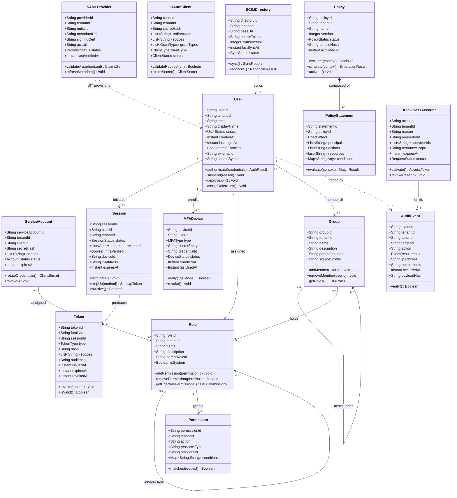

# Class Diagrams — Identity and Access Management Platform

This document defines the canonical object model for the IAM Platform. Each class maps
to a DDD aggregate root or entity within a bounded context. Relationships drive
persistence topology, event contracts, and API surface shapes.

---

## 1. Core Class Diagram



---

## 2. Enumeration Types

| Enumeration | Values |
|---|---|
| `UserStatus` | `INVITED`, `PENDING_MFA`, `ACTIVE`, `LOCKED_OUT`, `SUSPENDED`, `PENDING_DEPROVISION`, `DEPROVISIONED`, `ARCHIVED` |
| `SessionStatus` | `INITIATING`, `ACTIVE`, `STEP_UP_REQUIRED`, `STEP_UP_IN_PROGRESS`, `EXPIRED`, `TERMINATED`, `REVOKED` |
| `TokenType` | `ACCESS`, `REFRESH`, `STEP_UP`, `BREAK_GLASS` |
| `MFAType` | `TOTP`, `WEBAUTHN`, `PUSH`, `SMS`, `RECOVERY_CODE` |
| `Effect` | `PERMIT`, `DENY` |
| `PolicyStatus` | `DRAFT`, `ACTIVE`, `DEPRECATED` |
| `ClientType` | `CONFIDENTIAL`, `PUBLIC` |
| `GrantType` | `AUTHORIZATION_CODE`, `CLIENT_CREDENTIALS`, `REFRESH_TOKEN`, `DEVICE_CODE` |
| `DeviceStatus` | `PENDING`, `ACTIVE`, `REVOKED` |
| `RequestStatus` | `REQUESTED`, `PENDING_APPROVAL`, `APPROVED`, `ACTIVE`, `EXPIRED`, `REVOKED`, `COMPLETED` |
| `AccountStatus` | `ACTIVE`, `SUSPENDED`, `EXPIRED`, `REVOKED` |
| `SyncStatus` | `IDLE`, `RUNNING`, `FAILED`, `PARTIAL` |

---

## 3. Class Responsibility Matrix

| Class | Bounded Context | Persistence Store | Primary Events Produced |
|---|---|---|---|
| `User` | Identity | PostgreSQL `users` | `UserCreated`, `UserSuspended`, `UserDeprovisioned` |
| `ServiceAccount` | Identity | PostgreSQL `service_accounts` | `ServiceAccountCreated`, `CredentialsRotated` |
| `Role` | Authorization | PostgreSQL `roles` | `RoleCreated`, `RoleAssigned`, `RoleRevoked` |
| `Permission` | Authorization | PostgreSQL `permissions` | `PermissionGranted`, `PermissionRevoked` |
| `Policy` | Policy Engine | PostgreSQL `policies` + Redis cache | `PolicyActivated`, `PolicyDeprecated` |
| `PolicyStatement` | Policy Engine | PostgreSQL `policy_statements` | _(part of Policy aggregate — no independent events)_ |
| `Group` | Identity | PostgreSQL `groups` | `GroupCreated`, `MemberAdded`, `MemberRemoved` |
| `Session` | Auth | Redis `sessions:{id}` + PostgreSQL shadow | `SessionCreated`, `SessionTerminated`, `StepUpCompleted` |
| `Token` | Auth | PostgreSQL `tokens` + Redis deny-list | `TokenIssued`, `TokenRevoked`, `TokenFamilyRevoked` |
| `MFADevice` | Auth / MFA | PostgreSQL `mfa_devices` | `MFAEnrolled`, `MFAChallengeSucceeded`, `MFAChallengeFailed` |
| `OAuthClient` | Federation | PostgreSQL `oauth_clients` | `ClientRegistered`, `ClientSecretRotated` |
| `SAMLProvider` | Federation | PostgreSQL `saml_providers` | `FederationAssertionAccepted`, `MetadataRefreshed` |
| `SCIMDirectory` | Provisioning | PostgreSQL `scim_directories` | `SyncCompleted`, `DriftDetected`, `ReconcileApplied` |
| `AuditEvent` | Audit | ClickHouse `audit_events` + S3 Parquet | _(terminal — append-only, no downstream events)_ |
| `BreakGlassAccount` | Emergency Access | PostgreSQL `break_glass_requests` | `BreakGlassActivated`, `BreakGlassRevoked` |

---

## 4. Aggregate Boundaries

```
┌──────────────────────────────────────────────────────────┐
│  Identity Aggregate                                        │
│  Root    : User                                           │
│  Entities: MFADevice                                      │
│  Refs    : Session (by ID only — Session is own root)     │
│  Value Objects: Email, ExternalId, DisplayName            │
└──────────────────────────────────────────────────────────┘

┌──────────────────────────────────────────────────────────┐
│  Authorization Aggregate                                   │
│  Root    : Role                                           │
│  Entities: Permission                                     │
│  Value Objects: Action, ResourceType, ConditionExpression │
└──────────────────────────────────────────────────────────┘

┌──────────────────────────────────────────────────────────┐
│  Policy Aggregate                                          │
│  Root    : Policy                                         │
│  Entities: PolicyStatement                                │
│  Value Objects: Effect, Principal, ConditionSet           │
└──────────────────────────────────────────────────────────┘

┌──────────────────────────────────────────────────────────┐
│  Auth Aggregate                                            │
│  Root    : Session                                        │
│  Entities: Token (grouped by familyId)                    │
│  Value Objects: AuthMethod, DeviceFingerprint             │
└──────────────────────────────────────────────────────────┘

┌──────────────────────────────────────────────────────────┐
│  Federation Aggregate                                      │
│  Roots   : OAuthClient, SAMLProvider (separate roots)     │
│  Entities: JITProvisionedUser (transient, write-through)  │
│  Value Objects: ClaimsSet, RedirectUri, Scope, GrantType  │
└──────────────────────────────────────────────────────────┘

┌──────────────────────────────────────────────────────────┐
│  Emergency Access Aggregate                                │
│  Root    : BreakGlassAccount                              │
│  Refs    : User (requestorId, approverIds — by ID)        │
│  Value Objects: ResourceScope, ApprovalRecord             │
└──────────────────────────────────────────────────────────┘
```

---

## 5. Key Design Decisions

### 5.1 Separate Roots for User and ServiceAccount

`User` and `ServiceAccount` are distinct aggregate roots rather than subtypes of a common
`Principal` base class. Both implement a `Principal` marker interface consumed by the
Policy Engine, but they carry different lifecycle rules, credential models, and audit
obligations. Using composition over inheritance prevents the fragile base-class problem
when one type evolves independently (e.g., `ServiceAccount` gaining workload-identity
federation via SPIFFE/SVID).

### 5.2 Token Family Model for Refresh Rotation

`Token` carries a `familyId` that links all refresh-token rotations for a single session
grant. When a previously-issued (superseded) refresh token is re-presented — indicating
token theft — the entire family is revoked atomically. The family record is stored in
PostgreSQL; all members are fetched and revoked in a single serialisable transaction,
then a `TokenFamilyRevoked` event is published to Kafka for cache invalidation within
the 5-second SLA.

### 5.3 Policy as a Versioned, Immutable Aggregate

`Policy` is versioned: each structural edit increments `version` and creates a new
database row. Only one version per `policyId` may hold `status = ACTIVE`. Activation
is an explicit domain operation that sets `activatedAt`, computes `bundleHash`
(SHA-256 of canonicalised JSON), and publishes `PolicyActivated`. The PDP caches
bundles keyed by `(tenantId, bundleHash)` and skips re-loading when the hash matches.

### 5.4 Entity Identity for Permission

`Permission` is modelled as an entity with a stable `permissionId` rather than an
embedded value object in `Role`. This supports fine-grained audit trails (which
permission was added, by whom, when), cross-role permission sharing, and independent
condition updates. The `conditions` map within a `Permission` is a value object because
condition entries carry no identity of their own.

### 5.5 Session Primary in Redis, Shadow in PostgreSQL

`Session` is stored in Redis with a TTL equal to `expiresAt − now`, yielding
sub-millisecond lookups on the authentication hot path. A shadow row in PostgreSQL
captures `sessionId`, `userId`, `tenantId`, `createdAt`, `terminatedAt`, and
`terminationReason` for audit queries and SIEM correlation. The shadow row is written
asynchronously and is never read on the request path.

### 5.6 SCIMDirectory Bearer Token via Vault Reference

`SCIMDirectory.bearerToken` stores a Vault key reference
(`kms://tenants/{tenantId}/scim/{directoryId}`) rather than the encrypted token bytes.
The plain-text bearer token is resolved from Vault at runtime, injected into the HTTP
client for the duration of the sync operation, and never written to application logs or
database fields. This isolates secret material to Vault's audit log exclusively.

### 5.7 AuditEvent Immutability and Tamper Detection

`AuditEvent` is append-only: no update or delete paths exist in the repository
interface. `payloadHash` is an HMAC-SHA256 of the serialised event body keyed with a
per-tenant audit signing key managed in Vault. `verify()` recomputes the HMAC and
returns `false` if it differs from the stored hash, enabling tamper detection during
compliance exports. Events are written to ClickHouse and mirrored to S3 Parquet
partitioned by `(tenantId, year, month)`.

### 5.8 Break-Glass Dual-Approval Invariant

`BreakGlassAccount.approverIds` must contain at least two distinct approver identities
from different organisational units before `activate()` may execute. This invariant is
enforced inside the aggregate root method — not at the application layer — to prevent
bypass through direct repository writes or race conditions in concurrent approval flows.
`activate()` raises `InsufficientApprovalException` if the constraint is unmet.

### 5.9 Role Hierarchy Cycle Prevention

`Role.parentRoleId` enables hierarchical RBAC. `getEffectivePermissions()` performs a
depth-first traversal with a visited-set guard to detect and break cycles. The maximum
depth is capped at 10 levels; traversals exceeding this limit raise
`RoleHierarchyDepthExceededException` and are surfaced as a configuration validation
error in the PAP.

### 5.10 Group Nested Membership Expansion

`Group` supports a `parentGroupId` for nested membership. The `EntitlementEvaluator`
expands all transitive group memberships using a memoised BFS before role resolution.
Expansion results are cached per `(userId, tenantId)` in Redis with a 60-second TTL,
invalidated on `MemberAdded`, `MemberRemoved`, or `RoleAssigned` events.
