# Component Diagrams — Identity and Access Management Platform

This document defines the internal component structure of the IAM Platform, the
interfaces between components, and the data-store ownership rules for each module.

---

## 1. System Component Diagram

```mermaid
flowchart TD
    %% ── External Actors ──────────────────────────────────────────────
    ExtClient(["Client Application\n(Web / Mobile / M2M)"]):::external
    ExtIdP(["External IdP\n(SAML / OIDC)"]):::external
    ExtSCIM(["SCIM Client\n(HR System / AD)"]):::external
    ExtVault(["HashiCorp Vault\n(KMS)"]):::external
    ExtKafka(["Apache Kafka\n(Event Bus)"]):::external

    %% ── IAM Platform Boundary ────────────────────────────────────────
    subgraph IAM["IAM Platform"]

        subgraph GW["API Gateway / PEP Layer"]
            GatewayPEP["GatewayPEP\n(Policy Enforcement Point)"]
            RateLimiter["RateLimiter"]
            TLSTerminator["TLS Terminator"]
        end

        subgraph AuthSvc["Auth Service"]
            AC["AuthController"]
            CV["CredentialValidator"]
            SM["SessionManager"]
            RE["RiskEvaluator"]
        end

        subgraph TokenSvc["Token Service"]
            TI["TokenIssuer"]
            TR["TokenRotator"]
            TRev["TokenRevoker"]
            FT["FamilyTracker"]
        end

        subgraph PolicyEng["Policy Engine"]
            PDP["PDP\n(PolicyDecisionPoint)"]
            PAP["PAP\n(PolicyAdminPoint)"]
            RuleEng["RuleEngine"]
            PR["PolicyRepository"]
            PC["PolicyCache\n(Redis)"]
        end

        subgraph MFASvc["MFA Service"]
            MFAOrch["MFAOrchestrator"]
            TOTP["TOTPProvider"]
            WAN["WebAuthnProvider"]
            PUSH["PushProvider"]
        end

        subgraph UserSvc["User Service"]
            UR["UserRepository"]
            GM["GroupManager"]
            RM["RoleManager"]
            EE["EntitlementEvaluator"]
        end

        subgraph SCIMSvc["SCIM Service"]
            SCIMAdapt["SCIMAdapter"]
            SchM["SchemaMapper"]
            DR["DriftReconciler"]
            CR["ConflictResolver"]
        end

        subgraph FedSvc["Federation Service"]
            SAMLP["SAMLProcessor"]
            OIDCV["OIDCValidator"]
            CM["ClaimMapper"]
            JITP["JITProvisioner"]
        end

        subgraph AuditSvc["Audit Service"]
            AW["AuditWriter"]
            EA["EventAggregator"]
            RetM["RetentionManager"]
            ExSvc["ExportService"]
        end

        subgraph KMSvc["Key Management"]
            VC["VaultClient"]
            KRS["KeyRotationScheduler"]
            SKP["SigningKeyProvider"]
        end

    end

    %% ── Data Stores ──────────────────────────────────────────────────
    PGMain[("PostgreSQL\n(Primary)")]:::store
    Redis[("Redis\n(Session / Cache)")]:::store
    ClickHouse[("ClickHouse\n(Audit)")]:::store
    S3[("S3\n(Archive)")]:::store

    %% ── External entry points ────────────────────────────────────────
    ExtClient --> TLSTerminator
    TLSTerminator --> RateLimiter
    RateLimiter --> GatewayPEP
    ExtIdP --> SAMLP
    ExtIdP --> OIDCV
    ExtSCIM --> SCIMAdapt

    %% ── Gateway → Auth ───────────────────────────────────────────────
    GatewayPEP --> AC
    GatewayPEP --> PDP

    %% ── Auth Service internal ─────────────────────────────────────────
    AC --> CV
    AC --> SM
    AC --> RE
    AC --> MFAOrch
    AC --> TI
    SM --> TR
    SM --> TRev

    %% ── Auth → Policy ────────────────────────────────────────────────
    AC --> PDP

    %% ── Auth → User ──────────────────────────────────────────────────
    CV --> UR
    SM --> UR

    %% ── Token Service internal ───────────────────────────────────────
    TI --> FT
    TR --> FT
    TRev --> FT

    %% ── Token → Key Management ───────────────────────────────────────
    TI --> SKP
    TR --> SKP

    %% ── Policy Engine internal ───────────────────────────────────────
    PDP --> RuleEng
    PDP --> PC
    PDP --> PR
    PAP --> PR

    %% ── Policy → User (attribute fetch) ─────────────────────────────
    PDP --> EE
    EE --> RM
    EE --> GM

    %% ── MFA Service internal ─────────────────────────────────────────
    MFAOrch --> TOTP
    MFAOrch --> WAN
    MFAOrch --> PUSH

    %% ── MFA → Key Management (TOTP secret decrypt) ───────────────────
    TOTP --> VC
    WAN --> SKP

    %% ── User Service internal ────────────────────────────────────────
    UR --> GM
    GM --> RM

    %% ── Federation Service internal ──────────────────────────────────
    SAMLP --> CM
    OIDCV --> CM
    CM --> JITP
    JITP --> UR

    %% ── SCIM Service internal ────────────────────────────────────────
    SCIMAdapt --> SchM
    SchM --> DR
    DR --> CR
    SCIMAdapt --> UR

    %% ── Audit (write paths) ──────────────────────────────────────────
    AC --> AW
    MFAOrch --> AW
    TRev --> AW
    SAMLP --> AW
    OIDCV --> AW
    PAP --> AW
    SCIMAdapt --> AW

    %% ── Audit Service internal ───────────────────────────────────────
    AW --> EA
    EA --> RetM
    RetM --> ExSvc

    %% ── Key Management → Vault ───────────────────────────────────────
    VC --> ExtVault
    KRS --> VC
    SKP --> VC

    %% ── Event Bus ────────────────────────────────────────────────────
    TRev --> ExtKafka
    AW --> ExtKafka
    GatewayPEP --> ExtKafka

    %% ── Data Store bindings ──────────────────────────────────────────
    UR --> PGMain
    RM --> PGMain
    GM --> PGMain
    PR --> PGMain
    FT --> PGMain
    SAMLP --> PGMain
    SCIMAdapt --> PGMain

    SM --> Redis
    PC --> Redis
    FT --> Redis

    EA --> ClickHouse
    RetM --> ClickHouse
    ExSvc --> S3
    RetM --> S3

    %% ── Styles ───────────────────────────────────────────────────────
    classDef external fill:#dbeafe,stroke:#2563eb,stroke-dasharray:5 5
    classDef store fill:#fef9c3,stroke:#ca8a04
```



---

## 2. Component Responsibility Table

| Component | Module | Primary Responsibility | Interface Exposed | Key Dependencies |
|---|---|---|---|---|
| `GatewayPEP` | API Gateway | Enforce access decisions; forward bearer tokens; rate-gate requests | HTTP reverse proxy; Kafka consumer (`iam.token.revoked`) | `PDPService`, `TokenService` |
| `RateLimiter` | API Gateway | Token-bucket rate limiting per client IP + tenant | In-process filter | Redis (sliding window counters) |
| `AuthController` | Auth Service | Handle `/auth/*` routes; orchestrate credential + MFA + session flow | REST (inbound) | `CredentialValidator`, `SessionManager`, `MFAOrchestrator`, `PDPService`, `AuditWriter` |
| `CredentialValidator` | Auth Service | Validate password (bcrypt), API key (HMAC), or certificate | Internal | `UserRepository` |
| `SessionManager` | Auth Service | Create, update, expire, terminate sessions; issue restricted pre-auth tokens | Internal | `TokenIssuer`, `TokenRotator`, `UserRepository`, Redis |
| `RiskEvaluator` | Auth Service | Score login context (IP reputation, device trust, velocity) | Internal | Redis (velocity counters), external threat-intel (async) |
| `TokenIssuer` | Token Service | Sign and persist access + refresh token pairs | Internal | `FamilyTracker`, `SigningKeyProvider`, PostgreSQL |
| `TokenRotator` | Token Service | Validate + rotate refresh tokens; detect reuse | Internal | `FamilyTracker`, `TokenRevoker`, Redis |
| `TokenRevoker` | Token Service | Revoke individual tokens or entire families | Internal | `FamilyTracker`, Redis, KafkaProducer |
| `FamilyTracker` | Token Service | Maintain token family membership; reuse detection | Internal | PostgreSQL (`tokens`), Redis (deny-list) |
| `PDPService` | Policy Engine | Evaluate `EvaluationRequest`; return `Decision` with obligations | gRPC (internal), REST (admin) | `PolicyCache`, `PolicyRepository`, `RuleEngine`, `EntitlementEvaluator`, `DecisionLogger` |
| `PAP` | Policy Engine | Administer policy CRUD; validate + activate policy versions | REST (admin) | `PolicyRepository`, `AuditWriter` |
| `RuleEngine` | Policy Engine | Iterate policy statements; evaluate conditions; apply precedence | Internal (library) | None (pure computation) |
| `PolicyRepository` | Policy Engine | Persist and retrieve `Policy` + `PolicyStatement` records | Internal | PostgreSQL (`policies`, `policy_statements`) |
| `PolicyCache` | Policy Engine | Cache active policy bundles keyed by `(tenantId, bundleHash)` | Internal | Redis |
| `MFAOrchestrator` | MFA Service | Route MFA verification/enrollment to correct provider; track fail counts | Internal | `TOTPProvider`, `WebAuthnProvider`, `PushProvider`, `MFADeviceRepository`, `AuditWriter` |
| `TOTPProvider` | MFA Service | Generate and verify TOTP codes; replay detection | Internal | `VaultClient` (secret decryption), Redis (replay cache) |
| `WebAuthnProvider` | MFA Service | Manage WebAuthn registration and assertion flows | Internal | `ChallengeStore` (Redis), `MFADeviceRepository`, `SigningKeyProvider` |
| `PushProvider` | MFA Service | Send push challenges; poll for approval | Internal | External push gateway (async) |
| `UserRepository` | User Service | CRUD for `User` and `ServiceAccount` aggregates | Internal | PostgreSQL (`users`, `service_accounts`) |
| `GroupManager` | User Service | Manage group membership and nesting; expand membership graph | Internal | PostgreSQL (`groups`, `group_members`) |
| `RoleManager` | User Service | Manage role assignment; compute role hierarchy | Internal | PostgreSQL (`roles`, `permissions`, `role_assignments`) |
| `EntitlementEvaluator` | User Service | Compute effective entitlements for a subject (roles + groups + transitive) | Internal | `RoleManager`, `GroupManager`, Redis (entitlement cache) |
| `SCIMAdapter` | SCIM Service | Handle SCIM 2.0 protocol requests; route to provisioning logic | REST (inbound SCIM) | `SchemaMapper`, `UserRepository`, `AuditWriter` |
| `SchemaMapper` | SCIM Service | Map SCIM schema → IAM domain model and vice versa | Internal | None |
| `DriftReconciler` | SCIM Service | Detect drift between SCIM source-of-truth and IAM state | Scheduled job | `UserRepository`, `GroupManager` |
| `ConflictResolver` | SCIM Service | Apply conflict resolution rules when SCIM and local edits collide | Internal | None (rule-based) |
| `SAMLProcessor` | Federation Service | Parse and validate SAML 2.0 assertions; extract claims | REST (inbound ACS) | `SigningKeyProvider`, `ClaimMapper`, `AuditWriter`, PostgreSQL (`saml_providers`) |
| `OIDCValidator` | Federation Service | Validate OIDC ID tokens from external providers | Internal | `SigningKeyProvider` (JWKS), `ClaimMapper`, PostgreSQL (`oauth_clients`) |
| `ClaimMapper` | Federation Service | Transform external claims to IAM subject attributes | Internal | PostgreSQL (claim mapping rules) |
| `JITProvisioner` | Federation Service | Create or update `User` records on first federated login | Internal | `UserRepository`, `RoleManager` |
| `AuditWriter` | Audit Service | Buffer and write `AuditEvent` records; ensure at-least-once delivery | Internal (called by all services) | ClickHouse, Kafka (`iam.audit.events`) |
| `EventAggregator` | Audit Service | Aggregate raw events into summary statistics | Kafka consumer | ClickHouse |
| `RetentionManager` | Audit Service | Enforce per-tenant retention policy; archive and purge expired records | Scheduled job | ClickHouse, S3 |
| `ExportService` | Audit Service | Export audit records in NDJSON or Parquet for SIEM integration | REST (admin) | ClickHouse, S3 |
| `VaultClient` | Key Management | Thin wrapper over Vault HTTP API; caches unwrapped keys in-process for TTL | Internal | HashiCorp Vault |
| `KeyRotationScheduler` | Key Management | Schedule and execute periodic key rotation across all tenants | Scheduled job | `VaultClient` |
| `SigningKeyProvider` | Key Management | Provide active signing keys and JWKS endpoint | Internal + REST (JWKS) | `VaultClient` |

---

## 3. Interface Contracts

### 3.1 PDPService Evaluation Interface

```
Request  : EvaluationRequest
  subject    : { id: string, type: "USER" | "SERVICE_ACCOUNT" | "ANONYMOUS" }
  resource   : { id: string, type: string }
  action     : string                         // e.g. "document:read"
  environment: { ip: string, time: Instant, devicePosture: string? }
  tenantId   : string
  correlationId : string

Response : Decision
  result       : "PERMIT" | "DENY" | "NOT_APPLICABLE" | "INDETERMINATE"
  obligations  : ObligationSet { requireMFAStepUp, logAccess, notifyOwner, dataResidency? }
  matchedRules : string[]                     // statementIds
  denyReason   : string?
  policyVersion: integer
  bundleHash   : string
  evaluationMs : integer
  correlationId: string
```

**Contract guarantees:**
- Synchronous; returns within 25 ms P99.
- `INDETERMINATE` only on internal engine error; consumers must treat as `DENY`.
- `NOT_APPLICABLE` returned only when zero policy statements match; consumers default to `DENY` for write operations.
- `correlationId` propagated unchanged for tracing.

### 3.2 TokenIssuer Interface

```
Request  : TokenRequest
  sessionId  : string
  userId     : string
  tenantId   : string
  scopes     : string[]
  audience   : string
  grantType  : "AUTHORIZATION_CODE" | "CLIENT_CREDENTIALS" | "REFRESH_TOKEN"
  familyId   : string?     // provided for rotation; null for new grants

Response : TokenPair
  accessToken  : SignedJWT
  refreshToken : OpaqueString
  familyId     : string
  expiresIn    : integer   // seconds
  tokenId      : string
```

**Contract guarantees:**
- Atomic: both tokens written to PostgreSQL and Redis in a single transaction before returning.
- `familyId` is stable across all rotations for a single grant.
- Access token claims include `sub`, `iss`, `aud`, `exp`, `iat`, `jti`, `tenant_id`, `scope`.

### 3.3 AuditWriter Interface

```
Request  : AuditEventRecord
  tenantId      : string
  actorId       : string
  actorType     : "USER" | "SERVICE_ACCOUNT" | "SYSTEM"
  targetId      : string?
  targetType    : string?
  action        : string           // e.g. "session.create", "token.revoke"
  result        : "SUCCESS" | "FAILURE" | "PARTIAL"
  ipAddress     : string?
  correlationId : string
  metadata      : Map<string, string>   // action-specific fields; max 20 keys
  occurredAt    : Instant

Response : void  (fire-and-forget from caller's perspective)
```

**Contract guarantees:**
- Non-blocking: caller returns immediately after enqueuing to in-process buffer.
- At-least-once: buffer flushed to ClickHouse every 500 ms or when buffer reaches 500 events.
- DLQ: events that fail ClickHouse write after 3 retries are published to `iam.audit.dlq` Kafka topic.
- `payloadHash` (HMAC-SHA256) computed by `AuditWriter` before write; caller does not compute it.

### 3.4 MFAOrchestrator Interface

```
VerifyRequest:
  userId    : string
  tenantId  : string
  method    : "TOTP" | "WEBAUTHN" | "PUSH" | "RECOVERY_CODE"
  challenge : string   // TOTP code, WebAuthn assertion JSON, push approval token, recovery code

VerifyResponse:
  success      : boolean
  stepUpToken  : SignedJWT?   // present on success only
  failCount    : integer
  errorCode    : "INVALID_CODE" | "REPLAY_DETECTED" | "DEVICE_NOT_FOUND"
                 | "DEVICE_REVOKED" | "CHALLENGE_EXPIRED" | null
```

**Contract guarantees:**
- Idempotent for the same `(userId, method, challenge)` within a 90-second window (replay detection).
- `stepUpToken` TTL = 300 seconds; scoped to `urn:mfa:step-up` audience only.
- Fail counts are per-device, not per-user; a user with two TOTP devices has independent counters.

### 3.5 SCIMAdapter Interface (Inbound)

```
Supported SCIM 2.0 Operations:
  GET    /scim/v2/Users/{id}
  POST   /scim/v2/Users
  PUT    /scim/v2/Users/{id}
  PATCH  /scim/v2/Users/{id}
  DELETE /scim/v2/Users/{id}
  GET    /scim/v2/Groups/{id}
  POST   /scim/v2/Groups
  PUT    /scim/v2/Groups/{id}
  PATCH  /scim/v2/Groups/{id}
  DELETE /scim/v2/Groups/{id}
  GET    /scim/v2/ServiceProviderConfig
  GET    /scim/v2/Schemas
```

**Contract guarantees:**
- All mutations are idempotent by `externalId` (mapped to `User.externalId`).
- PATCH applies partial updates using the RFC 7396 JSON Merge Patch semantics.
- DELETE soft-deletes: sets `User.status = PENDING_DEPROVISION`, triggering the offboarding workflow.
- Response schema conforms to SCIM 2.0 RFC 7644.

---

## 4. Data-Store Ownership Rules

| Data Store | Owner Components | Access Pattern | Notes |
|---|---|---|---|
| PostgreSQL `users` | `UserRepository` | Read/Write | Single writer; all others read via `UserRepository` |
| PostgreSQL `roles`, `permissions` | `RoleManager` | Read/Write | Cached in `EntitlementEvaluator`; invalidated on write |
| PostgreSQL `groups` | `GroupManager` | Read/Write | BFS expansion cached in Redis (TTL 60 s) |
| PostgreSQL `sessions` (shadow) | `SessionManager` | Write-only | Hot reads from Redis; Postgres shadow for audit |
| PostgreSQL `tokens` | `FamilyTracker`, `TokenIssuer` | Read/Write | `TokenRevoker` writes `revokedAt`; GatewayPEP reads deny-list from Redis only |
| PostgreSQL `policies`, `policy_statements` | `PolicyRepository`, `PAP` | Read/Write | PDP reads via `PolicyCache`; never bypasses cache on hot path |
| PostgreSQL `mfa_devices` | `MFAOrchestrator` (via repo) | Read/Write | TOTP secrets stored as KMS references only |
| PostgreSQL `saml_providers`, `oauth_clients` | `SAMLProcessor`, `OIDCValidator` | Read (hot), Write (admin) | Cached in-process for 5 min; refreshed on metadata update event |
| Redis `sessions:{id}` | `SessionManager` | Read/Write | TTL = session `expiresAt`; authoritative for live sessions |
| Redis `revoked-tokens:{tenantId}` | `TokenRevoker`, `FamilyTracker` | Write (add), Read (GatewayPEP) | Sorted-set keyed by token hash; TTL per entry |
| Redis `policy:{tenantId}:{bundleHash}` | `PolicyCache` | Read/Write | TTL 60 s; invalidated by `PolicyActivated` event |
| Redis `totp:{deviceId}:{code}` | `TOTPProvider` | Write (set), Read (check) | TTL 90 s; replay prevention |
| Redis `wauthn:reg:{challengeId}` | `WebAuthnProvider` | Write (set), Read+Delete | TTL 300 s; single-use |
| ClickHouse `audit_events` | `AuditWriter`, `EventAggregator`, `ExportService` | Append-only write; read (analytics) | Partitioned by `(tenant_id, toYYYYMM(occurred_at))` |
| S3 `iam-audit-archive/` | `RetentionManager`, `ExportService` | Write (archive), Read (export) | Parquet format; partitioned by `tenant_id/year/month` |

---

## 5. Dependency and Layering Rules

1. **Gateway layer never calls domain repositories directly.** All data access goes
   through a service component (Auth Service, Token Service, Policy Engine).

2. **Policy Engine has no dependency on Auth Service.** The PDP is a stateless
   evaluator; it does not call `SessionManager` or `TokenIssuer`. Session state is
   resolved by the PEP before the evaluation request is constructed.

3. **Audit Service is write-only from domain services.** No domain service reads from
   `AuditWriter` or `EventAggregator`. Audit data is consumed only by `ExportService`
   and the SIEM integration.

4. **Key Management is a leaf component.** `VaultClient`, `KeyRotationScheduler`, and
   `SigningKeyProvider` do not depend on any IAM domain service. All key operations
   originate from callers; Key Management never calls back into Auth or Token services.

5. **SCIM Service is isolated from Token and Session services.** Provisioning operations
   do not create sessions or tokens. Identity state changes emitted by SCIM are consumed
   by downstream services via Kafka events, not direct calls.

6. **Federation Service produces Users, not Sessions.** JIT provisioning creates or
   updates `User` records only. The resulting `AuthResult` is returned to `AuthController`,
   which then creates the session and issues tokens in the normal flow.
