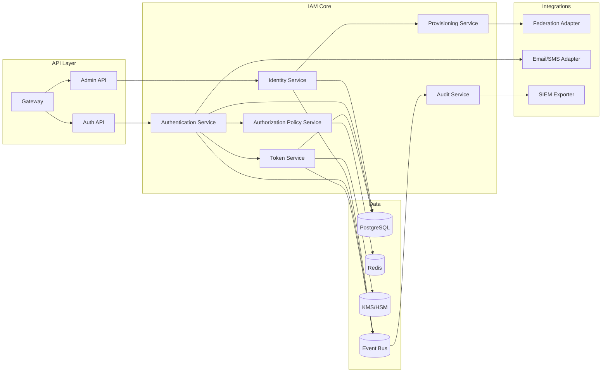

# Component Diagrams

```mermaid
flowchart LR
    subgraph API[API Layer]
      GW[Gateway]
      AuthAPI[Auth API]
      AdminAPI[Admin API]
    end

    subgraph Core[IAM Core]
      IdentitySvc[Identity Service]
      AuthSvc[Authentication Service]
      TokenSvc[Token Service]
      PolicySvc[Authorization Policy Service]
      ProvisionSvc[Provisioning Service]
      AuditSvc[Audit Service]
    end

    subgraph Integrations[Integrations]
      Federation[Federation Adapter]
      Notify[Email/SMS Adapter]
      SIEM[SIEM Exporter]
    end

    subgraph Data[Data]
      DB[(PostgreSQL)]
      Cache[(Redis)]
      KMS[(KMS/HSM)]
      Bus[(Event Bus)]
    end

    GW --> AuthAPI --> AuthSvc
    GW --> AdminAPI --> IdentitySvc
    AuthSvc --> TokenSvc
    AuthSvc --> PolicySvc
    IdentitySvc --> ProvisionSvc

    IdentitySvc --> DB
    AuthSvc --> DB
    TokenSvc --> DB
    PolicySvc --> Cache
    TokenSvc --> KMS

    AuthSvc --> Notify
    ProvisionSvc --> Federation
    AuditSvc --> SIEM

    IdentitySvc --> Bus
    AuthSvc --> Bus
    TokenSvc --> Bus
    Bus --> AuditSvc
```
