# ERD & Database Schema

## 1. Entity-Relationship Diagram

```mermaid
erDiagram
    tenants ||--o{ organizations : "owns"
    tenants ||--o{ users : "has"
    tenants ||--o{ service_accounts : "has"
    tenants ||--o{ roles : "defines"
    tenants ||--o{ permissions : "defines"
    tenants ||--o{ policies : "owns"
    tenants ||--o{ groups : "has"
    tenants ||--o{ oauth_clients : "registers"
    tenants ||--o{ saml_providers : "configures"
    tenants ||--o{ scim_directories : "manages"
    tenants ||--o{ audit_events : "generates"
    tenants ||--o{ ip_allowlists : "has"
    tenants ||--o{ break_glass_accounts : "has"

    organizations ||--o{ users : "contains"

    users ||--o{ user_roles : "assigned"
    users ||--o{ group_members : "member_of"
    users ||--o{ sessions : "maintains"
    users ||--o{ mfa_devices : "enrolls"
    users ||--o{ token_families : "owns"

    service_accounts ||--o{ user_roles : "assigned"
    service_accounts ||--o{ sessions : "maintains"
    service_accounts ||--o{ token_families : "owns"

    roles ||--o{ role_permissions : "grants"
    roles ||--o{ user_roles : "assigned_via"
    roles ||--o{ group_roles : "assigned_via"

    permissions ||--o{ role_permissions : "included_in"

    groups ||--o{ group_members : "has"
    groups ||--o{ group_roles : "has"

    policies ||--o{ policy_statements : "contains"

    token_families ||--o{ sessions : "tracked_by"
    token_families ||--o{ tokens : "contains"

    sessions ||--o{ tokens : "issues"

    break_glass_accounts ||--o{ break_glass_sessions : "activates"

    tenants {
        uuid tenant_id PK
        text name
        text domain
        text status
        jsonb settings
        timestamptz created_at
        timestamptz updated_at
    }

    organizations {
        uuid org_id PK
        uuid tenant_id FK
        text name
        text external_id
        text status
        jsonb metadata
        timestamptz created_at
        timestamptz updated_at
    }

    users {
        uuid user_id PK
        uuid tenant_id FK
        uuid org_id FK
        text email
        text display_name
        text status
        text password_hash
        int failed_login_count
        timestamptz locked_until
        timestamptz last_login_at
        bool mfa_required
        jsonb profile
        text external_id
        text source_directory
        timestamptz created_at
        timestamptz updated_at
        timestamptz deprovisioned_at
    }

    service_accounts {
        uuid sa_id PK
        uuid tenant_id FK
        text name
        text description
        text status
        text client_id
        text hashed_secret
        timestamptz secret_rotated_at
        timestamptz expires_at
        jsonb allowed_scopes
        timestamptz created_at
        timestamptz updated_at
    }

    roles {
        uuid role_id PK
        uuid tenant_id FK
        text name
        text description
        bool is_system
        bool is_assignable
        text status
        timestamptz created_at
        timestamptz updated_at
    }

    permissions {
        uuid permission_id PK
        uuid tenant_id FK
        text action
        text resource_type
        text description
        bool is_system
        timestamptz created_at
        timestamptz updated_at
    }

    role_permissions {
        uuid role_id FK
        uuid permission_id FK
        uuid granted_by FK
        timestamptz granted_at
    }

    user_roles {
        uuid assignment_id PK
        uuid principal_id FK
        text principal_type
        uuid role_id FK
        uuid granted_by FK
        timestamptz granted_at
        timestamptz expires_at
    }

    groups {
        uuid group_id PK
        uuid tenant_id FK
        text name
        text description
        text type
        bool is_system
        timestamptz created_at
        timestamptz updated_at
    }

    group_members {
        uuid group_id FK
        uuid user_id FK
        uuid added_by FK
        timestamptz added_at
    }

    group_roles {
        uuid group_id FK
        uuid role_id FK
        uuid granted_by FK
        timestamptz granted_at
    }

    policies {
        uuid policy_id PK
        uuid tenant_id FK
        text name
        text description
        text status
        int version
        text policy_type
        jsonb tags
        uuid created_by FK
        uuid approved_by FK
        timestamptz approved_at
        timestamptz activated_at
        timestamptz deprecated_at
        timestamptz created_at
        timestamptz updated_at
    }

    policy_statements {
        uuid statement_id PK
        uuid policy_id FK
        text label
        text effect
        jsonb principals
        jsonb actions
        jsonb resources
        jsonb conditions
        jsonb obligations
        int priority
        timestamptz created_at
    }

    sessions {
        uuid session_id PK
        uuid tenant_id FK
        uuid principal_id FK
        text principal_type
        uuid token_family_id FK
        text status
        text auth_method
        int assurance_level
        text ip_address
        text user_agent
        jsonb device_fingerprint
        jsonb risk_signals
        timestamptz auth_time
        timestamptz expires_at
        timestamptz last_active_at
        timestamptz revoked_at
        text revoke_reason
        timestamptz created_at
    }

    tokens {
        uuid token_id PK
        uuid tenant_id FK
        uuid session_id FK
        uuid token_family_id FK
        text token_type
        text jti
        text status
        text audience
        text scope
        timestamptz issued_at
        timestamptz expires_at
        timestamptz revoked_at
        text revoke_reason
        timestamptz created_at
    }

    token_families {
        uuid family_id PK
        uuid tenant_id FK
        uuid principal_id FK
        text principal_type
        text status
        int rotation_count
        timestamptz last_rotation_at
        timestamptz revoked_at
        text revoke_reason
        timestamptz created_at
        timestamptz updated_at
    }

    mfa_devices {
        uuid device_id PK
        uuid tenant_id FK
        uuid user_id FK
        text device_type
        text name
        text status
        text credential_id
        text public_key
        text totp_secret_encrypted
        int totp_counter
        bool is_primary
        timestamptz last_used_at
        timestamptz enrolled_at
        timestamptz created_at
        timestamptz updated_at
    }

    oauth_clients {
        uuid client_id PK
        uuid tenant_id FK
        text client_name
        text client_secret_hash
        text client_type
        text redirect_uris
        text allowed_grant_types
        text allowed_scopes
        bool require_pkce
        int access_token_ttl
        int refresh_token_ttl
        text status
        jsonb metadata
        timestamptz created_at
        timestamptz updated_at
    }

    saml_providers {
        uuid provider_id PK
        uuid tenant_id FK
        text name
        text entity_id
        text sso_url
        text slo_url
        text metadata_url
        text certificate_pem
        text name_id_format
        jsonb attribute_mappings
        text status
        timestamptz metadata_refreshed_at
        timestamptz created_at
        timestamptz updated_at
    }

    scim_directories {
        uuid directory_id PK
        uuid tenant_id FK
        text name
        text bearer_token_hash
        text status
        text sync_mode
        int sync_interval_minutes
        timestamptz last_sync_at
        jsonb attribute_mappings
        jsonb sync_stats
        timestamptz created_at
        timestamptz updated_at
    }

    audit_events {
        uuid event_id PK
        uuid tenant_id FK
        uuid actor_id
        text actor_type
        text actor_email
        text action
        text target_type
        uuid target_id
        text target_display
        text outcome
        text ip_address
        text user_agent
        uuid session_id
        text correlation_id
        text request_id
        jsonb context
        jsonb changes
        timestamptz occurred_at
    }

    break_glass_accounts {
        uuid bga_id PK
        uuid tenant_id FK
        text name
        text description
        bool is_active
        bool require_mfa
        int max_session_minutes
        jsonb allowed_actions
        text alert_email
        timestamptz created_at
        timestamptz updated_at
    }

    break_glass_sessions {
        uuid bgs_id PK
        uuid bga_id FK
        uuid tenant_id FK
        text activated_by
        text reason
        text ticket_reference
        text status
        text ip_address
        text user_agent
        timestamptz activated_at
        timestamptz expires_at
        timestamptz terminated_at
        text terminated_by
        text termination_reason
        timestamptz created_at
    }

    ip_allowlists {
        uuid allowlist_id PK
        uuid tenant_id FK
        text name
        text description
        text cidr_range
        text context
        bool is_active
        timestamptz created_at
        timestamptz updated_at
    }
```



---

## 2. SQL Table Definitions

### Core Tenant Tables

```sql
CREATE TABLE tenants (
  tenant_id  UUID        PRIMARY KEY DEFAULT gen_random_uuid(),
  name       TEXT        NOT NULL,
  domain     TEXT        NOT NULL UNIQUE,
  status     TEXT        NOT NULL DEFAULT 'active'
               CHECK (status IN ('active', 'suspended', 'deprovisioned')),
  settings   JSONB       NOT NULL DEFAULT '{}',
  created_at TIMESTAMPTZ NOT NULL DEFAULT NOW(),
  updated_at TIMESTAMPTZ NOT NULL DEFAULT NOW()
);

CREATE TABLE organizations (
  org_id      UUID        PRIMARY KEY DEFAULT gen_random_uuid(),
  tenant_id   UUID        NOT NULL REFERENCES tenants(tenant_id) ON DELETE CASCADE,
  name        TEXT        NOT NULL,
  external_id TEXT,
  status      TEXT        NOT NULL DEFAULT 'active'
                CHECK (status IN ('active', 'suspended', 'archived')),
  metadata    JSONB       NOT NULL DEFAULT '{}',
  created_at  TIMESTAMPTZ NOT NULL DEFAULT NOW(),
  updated_at  TIMESTAMPTZ NOT NULL DEFAULT NOW(),
  UNIQUE (tenant_id, external_id)
);
```

### Identity Tables

```sql
CREATE TABLE users (
  user_id            UUID        PRIMARY KEY DEFAULT gen_random_uuid(),
  tenant_id          UUID        NOT NULL REFERENCES tenants(tenant_id) ON DELETE CASCADE,
  org_id             UUID        REFERENCES organizations(org_id) ON DELETE SET NULL,
  email              TEXT        NOT NULL,
  display_name       TEXT        NOT NULL,
  status             TEXT        NOT NULL DEFAULT 'invited'
                       CHECK (status IN ('invited', 'active', 'suspended', 'locked',
                                         'deprovisioned', 'archived')),
  password_hash      TEXT,
  failed_login_count INTEGER     NOT NULL DEFAULT 0,
  locked_until       TIMESTAMPTZ,
  last_login_at      TIMESTAMPTZ,
  mfa_required       BOOLEAN     NOT NULL DEFAULT FALSE,
  profile            JSONB       NOT NULL DEFAULT '{}',
  external_id        TEXT,
  source_directory   TEXT,
  created_at         TIMESTAMPTZ NOT NULL DEFAULT NOW(),
  updated_at         TIMESTAMPTZ NOT NULL DEFAULT NOW(),
  deprovisioned_at   TIMESTAMPTZ,
  UNIQUE (tenant_id, email),
  UNIQUE (tenant_id, external_id)
);

CREATE TABLE service_accounts (
  sa_id              UUID        PRIMARY KEY DEFAULT gen_random_uuid(),
  tenant_id          UUID        NOT NULL REFERENCES tenants(tenant_id) ON DELETE CASCADE,
  name               TEXT        NOT NULL,
  description        TEXT        NOT NULL DEFAULT '',
  status             TEXT        NOT NULL DEFAULT 'active'
                       CHECK (status IN ('active', 'suspended', 'retired')),
  client_id          TEXT        NOT NULL UNIQUE DEFAULT gen_random_uuid()::TEXT,
  hashed_secret      TEXT        NOT NULL,
  secret_rotated_at  TIMESTAMPTZ NOT NULL DEFAULT NOW(),
  expires_at         TIMESTAMPTZ,
  allowed_scopes     JSONB       NOT NULL DEFAULT '[]',
  metadata           JSONB       NOT NULL DEFAULT '{}',
  created_at         TIMESTAMPTZ NOT NULL DEFAULT NOW(),
  updated_at         TIMESTAMPTZ NOT NULL DEFAULT NOW(),
  UNIQUE (tenant_id, name)
);
```

### RBAC Tables

```sql
CREATE TABLE roles (
  role_id       UUID        PRIMARY KEY DEFAULT gen_random_uuid(),
  tenant_id     UUID        NOT NULL REFERENCES tenants(tenant_id) ON DELETE CASCADE,
  name          TEXT        NOT NULL,
  description   TEXT        NOT NULL DEFAULT '',
  is_system     BOOLEAN     NOT NULL DEFAULT FALSE,
  is_assignable BOOLEAN     NOT NULL DEFAULT TRUE,
  status        TEXT        NOT NULL DEFAULT 'active'
                  CHECK (status IN ('active', 'deprecated')),
  created_at    TIMESTAMPTZ NOT NULL DEFAULT NOW(),
  updated_at    TIMESTAMPTZ NOT NULL DEFAULT NOW(),
  UNIQUE (tenant_id, name)
);

CREATE TABLE permissions (
  permission_id UUID        PRIMARY KEY DEFAULT gen_random_uuid(),
  tenant_id     UUID        NOT NULL REFERENCES tenants(tenant_id) ON DELETE CASCADE,
  action        TEXT        NOT NULL,
  resource_type TEXT        NOT NULL,
  description   TEXT        NOT NULL DEFAULT '',
  is_system     BOOLEAN     NOT NULL DEFAULT FALSE,
  created_at    TIMESTAMPTZ NOT NULL DEFAULT NOW(),
  updated_at    TIMESTAMPTZ NOT NULL DEFAULT NOW(),
  UNIQUE (tenant_id, action, resource_type)
);

CREATE TABLE role_permissions (
  role_id       UUID        NOT NULL REFERENCES roles(role_id) ON DELETE CASCADE,
  permission_id UUID        NOT NULL REFERENCES permissions(permission_id) ON DELETE CASCADE,
  granted_by    UUID        NOT NULL REFERENCES users(user_id) ON DELETE RESTRICT,
  granted_at    TIMESTAMPTZ NOT NULL DEFAULT NOW(),
  PRIMARY KEY (role_id, permission_id)
);

CREATE TABLE user_roles (
  assignment_id  UUID        PRIMARY KEY DEFAULT gen_random_uuid(),
  principal_id   UUID        NOT NULL,
  principal_type TEXT        NOT NULL CHECK (principal_type IN ('user', 'service_account')),
  role_id        UUID        NOT NULL REFERENCES roles(role_id) ON DELETE CASCADE,
  granted_by     UUID        NOT NULL REFERENCES users(user_id) ON DELETE RESTRICT,
  granted_at     TIMESTAMPTZ NOT NULL DEFAULT NOW(),
  expires_at     TIMESTAMPTZ,
  UNIQUE (principal_id, principal_type, role_id)
);
```

### Group Tables

```sql
CREATE TABLE groups (
  group_id    UUID        PRIMARY KEY DEFAULT gen_random_uuid(),
  tenant_id   UUID        NOT NULL REFERENCES tenants(tenant_id) ON DELETE CASCADE,
  name        TEXT        NOT NULL,
  description TEXT        NOT NULL DEFAULT '',
  type        TEXT        NOT NULL DEFAULT 'static'
                CHECK (type IN ('static', 'dynamic', 'external')),
  is_system   BOOLEAN     NOT NULL DEFAULT FALSE,
  created_at  TIMESTAMPTZ NOT NULL DEFAULT NOW(),
  updated_at  TIMESTAMPTZ NOT NULL DEFAULT NOW(),
  UNIQUE (tenant_id, name)
);

CREATE TABLE group_members (
  group_id UUID        NOT NULL REFERENCES groups(group_id) ON DELETE CASCADE,
  user_id  UUID        NOT NULL REFERENCES users(user_id) ON DELETE CASCADE,
  added_by UUID        NOT NULL REFERENCES users(user_id) ON DELETE RESTRICT,
  added_at TIMESTAMPTZ NOT NULL DEFAULT NOW(),
  PRIMARY KEY (group_id, user_id)
);

CREATE TABLE group_roles (
  group_id   UUID        NOT NULL REFERENCES groups(group_id) ON DELETE CASCADE,
  role_id    UUID        NOT NULL REFERENCES roles(role_id) ON DELETE CASCADE,
  granted_by UUID        NOT NULL REFERENCES users(user_id) ON DELETE RESTRICT,
  granted_at TIMESTAMPTZ NOT NULL DEFAULT NOW(),
  PRIMARY KEY (group_id, role_id)
);
```

### Policy Tables

```sql
CREATE TABLE policies (
  policy_id    UUID        PRIMARY KEY DEFAULT gen_random_uuid(),
  tenant_id    UUID        NOT NULL REFERENCES tenants(tenant_id) ON DELETE CASCADE,
  name         TEXT        NOT NULL,
  description  TEXT        NOT NULL DEFAULT '',
  status       TEXT        NOT NULL DEFAULT 'draft'
                 CHECK (status IN ('draft', 'review', 'approved', 'active', 'deprecated')),
  version      INTEGER     NOT NULL DEFAULT 1,
  policy_type  TEXT        NOT NULL DEFAULT 'authorization'
                 CHECK (policy_type IN ('authorization', 'access_control', 'data_governance')),
  tags         JSONB       NOT NULL DEFAULT '{}',
  created_by   UUID        NOT NULL REFERENCES users(user_id) ON DELETE RESTRICT,
  approved_by  UUID        REFERENCES users(user_id) ON DELETE SET NULL,
  approved_at  TIMESTAMPTZ,
  activated_at TIMESTAMPTZ,
  deprecated_at TIMESTAMPTZ,
  created_at   TIMESTAMPTZ NOT NULL DEFAULT NOW(),
  updated_at   TIMESTAMPTZ NOT NULL DEFAULT NOW(),
  UNIQUE (tenant_id, name, version)
);

CREATE TABLE policy_statements (
  statement_id UUID        PRIMARY KEY DEFAULT gen_random_uuid(),
  policy_id    UUID        NOT NULL REFERENCES policies(policy_id) ON DELETE CASCADE,
  label        TEXT        NOT NULL,
  effect       TEXT        NOT NULL CHECK (effect IN ('Allow', 'Deny')),
  principals   JSONB       NOT NULL DEFAULT '[]',
  actions      JSONB       NOT NULL DEFAULT '[]',
  resources    JSONB       NOT NULL DEFAULT '[]',
  conditions   JSONB       NOT NULL DEFAULT '{}',
  obligations  JSONB       NOT NULL DEFAULT '[]',
  priority     INTEGER     NOT NULL DEFAULT 100,
  created_at   TIMESTAMPTZ NOT NULL DEFAULT NOW()
);
```

### Session & Token Tables

```sql
CREATE TABLE token_families (
  family_id        UUID        PRIMARY KEY DEFAULT gen_random_uuid(),
  tenant_id        UUID        NOT NULL REFERENCES tenants(tenant_id) ON DELETE CASCADE,
  principal_id     UUID        NOT NULL,
  principal_type   TEXT        NOT NULL CHECK (principal_type IN ('user', 'service_account')),
  status           TEXT        NOT NULL DEFAULT 'active'
                     CHECK (status IN ('active', 'revoked')),
  rotation_count   INTEGER     NOT NULL DEFAULT 0,
  last_rotation_at TIMESTAMPTZ NOT NULL DEFAULT NOW(),
  revoked_at       TIMESTAMPTZ,
  revoke_reason    TEXT,
  created_at       TIMESTAMPTZ NOT NULL DEFAULT NOW(),
  updated_at       TIMESTAMPTZ NOT NULL DEFAULT NOW()
);

CREATE TABLE sessions (
  session_id         UUID        PRIMARY KEY DEFAULT gen_random_uuid(),
  tenant_id          UUID        NOT NULL REFERENCES tenants(tenant_id) ON DELETE CASCADE,
  principal_id       UUID        NOT NULL,
  principal_type     TEXT        NOT NULL CHECK (principal_type IN ('user', 'service_account')),
  token_family_id    UUID        NOT NULL REFERENCES token_families(family_id) ON DELETE CASCADE,
  status             TEXT        NOT NULL DEFAULT 'active'
                       CHECK (status IN ('active', 'step_up_required', 'revoked',
                                         'expired', 'terminated')),
  auth_method        TEXT        NOT NULL,
  assurance_level    INTEGER     NOT NULL DEFAULT 1 CHECK (assurance_level BETWEEN 1 AND 3),
  ip_address         INET,
  user_agent         TEXT,
  device_fingerprint JSONB       NOT NULL DEFAULT '{}',
  risk_signals       JSONB       NOT NULL DEFAULT '{}',
  auth_time          TIMESTAMPTZ NOT NULL DEFAULT NOW(),
  expires_at         TIMESTAMPTZ NOT NULL,
  last_active_at     TIMESTAMPTZ NOT NULL DEFAULT NOW(),
  revoked_at         TIMESTAMPTZ,
  revoke_reason      TEXT,
  created_at         TIMESTAMPTZ NOT NULL DEFAULT NOW()
) PARTITION BY RANGE (created_at);

CREATE TABLE tokens (
  token_id       UUID        PRIMARY KEY DEFAULT gen_random_uuid(),
  tenant_id      UUID        NOT NULL REFERENCES tenants(tenant_id) ON DELETE CASCADE,
  session_id     UUID        NOT NULL REFERENCES sessions(session_id) ON DELETE CASCADE,
  token_family_id UUID       NOT NULL REFERENCES token_families(family_id) ON DELETE CASCADE,
  token_type     TEXT        NOT NULL CHECK (token_type IN ('access', 'refresh', 'id')),
  jti            TEXT        NOT NULL UNIQUE,
  status         TEXT        NOT NULL DEFAULT 'active'
                   CHECK (status IN ('active', 'used', 'revoked', 'expired')),
  audience       TEXT        NOT NULL,
  scope          TEXT        NOT NULL DEFAULT '',
  issued_at      TIMESTAMPTZ NOT NULL DEFAULT NOW(),
  expires_at     TIMESTAMPTZ NOT NULL,
  revoked_at     TIMESTAMPTZ,
  revoke_reason  TEXT,
  created_at     TIMESTAMPTZ NOT NULL DEFAULT NOW()
);
```

### MFA Tables

```sql
CREATE TABLE mfa_devices (
  device_id             UUID        PRIMARY KEY DEFAULT gen_random_uuid(),
  tenant_id             UUID        NOT NULL REFERENCES tenants(tenant_id) ON DELETE CASCADE,
  user_id               UUID        NOT NULL REFERENCES users(user_id) ON DELETE CASCADE,
  device_type           TEXT        NOT NULL CHECK (device_type IN ('totp', 'webauthn', 'sms', 'email')),
  name                  TEXT        NOT NULL,
  status                TEXT        NOT NULL DEFAULT 'pending'
                          CHECK (status IN ('pending', 'active', 'revoked')),
  credential_id         TEXT,
  public_key            TEXT,
  totp_secret_encrypted TEXT,
  totp_counter          INTEGER     NOT NULL DEFAULT 0,
  is_primary            BOOLEAN     NOT NULL DEFAULT FALSE,
  last_used_at          TIMESTAMPTZ,
  enrolled_at           TIMESTAMPTZ,
  created_at            TIMESTAMPTZ NOT NULL DEFAULT NOW(),
  updated_at            TIMESTAMPTZ NOT NULL DEFAULT NOW()
);
```

### Federation Tables

```sql
CREATE TABLE oauth_clients (
  client_id            UUID        PRIMARY KEY DEFAULT gen_random_uuid(),
  tenant_id            UUID        NOT NULL REFERENCES tenants(tenant_id) ON DELETE CASCADE,
  client_name          TEXT        NOT NULL,
  client_secret_hash   TEXT,
  client_type          TEXT        NOT NULL CHECK (client_type IN ('confidential', 'public')),
  redirect_uris        TEXT[]      NOT NULL DEFAULT '{}',
  allowed_grant_types  TEXT[]      NOT NULL DEFAULT '{}',
  allowed_scopes       TEXT[]      NOT NULL DEFAULT '{}',
  allowed_response_types TEXT[]    NOT NULL DEFAULT '{}',
  require_pkce         BOOLEAN     NOT NULL DEFAULT TRUE,
  access_token_ttl     INTEGER     NOT NULL DEFAULT 600,
  refresh_token_ttl    INTEGER     NOT NULL DEFAULT 86400,
  status               TEXT        NOT NULL DEFAULT 'active'
                         CHECK (status IN ('active', 'suspended', 'revoked')),
  metadata             JSONB       NOT NULL DEFAULT '{}',
  created_at           TIMESTAMPTZ NOT NULL DEFAULT NOW(),
  updated_at           TIMESTAMPTZ NOT NULL DEFAULT NOW(),
  UNIQUE (tenant_id, client_name)
);

CREATE TABLE saml_providers (
  provider_id          UUID        PRIMARY KEY DEFAULT gen_random_uuid(),
  tenant_id            UUID        NOT NULL REFERENCES tenants(tenant_id) ON DELETE CASCADE,
  name                 TEXT        NOT NULL,
  entity_id            TEXT        NOT NULL,
  sso_url              TEXT        NOT NULL,
  slo_url              TEXT,
  metadata_url         TEXT,
  certificate_pem      TEXT        NOT NULL,
  name_id_format       TEXT        NOT NULL DEFAULT 'urn:oasis:names:tc:SAML:1.1:nameid-format:emailAddress',
  attribute_mappings   JSONB       NOT NULL DEFAULT '{}',
  status               TEXT        NOT NULL DEFAULT 'active'
                         CHECK (status IN ('active', 'inactive', 'error')),
  metadata_refreshed_at TIMESTAMPTZ,
  created_at           TIMESTAMPTZ NOT NULL DEFAULT NOW(),
  updated_at           TIMESTAMPTZ NOT NULL DEFAULT NOW(),
  UNIQUE (tenant_id, entity_id)
);

CREATE TABLE scim_directories (
  directory_id          UUID        PRIMARY KEY DEFAULT gen_random_uuid(),
  tenant_id             UUID        NOT NULL REFERENCES tenants(tenant_id) ON DELETE CASCADE,
  name                  TEXT        NOT NULL,
  bearer_token_hash     TEXT        NOT NULL,
  status                TEXT        NOT NULL DEFAULT 'active'
                          CHECK (status IN ('active', 'inactive', 'error')),
  sync_mode             TEXT        NOT NULL DEFAULT 'push'
                          CHECK (sync_mode IN ('push', 'pull', 'bidirectional')),
  sync_interval_minutes INTEGER     NOT NULL DEFAULT 15,
  last_sync_at          TIMESTAMPTZ,
  last_sync_completed_at TIMESTAMPTZ,
  attribute_mappings    JSONB       NOT NULL DEFAULT '{}',
  sync_stats            JSONB       NOT NULL DEFAULT '{}',
  created_at            TIMESTAMPTZ NOT NULL DEFAULT NOW(),
  updated_at            TIMESTAMPTZ NOT NULL DEFAULT NOW(),
  UNIQUE (tenant_id, name)
);
```

### Audit & Break-Glass Tables

```sql
CREATE TABLE audit_events (
  event_id       UUID        NOT NULL DEFAULT gen_random_uuid(),
  tenant_id      UUID        NOT NULL,
  actor_id       UUID,
  actor_type     TEXT        NOT NULL CHECK (actor_type IN ('user', 'service_account',
                                              'system', 'break_glass')),
  actor_email    TEXT,
  action         TEXT        NOT NULL,
  target_type    TEXT        NOT NULL,
  target_id      UUID,
  target_display TEXT,
  outcome        TEXT        NOT NULL CHECK (outcome IN ('success', 'failure',
                                             'deny', 'error')),
  ip_address     INET,
  user_agent     TEXT,
  session_id     UUID,
  correlation_id TEXT        NOT NULL,
  request_id     TEXT        NOT NULL,
  context        JSONB       NOT NULL DEFAULT '{}',
  changes        JSONB       NOT NULL DEFAULT '{}',
  occurred_at    TIMESTAMPTZ NOT NULL DEFAULT NOW(),
  PRIMARY KEY (event_id, occurred_at)
) PARTITION BY RANGE (occurred_at);

CREATE TABLE break_glass_accounts (
  bga_id                UUID        PRIMARY KEY DEFAULT gen_random_uuid(),
  tenant_id             UUID        NOT NULL REFERENCES tenants(tenant_id) ON DELETE CASCADE,
  name                  TEXT        NOT NULL,
  description           TEXT        NOT NULL DEFAULT '',
  is_active             BOOLEAN     NOT NULL DEFAULT TRUE,
  require_mfa           BOOLEAN     NOT NULL DEFAULT TRUE,
  max_session_minutes   INTEGER     NOT NULL DEFAULT 60,
  allowed_actions       JSONB       NOT NULL DEFAULT '[]',
  alert_email           TEXT        NOT NULL,
  created_at            TIMESTAMPTZ NOT NULL DEFAULT NOW(),
  updated_at            TIMESTAMPTZ NOT NULL DEFAULT NOW(),
  UNIQUE (tenant_id, name)
);

CREATE TABLE break_glass_sessions (
  bgs_id             UUID        PRIMARY KEY DEFAULT gen_random_uuid(),
  bga_id             UUID        NOT NULL REFERENCES break_glass_accounts(bga_id) ON DELETE RESTRICT,
  tenant_id          UUID        NOT NULL REFERENCES tenants(tenant_id) ON DELETE CASCADE,
  activated_by       TEXT        NOT NULL,
  reason             TEXT        NOT NULL,
  ticket_reference   TEXT        NOT NULL,
  status             TEXT        NOT NULL DEFAULT 'active'
                       CHECK (status IN ('active', 'expired', 'terminated')),
  ip_address         INET,
  user_agent         TEXT,
  activated_at       TIMESTAMPTZ NOT NULL DEFAULT NOW(),
  expires_at         TIMESTAMPTZ NOT NULL,
  terminated_at      TIMESTAMPTZ,
  terminated_by      TEXT,
  termination_reason TEXT,
  created_at         TIMESTAMPTZ NOT NULL DEFAULT NOW()
);

CREATE TABLE ip_allowlists (
  allowlist_id UUID        PRIMARY KEY DEFAULT gen_random_uuid(),
  tenant_id    UUID        NOT NULL REFERENCES tenants(tenant_id) ON DELETE CASCADE,
  name         TEXT        NOT NULL,
  description  TEXT        NOT NULL DEFAULT '',
  cidr_range   CIDR        NOT NULL,
  context      TEXT        NOT NULL DEFAULT 'all'
                 CHECK (context IN ('all', 'admin', 'api', 'mfa_bypass')),
  is_active    BOOLEAN     NOT NULL DEFAULT TRUE,
  created_at   TIMESTAMPTZ NOT NULL DEFAULT NOW(),
  updated_at   TIMESTAMPTZ NOT NULL DEFAULT NOW(),
  UNIQUE (tenant_id, cidr_range, context)
);
```

---

## 3. Index Strategy

### Authentication Hot Path

```sql
-- User lookup by email (login, SCIM provisioning)
CREATE INDEX idx_users_tenant_email      ON users(tenant_id, email);
CREATE INDEX idx_users_tenant_status     ON users(tenant_id, status) WHERE status != 'archived';
CREATE INDEX idx_users_external_id       ON users(tenant_id, external_id) WHERE external_id IS NOT NULL;

-- Service account lookup by client_id (token exchange)
CREATE UNIQUE INDEX idx_sa_client_id     ON service_accounts(client_id);
CREATE INDEX idx_sa_tenant_status        ON service_accounts(tenant_id, status);

-- Session validation (every authenticated request)
CREATE INDEX idx_sessions_tenant_principal
  ON sessions(tenant_id, principal_id, principal_type)
  WHERE status = 'active';
CREATE INDEX idx_sessions_family         ON sessions(token_family_id);
CREATE INDEX idx_sessions_expires        ON sessions(expires_at) WHERE status = 'active';

-- JWT introspection by JTI (every API call)
CREATE UNIQUE INDEX idx_tokens_jti       ON tokens(jti);
CREATE INDEX idx_tokens_session          ON tokens(session_id, token_type)
  WHERE status = 'active';
CREATE INDEX idx_tokens_family_type      ON tokens(token_family_id, token_type);
```

### Authorization Hot Path

```sql
-- Role assignments for a principal (RBAC evaluation)
CREATE INDEX idx_user_roles_principal    ON user_roles(principal_id, principal_type)
  WHERE expires_at IS NULL OR expires_at > NOW();
CREATE INDEX idx_user_roles_role         ON user_roles(role_id);

-- Group membership expansion (group-to-role RBAC)
CREATE INDEX idx_group_members_user      ON group_members(user_id);
CREATE INDEX idx_group_members_group     ON group_members(group_id);
CREATE INDEX idx_group_roles_group       ON group_roles(group_id);

-- Role permissions lookup
CREATE INDEX idx_role_permissions_role   ON role_permissions(role_id);

-- Active policies for a tenant (policy evaluation)
CREATE INDEX idx_policies_tenant_active  ON policies(tenant_id, status)
  WHERE status = 'active';
CREATE INDEX idx_policy_statements_policy ON policy_statements(policy_id);
```

### Audit & Operational Queries

```sql
-- Audit log queries (compliance, SOC investigations)
CREATE INDEX idx_audit_tenant_occurred   ON audit_events(tenant_id, occurred_at DESC);
CREATE INDEX idx_audit_actor             ON audit_events(tenant_id, actor_id, occurred_at DESC)
  WHERE actor_id IS NOT NULL;
CREATE INDEX idx_audit_action            ON audit_events(tenant_id, action, occurred_at DESC);
CREATE INDEX idx_audit_target            ON audit_events(tenant_id, target_type, target_id)
  WHERE target_id IS NOT NULL;
CREATE INDEX idx_audit_correlation       ON audit_events(correlation_id);

-- MFA device lookups
CREATE INDEX idx_mfa_user_active         ON mfa_devices(user_id, status)
  WHERE status = 'active';
CREATE INDEX idx_mfa_webauthn_credential ON mfa_devices(credential_id)
  WHERE device_type = 'webauthn';
```

---

## 4. Partitioning Strategy

### audit_events — Monthly Range Partitions

`audit_events` is the highest-write table. Rows are append-only (immutable), retention is 13 months hot + 7 years archive. Monthly range partitions allow fast pruning and independent tablespace assignment per age tier.

```sql
-- Create current and next two months upfront; automate via pg_partman
CREATE TABLE audit_events_2025_01 PARTITION OF audit_events
  FOR VALUES FROM ('2025-01-01') TO ('2025-02-01');

CREATE TABLE audit_events_2025_02 PARTITION OF audit_events
  FOR VALUES FROM ('2025-02-01') TO ('2025-03-01');

-- Attach archive tablespace after cutoff
ALTER TABLE audit_events_2025_01 SET TABLESPACE ts_audit_cold;
```

Partition management is handled by `pg_partman` with `retention = '13 months'` and `retention_keep_table = true`. Archived partitions are `pg_dump`-exported to object storage monthly and then detached.

### sessions — Range Partitions by Creation Month

Sessions older than 90 days are expired and eligible for deletion. Monthly partitioning enables `DROP PARTITION` cleanup without bloating the main table.

```sql
CREATE TABLE sessions_2025_01 PARTITION OF sessions
  FOR VALUES FROM ('2025-01-01') TO ('2025-02-01');
```

Active session queries use `status = 'active'` partial indexes per partition. The query planner prunes irrelevant partitions via the range constraint on `created_at`.

### tokens — Range Partitions by Expiry Month

Expired tokens accumulate rapidly (TTL 10 minutes for access tokens). Partitioning by `created_at` month allows bulk deletion of expired token rows without vacuuming the entire table.

---

## 5. Migration Strategy

### Principles

1. **Expand/Contract Pattern** — Every schema change is split into an additive phase (expand) and a cleanup phase (contract). The application is deployed compatibly with both old and new schema during the transition window.
2. **Online Index Builds** — All indexes are created with `CREATE INDEX CONCURRENTLY` to avoid table locks on production.
3. **Zero-Downtime Column Additions** — New nullable columns are added first, backfilled in batches, then constrained as `NOT NULL` once backfill is complete.
4. **Forward and Rollback Scripts** — Every migration has a corresponding rollback script. Rollback scripts are validated in staging before the forward migration is applied to production.
5. **Migration Lock Timeout** — All DDL statements run with `SET lock_timeout = '2s'` to abort rather than queue behind long-running transactions.

### Migration Tooling

- **Tool:** [golang-migrate](https://github.com/golang-migrate/migrate) with PostgreSQL driver.
- **Naming convention:** `YYYYMMDDHHMMSS_{description}.up.sql` / `.down.sql`.
- **Execution:** Applied by the deployment pipeline in a pre-deployment job; the application waits for migrations to complete before traffic is shifted.
- **Audit:** Each migration run is recorded in the `schema_migrations` table with the version, applied timestamp, and deploying actor.

### Large-Table Migration Example

```sql
-- Phase 1 (expand): add column nullable, deploy app that writes to both columns
ALTER TABLE users ADD COLUMN preferred_locale TEXT;

-- Phase 2 (backfill): batch update to avoid long-running transaction
UPDATE users SET preferred_locale = 'en-US'
WHERE preferred_locale IS NULL
  AND user_id IN (
    SELECT user_id FROM users WHERE preferred_locale IS NULL LIMIT 5000
  );

-- Phase 3 (contract): apply NOT NULL after backfill completes
ALTER TABLE users ALTER COLUMN preferred_locale SET NOT NULL;
ALTER TABLE users ALTER COLUMN preferred_locale SET DEFAULT 'en-US';
```

### Rollback Window

Rollback scripts must be tested in staging within 24 hours of the forward migration. The rollback window is open for 7 days post-deployment; after that the old schema contract is removed.
