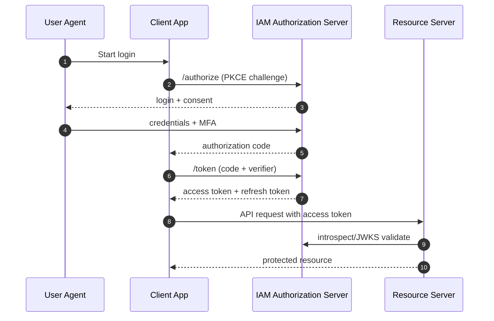
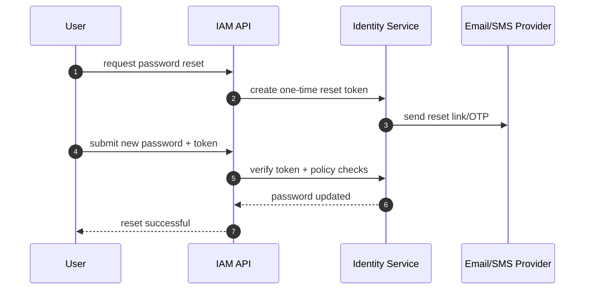

# Sequence Diagrams

## OAuth Authorization Code + PKCE

```mermaid
sequenceDiagram
    autonumber
    participant U as User Agent
    participant C as Client App
    participant AS as IAM Authorization Server
    participant RS as Resource Server

    U->>C: Start login
    C->>AS: /authorize (PKCE challenge)
    AS-->>U: login + consent
    U->>AS: credentials + MFA
    AS-->>C: authorization code
    C->>AS: /token (code + verifier)
    AS-->>C: access token + refresh token
    C->>RS: API request with access token
    RS->>AS: introspect/JWKS validate
    RS-->>C: protected resource
```

## Password Reset

```mermaid
sequenceDiagram
    autonumber
    participant U as User
    participant API as IAM API
    participant ID as Identity Service
    participant MSG as Email/SMS Provider

    U->>API: request password reset
    API->>ID: create one-time reset token
    ID->>MSG: send reset link/OTP
    U->>API: submit new password + token
    API->>ID: verify token + policy checks
    ID-->>API: password updated
    API-->>U: reset successful
```
