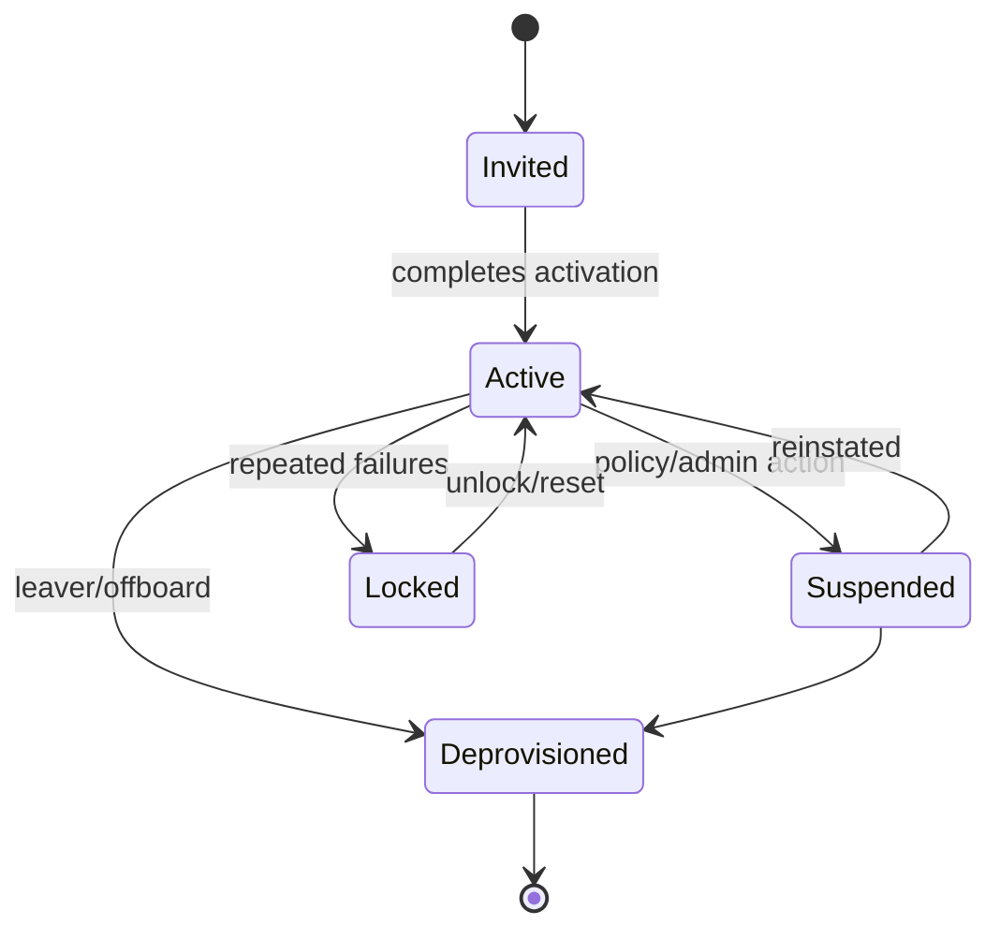
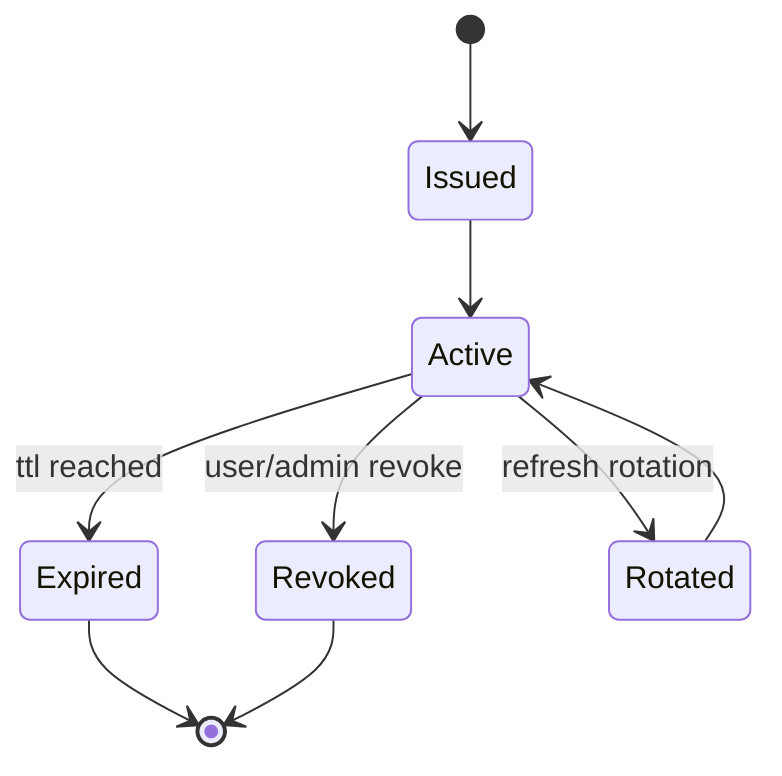
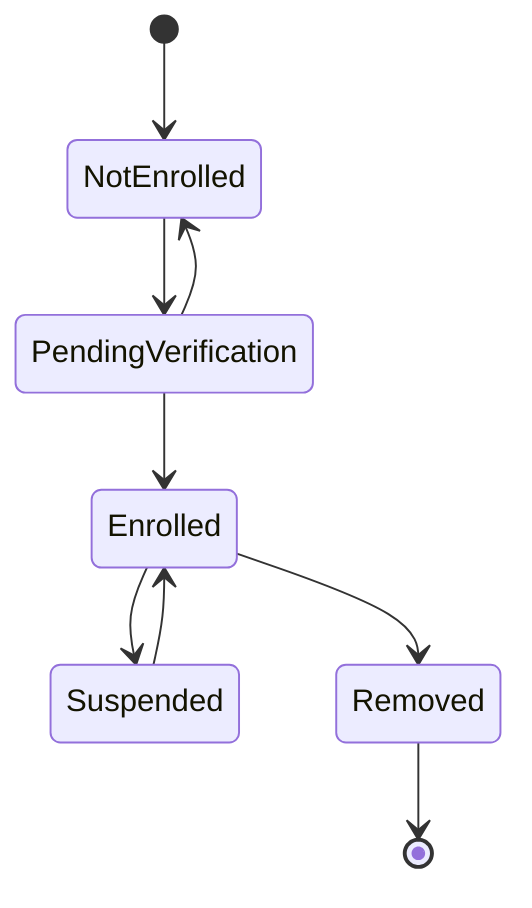

# State Machine Diagrams

## Identity Lifecycle

```mermaid
stateDiagram-v2
    [*] --> Invited
    Invited --> Active: completes activation
    Active --> Suspended: policy/admin action
    Suspended --> Active: reinstated
    Active --> Locked: repeated failures
    Locked --> Active: unlock/reset
    Active --> Deprovisioned: leaver/offboard
    Suspended --> Deprovisioned
    Deprovisioned --> [*]
```

## Access Token Lifecycle

```mermaid
stateDiagram-v2
    [*] --> Issued
    Issued --> Active
    Active --> Expired: ttl reached
    Active --> Revoked: user/admin revoke
    Active --> Rotated: refresh rotation
    Rotated --> Active
    Expired --> [*]
    Revoked --> [*]
```

## MFA Enrollment Lifecycle

```mermaid
stateDiagram-v2
    [*] --> NotEnrolled
    NotEnrolled --> PendingVerification
    PendingVerification --> Enrolled
    PendingVerification --> NotEnrolled
    Enrolled --> Suspended
    Suspended --> Enrolled
    Enrolled --> Removed
    Removed --> [*]
```
