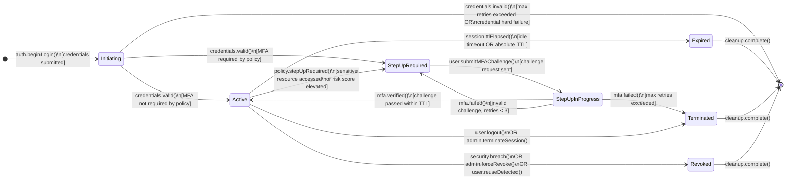

# State Machine Diagrams — Identity and Access Management Platform

This document specifies the lifecycle state machines for the four core entities whose
state transitions carry security and compliance significance. Each machine is followed
by a full transition table documenting guards, actions, and actors.

---

## 1. User Lifecycle

### 1.1 Overview

A User traverses eight distinct states from initial invitation through eventual archival.
Every transition must record the actor (human or system), a reason code, a correlation
ID, and a timestamp. Transitions that are not listed are explicitly forbidden and must
raise `IllegalStateTransitionException` at the domain layer.

### 1.2 State Diagram

```mermaid
stateDiagram-v2
    direction LR

    [*] --> Invited : admin.sendInvitation()

    Invited --> PendingMFAEnrollment : user.acceptInvite()\n[password meets policy]
    Invited --> [*] : invitation.expire()\n[48-hour TTL exceeded]

    PendingMFAEnrollment --> Active : user.enrollMFADevice()\n[within 7-day window]
    PendingMFAEnrollment --> Deprovisioned : enrollment.deadlineExceeded()\n[7 days elapsed without MFA]

    Active --> LockedOut : auth.failedAttempts()\n[≥ 5 failures in 15 min]
    LockedOut --> Active : admin.unlock(reason)\nOR auto.unlock()\n[30-min cooldown elapsed]

    Active --> Suspended : admin.suspend(reason)\nOR policy.violation()\n[automated risk action]
    Suspended --> Active : admin.restore(reason)

    Active --> PendingDeprovision : offboarding.initiate(actorId)
    Suspended --> PendingDeprovision : offboarding.initiate(actorId)

    PendingDeprovision --> Deprovisioned : entitlements.confirmed()\n[all roles/groups cleared\nand reconciled]

    Deprovisioned --> Archived : retention.period.met()\n[configurable; default 90 days]
    Archived --> [*] : data.purge()\n[PII erased per data-residency policy]
```

### 1.3 Transition Table

| From State | Event / Trigger | Guard Condition | To State | System Actions |
|---|---|---|---|---|
| `[*]` | `admin.sendInvitation()` | Tenant active; email unique; inviter has `user.invite` permission | `Invited` | Create User record; send invitation email with signed token; emit `UserInvited` |
| `Invited` | `user.acceptInvite()` | Invitation token valid; not expired; password meets complexity policy | `PendingMFAEnrollment` | Hash and store password; invalidate invitation token; start 7-day MFA enrollment timer; emit `UserPasswordSet` |
| `Invited` | `invitation.expire()` | 48 hours elapsed since invitation creation | `[*]` (deleted) | Delete User record; emit `InvitationExpired` |
| `PendingMFAEnrollment` | `user.enrollMFADevice()` | At least one MFA device successfully verified; within 7-day window | `Active` | Set `mfaEnrolled=true`; cancel enrollment timer; emit `UserActivated` |
| `PendingMFAEnrollment` | `enrollment.deadlineExceeded()` | 7-day window has elapsed without MFA enrollment | `Deprovisioned` | Revoke all sessions; emit `UserDeprovisioned(reason=ENROLLMENT_TIMEOUT)` |
| `Active` | `auth.failedAttempts()` | 5 or more failed password attempts within any 15-minute sliding window | `LockedOut` | Record `lockedAt`; start 30-min auto-unlock timer; invalidate all active sessions; emit `UserLockedOut` |
| `LockedOut` | `admin.unlock(reason)` | Actor has `user.unlock` permission; reason code provided | `Active` | Reset fail count; cancel auto-unlock timer; emit `UserUnlocked(actor, reason)` |
| `LockedOut` | `auto.unlock()` | 30-minute cooldown elapsed since `lockedAt` | `Active` | Reset fail count; emit `UserUnlocked(actor=system)` |
| `Active` | `admin.suspend(reason)` | Actor has `user.suspend` permission; reason code provided | `Suspended` | Immediately revoke all active sessions and tokens; emit `UserSuspended` |
| `Active` | `policy.violation()` | Automated risk engine detects policy violation above threshold | `Suspended` | Immediately revoke all active sessions and tokens; emit `UserSuspended(reason=POLICY_VIOLATION)` |
| `Suspended` | `admin.restore(reason)` | Actor has `user.restore` permission; reason code provided | `Active` | Emit `UserRestored(actor, reason)` |
| `Active` | `offboarding.initiate(actorId)` | Actor has `user.offboard` permission | `PendingDeprovision` | Revoke all sessions; begin async entitlement revocation workflow; emit `OffboardingInitiated` |
| `Suspended` | `offboarding.initiate(actorId)` | Actor has `user.offboard` permission | `PendingDeprovision` | Begin async entitlement revocation workflow; emit `OffboardingInitiated` |
| `PendingDeprovision` | `entitlements.confirmed()` | All roles, groups, and OAuth grants confirmed removed by reconciliation job | `Deprovisioned` | Anonymise PII fields (keep hashed identifiers); emit `UserDeprovisioned` |
| `Deprovisioned` | `retention.period.met()` | Configurable retention period elapsed (default 90 days) | `Archived` | Emit `UserArchived` |
| `Archived` | `data.purge()` | All audit retention periods satisfied; DPA deletion request or scheduled purge | `[*]` (deleted) | Delete remaining record bytes; emit `UserPurged` |

---

## 2. Session Lifecycle

### 2.1 Overview

A Session is created on successful credential validation and progresses through MFA
step-up states if required by policy. Sessions in `ACTIVE` state can be promoted to
`STEP_UP_REQUIRED` at any point when a sensitive resource access is attempted. All
terminal states result in token invalidation.

### 2.2 State Diagram



### 2.3 Transition Table

| From State | Event / Trigger | Guard Condition | To State | System Actions |
|---|---|---|---|---|
| `[*]` | `auth.beginLogin()` | Valid tenant; rate-limit not exceeded | `Initiating` | Create session stub in Redis; assign `sessionId`; start risk evaluation |
| `Initiating` | `credentials.valid()` | Password or certificate valid; MFA not required for user/resource | `Active` | Persist session; issue access + refresh tokens; emit `SessionCreated` |
| `Initiating` | `credentials.valid()` | MFA required by user policy or resource policy | `StepUpRequired` | Persist session in partial state; issue restricted pre-auth token; emit `SessionCreated(requiresMFA=true)` |
| `Initiating` | `credentials.invalid()` | Max retry attempts exceeded or hard credential failure | `[*]` | Delete session stub; emit `AuthenticationFailed`; trigger lockout if threshold met |
| `StepUpRequired` | `user.submitMFAChallenge()` | MFA device enrolled; device not revoked; challenge TTL valid | `StepUpInProgress` | Generate MFA challenge; store challenge reference; emit `MFAChallengeIssued` |
| `StepUpInProgress` | `mfa.verified()` | Challenge response valid; within TTL; no replay | `Active` | Set `mfaVerified=true`; issue full access token; emit `StepUpCompleted` |
| `StepUpInProgress` | `mfa.failed()` | Invalid response; retry count < 3 | `StepUpRequired` | Increment fail counter; emit `MFAChallengeFailed` |
| `StepUpInProgress` | `mfa.failed()` | Invalid response; retry count ≥ 3 | `Terminated` | Invalidate session and all tokens; emit `SessionTerminated(reason=MFA_MAX_RETRIES)` |
| `Active` | `policy.stepUpRequired()` | PDP returns obligation `requireMFAStepUp` for requested resource | `StepUpRequired` | Downgrade session token scope; emit `StepUpRequired` |
| `Active` | `session.ttlElapsed()` | `now() > expiresAt` (idle timeout = 30 min; absolute = 12 h) | `Expired` | Invalidate all tokens in session; emit `SessionExpired` |
| `Active` | `user.logout()` | User-initiated | `Terminated` | Invalidate all tokens; emit `SessionTerminated(reason=USER_LOGOUT)` |
| `Active` | `admin.terminateSession()` | Actor has `session.terminate` permission | `Terminated` | Invalidate all tokens; emit `SessionTerminated(reason=ADMIN_ACTION, actorId)` |
| `Active` | `security.breach()` | Security automation or admin force-revoke | `Revoked` | Invalidate all tokens; publish `SessionRevoked` to Kafka; emit `SecurityAlert` |

---

## 3. Token Lifecycle

### 3.1 Overview

Tokens follow a strict single-direction lifecycle. `ACCESS` tokens cannot be rotated;
they expire naturally. `REFRESH` tokens rotate on use (one-time use with replacement).
If a previously-rotated refresh token is re-presented, the entire token family is
revoked immediately. Revoked tokens are added to the Redis deny-list consumed by all
PEP instances within the 5-second propagation SLA.

### 3.2 State Diagram

```mermaid
stateDiagram-v2
    direction LR

    [*] --> Issued : tokenIssuer.issue()\n[session grant or refresh rotation]

    Issued --> Valid : persistence.confirmed()\n[DB write + Redis set complete]

    Valid --> Rotated : refreshToken.presented()\n[valid rotation request;\ntoken was latest in family]
    Rotated --> [*] : superseded\n[new token in Valid state;\nold token removed from hot path]

    Valid --> Revoked : admin.revoke()\nOR familyRevoke()\nOR reuseDetected()
    Issued --> Revoked : admin.revoke()\n[immediate — before DB confirm]

    Valid --> Expired : token.ttlElapsed()\n[exp claim exceeded]
    Rotated --> Expired : token.ttlElapsed()\n[superseded + not-yet-purged]

    Expired --> [*] : purge.scheduled()\n[DB cleanup job]
    Revoked --> [*] : deny-list.ttlElapsed()\n[deny entry expires after original exp]
```



### 3.3 Transition Table

| From State | Event / Trigger | Guard Condition | To State | System Actions |
|---|---|---|---|---|
| `[*]` | `tokenIssuer.issue()` | Valid session; scopes authorised; audience valid | `Issued` | Generate opaque token ID; sign JWT (ACCESS) or create opaque bytes (REFRESH); assign `familyId` |
| `Issued` | `persistence.confirmed()` | DB write and Redis cache set both succeed | `Valid` | Token is now usable by client |
| `Valid` | `refreshToken.presented()` | Token is type REFRESH; status=Valid; it is the latest in its family | `Rotated` | Issue new REFRESH + ACCESS token pair with same `familyId`; set old token `status=ROTATED`; emit `TokenRotated` |
| `Valid` | `refreshToken.presented()` | Token is type REFRESH; status=ROTATED (reuse detection) | `Revoked` | Revoke entire family; invalidate Redis; publish `TokenFamilyRevoked`; emit `SecurityAlert(REFRESH_REUSE)` |
| `Valid` | `admin.revoke()` | Actor has `token.revoke` permission | `Revoked` | Set `revokedAt`; add to Redis deny-list; publish `TokenRevoked` to Kafka; emit `TokenRevoked` audit event |
| `Valid` | `familyRevoke()` | Parent session revoked or security breach | `Revoked` | Same as admin.revoke() but bulk across all family members |
| `Valid` | `token.ttlElapsed()` | `now() > expiresAt` | `Expired` | Remove from Redis (TTL eviction); keep DB row for audit |
| `Rotated` | `token.ttlElapsed()` | `now() > expiresAt` | `Expired` | DB cleanup; no cache action required |
| `Expired` | `purge.scheduled()` | Retention period met (90 days) | `[*]` | Delete DB row; emit `TokenPurged` |
| `Revoked` | `deny-list.ttlElapsed()` | Redis deny-list entry TTL = original token `expiresAt` | `[*]` | Entry evicted from Redis; DB row retained for audit |

---

## 4. Break-Glass Request Lifecycle

### 4.1 Overview

Break-glass access enables emergency elevation beyond normal policy controls. It
requires a documented reason, dual approval from distinct organisational units, a
time-bound activation window (maximum 4 hours), and a mandatory post-access completion
audit. Every state transition is individually immutable-logged. Approver identities and
their approval timestamps are stored in `approverIds[]` on the aggregate.

### 4.2 State Diagram

```mermaid
stateDiagram-v2
    direction LR

    [*] --> Requested : requestor.submitBreakGlass(\n  reason, scope, justification\n)

    Requested --> PendingApproval : workflow.notifyApprovers()\n[≥ 2 eligible approvers identified\nin distinct org units]
    Requested --> [*] : requestor.cancel()\n[before any approver action]

    PendingApproval --> PendingApproval : approver.approve()\n[first approval received;\nawaiting second from\ndifferent org unit]
    PendingApproval --> Approved : approver.approve()\n[second distinct-OrgUnit approver;\napproverIds.length ≥ 2]
    PendingApproval --> [*] : approver.deny()\n[any approver denies]\nOR request.timeout()\n[15-min approval window]

    Approved --> Active : system.issueBreakGlassToken()\n[token materialised;\nrecorded in AuditEvent]
    Approved --> [*] : requestor.cancelApproved()\n[before token issuance]

    Active --> Expired : token.ttlElapsed()\n[max 4-hour lifetime]
    Active --> Revoked : admin.forceRevoke()\nOR security.alertTriggered()\nOR policy.violation()

    Expired --> Completed : audit.finalise()\n[access log confirmed written;\nresources released]
    Revoked --> Completed : audit.finalise()\n[revocation reason recorded;\nresources released]

    Completed --> [*]
```



### 4.3 Transition Table

| From State | Event / Trigger | Guard Condition | To State | System Actions |
|---|---|---|---|---|
| `[*]` | `requestor.submitBreakGlass()` | Requestor authenticated with MFA; reason ≥ 50 characters; scope within allowed break-glass scopes | `Requested` | Create `BreakGlassAccount` record; notify approver pool via PagerDuty + email; emit `BreakGlassRequested` |
| `Requested` | `workflow.notifyApprovers()` | ≥ 2 eligible approvers identified (excludes requestor; must be distinct org units) | `PendingApproval` | Send approval URLs with HMAC-signed tokens; start 15-minute approval timer |
| `Requested` | `requestor.cancel()` | Requestor cancels before any approver acts | `[*]` | Delete record; emit `BreakGlassCancelled` |
| `PendingApproval` | `approver.approve()` | Approver has `break-glass.approve` permission; not the requestor; first approval | `PendingApproval` | Record first approval in `approverIds`; notify remaining approvers that one approval is in; emit `BreakGlassApprovalReceived(count=1)` |
| `PendingApproval` | `approver.approve()` | Second approver; different org unit from first approver; `approverIds.length >= 2` | `Approved` | Record second approval; emit `BreakGlassApproved`; start 10-minute token-issuance window |
| `PendingApproval` | `approver.deny()` | Any approver denies | `[*]` | Record denial with reason; notify requestor; emit `BreakGlassDenied(approverIds, reason)` |
| `PendingApproval` | `request.timeout()` | 15-minute approval window elapsed without 2 approvals | `[*]` | Record timeout; notify requestor; emit `BreakGlassExpired(reason=APPROVAL_TIMEOUT)` |
| `Approved` | `system.issueBreakGlassToken()` | Approvals valid; within 10-minute issuance window | `Active` | Issue short-lived break-glass access token (type=BREAK_GLASS, max TTL=4h); emit `BreakGlassActivated`; start access timer |
| `Approved` | `requestor.cancelApproved()` | Requestor explicitly cancels before token issuance | `[*]` | Nullify approvals; emit `BreakGlassCancelled(stage=POST_APPROVAL)` |
| `Active` | `token.ttlElapsed()` | 4-hour maximum lifetime reached | `Expired` | Revoke break-glass token; terminate associated session; emit `BreakGlassExpired` |
| `Active` | `admin.forceRevoke()` | Admin with `break-glass.revoke` permission | `Revoked` | Immediately invalidate token; emit `BreakGlassRevoked(actorId, reason)` |
| `Active` | `security.alertTriggered()` | SIEM or anomaly detection flags the break-glass session | `Revoked` | Immediately invalidate token; emit `BreakGlassRevoked(reason=SECURITY_ALERT)` |
| `Expired` | `audit.finalise()` | All access events confirmed written to ClickHouse; resources released | `Completed` | Write completion record; notify requestor and approvers of completion; emit `BreakGlassCompleted` |
| `Revoked` | `audit.finalise()` | Revocation reason recorded; resources released | `Completed` | Write completion record; emit `BreakGlassCompleted(terminatedEarly=true)` |

---

## 5. Cross-Machine Interaction Points

The four state machines above interact at these boundaries:

| Source Machine | Event | Target Machine | Effect |
|---|---|---|---|
| User: `Active → LockedOut` | `UserLockedOut` | Session | All user sessions transition to `Terminated` |
| User: `Active → Suspended` | `UserSuspended` | Session, Token | All sessions `Terminated`; all token families `Revoked` |
| User: `PendingDeprovision → Deprovisioned` | `UserDeprovisioned` | Session, Token | Final sweep: any lingering sessions/tokens force-revoked |
| Session: `Active → Revoked` | `SessionRevoked` | Token | All tokens in session's `familyId` set transition to `Revoked` |
| Token: reuse detected | `SecurityAlert(REFRESH_REUSE)` | Session | Parent session transitions to `Revoked` |
| BreakGlass: `Active → Expired/Revoked` | `BreakGlassExpired/Revoked` | Token | Break-glass token transitions to `Revoked` within 500 ms |
