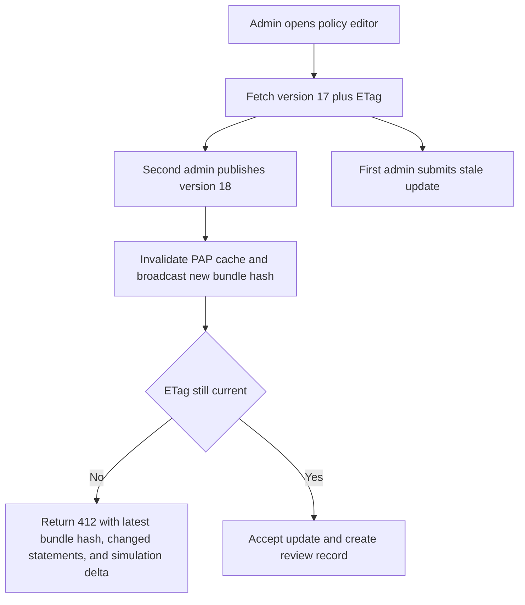

# API and UI Edge Cases

This document covers the user-facing race conditions and consistency traps that appear
in operator APIs, self-service identity flows, and admin dashboards. The goal is to make
the UI safe even when policy publication, suspension, or revocation propagate asynchronously.

## Scenario Matrix

| Scenario | Typical symptom | Required API contract | Required UI behavior |
|---|---|---|---|
| Policy publish race | Admin A edits version `17` while Admin B publishes version `18` | `If-Match` or `ETag` check returns `412 precondition_failed` with latest `bundle_hash` and diff summary | Show banner with latest version, discard stale preview, offer rebase or compare |
| User suspension during profile edit | Admin saves a profile after another operator suspended the user | Write returns `409 subject_state_conflict` plus current `status` and `reason_code` | Freeze edit form, show suspension details, block resubmission without re-open |
| Session revoke while self-service UI is open | User sees active sessions that were already revoked by admin | Session list returns `staleness_window_ms` and `source_watermark`; writes require fresh session version | Mark stale rows, auto-refresh, disable local logout on already-revoked sessions |
| Multi-tab step-up | One browser tab finishes step-up after another tab timed out | Step-up verify returns `409 stale_challenge` with replacement challenge metadata | Close stale modal, prompt user to continue in latest tab only |
| Partial bulk entitlement update | Some grants fail because of deny guardrails or missing approvals | Bulk API returns per-item `status`, `code`, `field_path`, `remediation`, and `correlation_id` | Render success, failure, and retry counts separately; allow retry only for retryable rows |
| Drift auto-remediation races UI edits | Admin edits an attribute while the reconciler rewrites a SCIM-owned field | Write returns `423 source_owned_field` with source owner and last sync timestamp | Make source-owned fields read-only with visible ownership badge and sync details |
| Rate-limited admin bulk job | UI retries too aggressively and amplifies load | APIs emit `429` with `Retry-After`, remaining quota, and `retry_policy` hints | Apply exponential backoff with jitter and pause bulk worker in browser |

## Policy Publication Race Flow

## API Safety Requirements
- All write APIs accept `X-Idempotency-Key`; server-side retention of idempotency records is at least `24 hours` for admin writes and `1 hour` for self-service writes.
- Optimistic concurrency is required on policy bundles, federation mappings, entitlement grants, and profile edits that target mutable local fields.
- Bulk endpoints return a deterministic `results[]` array that preserves client-supplied item ordering and includes a stable `item_ref`.
- Retry guidance uses truncated exponential backoff with full jitter: `sleep = random(0, min(base * 2^attempt, 30s))`.
- When session freshness or step-up status changes, APIs return machine-readable remediation codes such as `step_up_required`, `session_revoked`, or `subject_suspended`.

## UI Safety Requirements
- The UI must display last refresh time, source watermark, and ownership badges for SCIM-managed or federation-managed fields.
- Buttons that can widen access, such as publish policy, unsuspend user, or approve break-glass, must become unavailable when the operator session loses step-up freshness.
- Bulk-operation screens must offer a downloadable error report with item-level denial reason, unmet approval requirement, and correlation ID.
- Success toasts are delayed until the server confirms durable write and audit acceptance for privileged actions.
- Long-running actions show terminal states `queued`, `applying`, `verified`, `partially_failed`, and `rolled_back`.

## Observability and Alerting
- Dashboards slice `409`, `412`, `423`, `429`, and `422 policy_deny` by endpoint, tenant, operation mode, and browser client version.
- Alert when stale-ETag conflicts or `source_owned_field` errors exceed the tenant baseline by `3x` over `15 minutes`.
- Record UI workflow abandon rate for step-up prompts, policy review rebases, and partial bulk retries.
- Synthetic browser checks must verify that an admin suspension or session revoke is reflected in the UI within the backend revocation SLA plus `2 seconds` UI refresh delay.
