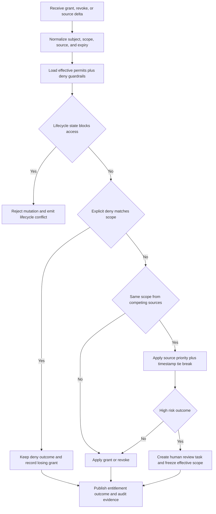

# Entitlement Conflicts

Entitlement conflicts occur when multiple grant sources or deny controls try to change
effective access at the same time. This document defines the precedence model, review
rules, and reconciliation evidence required to keep authorization deterministic.

## Conflict Types

| Conflict class | Example | Automatic disposition |
|---|---|---|
| Direct allow versus explicit deny | User receives `documents:write` grant while a deny policy blocks contractors from writes | Deny wins immediately |
| Group grant versus user revoke | SCIM group adds `finance-approver` while local admin explicitly revoked that role pending investigation | Local revoke wins until case closure |
| Emergency grant versus expiry | Operator still has an emergency role after break-glass expiry while a manual extension is being drafted | Expiry wins and forces new request |
| Multi-source group collision | Okta adds a group while HRIS deprovision removes the user | Lifecycle remove wins because offboarding blocks grants |
| Attribute-driven ABAC conflict | Local profile says `department=Finance`, IdP claim says `department=Engineering` | Source-of-truth matrix decides attribute owner |
| Orphan entitlement | Downstream SaaS role still present after local revoke succeeded | Quarantine grant and reopen reconciliation job |
| Pending suspension conflict | New entitlement request arrives while subject status is `suspended` or `pending_deprovision` | Reject request with lifecycle conflict |
| Workload compromise conflict | Service account rotation job grants a new credential while attestation marks workload compromised | Quarantine workload and block credential activation |

## Resolution Model
- Precedence order is `explicit deny policy` > `lifecycle block` > `break_glass grant` > `local security exception` > `authoritative source grant` > `derived group grant`.
- Group-level denies outrank user-level permits. User-level denies outrank every permit.
- Source priority is used only when two permits conflict and neither is constrained by a deny or lifecycle rule.
- Time-bounded grants can never outlive their parent approval, break-glass record, or source system assignment window.
- Any conflict that could widen access to privileged actions, production administration, billing systems, or regulated data is escalated for human review.

## Reconciliation Flow

## Verification and Reporting

| Field | Meaning |
|---|---|
| `conflict_id` | Stable identifier for all retries and review actions |
| `subject_ref` | Human or workload subject impacted by the conflict |
| `winning_record_ref` | Grant, revoke, or policy record that determined the effective state |
| `losing_record_ref` | Conflicting record that was rejected, deferred, or quarantined |
| `reason_code` | Deterministic rule identifier such as `explicit_deny`, `lifecycle_block`, `source_priority`, or `approval_missing` |
| `review_state` | `auto_resolved`, `pending_review`, `approved_override`, `rejected_override`, or `rolled_back` |
| `audit_refs` | Links to immutable audit envelopes and downstream acknowledgement set |

Reconciliation reports must show:
- counts for resolved, pending, escalated, and rolled-back conflicts;
- average age of open privileged conflicts;
- downstream systems still carrying stale grants;
- repeat offenders by tenant, source connector, or policy bundle.

## Automated Safeguards
- High-risk conflicts automatically quarantine the affected scope and may also terminate active sessions when stale access would remain possible.
- Conflict-resolution jobs emit before and after snapshots, winning-rule metadata, and downstream acknowledgement evidence.
- Repeat conflicts caused by the same policy statement or source mapping open a lint recommendation for policy or connector owners.
- Human-review SLA is `P50 < 1 hour` and `P95 < 4 hours` for privileged conflicts, `P95 < 24 hours` for all others.
