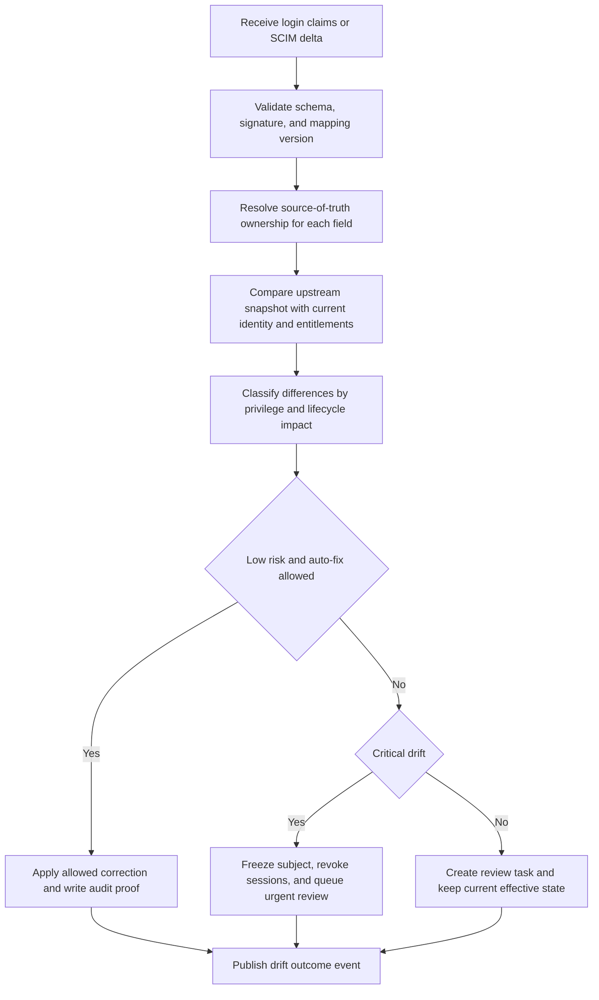

# Federation and SCIM Drift

Drift is the divergence between authoritative upstream identity data and the platform's
effective subject state. In IAM this is dangerous because a drift bug can widen access,
delay offboarding, or make policy decisions inexplicable.

## Drift Examples

| Drift case | Risk | Default response |
|---|---|---|
| IdP claim email changes but `external_id` stays constant | Account-link confusion | Require claim-mapping validation before any update |
| Upstream directory disables user, but SCIM connector is down | Stale access | Freeze subject locally and terminate sessions |
| Group removal arrives late after privilege-sensitive action started | Stale authorization | Re-evaluate next request and revoke tokens if scope changed |
| Login claim says `department=Finance` while SCIM says `department=Engineering` | ABAC mismatch | Source-of-truth matrix decides winner |
| SCIM manager reference points to unknown user | Broken reporting chain | Reject update and raise review task |
| OIDC claim mapping version changed without admin approval | Silent entitlement broadening | Reject login and disable connection until reviewed |

## Drift Detection

Detection rules:
- Scheduled drift jobs run per tenant and per provider every `15 minutes`, with concurrency caps to avoid stampedes when many connectors recover at once.
- Login-time claim drift acts as a real-time hint but may update only fields explicitly marked `login_authoritative`.
- Low-risk auto-fix allowlist includes `display_name`, `department`, `phone_number`, and non-privileged group labels. It excludes `status`, `manager`, `roles`, `assurance_level`, and privileged groups.
- Connector replay protection uses provider object IDs, SCIM `meta.version`, or assertion IDs so remediation is idempotent.

## Remediation Rules
- Critical drift that reduces trust, such as disablement, privileged group removal, or claim-mapping signature failure, immediately suspends or freezes the affected subject.
- High-risk drift that could widen access requires human approval before the platform mutates local state.
- Remediation records carry `operation_id`, `source_snapshot_hash`, `before_hash`, `after_hash`, and `review_ref`.
- Every correction republishes the effective identity version so PDP caches and relying parties can invalidate stale decisions.

## Drift Prevention and Observability
- Connector onboarding requires certification tests for schema validity, claim mappings, source ownership, and replay behavior.
- Mapping templates are version-controlled, signed, and activated through the same review workflow as policy bundles.
- Alert on sustained critical drift counts, repeated mapping failures, or per-tenant remediation backlog exceeding the `15 minute` scheduler interval.
- Auto-disable a connector when critical drift keeps recurring after rollback or when the connector emits malformed payloads above `1 percent` of requests in `5 minutes`.
