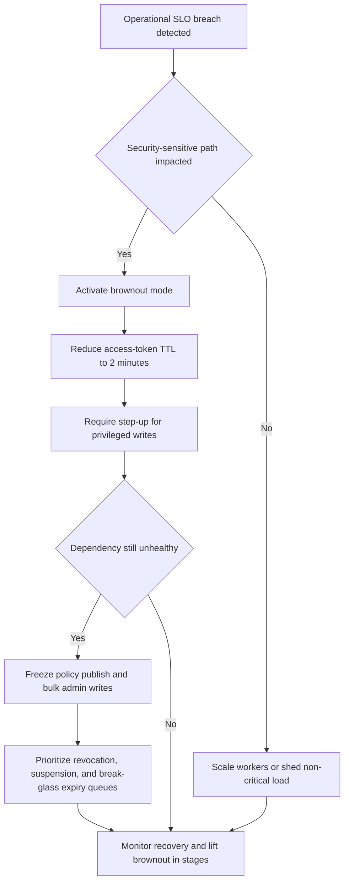

# Operations Edge Cases

Operational edge cases are where the IAM platform proves it can keep the wrong people
out while still remaining available enough for legitimate use. These scenarios focus on
lag, dependency failure, and operator decision points.

## Degradation Scenarios

| Scenario | Detection trigger | First action |
|---|---|---|
| Event-bus lag delays revocations | Revocation topic consumer lag exceeds `5 seconds` | Enter brownout mode and prioritize revocation workers |
| Redis outage increases PDP or session latency | Session read or cache miss latency exceeds `P99 200 ms` | Shift to reduced TTL mode and fail closed on privileged paths |
| Downstream IdP intermittent failure | Connector error rate above `5 percent` or `P99 > 10 seconds` | Open circuit breaker and route users to alternate login methods |
| KMS or signing service degradation | Signing calls exceed `2 seconds` or error rate above `1 percent` | Stop token minting and preserve existing sessions until expiry |
| Audit archive backlog | Audit export lag exceeds `2 minutes` | Scale consumers, preserve local durable buffer, and page compliance on-call |
| SCIM connector replay loop | Same object fails more than `3` times with identical input | Quarantine connector stream and require operator review |

## Brownout and Incident Decision Tree

## Runbook Anchors

### Queue Triage Order
1. `P0` revocation, suspension, and break-glass expiry events with target propagation under `5 seconds`.
2. `P1` privileged entitlement revokes and policy cache invalidations with target completion under `1 minute`.
3. `P2` standard deprovisioning, SCIM drift remediation, and non-privileged entitlement changes under `30 minutes`.
4. `P3` analytics, reporting, and bulk recertification jobs which may pause during incidents.

### Dependency Isolation Rules
- Federation connectors trip open when error rate exceeds `5 percent` or `P99 latency` exceeds `10 seconds` for `3` consecutive windows.
- SCIM connectors trip open on malformed payload rate above `1 percent`, manager-reference resolution failures above `20` objects, or replay-loop detection.
- Audit exporters never block authn or authz directly, but if durable local buffering exceeds threshold the platform pages and may freeze privileged admin writes.

### Operator Actions
- Brownout mode blocks new policy publication, non-essential bulk updates, and low-priority recertification jobs.
- Read-only mode keeps login, session validation, and revocation alive but rejects grant-changing operations.
- Maintenance mode for a federation connection can be tenant-scoped so one failing IdP does not degrade the entire platform.

## Readiness Checks
- Run monthly incident drills rotating through revocation lag, Redis outage, IdP outage, KMS failure, audit lag, and SCIM replay scenarios.
- Capture MTTR, false-escalation rate, and runbook drift after every drill and production incident.
- Validate that on-call can prove the latest revocation watermark, current brownout stage, and affected tenant list within `5 minutes`.
- Quarterly full-region failover tests must include token issuance freeze, recovery, and post-failover replay verification.
