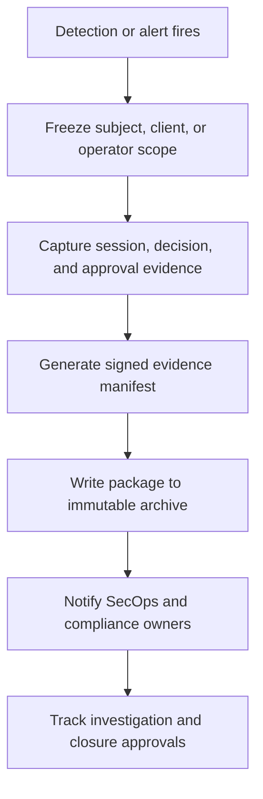

# Security and Compliance Edge Cases

Security and compliance edge cases focus on situations where the platform must contain a
threat, preserve evidence, and still prove to auditors that the controls worked as designed.

## High-Risk Scenarios

| Scenario | Detection threshold | Automated containment | Required evidence |
|---|---|---|---|
| Suspicious token mint surge from one client or workload | More than `5x` tenant baseline in `15 minutes`; auto-quarantine at `10x` | Freeze client, revoke active families, page incident commander | Client metadata, signing-key IDs, request origins, affected token IDs |
| Admin attempts privilege escalation outside workflow | Privileged write without fresh step-up or ticket reference | Deny request, suspend operator session if repeated, notify SecOps | Policy trace, operator identity, session posture, denied request payload |
| Audit pipeline backpressure delays evidence creation | Archive lag above `2 minutes` or local durable buffer above `80 percent` | Scale consumers, freeze privileged writes if durability is at risk | Buffer metrics, archive offsets, signed manifests |
| After-hours or impossible-travel admin access | Off-hours privileged access from new ASN or impossible-travel signal | Force step-up, restrict scope, create insider-threat case | Risk signals, device posture, approvals, session transcript |
| Break-glass overuse | More than `3` grants per operator per quarter or repeated same-scope grants | Require leadership review and suspend self-approval rights | Grant history, ticket trail, approver chain, post-use review |
| Policy bypass attempt | Resource served without matching PDP decision or obligation proof | Fail closed at PEP and emit integrity incident | Gateway logs, PDP trace, policy bundle hash, service response sample |

## Incident Evidence Preservation

## Required Controls
- Token-mint anomaly detection must baseline per tenant, client, and workload type so noisy tenants do not hide abuse.
- Privileged admin actions require fresh step-up, approved ticket, signed operator identity, and a PEP obligation proving justification capture.
- Audit writers emit chain-hashed envelopes; archive exporters verify object counts, offset continuity, and signature integrity before marking a batch complete.
- Insider-threat analytics consume after-hours access, repeated policy overrides, unusual scope patterns, and approval anomalies.
- Compliance exports must be reproducible from immutable sources without relying on mutable dashboard data.

## Evidence Expectations
- Every incident package contains timeline, affected principals, policy bundle hashes, session IDs, key IDs, containment action, approval chain, and closure decision.
- Break-glass investigations include the original request text, dual approvals, step-up proof, commands executed, and automatic expiry evidence.
- Chain-of-custody requires signed manifest creation time, archive object IDs, reviewer acknowledgements, and any evidence-handling transfers.
- Recertification campaigns and policy-diff reviews are retained because they demonstrate preventive control operation, not just reactive response.

## Assurance and Review Cadence
- Daily automated checks verify audit-chain continuity, key-rotation freshness, and revocation propagation SLOs.
- Weekly review examines high-risk denials, break-glass usage, failed policy publications, and connector quarantine events.
- Quarterly control attestation must sample at least one token incident, one break-glass workflow, one entitlement conflict, and one drift-remediation case.
