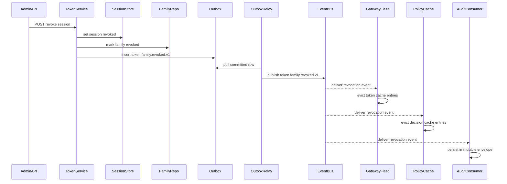

# Token Revocation Edge Cases

Token revocation is the critical control path that turns suspension, logout, reuse
detection, and break-glass expiry into enforced reality. The platform must prefer
security over convenience when ordering, lag, or cache health becomes uncertain.

## Revocation Propagation Sequence

## Failure Modes

| Failure mode | Risk | Required handling |
|---|---|---|
| Revoked token still accepted by stale gateway cache | Stale authorization | Gateway compares local watermark with control watermark and fails closed on privileged requests |
| Refresh reuse race during reconnect | Parallel token minting | Serializable family update plus single winner rule |
| Out-of-order rotate and revoke delivery | Older rotate event reactivates scope | Consumers ignore events below current family generation or watermark |
| Duplicate revocation event | Repeated cache purge and noisy alerting | Idempotent consumer keyed by `event_id` and `family_id` |
| Regional failover before revocation replay completes | Lost revoke state | Block refresh exchange until replay catches up |
| Gateway in degraded mode with bus disconnect | Accepting revoked tokens for too long | Use short-lived local bloom filter, watermark age alarm, and privileged-path fail closed |

## Mitigations
- Revocation events are tier-1 messages with commit-to-bus target `<= 100 ms` and dedicated consumer groups.
- Each token family stores a 64-bit `generation` and `family_state`; refresh processing must compare both before issuing a replacement token.
- Every gateway keeps a per-tenant revocation watermark and reports `lag_ms`; stale gateways are drained from load balancing if lag exceeds the policy threshold.
- Session termination, identity suspension, and break-glass expiry all call the same family-revocation projector so behavior stays consistent.
- Introspection and policy caches are invalidated from the same event to prevent a revoked token from being denied in one layer and allowed in another.

## Validation
- Chaos tests simulate event-bus lag, duplicate delivery, out-of-order replay, Redis partition, and region failover while checking privileged APIs deny revoked tokens.
- Synthetic probes mint a session, revoke it, and verify denial at gateways, PDP cache, and any relying-party introspection endpoint.
- Load tests verify revocation flood handling during bulk suspension without starving step-up or audit workloads.
- Target SLO is `P95 < 5 s` and `P99 < 10 s` from durable revoke commit to universal enforcement, with stricter `P95 < 3 s` for privileged admin surfaces.

## Revocation Hardening
- Gateways maintain a short-lived revocation bloom filter for degraded mode, but authoritative session or family state always wins when reachable.
- The platform records revocation watermark gaps, consumer replay counts, and family-generation anomalies as security metrics.
- If revocation correctness cannot be proven, the platform reduces token lifetime, pauses refresh exchange, and denies privileged traffic until state is trustworthy again.
