# IAM Platform — Architecture Diagram

## 1. Full System Architecture

```mermaid
flowchart TB
    subgraph CLIENTS["External Clients"]
        WEB["Web Browser\n(HTTPS / PKCE)"]
        MOB["Mobile App\n(OAuth 2.0 / PKCE)"]
        CLI_T["CLI / SDK\n(Client Credentials)"]
        PARTNER["Partner Services\n(mTLS / Client Credentials)"]
    end

    subgraph EDGE["Edge Layer"]
        WAF["WAF + DDoS Protection\n(CloudFront / Cloudflare)"]
        APIGW["API Gateway\n(Kong / AWS API Gateway)\nRate-Limit · mTLS · JWT Verify"]
    end

    subgraph AUTH_LAYER["Authentication Layer"]
        AUTH["Auth Service\n(Go / gRPC + REST)"]
        MFA["MFA Orchestrator\n(TOTP · FIDO2 · SMS · Email OTP)"]
        FED["Federation Adapter\n(SAML 2.0 / OIDC / OAuth 2.0)"]
    end

    subgraph AUTHZ_LAYER["Authorization Layer"]
        PEP["Policy Enforcement Point\n(Gateway Plugin + Sidecar)"]
        PDP["Policy Decision Point\n(OPA / Custom Engine)"]
        PAP["Policy Administration Point\n(REST API + Admin UI)"]
    end

    subgraph CORE["Core Services"]
        TOKENSVC["Token Service\n(JWT · Opaque · Rotation)"]
        USERSVC["User Service\n(CRUD · Lifecycle · Password)"]
        SESSMGR["Session Manager\n(Distributed Sessions · Idle TTL)"]
        SCIM["SCIM Adapter\n(SCIM v2.0 Inbound/Outbound)"]
        AUDIT["Audit Writer\n(Immutable Event Stream)"]
    end

    subgraph DATA["Data Layer"]
        PG[("PostgreSQL 15\nUser Store · Policy Store\nOAuth Clients · Tenants\nRead Replicas × 2")]
        REDIS[("Redis Cluster 7\nSession Cache · Token Cache\nPolicy Cache · OTP Nonces\nRate-Limit Counters")]
        KAFKA[("Kafka Cluster\nEvent Bus\n3 Brokers · RF=3 · min ISR=2")]
        VAULT[("HashiCorp Vault\nJWT Signing Keys · TLS PKI\nDynamic DB Credentials\nEncryption-as-a-Service")]
    end

    subgraph EXT["External Integrations"]
        SAML_IDP["SAML 2.0 IdP\n(Okta / AD FS / PingFederate)"]
        OIDC_IDP["OIDC Provider\n(Google Workspace / Azure AD)"]
        SCIM_DIR["SCIM 2.0 Directory\n(Okta / Azure AD / OneLogin)"]
        NOTIF["Email + SMS Gateway\n(SendGrid / Amazon SES / Twilio)"]
        SIEM["SIEM\n(Splunk / Datadog / Elastic)"]
    end

    %% Clients to Edge
    WEB      -->|"HTTPS POST /auth"| WAF
    MOB      -->|"HTTPS POST /auth (PKCE)"| WAF
    CLI_T    -->|"mTLS POST /auth/token"| WAF
    PARTNER  -->|"mTLS POST /auth/token"| WAF

    WAF -->|"Filtered, rate-limited request"| APIGW

    %% Edge to Auth Layer
    APIGW -->|"Route /auth/**"| AUTH
    APIGW -->|"Route /federation/**"| FED
    APIGW -->|"Inline PEP check on every request"| PEP

    %% Auth Layer internals
    AUTH -->|"Step-up MFA trigger"| MFA
    AUTH -->|"Delegated federated login"| FED
    MFA  -->|"OTP delivery request"| NOTIF

    %% Auth Layer to Core Services
    AUTH -->|"Validate user credentials"| USERSVC
    AUTH -->|"Create / validate session"| SESSMGR
    AUTH -->|"Issue access + refresh token"| TOKENSVC
    AUTH -->|"Write LoginAttempt event"| AUDIT

    %% Authorization Layer
    PEP -->|"Authorise(subject, resource, action)"| PDP
    PDP -->|"Policy cache lookup"| REDIS
    PDP -->|"Policy fetch on cache miss"| PG
    PAP -->|"Write / version policy"| PG
    PAP -->|"Publish PolicyChanged event"| KAFKA
    PDP -->|"Publish PolicyDecision event"| KAFKA

    %% Core to Data
    USERSVC  -->|"R/W user records (primary)"| PG
    SESSMGR  -->|"R/W session entry + TTL"| REDIS
    TOKENSVC -->|"Sign JWT via Transit engine"| VAULT
    TOKENSVC -->|"Write token to revocation list"| REDIS
    SCIM     -->|"Bulk user provision"| USERSVC
    AUDIT    -->|"Publish to iam.audit topic"| KAFKA

    %% Kafka downstream
    KAFKA -->|"Audit event stream"| SIEM

    %% Federation externals
    FED <-->|"SAMLRequest / SAMLResponse (HTTPS POST)"| SAML_IDP
    FED <-->|"Authorization code exchange (HTTPS)"| OIDC_IDP
    SCIM <-->|"SCIM 2.0 HTTPS REST"| SCIM_DIR

    %% Vault cross-cutting
    VAULT -->|"Issue short-lived TLS cert (24 h)"| APIGW
    VAULT -->|"Rotate DB credentials (1 h)"| PG
```

---

## 2. Architecture Principles

### 2.1 Defense in Depth

Every request traverses at minimum four distinct security controls before reaching a data store: WAF (L3/L4 packet filtering and DDoS mitigation), API Gateway (L7 JWT validation, mutual TLS verification, and per-client rate limiting), service-layer authentication (short-lived mTLS certificates between internal services issued by Vault PKI), and database-level row security (PostgreSQL Row Level Security policies enforcing tenant-scoped `WHERE tenant_id = current_setting('app.current_tenant_id')`). No single compromised layer grants unrestricted access to tenant data. Sensitive fields such as password hashes, TOTP seeds, and PII are additionally encrypted at rest using Vault's Transit encryption engine, providing a second layer of protection against direct database access.

### 2.2 Zero Trust Networking

Internal services never trust a request based on network origin alone. Each service-to-service call carries a short-lived mTLS certificate issued by Vault PKI with a 24-hour TTL, automatically renewed by the Vault Agent sidecar injected into every pod. The API Gateway validates the JWT `aud` and `iss` claims against a pre-registered client registry before forwarding to upstream services. Downstream services re-validate a signed gateway-forwarded identity header (`X-IAM-Identity`) to prevent header injection. Kubernetes NetworkPolicy rules restrict each service's egress to only its declared dependencies—for example, the Auth Service may reach the User Service and Token Service but not the SCIM Adapter directly. AWS Security Groups or GCP Firewall Rules provide a second enforcement layer at the hypervisor level.

### 2.3 Fail Closed Policy

If the Policy Decision Point is unreachable or returns an evaluation error, the Policy Enforcement Point denies the request with HTTP 503 and emits a `PolicyEvaluationFailure` audit event. Access is never granted by default. The PDP maintains a 60-second warm policy cache in Redis so that transient PDP restarts produce slightly stale decisions rather than a total outage; the cache is invalidated synchronously when a `PolicyChanged` event arrives from Kafka. The Token Service refuses to sign tokens if the Vault Transit engine is unreachable and does not fall back to a local key under any circumstance. The Auth Service's circuit breaker trips after three consecutive MFA provider failures and returns a degraded-mode challenge prompt (email OTP via the secondary provider) rather than silently bypassing MFA.

### 2.4 Tenant Isolation

Every database row that belongs to a tenant carries a non-nullable `tenant_id` column with a foreign-key constraint to the `tenants` table. PostgreSQL Row Level Security policies are enabled on all tenant-scoped tables, and the application-level connection pool sets `SET LOCAL app.current_tenant_id = $1` as the first statement in every transaction. Redis keys are namespaced `{tenant_id}:{resource_type}:{id}` so that a misconfigured cache lookup returns a miss rather than returning cross-tenant data. Kafka topics use `tenant_id` as the partition key; Kafka ACLs are configured so that each tenant-scoped consumer group may only consume from its own partitions. HashiCorp Vault namespaces isolate tenant-specific TOTP seeds, SAML signing certificates, and custom encryption keys from platform-level secrets.

### 2.5 Immutable Audit

Audit events are published to Kafka by the Audit Writer service in the same goroutine that handles the request, before the HTTP response is returned to the caller, ensuring that no observable action goes unrecorded. The `iam.audit` Kafka topic has log compaction disabled and uses append-only semantics with a configurable retention period (default 7 years). The Audit Consumer service reads from Kafka and writes records to an object store (Amazon S3 / Google Cloud Storage) configured with S3 Object Lock in Compliance mode (WORM), preventing deletion or overwrite for the compliance period. Each audit record is signed with a tenant-specific HMAC-SHA-256 key stored in Vault; any tampered record fails signature verification during a compliance export. The SIEM receives a parallel real-time stream for operational alerting; the object store is the authoritative system of record for regulatory queries.

---

## 3. Component Responsibility Table

| Component | Responsibility | Scaling Pattern | SLA Target |
|---|---|---|---|
| WAF + DDoS Protection | L3/L4 packet filtering, rate limiting, geo-blocking, bot mitigation, TLS offload | Managed cloud service (auto-scaled) | 99.99% |
| API Gateway | TLS termination, JWT validation, routing, rate limiting, request/response logging, mTLS enforcement | Horizontal Pod Autoscaler on RPS metric | 99.95% |
| Auth Service | Credential validation, bcrypt verification, session initiation, MFA orchestration, token issuance co-ordination | HPA on CPU; fully stateless | 99.95% |
| MFA Orchestrator | TOTP/FIDO2/SMS/Email OTP factor verification, challenge lifecycle, anti-replay nonce management | HPA; factor-provider circuit-breakers per provider | 99.90% |
| Federation Adapter | SAML 2.0 SP and IdP roles, OIDC Relying Party, claim mapping, JIT user provisioning, assertion validation | HPA; stateless after provider metadata cache warm | 99.90% |
| Policy Enforcement Point | Inline policy check at API Gateway plugin and service-mesh sidecar; zero additional network hop | Co-located with gateway; scales with gateway | 99.99% |
| Policy Decision Point | OPA-based attribute evaluation, policy cache management, obligation resolution | HPA on CPU; read-heavy; warm cache targets sub-5 ms | 99.95% |
| Policy Administration Point | Policy CRUD, semantic versioning, dry-run simulation, approval workflows, audit log of policy changes | Single active + standby; low write frequency | 99.90% |
| Token Service | JWT signing via Vault Transit, opaque token management, refresh token family rotation, token introspection | HPA; Vault connection pooled per pod | 99.95% |
| User Service | User lifecycle CRUD, bcrypt password management, account status transitions, group membership | HPA; writes to primary PG, reads from replica | 99.95% |
| Session Manager | Distributed session creation, validation, revocation, idle-timeout enforcement, concurrent-session policy | HPA; all state in Redis, no local state | 99.95% |
| SCIM Adapter | SCIM 2.0 inbound and outbound provisioning, bulk sync, idempotency checking, conflict resolution | HPA; idempotent operations safe for retry | 99.90% |
| Audit Writer | Structured event serialisation (Avro), Kafka publishing, in-memory buffer on transient broker failure | HPA; async write path does not block response | 99.99% |
| PostgreSQL | Persistent user, policy, OAuth client, and tenant records; append-only audit shadow table | Primary + 2 read replicas; PgBouncer connection pool | 99.95% |
| Redis Cluster | Session, token, policy, and OTP nonce caches; rate-limit counters | 3 shards × 2 replicas; LRU eviction on maxmemory | 99.95% |
| Kafka | Durable event bus for audit, policy cache invalidation, SCIM provisioning events, token issuance events | 3 brokers; RF=3; min ISR=2; rack-aware placement | 99.95% |
| HashiCorp Vault | JWT signing keys (Transit), TLS PKI, dynamic PostgreSQL credentials, TOTP seed encryption | 3-node Raft HA cluster; auto-unseal via cloud KMS | 99.99% |

---

## 4. Data Store Assignments

| Data Type | Store | Consistency Model | TTL / Retention |
|---|---|---|---|
| User profiles and hashed credentials | PostgreSQL (primary write) | Strong — synchronous streaming replication | Indefinite (soft-delete, 90-day purge) |
| Tenant and organisation records | PostgreSQL (primary write) | Strong | Indefinite |
| OAuth 2.0 client registrations | PostgreSQL (primary write) | Strong | Indefinite |
| Role, permission, and policy definitions | PostgreSQL (primary write) | Strong — versioned rows | Indefinite, all versions retained |
| Active session records | Redis Cluster | Eventual — async replica lag < 10 ms | Configurable; default 8 hours |
| Access token revocation list (jti set) | Redis Cluster | Eventual | Until token `exp` — max 15 minutes |
| OTP and TOTP nonces (anti-replay) | Redis Cluster | Strong — SETNX atomic | 30 seconds (TOTP rolling window) |
| Rate-limit sliding-window counters | Redis Cluster | Eventual | 60-second rolling window |
| Policy evaluation decision cache | Redis Cluster | Eventual | 60 seconds; invalidated on PolicyChanged event |
| Refresh token family records | PostgreSQL (primary write) | Strong | Until expiry or explicit revocation |
| SCIM provisioning cursor and state | PostgreSQL (primary write) | Strong | Indefinite |
| Audit events — hot path (streaming) | Kafka `iam.audit` topic | At-least-once delivery | 30 days in Kafka |
| Audit events — cold path (compliance) | S3 / GCS with WORM Object Lock | N/A — write-once | 7 years (regulatory default) |
| JWT signing keys | HashiCorp Vault Transit engine | Strong — Raft consensus | Rotated every 90 days; old key retained for verify |
| Internal TLS certificates | HashiCorp Vault PKI | Strong | 24-hour TTL; auto-renewed at 80% lifetime |
| Dynamic PostgreSQL credentials | HashiCorp Vault dynamic secrets | Strong | 1-hour TTL; renewed by Vault Agent |
| SAML and OIDC provider metadata | PostgreSQL primary + Redis cache | Eventual (cache read) | Cache: 1 hour; refreshed on metadata URL poll |
| Federation assertion nonces (anti-replay) | Redis Cluster | Strong — SETNX atomic | `NotOnOrAfter` timestamp + 5 minutes clock skew |
| FIDO2 / WebAuthn credential records | PostgreSQL (primary write) | Strong | Until authenticator deregistration |
